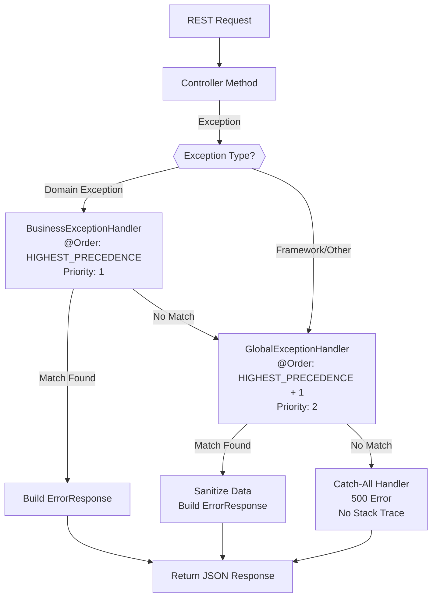

# Global Exception Handler

**Status**: Complete | **Last Updated**: 2025-11-20 | **Version**: 1.0.0

**Back to**: [Exception Architecture Index](./index.md) | [Architecture Overview](../index.md)

---

## Overview

The `GlobalExceptionHandler` is a **Spring @RestControllerAdvice** that provides **centralized exception handling** for framework-level exceptions across the entire Smart Supply Pro backend application. It catches exceptions thrown by Spring Framework, Spring MVC, validation framework, and unhandled application exceptions—then maps them to appropriate HTTP status codes and standardized error responses.

**Key Responsibilities**:
- Catch framework exceptions (validation, parameter binding, authentication, authorization)
- Map exceptions to HTTP status codes
- Sanitize sensitive data before returning to clients
- Build consistent ErrorResponse DTOs with correlation tracking
- Provide catch-all handler for unhandled exceptions

---

## Architecture & Ordering

### Handler Registration

```java
@Order(Ordered.HIGHEST_PRECEDENCE + 1)  // Runs AFTER BusinessExceptionHandler
@RestControllerAdvice
public class GlobalExceptionHandler {
    // Framework exception handlers
}
```

**Key Details**:
- **@RestControllerAdvice** – Applies to all @RestController classes across application
- **@Order(HIGHEST_PRECEDENCE + 1)** – Runs second, after BusinessExceptionHandler
- **Priority**: Domain exceptions take precedence over framework exceptions

### Handler Execution Flow



---

## Exception Handlers

### 1. Validation Exceptions (400 Bad Request)

#### MethodArgumentNotValidException

Caught when **@Valid annotation validation fails** on request body objects.

**Example Trigger**:
```java
@PostMapping("/suppliers")
public ResponseEntity<SupplierDTO> create(@Valid @RequestBody CreateSupplierRequest req) {
    // If @Valid fails on CreateSupplierRequest → MethodArgumentNotValidException
}
```

**Handler Logic**:
```java
@ExceptionHandler(MethodArgumentNotValidException.class)
public ResponseEntity<ErrorResponse> handleValidation(MethodArgumentNotValidException ex) {
    String message = ex.getBindingResult().getFieldErrors().stream()
            .map(error -> error.getField() + ": " + error.getDefaultMessage())
            .collect(Collectors.joining("; "));
    
    return ErrorResponse.builder()
            .status(HttpStatus.BAD_REQUEST)
            .message("Validation failed: " + message)
            .build();
}
```

**Response Example**:
```json
{
  "error": "bad_request",
  "message": "Validation failed: email: must be a well-formed email address; quantity: must be greater than 0",
  "timestamp": "2025-11-20T14:30:45.123Z",
  "correlationId": "SSP-1700551445123-4891"
}
```

---

#### ConstraintViolationException

Caught when **JSR-380 constraint violations** occur on method parameters or returned objects.

**Example Trigger**:
```java
@GetMapping("/{id}")
public SupplierDTO getSupplier(@NotNull @Min(1) @PathVariable Long id) {
    // If id = null or id < 1 → ConstraintViolationException
}
```

**Handler Logic**:
```java
@ExceptionHandler(ConstraintViolationException.class)
public ResponseEntity<ErrorResponse> handleConstraint(ConstraintViolationException ex) {
    String message = ex.getConstraintViolations().stream()
            .map(violation -> violation.getPropertyPath() + ": " + violation.getMessage())
            .collect(Collectors.joining("; "));
    
    return ErrorResponse.builder()
            .status(HttpStatus.BAD_REQUEST)
            .message("Constraint violation: " + message)
            .build();
}
```

**Response Example**:
```json
{
  "error": "bad_request",
  "message": "Constraint violation: id: must be greater than or equal to 1",
  "timestamp": "2025-11-20T14:30:46.234Z",
  "correlationId": "SSP-1700551446234-5902"
}
```

---

### 2. Request Parameter Errors (400 Bad Request)

#### MissingServletRequestParameterException

Caught when **required query/form parameters are missing**.

**Example Trigger**:
```java
@GetMapping
public List<SupplierDTO> searchSuppliers(
    @RequestParam(required = true) String category,
    @RequestParam(required = false) String region
) {
    // If 'category' not provided → MissingServletRequestParameterException
}
```

**Handler Logic**:
```java
@ExceptionHandler(MissingServletRequestParameterException.class)
public ResponseEntity<ErrorResponse> handleParameterError(MissingServletRequestParameterException ex) {
    String message = String.format("Missing required parameter: %s (%s)", 
            ex.getParameterName(), ex.getParameterType());
    
    return ErrorResponse.builder()
            .status(HttpStatus.BAD_REQUEST)
            .message(message)
            .build();
}
```

**Response Example**:
```json
{
  "error": "bad_request",
  "message": "Missing required parameter: category (String)",
  "timestamp": "2025-11-20T14:30:47.345Z",
  "correlationId": "SSP-1700551447345-6013"
}
```

---

#### MethodArgumentTypeMismatchException

Caught when **path/query parameter type conversion fails**.

**Example Trigger**:
```java
@GetMapping("/{id}")
public SupplierDTO get(@PathVariable Long id) {
    // If {id} = "abc" (not a number) → MethodArgumentTypeMismatchException
}
```

**Handler Logic**:
```java
@ExceptionHandler(MethodArgumentTypeMismatchException.class)
public ResponseEntity<ErrorResponse> handleTypeMismatch(MethodArgumentTypeMismatchException ex) {
    String message = String.format("Invalid %s for parameter '%s': received '%s'",
            ex.getRequiredType().getSimpleName(),
            ex.getName(),
            ex.getValue());
    
    return ErrorResponse.builder()
            .status(HttpStatus.BAD_REQUEST)
            .message(message)
            .build();
}
```

**Response Example**:
```json
{
  "error": "bad_request",
  "message": "Invalid Long for parameter 'id': received 'abc'",
  "timestamp": "2025-11-20T14:30:48.456Z",
  "correlationId": "SSP-1700551448456-7124"
}
```

---

#### HttpMessageNotReadableException

Caught when **request body JSON parsing fails** (malformed JSON, missing required fields in JSON).

**Example Trigger**:
```java
@PostMapping
public ResponseEntity<SupplierDTO> create(@RequestBody CreateSupplierRequest req) {
    // If request body has invalid JSON → HttpMessageNotReadableException
}
```

**Handler Logic**:
```java
@ExceptionHandler(HttpMessageNotReadableException.class)
public ResponseEntity<ErrorResponse> handleParsingError(HttpMessageNotReadableException ex) {
    String message = "Invalid request format: malformed JSON or missing required fields";
    
    // Extract more specific message if available
    if (ex.getCause() instanceof JsonMappingException jme) {
        message = "JSON parsing error at path: " + jme.getPath().stream()
                .map(p -> p.getFieldName())
                .collect(Collectors.joining("."));
    }
    
    return ErrorResponse.builder()
            .status(HttpStatus.BAD_REQUEST)
            .message(message)
            .build();
}
```

**Response Example**:
```json
{
  "error": "bad_request",
  "message": "Invalid request format: malformed JSON or missing required fields",
  "timestamp": "2025-11-20T14:30:49.567Z",
  "correlationId": "SSP-1700551449567-8235"
}
```

---

### 3. Authentication & Authorization (401/403)

#### AuthenticationException

Caught when **authentication fails** (invalid credentials, expired token, user not found).

**Example Trigger**:
```java
@GetMapping("/protected")
@PreAuthorize("isAuthenticated()")
public ResponseEntity<String> getProtected() {
    // If user not authenticated → AuthenticationException
}
```

**Handler Logic**:
```java
@ExceptionHandler(AuthenticationException.class)
public ResponseEntity<ErrorResponse> handleAuthentication(AuthenticationException ex) {
    // Return generic message (don't leak if user/password was wrong)
    String message = "Authentication failed: invalid credentials or expired session";
    
    return ErrorResponse.builder()
            .status(HttpStatus.UNAUTHORIZED)
            .message(message)
            .build();
}
```

**Response Example**:
```json
{
  "error": "unauthorized",
  "message": "Authentication failed: invalid credentials or expired session",
  "timestamp": "2025-11-20T14:30:50.678Z",
  "correlationId": "SSP-1700551450678-9346"
}
```

**Security Notes** ⚠️:
- ✅ Generic message (prevents user enumeration: attackers can't determine if username exists)
- ✅ No details about which credential failed (password vs. username)
- ✅ No token details (prevents token reuse information leakage)
- ✓ Full exception logged server-side for debugging (not sent to client)

---

#### AccessDeniedException

Caught when **user lacks authorization** for an operation (insufficient permissions, role check failed).

**Example Trigger**:
```java
@DeleteMapping("/{id}")
@PreAuthorize("hasRole('ADMIN')")
public ResponseEntity<Void> deleteSupplier(@PathVariable Long id) {
    // If user is not ADMIN → AccessDeniedException
}
```

**Handler Logic**:
```java
@ExceptionHandler(AccessDeniedException.class)
public ResponseEntity<ErrorResponse> handleAuthorization(AccessDeniedException ex) {
    // Return generic message (don't leak what permissions user lacks)
    String message = "Access denied: insufficient permissions for this operation";
    
    return ErrorResponse.builder()
            .status(HttpStatus.FORBIDDEN)
            .message(message)
            .build();
}
```

**Response Example**:
```json
{
  "error": "forbidden",
  "message": "Access denied: insufficient permissions for this operation",
  "timestamp": "2025-11-20T14:30:51.789Z",
  "correlationId": "SSP-1700551451789-0457"
}
```

**Security Notes** ⚠️:
- ✅ Generic message (doesn't leak required role/permission)
- ✅ No details about missing permissions
- ✓ Full exception logged server-side with user details

---

### 4. Resource Not Found (404)

#### NoSuchElementException

Caught when **resource lookup fails** in Optional or Stream operations.

**Example Trigger**:
```java
@GetMapping("/{id}")
public SupplierDTO get(@PathVariable Long id) {
    return supplierRepository.findById(id)
            .orElseThrow(() -> new NoSuchElementException("Supplier not found"));
}
```

**Handler Logic**:
```java
@ExceptionHandler(NoSuchElementException.class)
public ResponseEntity<ErrorResponse> handleNotFound(NoSuchElementException ex) {
    String message = (ex.getMessage() != null && !ex.getMessage().isBlank())
            ? ex.getMessage()
            : "Requested resource not found";
    
    return ErrorResponse.builder()
            .status(HttpStatus.NOT_FOUND)
            .message(message)
            .build();
}
```

**Response Example**:
```json
{
  "error": "not_found",
  "message": "Supplier not found",
  "timestamp": "2025-11-20T14:30:52.890Z",
  "correlationId": "SSP-1700551452890-1568"
}
```

---

#### IllegalArgumentException

Caught when **invalid argument causes lookup failure**.

**Example Trigger**:
```java
@GetMapping("/{status}")
public List<SupplierDTO> getByStatus(@PathVariable String status) {
    SupplierStatus enumStatus = SupplierStatus.valueOf(status); // Throws IllegalArgumentException
    return supplierRepository.findByStatus(enumStatus);
}
```

**Handler Logic**:
```java
@ExceptionHandler(IllegalArgumentException.class)
public ResponseEntity<ErrorResponse> handleIllegalArgument(IllegalArgumentException ex) {
    String message = (ex.getMessage() != null && !ex.getMessage().isBlank())
            ? ex.getMessage()
            : "Invalid argument provided";
    
    return ErrorResponse.builder()
            .status(HttpStatus.NOT_FOUND)
            .message(message)
            .build();
}
```

**Response Example**:
```json
{
  "error": "not_found",
  "message": "No enum constant com.smartsupplypro.SupplierStatus.UNKNOWN",
  "timestamp": "2025-11-20T14:30:53.901Z",
  "correlationId": "SSP-1700551453901-2679"
}
```

---

### 5. Conflict Errors (409)

#### DataIntegrityViolationException

Caught when **database constraint violations occur** (unique constraint, foreign key, check constraint).

**Example Trigger**:
```java
@PostMapping
public SupplierDTO create(CreateSupplierRequest req) {
    // If database has unique constraint on email and email already exists
    return supplierRepository.save(supplier); // Throws DataIntegrityViolationException
}
```

**Handler Logic**:
```java
@ExceptionHandler(DataIntegrityViolationException.class)
public ResponseEntity<ErrorResponse> handleDataIntegrity(DataIntegrityViolationException ex) {
    String message = sanitize(ex);
    
    return ErrorResponse.builder()
            .status(HttpStatus.CONFLICT)
            .message(message)
            .build();
}

private String sanitize(DataIntegrityViolationException ex) {
    String cause = ex.getMessage();
    // Hide SQL details, replace with generic message
    if (cause != null && cause.contains("UNIQUE constraint")) {
        return "Resource with this value already exists";
    }
    if (cause != null && cause.contains("FOREIGN KEY")) {
        return "Cannot modify resource: related records exist";
    }
    return "Database constraint violation occurred";
}
```

**Response Example**:
```json
{
  "error": "conflict",
  "message": "Resource with this value already exists",
  "timestamp": "2025-11-20T14:30:54.012Z",
  "correlationId": "SSP-1700551454012-3780"
}
```

**Security Notes** ⚠️:
- ✅ Sanitization removes SQL details and constraint names
- ✅ No database schema exposed
- ✓ Full exception logged server-side with original SQL error

---

#### ObjectOptimisticLockingFailureException

Caught when **concurrent update conflict occurs** (version mismatch in optimistic locking).

**Example Trigger**:
```java
@PutMapping("/{id}")
public SupplierDTO update(@PathVariable Long id, @RequestBody UpdateSupplierRequest req) {
    Supplier supplier = supplierRepository.findById(id).orElseThrow();
    supplier.setName(req.getName()); // Version field mismatch
    return supplierRepository.save(supplier); // Throws ObjectOptimisticLockingFailureException
}
```

**Handler Logic**:
```java
@ExceptionHandler(ObjectOptimisticLockingFailureException.class)
public ResponseEntity<ErrorResponse> handleOptimisticLock(ObjectOptimisticLockingFailureException ex) {
    String message = "Resource was modified by another user. Please refresh and try again.";
    
    return ErrorResponse.builder()
            .status(HttpStatus.CONFLICT)
            .message(message)
            .build();
}
```

**Response Example**:
```json
{
  "error": "conflict",
  "message": "Resource was modified by another user. Please refresh and try again.",
  "timestamp": "2025-11-20T14:30:55.123Z",
  "correlationId": "SSP-1700551455123-4891"
}
```

**Client Handling Example**:
```javascript
try {
    await api.put(`/suppliers/${id}`, updatedData);
} catch (error) {
    if (error.response.status === 409 && error.response.data.error === 'conflict') {
        // Refresh data and retry
        const freshData = await api.get(`/suppliers/${id}`);
        showRetryDialog(freshData);
    }
}
```

---

### 6. Other Framework Exceptions

#### ResponseStatusException

Caught when **explicit HTTP status exceptions** are thrown (preserves declared status code).

**Example Trigger**:
```java
@GetMapping("/{id}")
public SupplierDTO get(@PathVariable Long id) {
    Supplier supplier = supplierRepository.findById(id)
            .orElseThrow(() -> new ResponseStatusException(
                    HttpStatus.NOT_FOUND,
                    "Supplier not found"
            ));
}
```

**Handler Logic**:
```java
@ExceptionHandler(ResponseStatusException.class)
public ResponseEntity<ErrorResponse> handleResponseStatus(ResponseStatusException ex) {
    return ErrorResponse.builder()
            .status(ex.getStatus())
            .message(ex.getReason())
            .build();
}
```

---

### 7. Catch-All Handler (500 Internal Server Error)

Catches **any unhandled exceptions** not covered by specific handlers. This is the safety net.

**Handler Logic**:
```java
@ExceptionHandler(Exception.class)
public ResponseEntity<ErrorResponse> handleUnexpected(Exception ex) {
    // Log full exception with stack trace for debugging (server-side only)
    logger.error("Unhandled exception", ex);
    
    // Return generic message to client (no stack trace, no details)
    return ErrorResponse.builder()
            .status(HttpStatus.INTERNAL_SERVER_ERROR)
            .message("An unexpected error occurred. Please contact support.")
            .build();
}
```

**Response Example**:
```json
{
  "error": "internal_server_error",
  "message": "An unexpected error occurred. Please contact support.",
  "timestamp": "2025-11-20T14:30:56.234Z",
  "correlationId": "SSP-1700551456234-5902"
}
```

**Security Notes** ⚠️:
- ✅ No stack trace exposed to client
- ✅ No exception message details exposed
- ✅ Generic message encourages user to contact support
- ✓ Full exception logged server-side (use correlationId to find it)

**Frontend Error Handling**:
```javascript
// When you get a 500 error
if (error.response.status === 500) {
    const correlationId = error.response.data.correlationId;
    console.error(`Server error occurred: ${correlationId}`);
    alert(`Error: ${error.response.data.message}\nReport ID: ${correlationId}`);
    // User provides "Report ID" (correlation ID) to support team for investigation
}
```

---

## Complete Exception Handler Implementation

Here's the full GlobalExceptionHandler implementation:

```java
package com.smartsupplypro.inventory.exception;

import org.springframework.core.Ordered;
import org.springframework.core.annotation.Order;
import org.springframework.http.HttpStatus;
import org.springframework.http.ResponseEntity;
import org.springframework.http.converter.HttpMessageNotReadableException;
import org.springframework.security.access.AccessDeniedException;
import org.springframework.security.core.AuthenticationException;
import org.springframework.web.bind.MethodArgumentNotValidException;
import org.springframework.web.bind.annotation.ExceptionHandler;
import org.springframework.web.bind.annotation.RestControllerAdvice;
import org.springframework.web.method.annotation.MethodArgumentTypeMismatchException;
import org.springframework.web.servlet.NoHandlerFoundException;

import com.smartsupplypro.inventory.exception.dto.ErrorResponse;

import jakarta.validation.ConstraintViolationException;
import lombok.extern.slf4j.Slf4j;

/**
 * Global exception handler for framework-level exceptions.
 * Complements BusinessExceptionHandler for domain-specific exceptions.
 */
@Order(Ordered.HIGHEST_PRECEDENCE + 1)
@RestControllerAdvice
@Slf4j
public class GlobalExceptionHandler {

    // 400 Bad Request handlers
    @ExceptionHandler(MethodArgumentNotValidException.class)
    public ResponseEntity<ErrorResponse> handleValidation(MethodArgumentNotValidException ex) {
        String errors = ex.getBindingResult().getFieldErrors().stream()
                .map(e -> e.getField() + ": " + e.getDefaultMessage())
                .collect(Collectors.joining("; "));
        return ErrorResponse.builder()
                .status(HttpStatus.BAD_REQUEST)
                .message("Validation failed: " + errors)
                .build();
    }

    @ExceptionHandler(ConstraintViolationException.class)
    public ResponseEntity<ErrorResponse> handleConstraint(ConstraintViolationException ex) {
        String errors = ex.getConstraintViolations().stream()
                .map(v -> v.getPropertyPath() + ": " + v.getMessage())
                .collect(Collectors.joining("; "));
        return ErrorResponse.builder()
                .status(HttpStatus.BAD_REQUEST)
                .message("Constraint violation: " + errors)
                .build();
    }

    @ExceptionHandler(HttpMessageNotReadableException.class)
    public ResponseEntity<ErrorResponse> handleParsingError(HttpMessageNotReadableException ex) {
        return ErrorResponse.builder()
                .status(HttpStatus.BAD_REQUEST)
                .message("Invalid request format: malformed JSON")
                .build();
    }

    @ExceptionHandler(MethodArgumentTypeMismatchException.class)
    public ResponseEntity<ErrorResponse> handleTypeMismatch(MethodArgumentTypeMismatchException ex) {
        return ErrorResponse.builder()
                .status(HttpStatus.BAD_REQUEST)
                .message("Invalid type for parameter: " + ex.getName())
                .build();
    }

    // 401 Unauthorized
    @ExceptionHandler(AuthenticationException.class)
    public ResponseEntity<ErrorResponse> handleAuthentication(AuthenticationException ex) {
        return ErrorResponse.builder()
                .status(HttpStatus.UNAUTHORIZED)
                .message("Authentication failed")
                .build();
    }

    // 403 Forbidden
    @ExceptionHandler(AccessDeniedException.class)
    public ResponseEntity<ErrorResponse> handleAuthorization(AccessDeniedException ex) {
        return ErrorResponse.builder()
                .status(HttpStatus.FORBIDDEN)
                .message("Access denied")
                .build();
    }

    // 404 Not Found
    @ExceptionHandler(NoSuchElementException.class)
    public ResponseEntity<ErrorResponse> handleNotFound(NoSuchElementException ex) {
        return ErrorResponse.builder()
                .status(HttpStatus.NOT_FOUND)
                .message("Resource not found")
                .build();
    }

    // 409 Conflict
    @ExceptionHandler(DataIntegrityViolationException.class)
    public ResponseEntity<ErrorResponse> handleDataIntegrity(DataIntegrityViolationException ex) {
        return ErrorResponse.builder()
                .status(HttpStatus.CONFLICT)
                .message("Resource conflict occurred")
                .build();
    }

    // 500 Internal Server Error (catch-all)
    @ExceptionHandler(Exception.class)
    public ResponseEntity<ErrorResponse> handleUnexpected(Exception ex) {
        log.error("Unhandled exception", ex);
        return ErrorResponse.builder()
                .status(HttpStatus.INTERNAL_SERVER_ERROR)
                .message("An unexpected error occurred")
                .build();
    }
}
```

---

## Handler Ordering Strategy

The ordering of handlers matters:

1. **BusinessExceptionHandler** (@Order(HIGHEST_PRECEDENCE)) – Runs first
   - Catches: InvalidRequestException, DuplicateResourceException, IllegalStateException
   - Purpose: Domain-specific business rule violations

2. **GlobalExceptionHandler** (@Order(HIGHEST_PRECEDENCE + 1)) – Runs second
   - Catches: Framework exceptions, validation errors, auth/authz errors
   - Purpose: Framework-level and unhandled exceptions

If both handlers could handle the same exception, BusinessExceptionHandler wins. This ensures domain logic takes priority over framework defaults.

---

## Sensitive Data Sanitization

The sanitize() method prevents information disclosure:

```java
private String sanitize(DataIntegrityViolationException ex) {
    String cause = ex.getMessage();
    
    // Hide specific constraint names and SQL
    if (cause != null && cause.contains("UNIQUE constraint")) {
        return "Resource with this value already exists";
    }
    if (cause != null && cause.contains("FOREIGN KEY")) {
        return "Cannot modify resource: related records exist";
    }
    if (cause != null && cause.contains("CHECK constraint")) {
        return "Invalid data provided";
    }
    
    // Fallback generic message
    return "Database constraint violation occurred";
}
```

**Why This Matters**:
- ❌ Shows constraint name: Reveals database schema
- ❌ Shows column name: Attackers learn field names
- ❌ Shows SQL: Enables SQL injection testing
- ✅ Generic message: Hides schema details while informing user

---

## Integration with ErrorResponse

All handlers use the ErrorResponse builder:

```java
return ErrorResponse.builder()
        .status(HttpStatus.BAD_REQUEST)
        .message("Validation failed: email is required")
        .build();
```

The builder:
- ✅ Automatically generates timestamp (ISO-8601 UTC)
- ✅ Automatically generates correlation ID (SSP-{ts}-{random})
- ✅ Converts HttpStatus to lowercase error token (e.g., "bad_request")
- ✅ Wraps in ResponseEntity with JSON content type

---

## Testing Strategies

### Unit Testing

```java
@ExtendWith(MockitoExtension.class)
class GlobalExceptionHandlerTest {
    
    @InjectMocks
    private GlobalExceptionHandler handler;
    
    @Test
    void testHandleValidation() {
        MethodArgumentNotValidException ex = mock(MethodArgumentNotValidException.class);
        BindingResult binding = mock(BindingResult.class);
        when(ex.getBindingResult()).thenReturn(binding);
        when(binding.getFieldErrors()).thenReturn(List.of(
                createFieldError("email", "must be valid")
        ));
        
        ResponseEntity<ErrorResponse> response = handler.handleValidation(ex);
        
        assertThat(response.getStatusCode()).isEqualTo(HttpStatus.BAD_REQUEST);
        assertThat(response.getBody().getError()).isEqualTo("bad_request");
        assertThat(response.getBody().getMessage()).contains("Validation failed");
    }
}
```

### Integration Testing

```java
@SpringBootTest
@AutoConfigureMockMvc
class ExceptionHandlingIntegrationTest {
    
    @Autowired
    private MockMvc mockMvc;
    
    @Test
    void testValidationError() throws Exception {
        mockMvc.perform(post("/api/suppliers")
                .contentType(APPLICATION_JSON)
                .content("{}")) // Missing required fields
                .andExpect(status().isBadRequest())
                .andExpect(jsonPath("$.error").value("bad_request"))
                .andExpect(jsonPath("$.correlationId").exists());
    }
    
    @Test
    void testAuthenticationError() throws Exception {
        mockMvc.perform(get("/api/protected"))
                .andExpect(status().isUnauthorized())
                .andExpect(jsonPath("$.error").value("unauthorized"));
    }
}
```

---

## Related Documentation

- **[Exception Architecture Overview](./index.md)** – Handler ordering, exception types, execution flow
- **[Domain Exceptions](./domain-exceptions.md)** – Custom exceptions handled by BusinessExceptionHandler
- **[Error Response Structure](./error-response-structure.md)** – JSON structure and correlation IDs
- **[Exception-to-HTTP Mapping](./exception-to-http-mapping.md)** – Complete mapping reference
- **[Security Exceptions](./security-exceptions.md)** – Auth/authz handling details
- **[Guidelines & Best Practices](./guidelines-and-best-practices.md)** – Best practices for exception handling

---

## Version History

| Version | Date | Changes |
|---------|------|---------|
| 1.0.0 | 2025-11-20 | Initial comprehensive documentation |

---

## Quick Reference

### Handler Method Template

```java
@ExceptionHandler(SomeException.class)
public ResponseEntity<ErrorResponse> handleSomeException(SomeException ex) {
    // Extract meaningful message
    String message = ex.getMessage() != null ? ex.getMessage() : "Default message";
    
    // Sanitize sensitive data if needed
    message = sanitize(message);
    
    // Build and return error response
    return ErrorResponse.builder()
            .status(HttpStatus.APPROPRIATE_STATUS)
            .message(message)
            .build();
}
```

### Common Patterns

**Pattern 1: Field Validation Error**
```java
@ExceptionHandler(MethodArgumentNotValidException.class)
public ResponseEntity<ErrorResponse> handleValidation(MethodArgumentNotValidException ex) {
    String fields = ex.getBindingResult().getFieldErrors().stream()
            .map(e -> e.getField())
            .collect(Collectors.joining(", "));
    return ErrorResponse.builder()
            .status(HttpStatus.BAD_REQUEST)
            .message("Invalid fields: " + fields)
            .build();
}
```

**Pattern 2: Generic Message (Security)**
```java
@ExceptionHandler(AuthenticationException.class)
public ResponseEntity<ErrorResponse> handleAuth(AuthenticationException ex) {
    // Don't expose details about authentication failure
    return ErrorResponse.builder()
            .status(HttpStatus.UNAUTHORIZED)
            .message("Authentication failed")
            .build();
}
```

**Pattern 3: Sanitized Message (Data Integrity)**
```java
@ExceptionHandler(DataIntegrityViolationException.class)
public ResponseEntity<ErrorResponse> handleDataIntegrity(DataIntegrityViolationException ex) {
    String message = sanitize(ex);
    return ErrorResponse.builder()
            .status(HttpStatus.CONFLICT)
            .message(message)
            .build();
}
```
