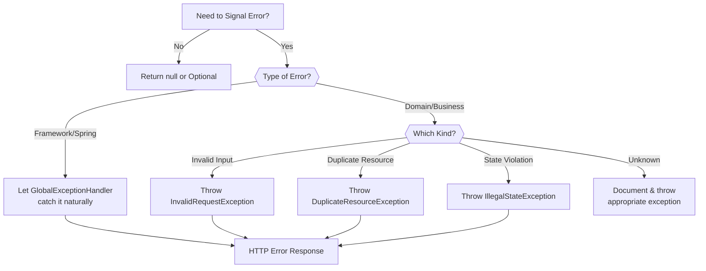
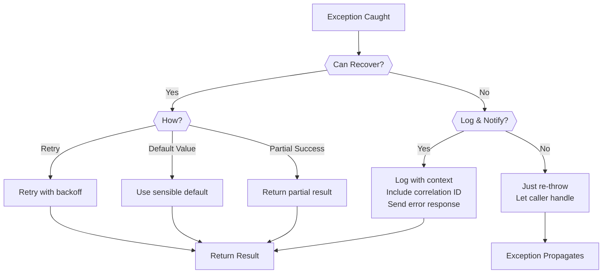

# Guidelines & Best Practices

**Status**: Complete | **Last Updated**: 2025-11-20 | **Version**: 1.0.0

## Overview

This document provides **actionable guidelines and best practices** for exception handling in Smart Supply Pro. It covers when to throw exceptions, how to choose the right exception type, common anti-patterns to avoid, and error recovery strategies.

---

## Exception Handling Decision Tree



---

## Guideline 1: When to Throw Exceptions vs. Return Values

### DO Throw Exceptions When:

#### 1. Invalid Request / Bad Input
```java
// Good: Throw exception for invalid input
if (request.getQuantity() < 1) {
    throw InvalidRequestException.valueOutOfRange("quantity", 1, 999999);
}

// Bad: Silently ignore invalid input
if (request.getQuantity() < 1) {
    quantity = 1;  // DON'T: Fix silently
}
```

**Why**: Invalid input should never proceed. Throwing forces handling at caller.

---

#### 2. Constraint Violations
```java
// Good: Throw exception for duplicate
if (supplierRepository.existsByName(name)) {
    throw DuplicateResourceException.supplierName(name);
}

// Bad: Return null to indicate duplicate
if (supplierRepository.existsByName(name)) {
    return null;  // DON'T: Ambiguous - could mean other errors
}
```

**Why**: Explicit exception is clearer than null/sentinel value.

---

#### 3. Business Rule Violations
```java
// Good: Throw exception for violated rule
if (supplier.getStatus() == DELETED) {
    throw new IllegalStateException("Cannot modify deleted supplier");
}

// Bad: Check everywhere manually
if (!isValidSupplierStatus(supplierId)) {
    // Handle error...
}
```

**Why**: Exception forces rule enforcement; prevents accidental bypass.

---

### Return Values When:

#### 1. Expected, Non-Exceptional Outcomes
```java
// Good: Return Optional for missing resource
return supplierRepository.findById(id);  // Returns Optional

// Bad: Throw exception for normal "not found"
if (!supplierRepository.existsById(id)) {
    throw new NoSuchElementException("Not found");  // Overkill for normal case
}
```

**Why**: Optional communicates that absence is normal/expected.

---

#### 2. Multiple Results (Collections)
```java
// Good: Return empty list for no results
return supplierRepository.findByStatus(status);  // Returns List (possibly empty)

// Bad: Throw exception for empty results
if (suppliers.isEmpty()) {
    throw new NoSuchElementException("No suppliers found");  // Overkill
}
```

**Why**: Empty list is standard way to communicate "no results".

---

#### 3. Boolean Conditions
```java
// Good: Return boolean for checks
public boolean canDeleteSupplier(Long id) {
    return !inventoryRepository.existsBySupplier(id);
}

// Usage
if (canDeleteSupplier(supplierId)) {
    delete(supplierId);
} else {
    // Handle cannot-delete case
}

// Bad: Throw exception for validation checks
public void validateCanDelete(Long id) {
    if (inventoryRepository.existsBySupplier(id)) {
        throw new IllegalStateException("Cannot delete");
    }
}
```

**Why**: Boolean methods are for checks; exceptions are for errors.

---

## Guideline 2: Choosing the Right Exception Type

### Decision Matrix

| Scenario | Exception | HTTP Status | Code Pattern |
|----------|-----------|-------------|--------------|
| **Required field missing** | InvalidRequestException | 400 | `throw InvalidRequestException.requiredField("name")` |
| **Invalid format** | InvalidRequestException | 400 | `throw InvalidRequestException.invalidFormat("sku", "XXX-YYYY")` |
| **Value out of range** | InvalidRequestException | 400 | `throw InvalidRequestException.valueOutOfRange("qty", 1, 999)` |
| **Business rule violated** | InvalidRequestException | 400 | `throw InvalidRequestException.businessRuleViolation("...")` |
| **Resource already exists** | DuplicateResourceException | 409 | `throw DuplicateResourceException.supplierName(name)` |
| **State rule violated** | IllegalStateException | 409 | `throw new IllegalStateException("Cannot delete...")` |
| **Resource not found** | NoSuchElementException | 404 | `throw new NoSuchElementException("Not found")` |
| **Not authenticated** | AuthenticationException | 401 | Thrown by Spring Security |
| **Insufficient permission** | AccessDeniedException | 403 | Thrown by Spring Security |

### When to Create Custom Exception vs. Use Standard

#### Create Custom Exception When:
```java
// DO: Custom exception for domain-specific error
public class InsufficientInventoryException extends RuntimeException {
    // Specific to inventory management domain
}

// Usage
if (availableQuantity < requestedQuantity) {
    throw new InsufficientInventoryException(
        "Not enough inventory: requested " + requestedQuantity + 
        " but only " + availableQuantity + " available"
    );
}
```

#### Use Standard Exception When:
```java
// DON'T: Custom exception for generic validation
public class NameValidationException extends RuntimeException {  // Too specific
}

// DO: Use InvalidRequestException instead
throw InvalidRequestException.invalidFormat("name", "Must be 1-100 characters");
```

---

## Guideline 3: Exception Messages

### DO: Provide Actionable Messages

**Good Messages**:
```java
// Specific about what's wrong
throw InvalidRequestException.requiredField("email");
// Message: "Required field missing: email"

// Suggests how to fix it
throw InvalidRequestException.invalidFormat("sku", "XXX-YYYY-ZZZZ");
// Message: "Invalid format for field: sku"

// Explains the business impact
throw new IllegalStateException(
    "Cannot delete supplier: active inventory items exist. " +
    "Please delete all inventory items first."
);

// Gives numeric boundaries
throw InvalidRequestException.valueOutOfRange("quantity", 1, 999999);
// Message: "Value must be between 1 and 999999"
```

**Bad Messages**:
```java
// Too generic
throw new IllegalArgumentException("Invalid");

// Too technical
throw new IllegalArgumentException(
    "java.sql.SQLException: Integrity constraint violation"
);

// Unclear
throw new IllegalStateException("Something went wrong");

// Too vague
throw new RuntimeException("Error occurred");
```

---

### DO: Avoid Sensitive Data in Messages

**Good**:
```java
// Generic message (no user enumeration)
throw new AuthenticationException("Authentication failed");

// No SQL details (database not exposed)
throw new DataIntegrityViolationException("Resource already exists");

// No internal paths
throw new NoSuchElementException("Resource not found");
```

**Bad**:
```java
// Reveals user doesn't exist
throw new AuthenticationException("User 'john@example.com' not found");

// Exposes SQL
throw new DataIntegrityViolationException(
    "UNIQUE constraint failed on SUPPLIERS.EMAIL"
);

// Shows internal structure
throw new NoSuchElementException(
    "ID 123 not found in table INVENTORY_ITEMS"
);
```

---

## Guideline 4: Common Anti-Patterns

### Anti-Pattern 1: Swallowing Exceptions

```java
// BAD: Silent catch - loses error information
try {
    return supplierRepository.findById(id);
} catch (Exception ex) {
    return null;  // DON'T: Where did error go?
}

// GOOD: Log or re-throw
try {
    return supplierRepository.findById(id);
} catch (DataAccessException ex) {
    logger.error("Database error finding supplier", ex);
    throw ex;  // Or throw custom exception
}
```

**Why**: Swallowing exceptions makes debugging impossible.

---

### Anti-Pattern 2: Catching Too Broad

```java
// BAD: Catches everything, including system errors
try {
    processSupplier(supplier);
} catch (Exception ex) {
    return "Error processing supplier";
}

// GOOD: Catch specific exceptions
try {
    processSupplier(supplier);
} catch (InvalidRequestException ex) {
    logger.warn("Validation failed", ex);
    return "Validation error";
} catch (DuplicateResourceException ex) {
    logger.warn("Duplicate supplier", ex);
    return "Duplicate supplier";
}
```

**Why**: Broad catch hides real bugs; specific catch handles predictable errors.

---

### Anti-Pattern 3: Catching Then Throwing Different Exception

```java
// BAD: Loses original error context
try {
    return supplierRepository.findById(id);
} catch (DataAccessException ex) {
    throw new RuntimeException("Database error");  // Lost root cause
}

// GOOD: Wrap with cause
try {
    return supplierRepository.findById(id);
} catch (DataAccessException ex) {
    throw new IllegalStateException("Cannot load supplier", ex);
}

// GOOD: Let it propagate if no handling needed
return supplierRepository.findById(id);
```

**Why**: Preserving cause chain enables root cause analysis.

---

### Anti-Pattern 4: Using Exceptions for Control Flow

```java
// BAD: Throwing exception for normal condition
try {
    for (int i = 0; i < list.size(); i++) {
        if (list.get(i).equals(target)) {
            throw new FoundException();  // Using exception as goto
        }
    }
} catch (FoundException ex) {
    return i;
}

// GOOD: Use normal control flow
for (int i = 0; i < list.size(); i++) {
    if (list.get(i).equals(target)) {
        return i;
    }
}
return -1;
```

**Why**: Exceptions are slow and meant for error conditions, not normal flow.

---

### Anti-Pattern 5: Not Specifying Which Validation Failed

```java
// BAD: Generic message, no field info
if (!isValidRequest(request)) {
    throw new InvalidRequestException("Validation failed");
}

// GOOD: Specific field and reason
if (request.getName() == null) {
    throw InvalidRequestException.requiredField("name");
}
if (!isValidEmail(request.getEmail())) {
    throw InvalidRequestException.invalidFormat("email", "valid@example.com");
}
```

**Why**: Frontend needs specific field info to highlight in form.

---

## Guideline 5: Error Recovery Strategies

### Strategy 1: Retry with Backoff

**When**: Transient failures (network timeout, database temporarily down)

```java
public static <T> T executeWithRetry(Supplier<T> operation, int maxRetries) {
    int attempt = 0;
    while (true) {
        try {
            return operation.get();
        } catch (TemporaryException ex) {  // Transient error
            attempt++;
            if (attempt >= maxRetries) {
                throw ex;  // Give up after max retries
            }
            
            // Exponential backoff: 100ms, 200ms, 400ms
            long delayMs = 100 * (long) Math.pow(2, attempt - 1);
            sleep(delayMs);
        }
    }
}

// Usage
User user = executeWithRetry(
    () -> userRepository.findById(userId),
    3  // Max 3 attempts
);
```

---

### Strategy 2: Graceful Degradation

**When**: Service dependency fails but operation can partially succeed

```java
@Service
public class ReportService {
    public ReportDTO generateReport(Long supplierId) {
        ReportDTO report = new ReportDTO();
        
        try {
            // Primary data
            report.setBasicInfo(supplierService.getSupplier(supplierId));
            
            // Optional enhancement (fail-safe)
            try {
                report.setAnalytics(analyticsService.getAnalytics(supplierId));
            } catch (AnalyticsServiceException ex) {
                logger.warn("Analytics unavailable, continuing", ex);
                // Continue without analytics
            }
            
            return report;
        } catch (SupplierNotFoundException ex) {
            throw ex;  // Critical error - can't generate report
        }
    }
}
```

---

### Strategy 3: Fail Fast with Clear Error

**When**: Validation error - can't proceed without user fixing it

```java
@Service
public class SupplierService {
    public SupplierDTO createSupplier(CreateSupplierRequest req) {
        // Validate all fields first
        List<String> errors = new ArrayList<>();
        
        if (req.getName() == null || req.getName().isBlank()) {
            errors.add("name: Required field");
        }
        
        if (req.getEmail() == null || !isValidEmail(req.getEmail())) {
            errors.add("email: Invalid format");
        }
        
        if (!errors.isEmpty()) {
            throw new InvalidRequestException(
                "Validation failed: " + String.join("; ", errors)
            );
        }
        
        // Now proceed with creation
        return save(req);
    }
}
```

---

### Strategy 4: Fallback to Default

**When**: Optional enhancement with reasonable default

```java
@Service
public class SupplierService {
    public SupplierDTO getSupplier(Long id) {
        Supplier supplier = supplierRepository.findById(id)
                .orElseThrow(() -> new NoSuchElementException("Not found"));
        
        // Optional: Load ratings from external service
        Double rating = null;
        try {
            rating = externalRatingService.getRating(supplier.getName());
        } catch (ExternalServiceException ex) {
            logger.warn("Rating service unavailable", ex);
            rating = 3.0;  // Default rating
        }
        
        return SupplierDTO.from(supplier, rating);
    }
}
```

---

## Guideline 6: Testing Exception Handling

### Unit Test: Exception Thrown on Validation Failure

```java
@Test
void testCreateSupplier_InvalidEmail() {
    CreateSupplierRequest request = CreateSupplierRequest.builder()
            .name("ACME")
            .email("invalid-email")  // Invalid
            .build();
    
    assertThrows(InvalidRequestException.class, () -> {
        supplierService.createSupplier(request);
    });
}
```

---

### Unit Test: Exception Message Content

```java
@Test
void testInvalidQuantity_MessageIncludesRange() {
    int quantity = 0;  // Out of range
    
    InvalidRequestException ex = assertThrows(InvalidRequestException.class, () -> {
        inventoryService.createInventory(quantity);
    });
    
    assertThat(ex.getMessage())
            .contains("quantity")
            .contains("1")
            .contains("999999");
}
```

---

### Integration Test: HTTP Status Code

```java
@Test
void testCreateSupplier_DuplicateName_Returns409() throws Exception {
    // Create supplier with name "ACME"
    supplierRepository.save(createSupplier("ACME"));
    
    // Try to create another with same name
    mockMvc.perform(post("/api/suppliers")
            .contentType(APPLICATION_JSON)
            .content(json(CreateSupplierRequest.builder()
                    .name("ACME")
                    .email("other@example.com")
                    .build())))
            .andExpect(status().isConflict())  // 409
            .andExpect(jsonPath("$.error").value("conflict"));
}
```

---

## Guideline 7: Logging Exceptions

### DO: Log with Context

```java
// Good: Logs exception with context
@ExceptionHandler(DuplicateResourceException.class)
public ResponseEntity<ErrorResponse> handleDuplicate(DuplicateResourceException ex) {
    String context = String.format(
        "Duplicate resource attempt: resourceType=%s, field=%s, value=%s",
        ex.getResourceType(), ex.getConflictField(), ex.getDuplicateValue()
    );
    logger.warn(context, ex);
    
    return ErrorResponse.builder()...build();
}

// Good: Includes correlation ID in logs
@ExceptionHandler(Exception.class)
public ResponseEntity<ErrorResponse> handleUnexpected(Exception ex) {
    String correlationId = MDC.get("correlationId");
    logger.error("Unexpected exception [" + correlationId + "]", ex);
    
    return ErrorResponse.builder()...build();
}
```

### DON'T: Log Sensitive Data

```java
// Bad: Logs sensitive data
logger.info("User login attempt: email=" + email + ", password=" + password);

// Bad: Logs full SQL
logger.error("Database error", ex);  // If ex contains full SQL with schema

// Good: Sanitize sensitive data
logger.info("Login attempt for user: " + maskEmail(email));
logger.debug("Database error: " + sanitize(ex.getMessage()));
```

---

## Guideline 8: Documentation Standards

### DO: Document Exceptions in Method Javadoc

```java
/**
 * Creates a new supplier in the system.
 *
 * @param request supplier creation request
 * @return created supplier DTO
 *
 * @throws InvalidRequestException if name is blank or email invalid
 * @throws DuplicateResourceException if supplier name already exists
 * 
 * @see InvalidRequestException#requiredField(String)
 * @see DuplicateResourceException#supplierName(String)
 */
public SupplierDTO createSupplier(CreateSupplierRequest request) {
    if (request.getName().isBlank()) {
        throw InvalidRequestException.requiredField("name");
    }
    
    if (supplierRepository.existsByName(request.getName())) {
        throw DuplicateResourceException.supplierName(request.getName());
    }
}
```

---

## Guideline 9: Exception Handling Checklist

Use this checklist when writing exception handling code:

- [ ] **Specific Exception?** Use specific exception type, not generic Exception
- [ ] **Meaningful Message?** Message explains what failed and how to fix
- [ ] **No Sensitive Data?** No passwords, tokens, or schema details
- [ ] **Logged?** Exception logged server-side with full details
- [ ] **Correlation ID?** Error response includes correlation ID
- [ ] **HTTP Status Correct?** Matches REST conventions (4xx client, 5xx server)
- [ ] **Frontend Actionable?** Error message helps frontend user understand issue
- [ ] **Tested?** Unit tests verify exception is thrown and message is correct
- [ ] **Documented?** Javadoc documents exceptions thrown by method
- [ ] **Cause Preserved?** Root cause exception is not lost

---

## Guideline 10: Recovery Action Flowchart



---

## Exception Handling Workflow

```
Request → Controller
    ↓
[Input Validation]
    ├→ Invalid → Throw InvalidRequestException (400)
    └→ Valid → Service Layer
        ↓
    [Business Logic]
        ├→ Duplicate → Throw DuplicateResourceException (409)
        ├→ Not Found → Throw NoSuchElementException (404)
        ├→ State Violation → Throw IllegalStateException (409)
        └→ Success → Return Result
            ↓
        [Exception Handler]
            ├→ BusinessExceptionHandler (first)
            └→ GlobalExceptionHandler (second)
                ↓
        [ErrorResponse Built]
            ├→ Error token (lowercase status)
            ├→ Human-readable message
            ├→ Timestamp (ISO-8601)
            └→ Correlation ID (tracking)
                ↓
        HTTP Response (4xx/5xx)
```

---

## Example: Complete Exception Handling

Here's a complete example following all guidelines:

```java
@RestController
@RequestMapping("/api/suppliers")
@Validated
public class SupplierController {
    
    /**
     * Creates a new supplier.
     *
     * @param request supplier creation request
     * @return created supplier DTO
     * @throws InvalidRequestException if validation fails
     * @throws DuplicateResourceException if supplier name exists
     */
    @PostMapping
    public ResponseEntity<SupplierDTO> createSupplier(
            @Valid @RequestBody CreateSupplierRequest request) {
        SupplierDTO created = supplierService.createSupplier(request);
        return ResponseEntity.status(HttpStatus.CREATED).body(created);
    }
}

@Service
@Slf4j
public class SupplierService {
    
    /**
     * Creates a new supplier with validation and duplicate checking.
     *
     * @param request creation request
     * @return created supplier
     * @throws InvalidRequestException if business validation fails
     * @throws DuplicateResourceException if name already exists
     */
    public SupplierDTO createSupplier(CreateSupplierRequest request) {
        // 1. Validate business constraints
        validateSupplierRequest(request);
        
        // 2. Check uniqueness
        if (supplierRepository.existsByNameIgnoreCase(request.getName())) {
            throw DuplicateResourceException.supplierName(request.getName());
        }
        
        // 3. Create and persist
        Supplier supplier = Supplier.builder()
                .name(request.getName())
                .email(request.getEmail())
                .build();
        
        Supplier saved = supplierRepository.save(supplier);
        return SupplierDTO.from(saved);
    }
    
    private void validateSupplierRequest(CreateSupplierRequest request) {
        Map<String, String> errors = new HashMap<>();
        
        if (request.getName() == null || request.getName().isBlank()) {
            errors.put("name", "Name is required");
        }
        
        if (!isValidEmail(request.getEmail())) {
            errors.put("email", "Valid email required");
        }
        
        if (!errors.isEmpty()) {
            throw new InvalidRequestException(
                "Validation failed: " + errors.size() + " error(s)",
                errors
            );
        }
    }
}

@RestControllerAdvice
@Order(Ordered.HIGHEST_PRECEDENCE)
@Slf4j
public class BusinessExceptionHandler {
    
    @ExceptionHandler(InvalidRequestException.class)
    public ResponseEntity<ErrorResponse> handleValidation(InvalidRequestException ex) {
        // Log with context
        log.warn("Validation failed: {}", ex.getValidationDetails());
        
        return ErrorResponse.builder()
                .status(HttpStatus.BAD_REQUEST)
                .message(ex.getMessage())
                .build();
    }
    
    @ExceptionHandler(DuplicateResourceException.class)
    public ResponseEntity<ErrorResponse> handleDuplicate(DuplicateResourceException ex) {
        // Log with details
        log.warn("Duplicate resource: type={}, field={}, value={}",
                ex.getResourceType(), ex.getConflictField(), ex.getDuplicateValue());
        
        return ErrorResponse.builder()
                .status(HttpStatus.CONFLICT)
                .message(ex.getClientMessage())
                .build();
    }
}
```

---

## Related Documentation

- **[Exception Architecture Overview](./index.md)** – Exception types and hierarchy
- **[Global Exception Handler](./global-exception-handler.md)** – Implementation details
- **[Domain Exceptions](./domain-exceptions.md)** – Custom exception classes
- **[Error Response Structure](./error-response-structure.md)** – JSON format
- **[Exception-to-HTTP Mapping](./exception-to-http-mapping.md)** – Status code mapping

---

## Version History

| Version | Date | Changes |
|---------|------|---------|
| 1.0.0 | 2025-11-20 | Initial comprehensive best practices |

---

## Quick Checklist

When handling exceptions:

```
□ Use specific exception type
□ Include meaningful message
□ No sensitive data exposed
□ Exception logged server-side
□ Correlation ID in response
□ Correct HTTP status code
□ Frontend message is actionable
□ Exception documented in Javadoc
□ Root cause preserved
□ Unit tests verify behavior
```

## One-Page Reference

| Do This | Don't Do This |
|---------|---------------|
| Throw InvalidRequestException for invalid input | Silently fix or ignore invalid input |
| Throw DuplicateResourceException for unique violations | Return null/empty for error conditions |
| Use generic auth messages | Reveal whether username/password was wrong |
| Log full exception server-side | Expose stack traces to client |
| Include correlation ID in response | Make errors hard to trace |
| Document exceptions in Javadoc | Leave exception usage unclear |
| Catch specific exceptions | Catch broad Exception class |
| Preserve cause chain | Lose original error context |
| Test exception throwing | Assume errors won't happen |
| Return empty collections | Throw exception for no results |
