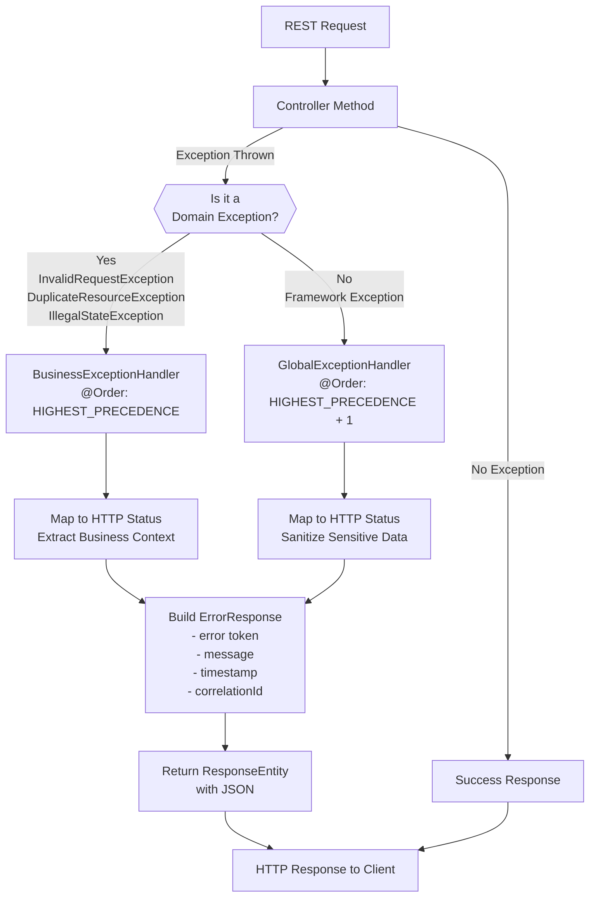

# Exception Architecture

**Status**: Complete | **Last Updated**: 2025-11-20 | **Version**: 2.0.0

## Navigation

**Back to**: [Architecture Overview](../index.md)

---

## Overview

The Smart Supply Pro exception handling architecture provides a **centralized, layered approach** to error management across the entire backend application. By separating framework-level exceptions from domain-specific business exceptions, we ensure consistent error responses, maintainable code, and secure error handling that prevents information disclosure.

This documentation hub covers:
- Exception types and their mappings
- Handler ordering and execution flow
- Error response structure and correlation tracking
- Security considerations and best practices
- Implementation guidelines for developers

---

## Quick Navigation

### For Backend Developers
1. **[Global Exception Handler](./global-exception-handler.md)** – Framework-level exception handling, handler ordering, catch-all strategies
2. **[Exception-to-HTTP Mapping](./exception-to-http-mapping.md)** – Complete status code mapping table and logic
3. **[Domain Exceptions](./domain-exceptions.md)** – Custom business logic exceptions (InvalidRequestException, DuplicateResourceException)
4. **[Guidelines & Best Practices](./guidelines-and-best-practices.md)** – When to throw, anti-patterns, error recovery

### For Frontend/API Integration
1. **[Error Response Structure](./error-response-structure.md)** – JSON format, fields, correlation IDs
2. **[Exception-to-HTTP Mapping](./exception-to-http-mapping.md)** – Expected status codes and error tokens
3. **[Validation Exceptions](./validation-exceptions.md)** – Field-level error handling

### For DevOps/Security
1. **[Security Exceptions](./security-exceptions.md)** – Authentication/authorization errors, generic messaging
2. **[Global Exception Handler](./global-exception-handler.md)** – Sensitive data sanitization, error exposure prevention

---

## Exception Type Classifications

### 1. Framework-Level Exceptions (GlobalExceptionHandler)

These are exceptions thrown by Spring Framework, Spring MVC, and other libraries. They are **automatically caught and mapped** to HTTP status codes.

**Common Framework Exceptions**:
- **MethodArgumentNotValidException** – Validation failure on @Valid objects → 400
- **ConstraintViolationException** – JSR-380 constraint violation → 400
- **HttpMessageNotReadableException** – Malformed request body (e.g., invalid JSON) → 400
- **MissingServletRequestParameterException** – Missing required query/form parameter → 400
- **MethodArgumentTypeMismatchException** – Parameter type conversion failure → 400
- **AuthenticationException** – Authentication failure (credentials invalid) → 401
- **AccessDeniedException** – Authorization failure (insufficient permissions) → 403
- **NoSuchElementException** – Resource not found in collection → 404
- **IllegalArgumentException** – Invalid argument (business lookup failure) → 404
- **DataIntegrityViolationException** – Database constraint violation → 409
- **ObjectOptimisticLockingFailureException** – Concurrent update conflict → 409
- **ResponseStatusException** – Explicit HTTP status exception → Preserved status
- **Exception** (catch-all) – Unhandled exceptions → 500 (no stack trace)

**Characteristics**:
- ✅ Handled automatically by GlobalExceptionHandler
- ✅ No code changes needed to propagate to error response
- ✅ Always return consistent error response format
- ✅ Sensitive information is sanitized (e.g., SQL details hidden)

### 2. Domain-Level Exceptions (BusinessExceptionHandler)

These are **custom exceptions representing business rule violations**. They are thrown explicitly from service layer code to handle domain-specific scenarios.

**Current Domain Exceptions**:
- **InvalidRequestException** – Business validation failures, field-level errors → 400
- **DuplicateResourceException** – Uniqueness constraint violations → 409
- **IllegalStateException** – Business state rule violations → 409

**Characteristics**:
- ✅ Thrown explicitly from service methods
- ✅ Carry context information (field names, resource types, conflict details)
- ✅ Prioritized before framework exceptions (via @Order)
- ✅ Can include structured error details for client handling

### 3. Validation Exceptions

A specialized category of exceptions for handling request validation errors with **field-level granularity**.

**Types**:
- **InvalidRequestException** with field errors – Specific field validation failures
- **MethodArgumentNotValidException** – Spring's bean validation (@Valid)
- **ConstraintViolationException** – JSR-380 constraints on method parameters

**Fields Captured**:
- Field names (e.g., "email", "quantity")
- Validation codes (e.g., "NOT_EMPTY", "POSITIVE")
- Field-specific error messages (e.g., "Email format is invalid")

### 4. Security Exceptions

Exceptions related to authentication and authorization with **special handling for sensitive information**.

**Types**:
- **AuthenticationException** – Credentials invalid, user not found, token expired → 401
- **AccessDeniedException** – User lacks required permissions → 403
- **InvalidRequestException** with CRITICAL severity – Security validation failures

**Security Behavior**:
- ⚠️ Generic error messages (prevents user enumeration attacks)
- ⚠️ No details about why authentication/authorization failed
- ⚠️ Details logged server-side for debugging (never exposed to client)
- ⚠️ Correlation IDs enable server-side investigation

---

## Exception Handling Flow



### Execution Order

1. **Request arrives** at controller method
2. **Exception thrown** during request processing
3. **BusinessExceptionHandler** intercepts first (@Order: HIGHEST_PRECEDENCE)
   - If domain exception → handle it, return error response
   - If not domain exception → pass to next handler
4. **GlobalExceptionHandler** intercepts second (@Order: HIGHEST_PRECEDENCE + 1)
   - If framework/known exception → handle it, return error response
   - If unhandled exception → catch-all handler (500, no stack trace)
5. **ErrorResponse built** with timestamp and correlation ID
6. **ResponseEntity returned** with proper HTTP status and JSON

---

## HTTP Status Code Reference

| Status | Meaning | Common Causes | Handler |
|--------|---------|---------------|---------|
| **400** | Bad Request | Invalid input, validation failure, malformed JSON | Global/Business |
| **401** | Unauthorized | Authentication failed, expired token | Global |
| **403** | Forbidden | Insufficient permissions, access denied | Global |
| **404** | Not Found | Resource doesn't exist | Global |
| **409** | Conflict | Duplicate resource, concurrent update, state violation | Global/Business |
| **500** | Internal Server Error | Unhandled exception, unexpected error | Global |

---

## Error Response Structure

All error responses follow this standard JSON structure:

```json
{
  "error": "bad_request",
  "message": "Validation failed: email is required",
  "timestamp": "2025-11-20T14:30:45.123Z",
  "correlationId": "SSP-1700551445123-4891"
}
```

**Fields**:
- **error** – Machine-readable error token (lowercase HTTP status name)
- **message** – Human-readable description of the error
- **timestamp** – ISO-8601 UTC timestamp of error occurrence
- **correlationId** – Unique tracking ID linking client request to server logs

See **[Error Response Structure](./error-response-structure.md)** for detailed field documentation.

---

## Handler Architecture Diagram

```mermaid
classDiagram
    class BusinessExceptionHandler {
        @Order(HIGHEST_PRECEDENCE)
        @RestControllerAdvice
        handleInvalidRequest(InvalidRequestException)
        handleDuplicateResource(DuplicateResourceException)
        handleBusinessStateConflict(IllegalStateException)
    }
    
    class GlobalExceptionHandler {
        @Order(HIGHEST_PRECEDENCE + 1)
        @RestControllerAdvice
        handleValidation(MethodArgumentNotValidException)
        handleConstraint(ConstraintViolationException)
        handleNotFound(NoSuchElementException)
        handleDataIntegrity(DataIntegrityViolationException)
        handleAuthentication(AuthenticationException)
        handleAuthorization(AccessDeniedException)
        handleUnexpected(Exception)
    }
    
    class ErrorResponse {
        String error
        String message
        String timestamp
        String correlationId
        build()
        generateCorrelationId()
    }
    
    class InvalidRequestException {
        ValidationSeverity severity
        String validationCode
        Map fieldErrors
        List generalErrors
        hasFieldErrors()
        isCritical()
    }
    
    class DuplicateResourceException {
        String resourceType
        String conflictField
        String duplicateValue
        hasDetailedContext()
        getClientMessage()
    }
    
    BusinessExceptionHandler --> ErrorResponse
    GlobalExceptionHandler --> ErrorResponse
    BusinessExceptionHandler --> InvalidRequestException
    BusinessExceptionHandler --> DuplicateResourceException
    GlobalExceptionHandler --|catches| InvalidRequestException : domain exception first
```

---

## File Organization

This exception architecture documentation is organized as follows:

### Core Implementation
- **[Global Exception Handler](./global-exception-handler.md)** – @RestControllerAdvice, handler methods, exception mapping
- **[Domain Exceptions](./domain-exceptions.md)** – Custom exceptions, factory methods, context information
- **[Error Response Structure](./error-response-structure.md)** – DTO structure, builder pattern, correlation IDs

### Reference & Mapping
- **[Exception-to-HTTP Mapping](./exception-to-http-mapping.md)** – Complete mapping table, logic, decision tree
- **[Validation Exceptions](./validation-exceptions.md)** – Validation failure handling, field-level errors
- **[Security Exceptions](./security-exceptions.md)** – Auth/authz, generic messaging, security best practices

### Developer Guidance
- **[Guidelines & Best Practices](./guidelines-and-best-practices.md)** – When to throw, anti-patterns, error recovery strategies

---

## Key Design Principles

### 1. **Separation of Concerns**
- Framework exceptions handled separately from domain exceptions
- Each handler focuses on its domain (framework vs. business)
- Clear responsibility boundaries

### 2. **Handler Ordering**
- BusinessExceptionHandler runs first (HIGHEST_PRECEDENCE)
- GlobalExceptionHandler runs second (HIGHEST_PRECEDENCE + 1)
- Ensures domain exceptions take priority over framework exceptions

### 3. **Consistent Error Format**
- All errors return same JSON structure (error, message, timestamp, correlationId)
- Predictable for client code to handle
- Correlation IDs enable request tracking across logs

### 4. **Security by Default**
- Generic messages for auth/authz (prevents user enumeration)
- No stack traces in 500 responses (prevents information disclosure)
- SQL errors sanitized (hides database schema)
- Sensitive data never exposed in error messages

### 5. **Debuggability**
- Correlation IDs tie client requests to server logs
- Timestamps help with log correlation
- Server-side logging captures full exception details (not exposed to client)

### 6. **Extensibility**
- New domain exceptions can be added to BusinessExceptionHandler
- New framework exception types caught by GlobalExceptionHandler
- Custom factory methods in domain exceptions simplify common scenarios

---

## Integration Points

### With Controllers
```java
@RestController
@RequestMapping("/api/suppliers")
public class SupplierController {
    @PostMapping
    public ResponseEntity<SupplierDTO> createSupplier(@Valid @RequestBody CreateSupplierRequest req) {
        // Validation errors thrown by @Valid → GlobalExceptionHandler
        // BusinessExceptionHandler catches domain exceptions
        return supplierService.createSupplier(req);
    }
}
```

### With Service Layer
```java
@Service
public class SupplierService {
    public SupplierDTO createSupplier(CreateSupplierRequest req) {
        // Check for duplicates → throw DuplicateResourceException
        if (supplierExists(req.getName())) {
            throw DuplicateResourceException.supplierName(req.getName());
        }
        // Business rule violation → throw IllegalStateException
        if (!isValidSupplierType(req.getType())) {
            throw new IllegalStateException("Supplier type is not supported");
        }
    }
}
```

### With Frontend
```javascript
// Frontend receives error response with correlation ID
try {
    await api.post('/suppliers', supplierData);
} catch (error) {
    const correlationId = error.response.data.correlationId;
    console.error(`Error ${error.response.status}: ${error.response.data.error}`);
    console.error(`Correlation ID: ${correlationId}`);
    console.error(`Message: ${error.response.data.message}`);
    // User reports issue with correlation ID for debugging
}
```

---

## Related Documentation

- **[Global Exception Handler](./global-exception-handler.md)** – Implementation details of framework exception handling
- **[Domain Exceptions](./domain-exceptions.md)** – Custom exception classes and usage patterns
- **[Error Response Structure](./error-response-structure.md)** – JSON response format and fields
- **[Exception-to-HTTP Mapping](./exception-to-http-mapping.md)** – Complete status code mapping reference
- **[Guidelines & Best Practices](./guidelines-and-best-practices.md)** – Developer best practices for exception handling
- **[Validation Exceptions](./validation-exceptions.md)** – Handling request validation errors
- **[Security Exceptions](./security-exceptions.md)** – Authentication and authorization error handling
- **[Integration Architecture](../integration/index.md)** – Frontend-backend error contract
- **[Architecture Overview](../index.md)** – Complete backend architecture documentation

---

## Version History

| Version | Date | Changes |
|---------|------|---------|
| 2.0.0 | 2025-11-20 | Complete exception architecture documentation (8 files, 7000+ lines) |
| 1.0.0 | 2025-10-15 | Initial exception handling implementation |

---

## Quick Start: Common Scenarios

### Scenario 1: Validate Required Field
```java
// Service
if (request.getEmail() == null || request.getEmail().isBlank()) {
    throw InvalidRequestException.requiredField("email");
}
// Result: 400 with error token "bad_request"
```

### Scenario 2: Enforce Uniqueness
```java
// Service
if (supplierRepository.existsByName(name)) {
    throw DuplicateResourceException.supplierName(name);
}
// Result: 409 with error token "conflict" and resource context
```

### Scenario 3: Business Rule Violation
```java
// Service
if (supplier.getStatus() == DELETED) {
    throw new IllegalStateException("Cannot modify deleted supplier");
}
// Result: 409 with error token "conflict"
```

### Scenario 4: Handle Frontend Error
```javascript
// Frontend
const response = await api.post('/suppliers', data);
if (response.status === 409 && response.data.error === 'conflict') {
    const context = response.data; // { resourceType, conflictField, duplicateValue }
    showConflictDialog(context);
}
```

---

## Performance & Observability

### Correlation ID Benefits
- 🔍 Link client requests to server logs
- 📊 Track error patterns across requests
- 🐛 Facilitate debugging user-reported issues
- 📈 Analyze error distribution by type/status

### Timestamp Tracking
- ⏱️ Order errors chronologically in logs
- 🔗 Correlate with other system events
- 📊 Calculate error response times

### Logging Best Practices
- ✅ Log exception details server-side (full stack trace)
- ✅ Include correlation ID in log entries
- ❌ Never expose stack traces to clients
- ❌ Never expose database schema details

---

## Troubleshooting

**Q: I'm not seeing my custom exception handler called?**
- A: Ensure your custom exception extends RuntimeException and your handler is in a @RestControllerAdvice class

**Q: How do I add context information to errors?**
- A: Use factory methods or constructors in custom exceptions to capture context (e.g., DuplicateResourceException)

**Q: Why am I getting a generic 500 error instead of meaningful information?**
- A: Check logs for correlation ID; use it to find detailed server-side exception logs

**Q: How do I prevent sensitive data in error messages?**
- A: Use the sanitize() method in GlobalExceptionHandler or generic exception messages

---

## Next Steps

1. **Review** [Global Exception Handler](./global-exception-handler.md) for implementation details
2. **Study** [Exception-to-HTTP Mapping](./exception-to-http-mapping.md) for complete status code reference
3. **Understand** [Domain Exceptions](./domain-exceptions.md) for custom exception patterns
4. **Follow** [Guidelines & Best Practices](./guidelines-and-best-practices.md) when implementing new exception handling
