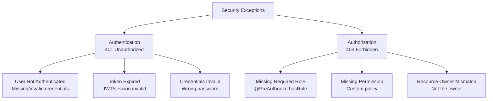

# Security Exceptions

**Status**: Complete | **Last Updated**: 2025-11-20 | **Version**: 1.0.0

## Overview

Security exceptions are **authentication and authorization errors** with **special handling for sensitive information**. Unlike other exception types, security exceptions must use **generic error messages** to prevent security vulnerabilities (user enumeration, permission enumeration attacks).

**Key Characteristics**:
- ✅ Map to HTTP 401 (authentication) and 403 (authorization)
- ✅ Use generic messages (prevent information disclosure)
- ✅ Full details logged server-side (never exposed to client)
- ✅ Correlation IDs enable server-side investigation
- ✅ Clear for legitimate users, frustrate attackers
- ✅ Consistent error responses across auth/authz failures

---

## Exception Types



---

## Exception 1: AuthenticationException (401 Unauthorized)

### Purpose

Thrown when **user authentication fails** (not logged in, invalid credentials, expired token). Maps to **HTTP 401 Unauthorized**.

**Use Cases**:
- User not authenticated (no token/session)
- Token is expired
- Token is invalid (tampered with)
- Credentials (username/password) don't match
- Session has been invalidated

### Trigger Scenarios

#### Scenario 1: Accessing Protected Resource Without Token

```java
@GetMapping("/profile")
@PreAuthorize("isAuthenticated()")
public ProfileDTO getProfile() {
    // If user not authenticated → AuthenticationException
    return userService.getCurrentUserProfile();
}
```

**Request**:
```
GET /api/profile
(no Authorization header)
```

**GlobalExceptionHandler**:
```java
@ExceptionHandler(AuthenticationException.class)
public ResponseEntity<ErrorResponse> handleAuthentication(AuthenticationException ex) {
    // Generic message - don't leak whether user exists or password is wrong
    return ErrorResponse.builder()
            .status(HttpStatus.UNAUTHORIZED)
            .message("Authentication failed: invalid credentials or expired session")
            .build();
}
```

**HTTP Response (401)**:
```json
{
  "error": "unauthorized",
  "message": "Authentication failed: invalid credentials or expired session",
  "timestamp": "2025-11-20T14:30:45.123Z",
  "correlationId": "SSP-1700551445123-4891"
}
```

---

#### Scenario 2: Expired JWT Token

**JWT Validation**:
```java
@Component
public class JwtAuthenticationFilter extends OncePerRequestFilter {
    
    @Override
    protected void doFilterInternal(HttpServletRequest request, 
                                   HttpServletResponse response,
                                   FilterChain filterChain) throws ServletException, IOException {
        try {
            String token = extractToken(request);
            if (token != null && !isTokenExpired(token)) {
                // Token valid - proceed
            } else if (isTokenExpired(token)) {
                throw new AuthenticationException("Token has expired");
            } else {
                throw new AuthenticationException("No token provided");
            }
        } catch (AuthenticationException ex) {
            // Handled by GlobalExceptionHandler
            throw ex;
        }
    }
}
```

**Error Response**:
```json
{
  "error": "unauthorized",
  "message": "Authentication failed: invalid credentials or expired session",
  "timestamp": "2025-11-20T14:30:46.234Z",
  "correlationId": "SSP-1700551446234-5902"
}
```

---

#### Scenario 3: Invalid Credentials

**Login Endpoint**:
```java
@PostMapping("/login")
public LoginResponse login(@RequestBody LoginRequest req) {
    User user = userRepository.findByEmail(req.getEmail())
            .orElseThrow(() -> new AuthenticationException(
                    "Authentication failed"  // Don't say "user not found"
            ));
    
    if (!passwordEncoder.matches(req.getPassword(), user.getPassword())) {
        throw new AuthenticationException(
                "Authentication failed"  // Don't say "password incorrect"
        );
    }
    
    String token = jwtProvider.generateToken(user);
    return LoginResponse.builder().token(token).build();
}
```

**Invalid Email Request**:
```
POST /login
Content-Type: application/json

{"email":"john@example.com","password":"password123"}
```

**Error Response**:
```json
{
  "error": "unauthorized",
  "message": "Authentication failed: invalid credentials or expired session",
  "timestamp": "2025-11-20T14:30:47.345Z",
  "correlationId": "SSP-1700551447345-6013"
}
```

**Server-Side Log** (never sent to client):
```
[SSP-1700551447345-6013] AuthenticationException: User not found: john@example.com
Attempted authentication with non-existent email address
```

---

### Security Best Practices

#### ✅ DO: Use Generic Messages

```java
// Good - Generic message
throw new AuthenticationException("Authentication failed");

// Good - Doesn't leak details
return ErrorResponse.builder()
        .status(HttpStatus.UNAUTHORIZED)
        .message("Authentication failed: invalid credentials or expired session")
        .build();
```

#### ❌ DON'T: Leak User Existence

```java
// Bad - Reveals user doesn't exist
throw new AuthenticationException("User 'john@example.com' not found");

// Bad - Reveals password is wrong
throw new AuthenticationException("Email found but password incorrect");

// Bad - Reveals account is locked
throw new AuthenticationException("Account 'john' is locked due to too many attempts");
```

#### ❌ DON'T: Expose Token Details

```java
// Bad - Reveals token details
throw new AuthenticationException("JWT token signature is invalid");

// Bad - Reveals algorithm
throw new AuthenticationException("HMAC-SHA256 verification failed");

// Bad - Reveals expiration details
throw new AuthenticationException("Token expired at 2025-11-20T14:00:00Z");
```

---

### Frontend Handling

```typescript
// Login form submission
async function login(email, password) {
    try {
        const response = await api.post('/login', { email, password });
        setAuthToken(response.data.token);
        navigateToDashboard();
    } catch (error) {
        if (error.response?.status === 401) {
            // Show generic error message
            showMessage('Invalid credentials. Please check email and password.');
            
            // Log correlation ID for support
            const correlationId = error.response.data.correlationId;
            console.error(`Login failed: ${correlationId}`);
            
            // Don't try to guess which field is wrong
            // User will figure it out by trying again
        }
    }
}

// Accessing protected resource
async function fetchProfile() {
    try {
        const response = await api.get('/profile');
        return response.data;
    } catch (error) {
        if (error.response?.status === 401) {
            // Session expired or token invalid
            clearAuthToken();
            redirectToLogin();
            
            // Show message
            showMessage('Your session has expired. Please log in again.');
        }
    }
}
```

---

## Exception 2: AccessDeniedException (403 Forbidden)

### Purpose

Thrown when **user is authenticated but lacks permission** for the operation. Maps to **HTTP 403 Forbidden**.

**Use Cases**:
- User doesn't have required role (ADMIN, MANAGER)
- User lacks specific permission (DELETE_SUPPLIER)
- User is not the resource owner
- Resource access is restricted by status/flags

### Trigger Scenarios

#### Scenario 1: Missing Required Role

```java
@DeleteMapping("/{id}")
@PreAuthorize("hasRole('ADMIN')")
public ResponseEntity<Void> deleteSupplier(@PathVariable Long id) {
    // If user is not ADMIN → AccessDeniedException
    supplierService.deleteSupplier(id);
    return ResponseEntity.ok().build();
}
```

**Request** (Non-ADMIN user):
```
DELETE /api/suppliers/123
Authorization: Bearer {userToken}
```

**GlobalExceptionHandler**:
```java
@ExceptionHandler(AccessDeniedException.class)
public ResponseEntity<ErrorResponse> handleAuthorization(AccessDeniedException ex) {
    // Generic message - don't leak what role/permission is required
    return ErrorResponse.builder()
            .status(HttpStatus.FORBIDDEN)
            .message("Access denied: insufficient permissions for this operation")
            .build();
}
```

**HTTP Response (403)**:
```json
{
  "error": "forbidden",
  "message": "Access denied: insufficient permissions for this operation",
  "timestamp": "2025-11-20T14:30:48.456Z",
  "correlationId": "SSP-1700551448456-7124"
}
```

---

#### Scenario 2: Missing Custom Permission

```java
@PostMapping("/{id}/export")
@PreAuthorize("@permissionService.canExport(#id, authentication.principal)")
public ResponseEntity<ByteArrayResource> exportData(@PathVariable Long id) {
    // If user lacks export permission → AccessDeniedException
    return supplierService.exportData(id);
}

@Component
public class PermissionService {
    public boolean canExport(Long supplierId, UserPrincipal user) {
        // Check custom permission logic
        return user.hasPermission("EXPORT_DATA") && 
               user.hasAccessToSupplier(supplierId);
    }
}
```

**Error Response**:
```json
{
  "error": "forbidden",
  "message": "Access denied: insufficient permissions for this operation",
  "timestamp": "2025-11-20T14:30:49.567Z",
  "correlationId": "SSP-1700551449567-8235"
}
```

---

#### Scenario 3: Resource Owner Verification

```java
@PutMapping("/profile/{userId}")
public ResponseEntity<UserDTO> updateProfile(@PathVariable Long userId,
                                             @RequestBody UpdateProfileRequest req,
                                             @AuthenticationPrincipal UserPrincipal user) {
    // Verify user is updating their own profile
    if (!user.getId().equals(userId)) {
        throw new AccessDeniedException(
                "User " + user.getId() + 
                " cannot modify profile of user " + userId
        );
    }
    
    return userService.updateProfile(userId, req);
}
```

**Request** (User 123 trying to update User 456's profile):
```
PUT /api/profile/456
Authorization: Bearer {user123Token}
Content-Type: application/json

{"name":"NewName"}
```

**Error Response**:
```json
{
  "error": "forbidden",
  "message": "Access denied: insufficient permissions for this operation",
  "timestamp": "2025-11-20T14:30:50.678Z",
  "correlationId": "SSP-1700551450678-9346"
}
```

**Server-Side Log** (never sent to client):
```
[SSP-1700551450678-9346] AccessDeniedException: User 123 attempted to modify profile of user 456
Unauthorized profile modification attempt
```

---

### Security Best Practices

#### ✅ DO: Use Generic Messages

```java
// Good - Generic message
throw new AccessDeniedException("Access denied");

// Good - Doesn't reveal required role
return ErrorResponse.builder()
        .status(HttpStatus.FORBIDDEN)
        .message("Access denied: insufficient permissions for this operation")
        .build();
```

#### ❌ DON'T: Leak Required Roles/Permissions

```java
// Bad - Reveals required role
throw new AccessDeniedException("Requires ADMIN role");

// Bad - Reveals required permission
throw new AccessDeniedException("Missing EXPORT_DATA permission");

// Bad - Lists all required roles
throw new AccessDeniedException("Requires one of: ADMIN, MANAGER");
```

#### ❌ DON'T: Expose Permission Details

```java
// Bad - Reveals permission logic
throw new AccessDeniedException("User must have SUPPLIER_WRITE and REGION_US permissions");

// Bad - Leaks security policy
throw new AccessDeniedException("Only supplier account owners can delete");

// Bad - Reveals configuration
throw new AccessDeniedException("User IP 192.168.1.100 not in whitelist");
```

---

### Frontend Handling

```typescript
// Handle 403 errors
async function performAdminAction() {
    try {
        await api.delete('/suppliers/123');
    } catch (error) {
        if (error.response?.status === 403) {
            // User lacks permission
            showMessage('You do not have permission to perform this action.');
            
            // Optional: disable/hide the button
            document.querySelector('#delete-btn').disabled = true;
            
            // Optional: show "contact admin" message
            showContactAdminLink();
            
            // Log for telemetry
            const correlationId = error.response.data.correlationId;
            console.error(`Access denied: ${correlationId}`);
        }
    }
}
```

---

## Common Authentication/Authorization Scenarios

### Scenario A: Login Flow with Invalid Credentials

```
Request:
POST /login
{"email":"john@example.com","password":"wrongpassword"}

Response (401):
{
  "error": "unauthorized",
  "message": "Authentication failed: invalid credentials or expired session",
  "correlationId": "SSP-1700551445123-4891"
}

Frontend:
- Show generic error message
- Don't reveal that email was found or password was wrong
- Clear any stored credentials
```

---

### Scenario B: Expired Session/Token

```
Request:
GET /profile
Authorization: Bearer {expiredToken}

Response (401):
{
  "error": "unauthorized",
  "message": "Authentication failed: invalid credentials or expired session",
  "correlationId": "SSP-1700551446234-5902"
}

Frontend:
- Redirect to login page
- Clear stored token
- Show "session expired" message
- Offer to re-login
```

---

### Scenario C: Missing Admin Role

```
Request:
DELETE /suppliers/123
Authorization: Bearer {standardUserToken}

Response (403):
{
  "error": "forbidden",
  "message": "Access denied: insufficient permissions for this operation",
  "correlationId": "SSP-1700551447345-6013"
}

Frontend:
- Show generic "access denied" message
- Don't try to guess which role is needed
- Disable the delete button
- Show "contact admin" option
```

---

### Scenario D: Token Not Provided

```
Request:
GET /protected
(no Authorization header)

Response (401):
{
  "error": "unauthorized",
  "message": "Authentication failed: invalid credentials or expired session",
  "correlationId": "SSP-1700551448456-7124"
}

Frontend:
- Redirect to login
- Show "login required" message
```

---

## Implementation Examples

### Spring Security Configuration

```java
@Configuration
@EnableWebSecurity
@EnableGlobalMethodSecurity(prePostEnabled = true)
public class SecurityConfig {
    
    @Bean
    public SecurityFilterChain filterChain(HttpSecurity http) throws Exception {
        return http
            .csrf().disable()
            .authorizeRequests()
                .antMatchers("/login", "/register").permitAll()
                .antMatchers("/admin/**").hasRole("ADMIN")
                .antMatchers("/api/**").authenticated()
                .anyRequest().authenticated()
            .and()
            .httpBasic()
            .and()
            .build();
    }
    
    @Bean
    public AuthenticationEntryPoint authenticationEntryPoint() {
        return (request, response, ex) -> {
            response.setStatus(HttpServletResponse.SC_UNAUTHORIZED);
            response.setContentType("application/json");
            response.getWriter().write(
                "{\"error\":\"unauthorized\",\"message\":\"Authentication failed\"}"
            );
        };
    }
}
```

### JWT Token Validation

```java
@Component
public class JwtTokenProvider {
    
    public boolean validateToken(String token) {
        try {
            Jwts.parserBuilder()
                .setSigningKey(getSigningKey())
                .build()
                .parseClaimsJws(token);
            return true;
        } catch (ExpiredJwtException ex) {
            logger.warn("JWT token expired", ex);
            throw new AuthenticationException("Token expired");
        } catch (SignatureException ex) {
            logger.warn("Invalid JWT signature", ex);
            throw new AuthenticationException("Invalid token");
        } catch (JwtException ex) {
            logger.warn("Invalid JWT token", ex);
            throw new AuthenticationException("Invalid token");
        }
    }
    
    public String extractEmail(String token) {
        try {
            return Jwts.parserBuilder()
                .setSigningKey(getSigningKey())
                .build()
                .parseClaimsJws(token)
                .getBody()
                .getSubject();
        } catch (JwtException ex) {
            throw new AuthenticationException("Cannot extract email from token");
        }
    }
}
```

---

## Testing Security Exceptions

### Unit Test: Authentication Failure

```java
@SpringBootTest
class AuthenticationExceptionTest {
    
    @Autowired
    private MockMvc mockMvc;
    
    @Test
    void testAccessProtectedResourceWithoutToken() throws Exception {
        mockMvc.perform(get("/api/profile"))
                .andExpect(status().isUnauthorized())
                .andExpect(jsonPath("$.error").value("unauthorized"))
                .andExpect(jsonPath("$.message")
                        .value("Authentication failed: invalid credentials or expired session"));
    }
    
    @Test
    void testInvalidJwtToken() throws Exception {
        mockMvc.perform(get("/api/profile")
                .header("Authorization", "Bearer invalid.token.here"))
                .andExpect(status().isUnauthorized())
                .andExpect(jsonPath("$.error").value("unauthorized"));
    }
}
```

### Unit Test: Authorization Failure

```java
@SpringBootTest
class AuthorizationExceptionTest {
    
    @Test
    @WithMockUser(roles = "USER")  // Regular user, not ADMIN
    void testAdminEndpointWithoutAdminRole() throws Exception {
        mockMvc.perform(delete("/api/suppliers/123"))
                .andExpect(status().isForbidden())
                .andExpect(jsonPath("$.error").value("forbidden"))
                .andExpect(jsonPath("$.message")
                        .value("Access denied: insufficient permissions for this operation"));
    }
    
    @Test
    @WithMockUser(roles = "ADMIN")
    void testAdminEndpointWithAdminRole() throws Exception {
        mockMvc.perform(delete("/api/suppliers/123"))
                .andExpect(status().isOk());  // Success
    }
}
```

---

## Best Practices

### DO:
- ✅ Use generic error messages for auth/authz errors
- ✅ Log full details server-side (for debugging)
- ✅ Provide correlation ID in error response (for support investigation)
- ✅ Validate authentication early (in filter/interceptor)
- ✅ Use standard Spring Security exceptions
- ✅ Separate auth (401) from authz (403) errors
- ✅ Clear tokens on logout/session expiration

### DON'T:
- ❌ Reveal whether user exists ("user not found" vs "password wrong")
- ❌ Leak required roles ("requires ADMIN")
- ❌ Expose permission details to unauthorized users
- ❌ Include sensitive data in error messages
- ❌ Use different messages for different failure reasons
- ❌ Log stack traces to response (only to server logs)
- ❌ Send tokens in error responses

---

## Related Documentation

- **[Exception Architecture Overview](./index.md)** – Exception types and hierarchy
- **[Global Exception Handler](./global-exception-handler.md)** – Framework exception handling
- **[Exception-to-HTTP Mapping](./exception-to-http-mapping.md)** – 401/403 mapping details
- **[Error Response Structure](./error-response-structure.md)** – JSON format and fields
- **[Guidelines & Best Practices](./guidelines-and-best-practices.md)** – General best practices
- **[Integration Architecture - Auth Flow](../integration/auth-flow-frontend.md)** – Frontend-backend auth flow

---

## Version History

| Version | Date | Changes |
|---------|------|---------|
| 1.0.0 | 2025-11-20 | Initial comprehensive documentation |

---

## Quick Reference

### HTTP Status Codes

| Status | Exception | Meaning |
|--------|-----------|---------|
| **401** | AuthenticationException | User not authenticated or credentials invalid |
| **403** | AccessDeniedException | User authenticated but lacks permission |

### Generic Messages

```
// Authentication (401)
"Authentication failed: invalid credentials or expired session"

// Authorization (403)
"Access denied: insufficient permissions for this operation"
```

### Error Handling Flow

```
API Request
    ↓
[Authentication Check]
    ├→ Not authenticated → 401 Unauthorized (AuthenticationException)
    └→ Authenticated → [Authorization Check]
        ├→ Lacks permission → 403 Forbidden (AccessDeniedException)
        └→ Has permission → [Process Request]
            ├→ Success → 2xx Response
            └→ Error → 4xx/5xx Response
```

### Logging Checklist

When logging auth/authz failures:
- ✅ Log full user identity (email, user ID)
- ✅ Log which role/permission was checked
- ✅ Log the actual failure reason
- ✅ Include correlation ID
- ✅ Include timestamp
- ✅ ❌ Don't send details to client
- ✅ ❌ Don't expose password/token
