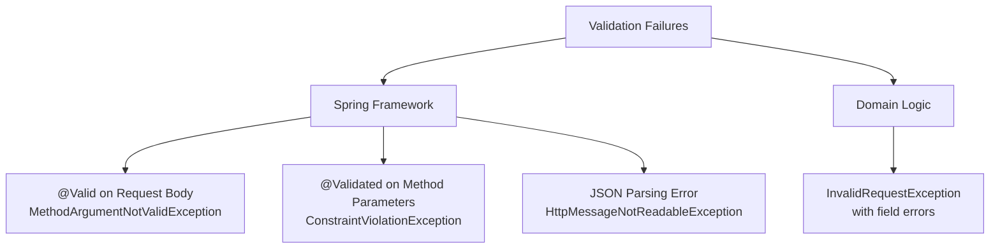

# Validation Exceptions

**Status**: Complete | **Last Updated**: 2025-11-20 | **Version**: 1.0.0

**Back to**: [Exception Architecture Index](./index.md) | [Architecture Overview](../index.md)

---

## Overview

Validation exceptions are a **specialized category** of exceptions for handling request validation errors with **field-level granularity**. They provide detailed information about which fields failed validation, what constraints were violated, and helpful error messages for API clients.

**Key Characteristics**:
- ✅ Capture field-level validation errors
- ✅ Support multiple validation failures per request
- ✅ Include validation codes and constraint details
- ✅ Map to HTTP 400 Bad Request
- ✅ Enable intelligent frontend error handling
- ✅ Support custom validation logic

---

## Exception Types



---

## Exception 1: MethodArgumentNotValidException

### Purpose

Caught when **@Valid annotation validation fails** on request body objects. This is the most common validation exception.

**Trigger Scenarios**:
```java
@PostMapping("/suppliers")
public SupplierDTO create(@Valid @RequestBody CreateSupplierRequest req) {
    // If req violates @Valid constraints → MethodArgumentNotValidException
}
```

### Field-Level Error Capture

The exception captures individual field validation failures:

```java
MethodArgumentNotValidException ex = ...;
BindingResult bindingResult = ex.getBindingResult();

// Get all field errors
List<FieldError> fieldErrors = bindingResult.getFieldErrors();

// Each FieldError contains:
fieldError.getField();           // Field name (e.g., "email")
fieldError.getDefaultMessage();  // Error message (e.g., "must be a well-formed email")
fieldError.getRejectedValue();   // Value that was rejected
fieldError.getCode();            // Validation code (e.g., "Email")
```

### Example: Email Validation

**Request DTO**:
```java
@Data
public class CreateSupplierRequest {
    @NotBlank(message = "Name is required")
    private String name;
    
    @NotBlank(message = "Email is required")
    @Email(message = "Email must be valid format")
    private String email;
    
    @NotNull(message = "Category is required")
    private SupplierCategory category;
    
    @Positive(message = "Rating must be greater than 0")
    private Double rating;
}
```

**Invalid Request**:
```json
{
  "name": "",
  "email": "not-an-email",
  "category": null,
  "rating": -5
}
```

**GlobalExceptionHandler**:
```java
@ExceptionHandler(MethodArgumentNotValidException.class)
public ResponseEntity<ErrorResponse> handleValidation(MethodArgumentNotValidException ex) {
    String errors = ex.getBindingResult().getFieldErrors().stream()
            .map(error -> error.getField() + ": " + error.getDefaultMessage())
            .collect(Collectors.joining("; "));
    
    return ErrorResponse.builder()
            .status(HttpStatus.BAD_REQUEST)
            .message("Validation failed: " + errors)
            .build();
}
```

**HTTP Response (400)**:
```json
{
  "error": "bad_request",
  "message": "Validation failed: name: Name is required; email: Email must be valid format; category: Category is required; rating: Rating must be greater than 0",
  "timestamp": "2025-11-20T14:30:45.123Z",
  "correlationId": "SSP-1700551445123-4891"
}
```

### Frontend Handling

```typescript
try {
    await api.post('/suppliers', supplierData);
} catch (error) {
    if (error.response.status === 400) {
        const message = error.response.data.message;
        
        // Parse field errors from message
        const fieldErrors = message
            .split(';')
            .map(e => e.trim())
            .reduce((acc, error) => {
                const [field, msg] = error.split(':');
                acc[field.trim()] = msg.trim();
                return acc;
            }, {});
        
        // Display field-specific errors
        Object.entries(fieldErrors).forEach(([field, message]) => {
            showFieldError(field, message);
        });
    }
}
```

---

## Exception 2: ConstraintViolationException

### Purpose

Caught when **JSR-380 constraints fail** on method parameters (path variables, query parameters, method parameters).

**Trigger Scenarios**:
```java
@GetMapping("/{id}")
public SupplierDTO get(@NotNull @Min(1) @PathVariable Long id) {
    // If id is null or < 1 → ConstraintViolationException
}

@GetMapping
public List<SupplierDTO> search(
    @Pattern(regexp = "[A-Z]+") @RequestParam String code
) {
    // If code doesn't match pattern → ConstraintViolationException
}
```

### Common Validation Annotations

| Annotation | Purpose | Example |
|---|---|---|
| **@NotNull** | Value must not be null | `@NotNull Long id` |
| **@NotEmpty** | String/Collection must not be empty | `@NotEmpty String name` |
| **@NotBlank** | String must not be blank (spaces don't count) | `@NotBlank String email` |
| **@Min(n)** | Number must be >= n | `@Min(1) Integer quantity` |
| **@Max(n)** | Number must be <= n | `@Max(100) Integer percentage` |
| **@Positive** | Number must be > 0 | `@Positive Double price` |
| **@PositiveOrZero** | Number must be >= 0 | `@PositiveOrZero Integer offset` |
| **@Pattern(regex)** | String must match regex | `@Pattern(regexp = "[0-9]+") String code` |
| **@Email** | Must be valid email format | `@Email String email` |
| **@Size(min, max)** | Collection size between min and max | `@Size(min=1, max=10)` |
| **@Future** | Date must be in future | `@Future LocalDate eventDate` |
| **@Past** | Date must be in past | `@Past LocalDate birthDate` |

### Example: Path Parameter Validation

**Controller**:
```java
@GetMapping("/{id}")
public SupplierDTO getSupplier(
    @NotNull(message = "ID must not be null")
    @Min(value = 1, message = "ID must be greater than 0")
    @PathVariable Long id
) {
    return supplierService.findById(id);
}
```

**Invalid Request**:
```
GET /suppliers/0         // ID = 0 (violates @Min(1))
GET /suppliers/abc       // Not a number (type mismatch → different exception)
```

**GlobalExceptionHandler**:
```java
@ExceptionHandler(ConstraintViolationException.class)
public ResponseEntity<ErrorResponse> handleConstraint(ConstraintViolationException ex) {
    String errors = ex.getConstraintViolations().stream()
            .map(v -> v.getPropertyPath() + ": " + v.getMessage())
            .collect(Collectors.joining("; "));
    
    return ErrorResponse.builder()
            .status(HttpStatus.BAD_REQUEST)
            .message("Constraint violation: " + errors)
            .build();
}
```

**HTTP Response (400)**:
```json
{
  "error": "bad_request",
  "message": "Constraint violation: getSupplier.id: ID must be greater than 0",
  "timestamp": "2025-11-20T14:30:46.234Z",
  "correlationId": "SSP-1700551446234-5902"
}
```

---

## Exception 3: InvalidRequestException with Field Errors

### Purpose

Custom domain exception that carries **field-level validation errors** alongside the main exception message.

**Usage**:
```java
@Service
public class SupplierService {
    public SupplierDTO createSupplier(CreateSupplierRequest req) {
        // Custom validation logic
        Map<String, String> fieldErrors = new HashMap<>();
        
        if (!isValidSupplierCode(req.getCode())) {
            fieldErrors.put("code", "Supplier code must match format XXX-YYYY");
        }
        
        if (supplierExists(req.getName())) {
            fieldErrors.put("name", "Supplier name already exists");
        }
        
        if (!fieldErrors.isEmpty()) {
            throw new InvalidRequestException(
                "Validation failed: " + fieldErrors.size() + " error(s)",
                fieldErrors
            );
        }
    }
}
```

**HTTP Response (400)**:
```json
{
  "error": "bad_request",
  "message": "Validation failed: 2 error(s)",
  "timestamp": "2025-11-20T14:30:47.345Z",
  "correlationId": "SSP-1700551447345-6013"
}
```

### Field Error Access

Frontend can parse field errors:

```typescript
try {
    await api.post('/suppliers', data);
} catch (error) {
    if (error.response.status === 400 && 
        error.response.data.error === 'bad_request') {
        
        // For custom InvalidRequestException with field errors:
        const context = error.response.data;
        // context.fieldErrors: { "code": "...", "name": "..." }
        
        Object.entries(context.fieldErrors || {}).forEach(([field, message]) => {
            displayFieldError(field, message);
        });
    }
}
```

---

## Common Validation Scenarios

### Scenario 1: Email Validation

**Request DTO**:
```java
@Data
@Builder
public class CreateUserRequest {
    @NotBlank(message = "Email is required")
    @Email(message = "Email must be valid format")
    private String email;
}
```

**Valid Values**:
```
john.doe@example.com
user+tag@domain.org
```

**Invalid Values**:
```
john@                    // Missing domain
john@example             // Missing TLD
john.example.com         // Missing @
```

---

### Scenario 2: Numeric Range Validation

**Request DTO**:
```java
@Data
public class CreateInventoryRequest {
    @NotNull(message = "Quantity is required")
    @Min(value = 1, message = "Quantity must be at least 1")
    @Max(value = 999999, message = "Quantity cannot exceed 999999")
    private Integer quantity;
}
```

**Valid Values**:
```
1, 100, 50000, 999999
```

**Invalid Values**:
```
0         // Violates @Min
-10       // Violates @Min
1000000   // Violates @Max
null      // Violates @NotNull
```

---

### Scenario 3: Pattern Validation

**Request DTO**:
```java
@Data
public class CreateProductRequest {
    @NotBlank
    @Pattern(
        regexp = "^[A-Z]{3}-[0-9]{4}$",
        message = "SKU must match format XXX-0000 (3 letters, dash, 4 digits)"
    )
    private String sku;
}
```

**Valid Values**:
```
ABC-0001
XYZ-9999
```

**Invalid Values**:
```
abc-0001       // Lowercase (requires uppercase)
ABC-001        // Only 3 digits (requires 4)
ABC0001        // Missing dash
AB-0001        // Only 2 letters (requires 3)
```

---

### Scenario 4: Collection Size Validation

**Request DTO**:
```java
@Data
public class CreateBatchOrderRequest {
    @NotEmpty(message = "Must include at least one item")
    @Size(max = 100, message = "Cannot include more than 100 items per batch")
    private List<BatchOrderItem> items;
}
```

**Valid Values**:
```
[item1, item2, ..., item100]   // 1-100 items
```

**Invalid Values**:
```
[]              // Empty (violates @NotEmpty)
[item1 to item101]  // 101 items (violates @Size max)
```

---

## Validation Framework Integration

### Spring Validation

**Enable validation with @Validated**:
```java
@Configuration
public class ValidationConfig {
    @Bean
    public MethodValidationPostProcessor methodValidationPostProcessor() {
        return new MethodValidationPostProcessor();
    }
}
```

**Use on controller methods**:
```java
@RestController
@Validated
public class SupplierController {
    
    @GetMapping("/{id}")
    public SupplierDTO get(
        @NotNull @Min(1) @PathVariable Long id
    ) {
        // Validates path parameter
    }
    
    @GetMapping
    public List<SupplierDTO> search(
        @NotBlank @Size(max = 50) @RequestParam String name
    ) {
        // Validates query parameter
    }
}
```

### Bean Validation (JSR-380)

**Hibernate Validator** (standard implementation):
```xml
<dependency>
    <groupId>org.hibernate.validator</groupId>
    <artifactId>hibernate-validator</artifactId>
</dependency>
```

**Custom validators**:
```java
@Target({ElementType.TYPE})
@Retention(RetentionPolicy.RUNTIME)
@Constraint(validatedBy = SupplierValidator.class)
public @interface ValidSupplier {
    String message() default "Invalid supplier";
    Class<?>[] groups() default {};
    Class<? extends Payload>[] payload() default {};
}

public class SupplierValidator implements ConstraintValidator<ValidSupplier, CreateSupplierRequest> {
    @Override
    public boolean isValid(CreateSupplierRequest req, ConstraintValidatorContext ctx) {
        if (req == null) return true;
        
        // Custom validation logic
        return isValidBusinessLogic(req);
    }
}

// Use custom validator
@Data
@ValidSupplier
public class CreateSupplierRequest {
    private String name;
    private String email;
}
```

---

## Frontend Error Handling Patterns

### Pattern 1: Extract and Display Field Errors

```typescript
async function submitForm(data) {
    try {
        await api.post('/suppliers', data);
        showSuccessMessage('Supplier created');
    } catch (error) {
        if (error.response?.status === 400) {
            const { message } = error.response.data;
            
            // Parse multiple field errors from message
            if (message.includes(';')) {
                const fieldErrors = message
                    .split(';')
                    .reduce((acc, error) => {
                        const [field, msg] = error.split(':');
                        acc[field?.trim()] = msg?.trim();
                        return acc;
                    }, {});
                
                displayMultipleFieldErrors(fieldErrors);
            } else {
                displaySingleError(message);
            }
        }
    }
}
```

### Pattern 2: Form Validation Class

```typescript
class FormValidator {
    static displayValidationErrors(error) {
        if (error.response?.status !== 400) return;
        
        const { message, error: errorCode } = error.response.data;
        
        if (errorCode === 'bad_request') {
            const errors = this.parseErrors(message);
            this.highlightInvalidFields(errors);
        }
    }
    
    static parseErrors(message) {
        // Parse: "field1: error1; field2: error2"
        return message
            .split(';')
            .reduce((acc, part) => {
                const [field, msg] = part.split(':');
                acc[field?.trim()] = msg?.trim();
                return acc;
            }, {});
    }
    
    static highlightInvalidFields(errors) {
        Object.entries(errors).forEach(([field, message]) => {
            const input = document.querySelector(`[name="${field}"]`);
            if (input) {
                input.classList.add('is-invalid');
                const errorEl = document.querySelector(`#${field}-error`);
                if (errorEl) errorEl.textContent = message;
            }
        });
    }
}
```

---

## Testing Validation

### Unit Test Example

```java
@ExtendWith(SpringExtension.class)
@SpringBootTest
class ValidationExceptionTest {
    
    @Autowired
    private Validator validator;
    
    @Test
    void testEmailValidation() {
        // Arrange
        CreateSupplierRequest request = CreateSupplierRequest.builder()
                .name("ACME Inc")
                .email("invalid-email")  // Invalid format
                .category(SupplierCategory.FOOD)
                .build();
        
        // Act
        Set<ConstraintViolation<CreateSupplierRequest>> violations = validator.validate(request);
        
        // Assert
        assertThat(violations).hasSize(1);
        assertThat(violations.iterator().next().getMessage())
                .contains("must be a well-formed email");
    }
}
```

### Integration Test Example

```java
@SpringBootTest
@AutoConfigureMockMvc
class ValidationIntegrationTest {
    
    @Autowired
    private MockMvc mockMvc;
    
    @Test
    void testPostWithInvalidEmail() throws Exception {
        mockMvc.perform(post("/api/suppliers")
                .contentType(APPLICATION_JSON)
                .content("{\"name\":\"ACME\",\"email\":\"invalid\"}"))
                .andExpect(status().isBadRequest())
                .andExpect(jsonPath("$.error").value("bad_request"))
                .andExpect(jsonPath("$.message").value(containsString("email")));
    }
}
```

---

## Best Practices

### DO:
- ✅ Use descriptive validation messages
- ✅ Validate early (at API boundary)
- ✅ Include field names in error messages
- ✅ Use standard annotations (@NotNull, @Email, @Min, etc.)
- ✅ Create custom validators for complex logic
- ✅ Test validation rules thoroughly

### DON'T:
- ❌ Let validation exceptions propagate uncaught
- ❌ Use generic messages ("Invalid input")
- ❌ Validate in business logic (do it at API boundary)
- ❌ Ignore violation details
- ❌ Use checked exceptions (use RuntimeException)
- ❌ Expose database schema in validation messages

---

## Related Documentation

- **[Exception Architecture Overview](./index.md)** – Exception types and hierarchy
- **[Global Exception Handler](./global-exception-handler.md)** – Framework exception handling
- **[Error Response Structure](./error-response-structure.md)** – JSON response format
- **[Exception-to-HTTP Mapping](./exception-to-http-mapping.md)** – Status code mapping (400 Bad Request)
- **[Domain Exceptions](./domain-exceptions.md)** – InvalidRequestException with field errors
- **[Guidelines & Best Practices](./guidelines-and-best-practices.md)** – Exception handling best practices

---

## Version History

| Version | Date | Changes |
|---------|------|---------|
| 1.0.0 | 2025-11-20 | Initial comprehensive documentation |

---

## Quick Reference

### Common Validation Annotations

```java
@NotNull                    // Value must not be null
@NotEmpty                   // String/Collection must not be empty
@NotBlank                   // String must not be blank
@Min(n)                     // Number >= n
@Max(n)                     // Number <= n
@Positive                   // Number > 0
@PositiveOrZero             // Number >= 0
@Pattern(regexp)            // Matches regex
@Email                      // Valid email
@Size(min, max)             // Collection size
@Future/@Past               // Date validation
```

### Exception Mapping

| Exception | Trigger | HTTP Status | Error Code |
|-----------|---------|-------------|-----------|
| MethodArgumentNotValidException | @Valid fails on request body | 400 | bad_request |
| ConstraintViolationException | JSR-380 constraint fails | 400 | bad_request |
| HttpMessageNotReadableException | JSON parsing fails | 400 | bad_request |
| InvalidRequestException (with fields) | Custom validation fails | 400 | bad_request |
