# API Contract & Endpoints

> **All REST API endpoints, response shapes, and how the frontend consumes them.**

## API Overview

Smart Supply Pro backend exposes a **versioned REST API** under `/api/v1` (or `/api` for backward compatibility).

```mermaid
graph TB
    Frontend["📱 Frontend<br/>(httpClient.ts)"]
    
    APIBase["🌐 /api"]
    
    AuthGroup["🔐 /api/auth<br/>(Authentication)"]
    SupplierGroup["📦 /api/suppliers<br/>(Supplier CRUD)"]
    InventoryGroup["📊 /api/inventory<br/>(Inventory CRUD)"]
    StockGroup["📈 /api/stock-history<br/>(Stock Movements)"]
    AnalyticsGroup["📉 /api/analytics<br/>(Dashboards & Reports)"]
    
    Frontend --> APIBase
    APIBase --> AuthGroup
    APIBase --> SupplierGroup
    APIBase --> InventoryGroup
    APIBase --> StockGroup
    APIBase --> AnalyticsGroup
    
    style Frontend fill:#61dafb,stroke:#0288d1,stroke-width:2px,color:#000
    style APIBase fill:#ff9800,stroke:#e65100,stroke-width:2px,color:#fff
    style AuthGroup fill:#4caf50,stroke:#2e7d32,stroke-width:2px,color:#fff
    style SupplierGroup fill:#2196f3,stroke:#1565c0,stroke-width:2px,color:#fff
    style InventoryGroup fill:#9c27b0,stroke:#6a1b9a,stroke-width:2px,color:#fff
    style StockGroup fill:#f44336,stroke:#c62828,stroke-width:2px,color:#fff
    style AnalyticsGroup fill:#ff5722,stroke:#bf360c,stroke-width:2px,color:#fff
```



---

## API Base URL

### Environment-Specific URLs

| Environment | Frontend URL | Backend URL | API Base (Frontend sees) |
|---|---|---|---|
| **Local Dev** | `http://localhost:3000` | `http://localhost:8080` | `/api` (Vite proxy or explicit URL) |
| **Production** | `https://inventory-app.com` | `https://api.inventory-app.com` | `/api` (same-origin via Nginx proxy) |
| **Fly.io (Staging)** | `https://app.fly.dev` | Same domain via Nginx | `/api` (Nginx reverse proxy) |

### Frontend Configuration

**In `/frontend/.env.local` (local dev):**

```env
# Empty or not set = use /api (relative path)
# VITE_API_BASE=/api

# Or explicit if backend is on different port:
# VITE_API_BASE=http://localhost:8080/api
```

**In `/frontend/.env.production`:**

```env
# Production: backend is same-origin (Nginx proxy)
# Leave empty or set to /api
# VITE_API_BASE=/api
```

**Resolution in `httpClient.ts`:**

```typescript
const RAW_BASE = import.meta.env.VITE_API_BASE;
export const API_BASE = (RAW_BASE?.trim().length > 0)
  ? RAW_BASE
  : '/api';  // Default to relative path

const httpClient = axios.create({
  baseURL: API_BASE,
  withCredentials: true,  // Include session cookies
});
```

---

## Endpoint Groups

### 🔐 Authentication Endpoints (`/api/auth`)

Handle user profile and logout operations.

#### `GET /api/auth/me`

Retrieve current user profile (if logged in).

**Request:**

```http
GET /api/auth/me
Cookie: SESSION=abc123...
```

**Response (200 OK - Logged In):**

```json
{
  "email": "user@example.com",
  "fullName": "John Doe",
  "role": "ADMIN",
  "pictureUrl": "https://lh3.googleusercontent.com/..."
}
```

**Response (401 Unauthorized - Not Logged In):**

```json
{
  "error": "unauthorized",
  "message": "No valid session",
  "timestamp": "2025-11-20T10:00:00.000Z",
  "correlationId": "SSP-1700551200000-1234"
}
```

**Frontend Usage:**

```typescript
useEffect(() => {
  httpClient.get('/auth/me')
    .then(res => setUser(res.data))
    .catch(error => {
      if (error.response?.status === 401) {
        setUser(null);  // Not logged in
        // Show login page
      }
    });
}, []);
```

**Authorization:** None (anyone can call to check if logged in)

---

#### `POST /api/auth/logout`

Logout the current user and invalidate session.

**Request:**

```http
POST /api/auth/logout
Cookie: SESSION=abc123...
```

**Response (204 No Content):**

```
(empty body)
```

**Frontend Usage:**

```typescript
const handleLogout = () => {
  httpClient.post('/auth/logout')
    .then(() => {
      setUser(null);
      navigate('/login');
      toast.success('Logged out');
    })
    .catch(error => toast.error('Logout failed'));
};
```

**Authorization:** Authenticated users only

---

### 📦 Supplier Endpoints (`/api/suppliers`)

Full CRUD operations on suppliers.

#### `GET /api/suppliers`

List all suppliers.

**Request:**

```http
GET /api/suppliers
Cookie: SESSION=abc123...
```

**Response (200 OK):**

```json
[
  {
    "id": "SUP001",
    "name": "Acme Corporation",
    "email": "contact@acme.com",
    "phoneNumber": "+1-555-0100"
  },
  {
    "id": "SUP002",
    "name": "Globex Corp",
    "email": "info@globex.com",
    "phoneNumber": "+1-555-0101"
  }
]
```

**Authorization:** `isAuthenticated() OR demoReadonly` (public read in demo mode)

**Frontend Usage:**

```typescript
const [suppliers, setSuppliers] = useState([]);

useEffect(() => {
  httpClient.get('/suppliers')
    .then(res => setSuppliers(res.data))
    .catch(error => toast.error('Failed to load suppliers'));
}, []);
```

---

#### `GET /api/suppliers/{id}`

Retrieve single supplier by ID.

**Request:**

```http
GET /api/suppliers/SUP001
Cookie: SESSION=abc123...
```

**Response (200 OK):**

```json
{
  "id": "SUP001",
  "name": "Acme Corporation",
  "email": "contact@acme.com",
  "phoneNumber": "+1-555-0100"
}
```

**Response (404 Not Found):**

```json
{
  "error": "not_found",
  "message": "Supplier not found: SUP001",
  "timestamp": "2025-11-20T10:00:00.000Z",
  "correlationId": "SSP-1700551200000-1234"
}
```

---

#### `GET /api/suppliers/count`

Get total count of suppliers.

**Request:**

```http
GET /api/suppliers/count
Cookie: SESSION=abc123...
```

**Response (200 OK):**

```json
42
```

---

#### `GET /api/suppliers/search?name=acme`

Search suppliers by name (partial match).

**Request:**

```http
GET /api/suppliers/search?name=acme
Cookie: SESSION=abc123...
```

**Response (200 OK):**

```json
[
  {
    "id": "SUP001",
    "name": "Acme Corporation",
    "email": "contact@acme.com",
    "phoneNumber": "+1-555-0100"
  }
]
```

---

#### `POST /api/suppliers`

Create new supplier.

**Request:**

```http
POST /api/suppliers
Cookie: SESSION=abc123...
Content-Type: application/json

{
  "name": "New Supplier Inc",
  "email": "sales@newsupplier.com",
  "phoneNumber": "+1-555-0200"
}
```

**Response (201 Created):**

```json
{
  "id": "SUP003",
  "name": "New Supplier Inc",
  "email": "sales@newsupplier.com",
  "phoneNumber": "+1-555-0200"
}
```

**Response (400 Bad Request - Validation Error):**

```json
{
  "error": "bad_request",
  "message": "Validation failed: email must be valid format, name is required",
  "timestamp": "2025-11-20T10:00:00.000Z",
  "correlationId": "SSP-1700551200000-1234"
}
```

**Response (409 Conflict - Duplicate):**

```json
{
  "error": "conflict",
  "message": "Supplier with name 'New Supplier Inc' already exists",
  "timestamp": "2025-11-20T10:00:00.000Z",
  "correlationId": "SSP-1700551200000-1234"
}
```

**Authorization:** `hasRole('ADMIN')` only

---

#### `PUT /api/suppliers/{id}`

Update existing supplier.

**Request:**

```http
PUT /api/suppliers/SUP001
Cookie: SESSION=abc123...
Content-Type: application/json

{
  "name": "Acme Corporation Updated",
  "email": "newemail@acme.com",
  "phoneNumber": "+1-555-0100"
}
```

**Response (200 OK):**

```json
{
  "id": "SUP001",
  "name": "Acme Corporation Updated",
  "email": "newemail@acme.com",
  "phoneNumber": "+1-555-0100"
}
```

**Authorization:** `hasRole('ADMIN')` only

---

#### `DELETE /api/suppliers/{id}`

Delete supplier by ID.

**Request:**

```http
DELETE /api/suppliers/SUP001
Cookie: SESSION=abc123...
```

**Response (204 No Content):**

```
(empty body)
```

**Response (404 Not Found):**

```json
{
  "error": "not_found",
  "message": "Supplier not found: SUP001",
  "timestamp": "2025-11-20T10:00:00.000Z",
  "correlationId": "SSP-1700551200000-1234"
}
```

**Authorization:** `hasRole('ADMIN')` only

---

### 📊 Inventory Item Endpoints (`/api/inventory`)

CRUD operations on inventory items with similar pattern to suppliers.

| Method | Endpoint | Purpose | Auth |
|---|---|---|---|
| `GET` | `/api/inventory` | List all items | Authenticated OR demo |
| `GET` | `/api/inventory/{id}` | Get single item | Authenticated |
| `GET` | `/api/inventory/count` | Count items | Authenticated OR demo |
| `GET` | `/api/inventory/search?name=...` | Search by name | Authenticated OR demo |
| `POST` | `/api/inventory` | Create item | ADMIN |
| `PUT` | `/api/inventory/{id}` | Update item | ADMIN |
| `DELETE` | `/api/inventory/{id}` | Delete item | ADMIN |

**Response Shape (InventoryItemDTO):**

```json
{
  "id": "INV001",
  "name": "Widget A",
  "sku": "WID-A-001",
  "supplierId": "SUP001",
  "quantity": 150,
  "reorderLevel": 50,
  "unitPrice": 29.99,
  "lastRestockDate": "2025-11-15T00:00:00.000Z"
}
```

---

### 📈 Stock History Endpoints (`/api/stock-history`)

Query historical stock movements and changes.

| Method | Endpoint | Purpose |
|---|---|---|
| `GET` | `/api/stock-history` | List all stock movements |
| `GET` | `/api/stock-history/item/{itemId}` | Get movements for specific item |
| `GET` | `/api/stock-history/reason/{reason}` | Get movements by reason (e.g., "SALE", "RESTOCK") |
| `GET` | `/api/stock-history/search?...` | Advanced search with filters |

**Response Shape (StockHistoryDTO):**

```json
[
  {
    "id": "STK001",
    "itemId": "INV001",
    "itemName": "Widget A",
    "quantity": 50,
    "reason": "SALE",
    "reference": "ORDER-2025-1001",
    "timestamp": "2025-11-20T10:30:00.000Z",
    "userId": "user@example.com"
  }
]
```

---

### 📉 Analytics Endpoints (`/api/analytics`)

Dashboard metrics and reporting endpoints.

| Method | Endpoint | Purpose | Returns |
|---|---|---|---|
| `GET` | `/api/analytics/dashboard-summary` | Key metrics (total items, suppliers, stock value) | `DashboardSummaryDTO` |
| `GET` | `/api/analytics/low-stock` | Items below reorder level | List of `LowStockItemDTO` |
| `GET` | `/api/analytics/stock-per-supplier` | Inventory breakdown by supplier | List of `StockPerSupplierDTO` |
| `GET` | `/api/analytics/price-trends` | Price movement over time | List of `PriceTrendDTO` |
| `GET` | `/api/analytics/monthly-movements` | Stock movements by month | List of `MonthlyStockMovementDTO` |

**Example Response (Dashboard Summary):**

```json
{
  "totalSuppliers": 42,
  "totalInventoryItems": 256,
  "totalStockValue": 125000.50,
  "lowStockCount": 12,
  "recentMovements": 3456
}
```

---

## Common Response Patterns

### Pagination (if implemented)

Some endpoints may support pagination:

```http
GET /api/suppliers?page=0&size=20&sort=name,asc
```

**Response:**

```json
{
  "content": [
    { "id": "SUP001", "name": "Acme", ... },
    { "id": "SUP002", "name": "Globex", ... }
  ],
  "totalElements": 42,
  "totalPages": 3,
  "pageNumber": 0,
  "pageSize": 20,
  "hasNext": true,
  "hasPrevious": false
}
```

---

### Error Responses (Standardized)

All errors follow this shape:

```json
{
  "error": "error_type_in_snake_case",
  "message": "Human-readable error description",
  "timestamp": "2025-11-20T10:00:00.000Z",
  "correlationId": "SSP-1700551200000-1234"
}
```

**Status Code Mapping:**

| Status | Error Type | Meaning | Frontend Action |
|---|---|---|---|
| `200` | (success) | Request succeeded | Process data |
| `201` | (created) | Resource created | Show confirmation, add to list |
| `400` | `bad_request` | Validation failed | Show form errors |
| `401` | `unauthorized` | Not logged in | Redirect to login |
| `403` | `forbidden` | Not authorized | Show "Access Denied" |
| `404` | `not_found` | Resource doesn't exist | Show "Not Found" |
| `409` | `conflict` | Duplicate/conflict | Show conflict message |
| `500` | `internal_server_error` | Server error | Show generic error, log details |

---

## Frontend API Client Pattern

### Centralized HTTP Client (`/frontend/src/api/httpClient.ts`)

All API calls go through this single client:

```typescript
import axios from 'axios';

const httpClient = axios.create({
  baseURL: '/api',
  withCredentials: true,
  timeout: 30_000,
});

// Global error handling
httpClient.interceptors.response.use(
  (res) => res,
  (error) => {
    if (error.response?.status === 401) {
      // Redirect to login on auth failure
      window.location.href = '/login';
    }
    return Promise.reject(error);
  }
);

export default httpClient;
```

### Domain-Specific API Calls

**Example: `/frontend/src/api/inventory/supplierApi.ts`**

```typescript
import httpClient from '../httpClient';
import { SupplierDTO } from './types';

export const supplierApi = {
  listAll: () => httpClient.get<SupplierDTO[]>('/suppliers'),
  
  getById: (id: string) => httpClient.get<SupplierDTO>(`/suppliers/${id}`),
  
  search: (name: string) => 
    httpClient.get<SupplierDTO[]>('/suppliers/search', { params: { name } }),
  
  create: (data: SupplierDTO) => 
    httpClient.post<SupplierDTO>('/suppliers', data),
  
  update: (id: string, data: SupplierDTO) => 
    httpClient.put<SupplierDTO>(`/suppliers/${id}`, data),
  
  delete: (id: string) => 
    httpClient.delete(`/suppliers/${id}`),
};
```

### Component Usage

```typescript
import { supplierApi } from '@/api/inventory/supplierApi';

const SuppliersPage = () => {
  const [suppliers, setSuppliers] = useState<SupplierDTO[]>([]);
  const [loading, setLoading] = useState(true);
  const [error, setError] = useState<string | null>(null);

  useEffect(() => {
    supplierApi.listAll()
      .then(res => setSuppliers(res.data))
      .catch(err => setError(err.response?.data?.message))
      .finally(() => setLoading(false));
  }, []);

  if (loading) return <Spinner />;
  if (error) return <Error message={error} />;
  
  return <SupplierTable suppliers={suppliers} />;
};
```

---

## Authorization Rules

### Authentication Levels

- **No Auth Required:** `demoReadonly` flag (read-only public demo)
- **Authenticated:** Any logged-in user (USER or ADMIN role)
- **Admin Only:** Users with ADMIN role

### Backend Enforcement

**@PreAuthorize Examples:**

```java
// Public (demo mode)
@PreAuthorize("isAuthenticated() or @appProperties.demoReadonly")
@GetMapping
public ResponseEntity<List<SupplierDTO>> listAll() { ... }

// Authenticated only
@PreAuthorize("isAuthenticated()")
@GetMapping("/{id}")
public ResponseEntity<SupplierDTO> getById(@PathVariable String id) { ... }

// Admin only
@PreAuthorize("hasRole('ADMIN')")
@PostMapping
public ResponseEntity<SupplierDTO> create(@Valid @RequestBody SupplierDTO dto) { ... }
```

---

## API Documentation

### Authoritative Source

The complete OpenAPI specification is generated and available at:

- **Local:** `http://localhost:8080/api/swagger-ui.html` (if enabled)
- **Production Docs:** [GitHub Pages ReDoc](../../../docs/api/index.html)
- **Source:** Generated from Java `@RestController` annotations and `@Operation` Javadoc

### How to Use the Docs

1. Navigate to the ReDoc/Swagger page
2. Search for endpoint by resource (suppliers, inventory, etc.)
3. Click endpoint to expand
4. See request/response examples
5. Try it out with `Try it out` button (if Swagger UI)

---

## Navigation

- **← [Back to Integration Index](./index.html)**
- **← [Backend-Frontend Overview](./backend-frontend-overview.html)**
- **→ [Authentication Flow](./auth-flow-frontend.html)** - Login details
- **→ [Error Handling](./error-handling-contract.html)** - Error shapes
- **← [Back to Architecture Index](../index.html)**

