# Authentication Flow (Frontend Perspective)

> **How login, logout, and session detection work from the frontend's point of view.**

## OAuth2 Flow Overview

Smart Supply Pro uses **OAuth2 with Google as the provider**. The flow is initiated and completed by the backend; the frontend mainly detects the result.

```mermaid
graph LR
    User["👤 User<br/>(Browser)"]
    Frontend["📱 Frontend<br/>(React)"]
    Backend["⚙️ Backend<br/>(Spring Security)"]
    Google["🔐 Google<br/>(OAuth2 Provider)"]
    
    User -->|1. Clicks Login| Frontend
    Frontend -->|2. Redirect to /oauth2/authorization/google| Backend
    Backend -->|3. Redirect to Google login| Google
    Google -->|4. User authenticates| Google
    Google -->|5. Redirect back with code| Backend
    Backend -->|6. Exchange code for tokens<br/>Create session| Backend
    Backend -->|7. Set SESSION cookie<br/>Redirect to /dashboard| Frontend
    Frontend -->|8. Cookie included<br/>in requests| Backend
    
    style User fill:#ff9900,color:#000
    style Frontend fill:#61dafb,color:#000
    style Backend fill:#6db33f,color:#fff
    style Google fill:#4285f4,color:#fff
```



---

## Step 1: User Clicks "Login"

### Frontend Code

**In `/frontend/src/pages/LoginPage.tsx` or similar:**

```typescript
const LoginPage = () => {
  const handleGoogleLogin = () => {
    // Redirect to backend's OAuth2 authorization endpoint
    window.location.href = '/api/oauth2/authorization/google';
  };

  return (
    <div className="login-container">
      <h1>Smart Supply Pro</h1>
      <button onClick={handleGoogleLogin}>
        Login with Google
      </button>
    </div>
  );
};
```

**What happens:**

- User clicks the button
- Frontend navigates to `/api/oauth2/authorization/google` (backend endpoint)
- Backend receives the request and initiates OAuth2 flow

---

## Step 2: Backend Initiates OAuth2 Exchange

### Backend Configuration

**In `src/main/java/com/smartsupplypro/inventory/config/SecurityConfig.java`:**

```java
@Configuration
public class SecurityConfig {
    
    @Bean
    public SecurityFilterChain filterChain(HttpSecurity http) throws Exception {
        http
            .oauth2Login(oauth2 -> oauth2
                .authorizationEndpoint(auth -> auth
                    .baseUri("/api/oauth2/authorization")
                )
                .redirectionEndpoint(redir -> redir
                    .baseUri("/login/oauth2/code/*")
                )
                .successHandler((request, response, authentication) -> {
                    // After successful OAuth2, redirect user to dashboard
                    response.sendRedirect("/dashboard");
                })
                .failureHandler((request, response, exception) -> {
                    // On failure, redirect to login error page
                    response.sendRedirect("/login?error=oauth2_failure");
                })
            )
            .logout(logout -> logout
                .logoutUrl("/api/auth/logout")
                .logoutSuccessUrl("/login")
                .invalidateHttpSession(true)
                .deleteCookies("SESSION")
            );
        
        return http.build();
    }
}
```

**What Spring does:**

1. Detects OAuth2 request to `/api/oauth2/authorization/google`
2. Looks up Google OAuth2 provider credentials (from `application.yml`)
3. Generates authorization URL
4. Redirects user's browser to Google's login page

---

## Step 3: User Authenticates with Google

The user logs in to Google in their browser (visible in the URL bar as `accounts.google.com`).

---

## Step 4: Google Redirects Back

Google redirects the user to the backend's redirect URI:

```
https://your-domain/login/oauth2/code/google?code=4/0AY...&state=xyz
```

The backend **never exposes this code to the frontend** — it's handled server-to-server.

---

## Step 5: Backend Exchanges Code for Tokens

### Server-to-Server Exchange

Spring Security automatically:

1. Extracts the `code` and `state` from URL
2. Makes HTTPS request to `https://oauth.google.com/token`
3. Sends client ID + client secret + code
4. Receives `access_token`, `id_token`, `refresh_token`

**Why this is secure:**

- Client secret never leaves the backend
- Frontend never sees tokens
- All crypto happens server-to-server

---

## Step 6: Backend Creates Session Cookie

After successful token exchange, Spring Security:

1. Creates a `SecurityContext` with the authenticated user
2. Generates a **session cookie** (HTTP-only, Secure, SameSite=STRICT)
3. Stores session data in Spring Session store (in-memory or distributed)
4. Redirects user back to frontend with `Set-Cookie` header

**Example Response Headers:**

```http
HTTP/1.1 302 Found
Location: /dashboard
Set-Cookie: SESSION=abc123xyz789; HttpOnly; Secure; SameSite=Strict; Path=/; Max-Age=86400
```

### Session Lifecycle

| Property | Value | Meaning |
|---|---|---|
| **HttpOnly** | true | JavaScript cannot access it (`document.cookie` won't show it) |
| **Secure** | true | Only sent over HTTPS (not HTTP) |
| **SameSite** | Strict | Not sent on cross-site requests (prevents CSRF) |
| **Path** | / | Sent with all requests to the domain |
| **Max-Age** | 86400 (24 hours) | Expires after 24 hours of inactivity |

---

## Step 7: Frontend Receives Redirect

The browser automatically:

1. Stores the `SESSION` cookie
2. Navigates to `/dashboard`
3. Includes `SESSION` cookie in the request

---

## Step 8: Frontend Detects Logged-In State

### App Initialization

**In `/frontend/src/App.tsx` or similar:**

```typescript
const App = () => {
  const [user, setUser] = useState(null);
  const [loading, setLoading] = useState(true);

  useEffect(() => {
    // Probe the backend to see if user is logged in
    httpClient.get('/auth/me')
      .then(response => {
        // User is authenticated
        setUser(response.data);
      })
      .catch(error => {
        if (error.response?.status === 401) {
          // User is not authenticated
          setUser(null);
        }
      })
      .finally(() => setLoading(false));
  }, []);

  if (loading) return <Spinner />;
  
  if (!user) {
    return <LoginPage />;
  }

  return <Dashboard user={user} />;
};
```

### Backend Verifies Session

When frontend calls `GET /api/auth/me`:

```java
@RestController
@RequestMapping("/api/auth")
public class AuthController {

    @GetMapping("/me")
    public ResponseEntity<AppUserProfileDTO> currentUser(
        @AuthenticationPrincipal OAuth2User principal
    ) {
        if (principal == null) {
            return ResponseEntity.status(HttpStatus.UNAUTHORIZED)
                .body(new AppUserProfileDTO(null, null, null, null));
        }

        String email = principal.getAttribute("email");
        String name = principal.getAttribute("name");
        String picture = principal.getAttribute("picture");
        
        // Load user from DB, get role
        AppUser user = appUserRepository.findByEmail(email)
            .orElseThrow();

        return ResponseEntity.ok(new AppUserProfileDTO(
            email,
            name,
            user.getRole().name(),
            picture
        ));
    }
}
```

**Backend response (200 OK):**

```json
{
  "email": "user@example.com",
  "fullName": "John Doe",
  "role": "ADMIN",
  "pictureUrl": "https://lh3.googleusercontent.com/..."
}
```

**Frontend stores in Context:**

```typescript
const [user, setUser] = useState({
  email: "user@example.com",
  fullName: "John Doe",
  role: "ADMIN",
  pictureUrl: "https://..."
});
```

---

## Subsequent Requests (With Session Cookie)

### Automatic Credential Inclusion

**In `httpClient.ts`:**

```typescript
const httpClient = axios.create({
  baseURL: '/api',
  withCredentials: true,  // ← Include cookies automatically
  timeout: 30_000,
});
```

**With `withCredentials: true`, every request includes:**

```http
GET /api/suppliers
Cookie: SESSION=abc123xyz789
Accept: application/json
```

**Backend automatically:**

1. Extracts `SESSION` cookie
2. Looks up session in store
3. Restores `SecurityContext`
4. Executes request if authenticated
5. Returns data (or 401 if session expired)

---

## Logout Flow

### Frontend Initiates Logout

**In a component or context:**

```typescript
const handleLogout = async () => {
  try {
    // Call backend logout endpoint
    await httpClient.post('/auth/logout');
    
    // Clear frontend state
    setUser(null);
    
    // Redirect to login
    navigate('/login');
    
    // Show confirmation
    toast.success('Logged out successfully');
  } catch (error) {
    toast.error('Logout failed');
  }
};
```

### Backend Invalidates Session

**In `SecurityConfig.java`:**

```java
.logout(logout -> logout
    .logoutUrl("/api/auth/logout")              // POST endpoint
    .logoutSuccessUrl("/login")                 // Redirect after logout
    .invalidateHttpSession(true)                // Clear session
    .deleteCookies("SESSION")                   // Delete cookie
)
```

**Spring Security on `POST /api/auth/logout`:**

1. Finds session by `SESSION` cookie
2. Deletes session from store
3. Sends response with `Set-Cookie: SESSION=; Max-Age=0` (delete cookie)
4. Redirects to `/login`

**Response Headers:**

```http
HTTP/1.1 302 Found
Location: /login
Set-Cookie: SESSION=; Max-Age=0; Path=/
```

**Frontend:**

- Browser deletes the cookie
- Frontend navigation to `/login`
- User sees login page

---

## Demo Mode (Read-Only Without Login)

### Configuration

**In `application.yml`:**

```yaml
app:
  demo:
    readonly: true  # Enable read-only demo mode
```

### Backend Behavior

When `demo.readonly=true`:

```java
@PreAuthorize("isAuthenticated() or @appProperties.demoReadonly")
@GetMapping
public ResponseEntity<List<SupplierDTO>> listAll() {
    return ResponseEntity.ok(supplierService.findAll());
}
```

**Allows:**
- ✅ `GET /api/suppliers` (read)
- ✅ `GET /api/inventory` (read)
- ❌ `POST /api/suppliers` (create) — still requires ADMIN role
- ❌ `PUT /api/suppliers/{id}` (update) — still requires ADMIN role
- ❌ `DELETE /api/suppliers/{id}` (delete) — still requires ADMIN role

### Frontend Behavior

**Detect demo mode:**

```typescript
useEffect(() => {
  // Check if running in demo mode
  const demoFlag = localStorage.getItem('ssp.demo.session');
  if (demoFlag === 'true') {
    setIsDemo(true);
    // Don't require login; show read-only UI
  }
}, []);
```

**Hide edit/delete buttons in demo mode:**

```typescript
return (
  <div>
    <table>{/* supplier data */}</table>
    {!isDemo && (
      <button onClick={handleEdit}>Edit</button>
    )}
    {!isDemo && (
      <button onClick={handleDelete}>Delete</button>
    )}
  </div>
);
```

---

## Session Expiration & Timeout

### Server-Side Timeout

**In `application.yml`:**

```yaml
server:
  servlet:
    session:
      timeout: 30m  # 30 minutes of inactivity
```

After 30 minutes without activity:

1. Spring Security invalidates the session
2. `SESSION` cookie becomes invalid
3. Next request returns **401 Unauthorized**

### Frontend Response to 401

**In `httpClient.ts` interceptor:**

```typescript
httpClient.interceptors.response.use(
  (res) => res,
  (error) => {
    if (error.response?.status === 401) {
      // Session expired or invalid
      setUser(null);
      
      // Redirect to login unless we're on a public page
      if (!isPublicRoute(window.location.pathname)) {
        window.location.href = '/login?expired=true';
      }
    }
    return Promise.reject(error);
  }
);
```

**User sees:**

- "Your session has expired. Please log in again."
- Redirect to login page

---

## Security Considerations

### Why HTTP-Only Cookies?

| Approach | XSS Vulnerability | CSRF Vulnerability | Notes |
|---|---|---|---|
| **LocalStorage JWT** | ✅ Vulnerable (JS can access) | ✅ Safer (custom header) | Don't use this |
| **Session Cookie (HTTP-Only)** | ✅ Protected (JS can't access) | ✅ Protected (SameSite=Strict) | **Use this** |
| **Custom Authorization Header** | ✅ Vulnerable (JS can access) | ✅ Safer | Adds complexity |

### CSRF Protection

**Session cookies with SameSite=Strict:**

```http
Set-Cookie: SESSION=...; SameSite=Strict
```

Prevents:
- Attacker's site making requests to your domain
- CSRF token bypass
- Malicious link attacks

### No JWT in Frontend

Some systems put JWT tokens in localStorage or in the Authorization header. **We don't:**

- JWT visible to JavaScript (vulnerable to XSS)
- Token rotation complex
- Server-side revocation difficult

Instead, we use:
- HTTP-only session cookies (JS can't access)
- Server-side session store (can revoke instantly)
- HTTPS-only (encrypted in transit)

---

## Common Issues & Solutions

### Issue: "Always Redirects to Login"

**Cause:** `withCredentials: true` not set in httpClient.

**Fix:**

```typescript
const httpClient = axios.create({
  baseURL: '/api',
  withCredentials: true,  // ← Required for cookies
});
```

---

### Issue: "Session Works Locally, Not in Production"

**Cause:** Cookies not first-party (frontend and backend on different domains).

**Solution:** Use Nginx reverse proxy so both are under same domain:

- Frontend: `https://app.example.com`
- Backend API: `https://app.example.com/api` (proxied by Nginx)

Both under `app.example.com` = first-party cookies work.

---

### Issue: "Logout Button Doesn't Clear Session"

**Cause:** Frontend doesn't wait for logout response, or httpClient doesn't include cookies.

**Fix:**

```typescript
const handleLogout = async () => {
  try {
    await httpClient.post('/auth/logout');  // Wait for response
    setUser(null);
    localStorage.removeItem('user');  // Clear any cached data
    navigate('/login');
  } catch (error) {
    console.error('Logout error:', error);
  }
};
```

---

## Navigation

- **← [Back to Integration Index](./index.html)**
- **← [Backend-Frontend Overview](./backend-frontend-overview.html)**
- **→ [Error Handling](./error-handling-contract.html)**
- **→ [CORS & Network](./cors-and-network.html)**
- **← [Back to Architecture Index](../index.html)**

