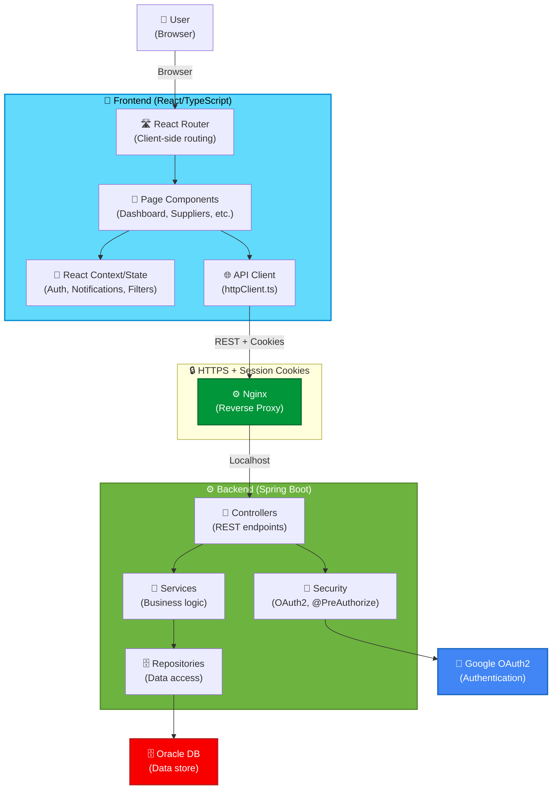

# Backend-Frontend Overview

> **Understand how the React frontend and Spring Boot backend work together, divide responsibilities, and exchange data.**

## Architecture Overview

Smart Supply Pro follows the **modern SPA + REST API** pattern:



---

## Responsibility Division

### Frontend (React/TypeScript in `/frontend`)

**What the frontend handles:**

| Responsibility | Example | Technology |
|---|---|---|
| **User Interface** | Rendering forms, buttons, tables | React components |
| **Client-side Routing** | Navigation between pages | React Router |
| **State Management** | Auth context, notification queue, filter state | React Context / hooks |
| **API Calls** | Calling `/api/suppliers`, `/api/inventory` | axios via httpClient.ts |
| **Input Validation** | Form field error hints (client-side only) | HTML5 constraints + JS |
| **Error Display** | Toast notifications, error messages | React toast library |
| **Demo Mode Detection** | Read-only UI if `demoReadonly=true` | localStorage check |

**What the frontend does NOT do:**

- ❌ Business logic (calculations, rules, constraints)
- ❌ Database access (all data flows through backend API)
- ❌ Authentication (backend handles OAuth2, frontend detects session)
- ❌ Authorization (frontend hides UI; backend enforces via `@PreAuthorize`)
- ❌ Data validation (client-side hints only; server is source of truth)

### Backend (Spring Boot in `/src/main/java`)

**What the backend handles:**

| Responsibility | Example | Technology |
|---|---|---|
| **REST API** | `/api/suppliers`, `/api/inventory` endpoints | Spring `@RestController` |
| **Business Logic** | Calculate stock levels, validate constraints | Spring `@Service` |
| **Data Access** | Query/insert/update to Oracle DB | Spring Data JPA |
| **Authentication** | OAuth2 exchange, session creation | Spring Security OAuth2 |
| **Authorization** | `@PreAuthorize("hasRole('ADMIN')")` | Spring Security annotations |
| **Data Validation** | JSR-380 constraints, custom validators | `@Valid` + validators |
| **Error Responses** | `ErrorResponse` with status code + message | GlobalExceptionHandler |
| **Transactions** | ACID guarantees across updates | `@Transactional` |

**What the backend does NOT do:**

- ❌ Render HTML (API-only, no templates)
- ❌ Client-side routing (frontend handles that)
- ❌ Store user session state in memory (uses cookies, Spring Security handles it)
- ❌ User interface logic (buttons, forms, dialogs)

---

## Data Flow: User Interaction

### Example: User Views Suppliers

```
User clicks "Suppliers" in nav
          ↓
Frontend Router navigates to /suppliers
          ↓
Page component mounts, calls httpClient.get('/suppliers')
          ↓
[CORS check] Nginx proxy allows (same-origin)
          ↓
Backend SupplierController.listAll() receives request
          ↓
@PreAuthorize checks if user is authenticated OR demo.readonly is true
          ↓
SupplierService.findAll() queries SupplierRepository
          ↓
JPA executes SQL: SELECT * FROM suppliers
          ↓
Oracle returns rows, JPA maps to Supplier entities
          ↓
Mapper converts entities → SupplierDTOs
          ↓
SupplierController returns ResponseEntity<List<SupplierDTO>>
          ↓
Spring converts to JSON: [{ id, name, email, phone }, ...]
          ↓
Response returns to frontend (with session cookie in Set-Cookie header)
          ↓
Frontend axios interceptor checks for 401 → no, success
          ↓
Frontend setState(suppliers) → React re-renders table
          ↓
User sees supplier list on screen
```

### Example: User Creates New Supplier

```
User fills form: name="Acme Co", email="contact@acme.com"
          ↓
User clicks "Save"
          ↓
Frontend validates required fields (client-side hint)
          ↓
Frontend calls httpClient.post('/suppliers', { name, email, ... })
          ↓
Backend SupplierController.create(SupplierDTO supplierDTO)
          ↓
@PreAuthorize("hasRole('ADMIN')") checks authorization
          ↓
SupplierService receives DTO
          ↓
Service validates constraints (JSR-380)
          ↓
Service checks for duplicate name using repository
          ↓
Service creates Supplier entity, saves to DB
          ↓
Service returns success response with new supplier
          ↓
Frontend receives 201 Created + SupplierDTO
          ↓
Frontend updates state, shows toast "Supplier created!"
          ↓
Frontend navigates to supplier detail page
```

---

## Key Design Patterns

### 1. DTOs as API Contracts

**Problem:** Entities have internal fields (JPA relations, hibernateLazyInitializationException, password hashes, etc.). Sending them directly is a security/performance risk.

**Solution:** DTOs (Data Transfer Objects) represent what the API actually returns to clients.

**Example:**

```java
// Entity (database model)
@Entity
public class Supplier {
    @Id
    private String id;
    private String name;
    private String email;
    private LocalDateTime createdAt;
    // ... 10 other internal fields
    @OneToMany(mappedBy = "supplier")
    private List<InventoryItem> items; // lazy-loaded
}

// DTO (API contract)
public record SupplierDTO(
    String id,
    String name,
    String email
) {}

// Controller
@GetMapping
public ResponseEntity<List<SupplierDTO>> listAll() {
    return ResponseEntity.ok(
        supplierService.findAll()
            .stream()
            .map(mapperService::toDTO)
            .toList()
    );
}
```

**Frontend consumes:**

```javascript
const response = await httpClient.get('/suppliers');
// response.data = [
//   { id: "S1", name: "Acme", email: "..." },
//   { id: "S2", name: "Globex", email: "..." }
// ]
```

### 2. Centralized HTTP Client

**Problem:** If you scatter API calls across 20 components, how do you handle auth timeouts, retries, error handling consistently?

**Solution:** Centralize in `httpClient.ts`

```typescript
// src/api/httpClient.ts
const httpClient = axios.create({
  baseURL: '/api',
  withCredentials: true, // include session cookie
  timeout: 30_000,
});

// Global 401 handler
httpClient.interceptors.response.use(
  (res) => res,
  (error) => {
    if (error.response?.status === 401) {
      // redirect to /login
      window.location.href = '/login';
    }
    return Promise.reject(error);
  }
);

export default httpClient;
```

**Usage in components:**

```typescript
const SuppliersPage = () => {
  const [suppliers, setSuppliers] = useState([]);
  
  useEffect(() => {
    httpClient.get('/suppliers')
      .then(res => setSuppliers(res.data))
      .catch(error => toast.error(error.response?.data?.message));
  }, []);
  
  return <SupplierTable suppliers={suppliers} />;
};
```

### 3. @PreAuthorize for Role-Based Access

**Problem:** If the UI hides an "Edit" button for non-admins, a malicious user could still call the API directly.

**Solution:** Backend enforces authorization on every endpoint.

```java
@RestController
@RequestMapping("/api/suppliers")
public class SupplierController {
    
    @PreAuthorize("isAuthenticated() or @appProperties.demoReadonly")
    @GetMapping
    public ResponseEntity<List<SupplierDTO>> listAll() {
        // Authenticated users OR demo-readonly mode can read
        return ResponseEntity.ok(supplierService.findAll());
    }
    
    @PreAuthorize("hasRole('ADMIN')")
    @PostMapping
    public ResponseEntity<SupplierDTO> create(@Valid @RequestBody SupplierDTO dto) {
        // Only admins can create
        return ResponseEntity.status(HttpStatus.CREATED)
            .body(supplierService.save(dto));
    }
    
    @PreAuthorize("hasRole('ADMIN')")
    @DeleteMapping("/{id}")
    public ResponseEntity<Void> delete(@PathVariable String id) {
        // Only admins can delete
        supplierService.deleteById(id);
        return ResponseEntity.noContent().build();
    }
}
```

**Frontend respects this:**

```typescript
const canEditSupplier = user?.role === 'ADMIN';

return (
  <button 
    disabled={!canEditSupplier}
    onClick={() => updateSupplier(id, data)}
  >
    Edit
  </button>
);
```

But **backend doesn't trust the frontend:**

```
If user sends POST /api/suppliers without ADMIN role:
   Backend returns 403 Forbidden
   Frontend catches 401/403 and shows "Access Denied"
```

### 4. Error Responses Are Standardized

**Problem:** Different endpoints throw different exceptions (DuplicateResourceException, InvalidRequestException, etc.). Frontend has no idea what to display.

**Solution:** GlobalExceptionHandler maps all exceptions to a standard `ErrorResponse` shape.

```java
@RestControllerAdvice
public class GlobalExceptionHandler {
    
    @ExceptionHandler(DuplicateResourceException.class)
    public ResponseEntity<ErrorResponse> handleDuplicate(DuplicateResourceException e) {
        return ErrorResponse.builder()
            .status(HttpStatus.CONFLICT)
            .message(e.getMessage())
            .build()
            .toResponseEntity();
    }
    
    @ExceptionHandler(InvalidRequestException.class)
    public ResponseEntity<ErrorResponse> handleInvalid(InvalidRequestException e) {
        return ErrorResponse.builder()
            .status(HttpStatus.BAD_REQUEST)
            .message(e.getMessage())
            .build()
            .toResponseEntity();
    }
}
```

**Response format:**

```json
{
  "error": "conflict",
  "message": "Supplier 'Acme Co' already exists",
  "timestamp": "2025-11-20T10:30:00.123Z",
  "correlationId": "SSP-1700551800123-7891"
}
```

**Frontend handles consistently:**

```typescript
httpClient.post('/suppliers', formData)
  .catch(error => {
    const { message, error: errorType } = error.response?.data;
    
    if (errorType === 'conflict') {
      toast.error(`Duplicate: ${message}`);
    } else if (errorType === 'bad_request') {
      setFormErrors(parseValidationErrors(message));
    } else {
      toast.error('Server error occurred');
    }
  });
```

---

## Technology Stack

### Frontend
- **Framework:** React 18+
- **Language:** TypeScript
- **HTTP Client:** axios (wrapped in `httpClient.ts`)
- **Routing:** React Router v6+
- **State:** React Context + hooks
- **Build Tool:** Vite
- **Testing:** React Testing Library, Vitest, Cypress (if applicable)
- **UI Components:** (Material-UI, custom, or other)

### Backend
- **Framework:** Spring Boot 3.x+
- **Language:** Java 17+
- **REST:** Spring Web MVC
- **Database:** Spring Data JPA + Hibernate
- **Authentication:** Spring Security OAuth2
- **Validation:** JSR-380 (Jakarta Validation)
- **Data Mapping:** Custom mappers or MapStruct
- **Testing:** JUnit5, Mockito, TestContainers
- **Build:** Maven
- **Logging:** SLF4J + Logback

---

## File Organization

### Backend Source (`/src/main/java/com/smartsupplypro/inventory`)

```
controller/              ← REST endpoints (@RestController)
  ├── AuthController.java
  ├── SupplierController.java
  ├── InventoryItemController.java
  ├── StockHistoryController.java
  └── AnalyticsController.java

dto/                    ← API contracts (request/response shapes)
  ├── SupplierDTO.java
  ├── InventoryItemDTO.java
  ├── StockHistoryDTO.java
  └── ...

service/                ← Business logic (transactions, rules)
  ├── SupplierService.java
  ├── InventoryItemService.java
  └── ...

repository/             ← Data access (JPA queries)
  ├── SupplierRepository.java
  ├── InventoryItemRepository.java
  └── ...

security/               ← OAuth2, role/permission logic
  └── SecurityConfig.java

exception/              ← Exception handling
  ├── GlobalExceptionHandler.java
  └── dto/
      └── ErrorResponse.java

mapper/                 ← Entity ↔ DTO conversion
  └── DtoMappers.java
```

### Frontend Source (`/frontend/src`)

```
api/                    ← HTTP client & API methods
  ├── httpClient.ts     ← Centralized axios instance
  ├── inventory/        ← Domain-specific API calls
  ├── analytics/
  └── ...

pages/                  ← Page-level components (routes)
  ├── DashboardPage.tsx
  ├── SuppliersPage.tsx
  ├── InventoryPage.tsx
  └── LoginPage.tsx

components/             ← Reusable UI components
  ├── SupplierForm.tsx
  ├── InventoryTable.tsx
  └── ...

context/                ← Global state (Auth, notifications)
  ├── AuthContext.tsx
  ├── NotificationContext.tsx
  └── ...

features/               ← Feature-specific logic
  └── auth/             ← Auth flows, login/logout
```

---

## Summary: How They Work Together

1. **User loads the app** → Frontend loads, calls `GET /api/auth/me`
2. **Backend responds** → Either user profile (logged in) or 401 (not logged in)
3. **Frontend detects auth state** → Renders dashboard or redirects to login
4. **User navigates** → Frontend React Router handles (no page reload)
5. **User clicks action** (e.g., "Create Supplier")
6. **Frontend calls API** → `POST /api/suppliers` with DTO JSON body
7. **Backend processes** → Validates, applies business logic, persists to DB
8. **Backend responds** → 201 Created + new SupplierDTO (or error)
9. **Frontend updates** → React state changes, UI re-renders
10. **User sees result** → Toast notification, updated table, etc.

---

## Navigation

- **← [Back to Integration Index](./index.html)**
- **→ [API Contract & Endpoints](./api-contract-and-endpoints.html)** - Endpoint catalog
- **→ [Authentication Flow](./auth-flow-frontend.html)** - Login/logout details
- **→ [Error Handling Contract](./error-handling-contract.html)** - Error shapes and mapping
- **← [Back to Architecture Index](../index.html)**

