# CORS & Network Configuration

> **How cross-origin requests, cookies, and network paths work across local, staging, and production environments.**

## Problem: Same-Origin Policy

Browsers enforce the **Same-Origin Policy** for security: JavaScript running on `example.com` cannot make requests to `api.example.com` (different origins).

```mermaid
graph LR
    Client["🖥️ Browser<br/>http://localhost:3000"]
    
    Backend1["⚙️ Backend<br/>http://localhost:8080"]
    Backend2["⚙️ Backend<br/>http://api.example.com"]
    
    Client -->|CORS OK?| Backend1
    Client -->|CORS NEEDED| Backend2
    
    style Client fill:#ff9900,color:#000
    style Backend1 fill:#4caf50,color:#fff
    style Backend2 fill:#f44336,color:#fff
```



---

## Origins in Play

### Local Development

**Frontend:** `http://localhost:3000` (Vite dev server)

**Backend:** `http://localhost:8080` (Spring Boot)

**Are they the same origin?**

```
https:     http:      ← Protocol differs
localhost  localhost  ← Host is same
:3000      :8080      ← Port differs
```

**Result:** ❌ Different origins (protocol + port matter). **CORS required.**

### Production (Fly.io + Nginx)

**Frontend:** `https://app.fly.dev` (deployed to Vercel, GitHub Pages, or same domain)

**Backend:** `https://app.fly.dev/api` (same domain via Nginx proxy)

```
https://app.fly.dev      ← Frontend
https://app.fly.dev/api  ← Backend (proxy)
```

**Are they the same origin?**

```
https:        https:       ← Same protocol
app.fly.dev   app.fly.dev  ← Same host
(default 443) (default 443)
```

**Result:** ✅ **Same origin. No CORS needed.** Cookies work naturally.

---

## CORS (Cross-Origin Resource Sharing)

When origins differ, the browser requires **CORS headers** for certain requests.

### CORS Handshake

```mermaid
graph TB
    Browser["🖥️ Browser<br/>(localhost:3000)"]
    Backend["⚙️ Backend<br/>(localhost:8080)"]
    
    Browser -->|1. OPTIONS /api/suppliers<br/>Origin: http://localhost:3000<br/>...| Backend
    Backend -->|2. 200 OK<br/>Access-Control-Allow-Origin: http://localhost:3000<br/>Access-Control-Allow-Credentials: true<br/>...| Browser
    Browser -->|3. Request allowed?<br/>Yes, proceed| Browser
    Browser -->|4. GET /api/suppliers<br/>Cookie: SESSION=...| Backend
    Backend -->|5. 200 OK<br/>[supplier data]| Browser
    
    style Browser fill:#ff9900,color:#000
    style Backend fill:#6db33f,color:#fff
```

### Preflight Request (OPTIONS)

Before sending certain requests (POST, PUT, DELETE), the browser sends an **OPTIONS** request to check if the server allows it.

**Browser sends:**

```http
OPTIONS /api/suppliers HTTP/1.1
Host: localhost:8080
Origin: http://localhost:3000
Access-Control-Request-Method: POST
Access-Control-Request-Headers: Content-Type
```

**Backend responds:**

```http
HTTP/1.1 200 OK
Access-Control-Allow-Origin: http://localhost:3000
Access-Control-Allow-Methods: GET, POST, PUT, DELETE, OPTIONS
Access-Control-Allow-Headers: Content-Type, Authorization, X-Requested-With
Access-Control-Allow-Credentials: true
Access-Control-Max-Age: 3600
```

**Browser interprets:**

- ✅ Origin `http://localhost:3000` is allowed
- ✅ Methods POST, PUT, DELETE are allowed
- ✅ Credentials (cookies) can be sent
- ✅ Cache this preflight for 1 hour

**Then browser sends actual request:**

```http
POST /api/suppliers HTTP/1.1
Host: localhost:8080
Origin: http://localhost:3000
Cookie: SESSION=abc123...
Content-Type: application/json

{ "name": "New Supplier", ... }
```

---

## Backend CORS Configuration

### Spring Security Setup

**In `src/main/java/com/smartsupplypro/inventory/config/SecurityConfig.java`:**

```java
@Configuration
public class SecurityConfig {

    @Bean
    public SecurityFilterChain filterChain(HttpSecurity http) throws Exception {
        http
            .cors(cors -> cors.configurationSource(corsConfigurationSource()))
            .csrf(csrf -> csrf.disable())  // Disabled; relying on SameSite cookies
            .authorizeHttpRequests(authz -> authz
                .requestMatchers("/api/oauth2/**").permitAll()
                .requestMatchers("/api/auth/me").permitAll()  // Allow public check
                .anyRequest().authenticated()
            );
        
        return http.build();
    }

    @Bean
    public CorsConfigurationSource corsConfigurationSource() {
        CorsConfiguration config = new CorsConfiguration();
        
        // Allowed origins depend on environment
        if (isLocalDevelopment()) {
            // Local dev: allow localhost:3000
            config.setAllowedOrigins(Arrays.asList(
                "http://localhost:3000",
                "http://localhost:3001"  // For multiple dev servers
            ));
        } else {
            // Production: allow same domain (no CORS needed, but be explicit)
            config.setAllowedOrigins(Arrays.asList(
                "https://app.fly.dev",
                "https://www.app.fly.dev"
            ));
        }
        
        // Allowed HTTP methods
        config.setAllowedMethods(Arrays.asList(
            "GET", "POST", "PUT", "DELETE", "OPTIONS", "HEAD"
        ));
        
        // Allowed request headers
        config.setAllowedHeaders(Arrays.asList(
            "Authorization",
            "Content-Type",
            "X-Requested-With",
            "Accept"
        ));
        
        // Allow credentials (session cookies)
        config.setAllowCredentials(true);
        
        // Preflight cache duration (1 hour)
        config.setMaxAge(3600L);
        
        UrlBasedCorsConfigurationSource source = new UrlBasedCorsConfigurationSource();
        source.registerCorsConfiguration("/**", config);
        return source;
    }

    private boolean isLocalDevelopment() {
        String profile = System.getenv("SPRING_PROFILES_ACTIVE");
        return profile == null || profile.isEmpty() || profile.equals("dev");
    }
}
```

### Example: application-dev.yml

```yaml
# application-dev.yml (local development)
cors:
  allowed-origins:
    - "http://localhost:3000"
    - "http://localhost:3001"
```

### Example: application-prod.yml

```yaml
# application-prod.yml (production)
cors:
  allowed-origins:
    - "https://app.fly.dev"
    - "https://www.app.fly.dev"
```

---

## Frontend HTTP Client Configuration

### httpClient.ts Setup

**In `/frontend/src/api/httpClient.ts`:**

```typescript
import axios from 'axios';

const httpClient = axios.create({
  // Base URL (relative path in production, explicit in local dev)
  baseURL: '/api',
  
  // ← KEY: Include credentials (cookies, HTTP auth)
  withCredentials: true,
  
  // Request timeout
  timeout: 30_000,
});

// Set common headers
httpClient.defaults.headers.common['Accept'] = 'application/json';
httpClient.defaults.headers.common['X-Requested-With'] = 'XMLHttpRequest';

export default httpClient;
```

### Why withCredentials: true?

By default, axios (and fetch) **do not send cookies on cross-origin requests** for security.

**With `withCredentials: true`:**

- Session cookies are included in every request
- Backend can identify the user by session
- Authentication works automatically

**Without it:**

- Cookies are not sent
- Backend sees 401 Unauthorized on every request
- User stays logged out

---

## Cookie Configuration

### Session Cookie Settings

**From Spring Security:**

```http
Set-Cookie: SESSION=abc123xyz789; 
            HttpOnly;              ← JS can't access
            Secure;                ← HTTPS-only
            SameSite=Strict;       ← No cross-site requests
            Path=/;                ← Sent with all paths
            Max-Age=86400          ← 24 hours
```

| Attribute | Value | Meaning |
|---|---|---|
| **HttpOnly** | true | JavaScript (`document.cookie`) cannot access it. Prevents XSS attacks. |
| **Secure** | true | Only sent over HTTPS (not HTTP). Prevents man-in-the-middle. |
| **SameSite** | Strict | Not sent on cross-site requests. Prevents CSRF attacks. |
| **Path** | / | Sent with all requests to the domain. |
| **Domain** | (implicit) | First-party only (same domain as frontend). |
| **Max-Age** | 86400 | Expires after 24 hours of inactivity. |

### Browser Cookie Behavior

**Same-Origin Request (Local Dev):**

```
Browser: http://localhost:3000
Request: http://localhost:8080/api/suppliers

Cookie included? 
  - Origin differs (port 3000 vs 8080)
  - withCredentials: true required
  - Yes, cookie included (CORS allows)
```

**Same-Origin Request (Production):**

```
Browser: https://app.fly.dev
Request: https://app.fly.dev/api/suppliers

Cookie included?
  - Same origin (both app.fly.dev)
  - Always included
  - Yes, cookie included (no CORS issue)
```

---

## Network Paths & Proxying

### Local Development

**User accesses:** `http://localhost:3000`

**Frontend source:**

```typescript
// httpClient.ts
const API_BASE = '/api';  // Relative path
```

**Vite dev server setup (`vite.config.ts`):**

```typescript
export default defineConfig({
  server: {
    proxy: {
      '/api': {
        target: 'http://localhost:8080',
        changeOrigin: true,
        secure: false,
      },
    },
  },
});
```

**Request flow:**

```
User → Browser localhost:3000
       ↓
  Vite dev server (localhost:3000)
       ↓ [proxy /api → localhost:8080]
  Backend (localhost:8080)
```

**Cookies work?** ✅ Yes (withCredentials: true + CORS allows it)

### Production (Fly.io)

**User accesses:** `https://app.fly.dev`

**Frontend source:**

```typescript
// httpClient.ts
const API_BASE = '/api';  // Relative path
```

**Nginx reverse proxy (`/ops/nginx/nginx.conf`):**

```nginx
server {
    listen 80;
    
    location /api/ {
        proxy_pass http://localhost:8080;  # Backend on localhost
        proxy_set_header Host $host;
        proxy_set_header X-Real-IP $remote_addr;
        proxy_set_header X-Forwarded-For $proxy_add_x_forwarded_for;
        proxy_set_header X-Forwarded-Proto $scheme;
    }
    
    location / {
        # Frontend static assets or SPA fallback
        root /usr/share/nginx/html;
        try_files $uri /index.html;
    }
}
```

**Request flow:**

```
User → Browser app.fly.dev
       ↓
  Nginx (port 80, same container)
       ↓ [reverse proxy /api → localhost:8080]
  Backend (port 8080, same container)
       ↓
  Database
```

**Cookies work?** ✅ Yes (same origin: app.fly.dev ↔ app.fly.dev)

---

## Environment-Specific Configuration

### Table: Origins & CORS by Environment

| Environment | Frontend URL | Backend URL | Same Origin? | CORS Required? | Cookies Work? |
|---|---|---|---|---|---|
| **Local Dev** | `http://localhost:3000` | `http://localhost:8080` | ❌ No | ✅ Yes | ✅ Yes (with `withCredentials`) |
| **Production** | `https://app.fly.dev` | `https://app.fly.dev/api` | ✅ Yes | ❌ No | ✅ Yes (same domain) |
| **External API** | `https://app.fly.dev` | `https://api.fly.dev` | ❌ No | ✅ Yes | ❌ No (different domain) |

---

## Common Issues & Solutions

### Issue: "No 'Access-Control-Allow-Origin' Header"

**Cause:** CORS not configured in backend, or `Origin` doesn't match allowed list.

**Debug:**

1. Check browser console for CORS error
2. Check backend logs for request
3. Verify frontend origin matches `config.setAllowedOrigins(...)`

**Fix:**

```java
// Add actual origin
config.setAllowedOrigins(Arrays.asList(
    "http://localhost:3000",
    "https://app.fly.dev"
));
```

---

### Issue: "Cookie Not Sent to Backend"

**Cause:** `withCredentials: true` missing or CORS not allowing credentials.

**Debug:**

1. Check httpClient config
2. Check request headers (Network tab, look for `Cookie:`)
3. Check response headers for `Access-Control-Allow-Credentials: true`

**Fix:**

```typescript
// In httpClient.ts
const httpClient = axios.create({
  withCredentials: true,  // ← Must be set
});
```

```java
// In backend
config.setAllowCredentials(true);  // ← Must be set
```

---

### Issue: "Preflight (OPTIONS) Returning 404"

**Cause:** Backend doesn't handle OPTIONS requests.

**Debug:**

- Make a POST request → browser sends OPTIONS first
- If OPTIONS returns 404, browser blocks actual request

**Fix:**

```java
// In SecurityConfig
http.cors(cors -> cors.configurationSource(corsConfigurationSource()));
```

Spring automatically handles OPTIONS if CORS is configured.

---

### Issue: "Cookies Work in Dev, Not in Production"

**Common cause:** Frontend and backend on different domains.

**Example:**

```
Dev:  localhost:3000 ↔ localhost:8080  (works with withCredentials)
Prod: app.fly.dev ↔ api.fly.dev        (different domains, cookies don't work)
```

**Solution:** Use **same domain** with Nginx proxy:

```
Prod: app.fly.dev → /api → app.fly.dev/api (via Nginx proxy)
```

---

## CORS Headers Reference

### Request Headers

```http
Origin: http://localhost:3000
Access-Control-Request-Method: POST
Access-Control-Request-Headers: Content-Type
```

### Response Headers

```http
Access-Control-Allow-Origin: http://localhost:3000
Access-Control-Allow-Methods: GET, POST, PUT, DELETE, OPTIONS
Access-Control-Allow-Headers: Content-Type, Authorization
Access-Control-Allow-Credentials: true
Access-Control-Max-Age: 3600
```

---

## Testing CORS

### Manual Test (curl)

```bash
# Preflight request
curl -X OPTIONS http://localhost:8080/api/suppliers \
  -H "Origin: http://localhost:3000" \
  -H "Access-Control-Request-Method: POST" \
  -v
```

**Expected response:**

```
Access-Control-Allow-Origin: http://localhost:3000
Access-Control-Allow-Methods: POST
Access-Control-Allow-Credentials: true
```

### Browser Test (console)

```javascript
// In browser console (localhost:3000)
fetch('http://localhost:8080/api/suppliers', {
  credentials: 'include'  // Same as withCredentials: true
})
  .then(r => r.json())
  .then(data => console.log(data))
  .catch(err => console.error(err));
```

---

## Navigation

- **← [Back to Integration Index](./index.html)**
- **← [Error Handling](./error-handling-contract.html)**
- **→ [Environments & URLs](./environments-and-urls.html)**
- **← [Back to Architecture Index](../index.html)**

