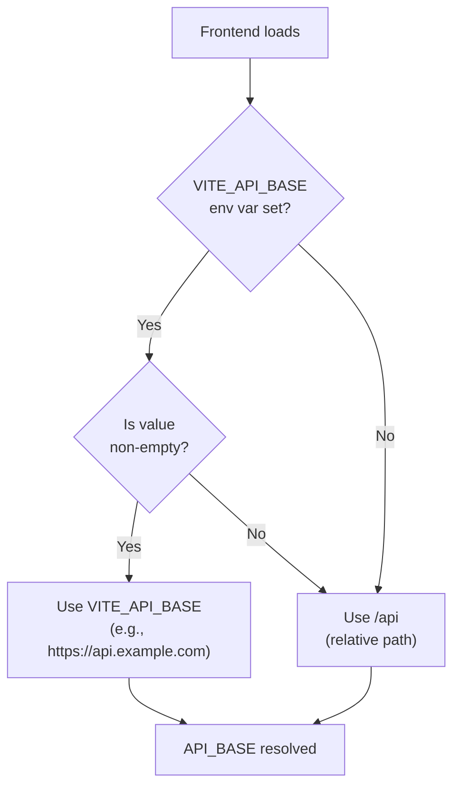

# Environments & URLs

> **Map API base URLs, environment configurations, and how the frontend connects to the correct backend across local, staging, and production.**

## Environment Matrix

### Quick Reference Table

| Environment | Frontend URL | Backend URL | API Base | Frontend Config | Backend Profile |
|---|---|---|---|---|---|
| **Local Dev** | `http://localhost:3000` | `http://localhost:8080` | `/api` | `.env.local` | (default/dev) |
| **Staging** | `https://staging.app.com` | `https://staging.app.com/api` | `/api` | `.env.staging` | `prod` |
| **Production** | `https://app.com` | `https://app.com/api` | `/api` | `.env.production` | `prod` |
| **Fly.io** | `https://app.fly.dev` | `https://app.fly.dev/api` | `/api` | `.env.production` | `prod` |

---

## Local Development

### Frontend

**URL:** `http://localhost:3000`

**Vite dev server:**

```bash
$ cd frontend
$ npm run dev
# Vite running on http://localhost:3000
```

**Configuration (`.env.local` or not set):**

```bash
# .env.local
# Leave VITE_API_BASE empty or unset
# httpClient will default to /api and Vite proxy to localhost:8080
```

**vite.config.ts proxy setup:**

```typescript
export default defineConfig({
  server: {
    proxy: {
      '/api': {
        target: 'http://localhost:8080',
        changeOrigin: true,
        secure: false,
      },
    },
  },
});
```

### Backend

**URL:** `http://localhost:8080`

**Start server:**

```bash
$ cd inventory-service
$ mvn spring-boot:run
# Spring Boot running on http://localhost:8080
```

**Configuration (default profile):**

**In `src/main/resources/application.yml`:**

```yaml
# Default dev configuration
server:
  port: 8080
  servlet:
    context-path: /

spring:
  datasource:
    url: jdbc:h2:mem:testdb
    driver-class-name: org.h2.Driver
  jpa:
    database-platform: org.hibernate.dialect.H2Dialect
    hibernate:
      ddl-auto: create-drop

app:
  demo:
    readonly: false  # Full access (no read-only mode)
  security:
    oauth2-client-id: ${OAUTH2_CLIENT_ID:dev-client-id}
    oauth2-client-secret: ${OAUTH2_CLIENT_SECRET:dev-secret}
```

### Test the Integration

```bash
# Terminal 1: Start backend
$ mvn spring-boot:run

# Terminal 2: Start frontend
$ npm run dev

# Terminal 3: Test endpoint
$ curl http://localhost:8080/api/auth/me -v
# Should see OPTIONS preflight + actual request
```

---

## Production (Fly.io)

### Frontend

**URL:** `https://app.fly.dev`

**Deployed via:** GitHub Pages, Vercel, or Fly.io static hosting

**Configuration (`.env.production`):**

```bash
# .env.production
# Leave VITE_API_BASE unset (or set to /api)
# In production, backend is at same domain via Nginx proxy
VITE_API_BASE=/api
```

**Build & deploy:**

```bash
$ npm run build    # Outputs to dist/
$ npm run preview  # Test production build locally

# Then deploy (example: Vercel)
$ vercel deploy
```

### Backend

**URL:** `https://app.fly.dev` (same domain via Nginx)

**Deployed via:** Fly.io (via Docker + CI/CD)

**Configuration (`application-prod.yml`):**

```yaml
# application-prod.yml (production profile)
server:
  port: 8080
  servlet:
    context-path: /
  ssl:
    enabled: false  # TLS handled by Nginx/Fly.io

spring:
  datasource:
    url: ${DB_URL}  # From Fly.io secrets
    username: ${DB_USER}
    password: ${DB_PASSWORD}
    driver-class-name: oracle.jdbc.driver.OracleDriver
  jpa:
    hibernate:
      ddl-auto: validate  # Don't modify schema in prod
  
  security:
    oauth2:
      client:
        registration:
          google:
            client-id: ${OAUTH2_CLIENT_ID}
            client-secret: ${OAUTH2_CLIENT_SECRET}

app:
  demo:
    readonly: false
  security:
    cors-allowed-origins:
      - https://app.fly.dev
      - https://www.app.fly.dev
```

**Fly.io secrets (set via CLI):**

```bash
$ flyctl secrets set \
  DB_URL="jdbc:oracle:thin:@..." \
  DB_USER="admin" \
  DB_PASSWORD="..." \
  OAUTH2_CLIENT_ID="..." \
  OAUTH2_CLIENT_SECRET="..."

# Verify
$ flyctl secrets list
```

**Nginx configuration (`ops/nginx/nginx.conf`):**

```nginx
server {
    listen 80 default_server;
    
    location /api/ {
        proxy_pass http://localhost:8080;
        proxy_set_header Host $host;
        proxy_set_header X-Real-IP $remote_addr;
        proxy_set_header X-Forwarded-For $proxy_add_x_forwarded_for;
        proxy_set_header X-Forwarded-Proto $scheme;
    }
    
    location / {
        # Frontend static assets or SPA
        root /usr/share/nginx/html;
        try_files $uri /index.html;
    }
}
```

---

## How Frontend Discovers Backend URL

### Resolution Order



### Implementation in httpClient.ts

```typescript
/**
 * API base URL resolution logic.
 * 
 * Priority:
 * 1. If VITE_API_BASE env var is set and non-empty → use it
 * 2. Otherwise → use '/api' (relative path, same origin)
 */
interface ViteEnv {
  VITE_API_BASE?: string;
}

const RAW_BASE = (import.meta.env as unknown as ViteEnv)?.VITE_API_BASE;

export const API_BASE: string = (() => {
  const trimmed = (RAW_BASE ?? '').trim();
  return trimmed.length > 0 ? trimmed : '/api';
})();

const httpClient = axios.create({
  baseURL: API_BASE,
  withCredentials: true,
  timeout: 30_000,
});

export default httpClient;
```

### Examples

**Local Dev (no .env.local):**

```javascript
VITE_API_BASE = undefined
→ trimmed = ""
→ API_BASE = '/api'
→ httpClient calls http://localhost:3000/api/... 
   (Vite proxy forwards to http://localhost:8080)
```

**Production (.env.production with VITE_API_BASE=/api):**

```javascript
VITE_API_BASE = '/api'
→ trimmed = '/api'
→ API_BASE = '/api'
→ httpClient calls /api/...
   (Browser makes same-origin request to https://app.fly.dev/api/...)
   (Nginx proxies to http://localhost:8080)
```

**External API (if needed):**

```javascript
VITE_API_BASE = 'https://api.example.com'
→ trimmed = 'https://api.example.com'
→ API_BASE = 'https://api.example.com'
→ httpClient calls https://api.example.com/...
   (Cross-origin request; CORS required)
```

---

## Frontend Environment Files

### .env.local (Local Development)

```bash
# .env.local
# DO NOT COMMIT (add to .gitignore)

# Leave unset or set to relative path
# VITE_API_BASE=/api

# Or explicit if testing against remote backend
# VITE_API_BASE=https://staging.app.com/api

# Other dev settings
VITE_LOG_LEVEL=debug
VITE_ENABLE_MOCK_DATA=false
```

### .env.staging (Staging)

```bash
# .env.staging
VITE_API_BASE=/api
VITE_LOG_LEVEL=info
VITE_ENABLE_MOCK_DATA=false
```

### .env.production (Production)

```bash
# .env.production
VITE_API_BASE=/api
VITE_LOG_LEVEL=warn
VITE_ENABLE_MOCK_DATA=false
```

### Build with Environment

```bash
# Build for development (uses .env.local)
$ npm run dev

# Build for staging
$ npx vite build --mode staging

# Build for production
$ npm run build  # Uses .env.production
```

---

## Backend Environment Configuration

### Default Profile (Local Dev)

**No profile set** → uses `application.yml`

```bash
$ mvn spring-boot:run
# SPRING_PROFILES_ACTIVE not set
# Uses application.yml (H2 database, demo data, etc.)
```

### Test Profile

**`SPRING_PROFILES_ACTIVE=test`** → uses `application-test.yml`

```bash
$ SPRING_PROFILES_ACTIVE=test mvn spring-boot:run
# Uses application-test.yml (TestContainers, restricted logging)
```

### Production Profile

**`SPRING_PROFILES_ACTIVE=prod`** → uses `application-prod.yml`

```bash
$ SPRING_PROFILES_ACTIVE=prod mvn spring-boot:run
# Uses application-prod.yml (Oracle DB, optimized logging)
```

### In Docker (Fly.io)

**start.sh script:**

```bash
#!/bin/bash
set -e

export SPRING_PROFILES_ACTIVE=prod

java -jar /app/inventory-service.jar
```

---

## Database URLs by Environment

| Environment | Driver | URL | Credentials |
|---|---|---|---|
| **Local** | H2 (in-memory) | `jdbc:h2:mem:testdb` | None (embedded) |
| **Test** | H2 (in-memory) | `jdbc:h2:mem:testdb` | None (test data) |
| **Production** | Oracle Autonomous DB | `jdbc:oracle:thin:@dbname_high?TNS_ADMIN=/opt/oracle/wallet` | From Fly.io secrets |

### Local Database Setup

No setup needed! H2 in-memory database is auto-created.

### Production Database Setup

**Oracle Wallet is required:**

```bash
# 1. Download wallet from Oracle Cloud Console
# 2. Store in /oracle_wallet/Wallet_sspdb_fixed/ (in Docker)
# 3. Set DB_URL to include wallet path

export DB_URL="jdbc:oracle:thin:@dbname_high?TNS_ADMIN=/opt/oracle/wallet"
```

---

## OAuth2 Credentials by Environment

### Local Development

**In `application.yml` or `.env.local` (if using Spring's env var support):**

```yaml
spring:
  security:
    oauth2:
      client:
        registration:
          google:
            client-id: ${OAUTH2_CLIENT_ID:123456789.apps.googleusercontent.com}
            client-secret: ${OAUTH2_CLIENT_SECRET:GOCSPX-xxxxx}
```

**Create test OAuth2 credentials:**

1. Go to [Google Cloud Console](https://console.cloud.google.com/)
2. Create a new project
3. Enable Google+ API
4. Create OAuth2 credentials (Web application)
5. Add `http://localhost:8080` and `http://localhost:3000` as authorized origins
6. Copy Client ID and Secret
7. Set environment variables:

```bash
export OAUTH2_CLIENT_ID="..."
export OAUTH2_CLIENT_SECRET="..."
mvn spring-boot:run
```

### Production

**Via Fly.io secrets:**

```bash
$ flyctl secrets set \
  OAUTH2_CLIENT_ID="production-client-id.apps.googleusercontent.com" \
  OAUTH2_CLIENT_SECRET="GOCSPX-production-secret"
```

**Verify authorized origins in Google Cloud Console:**

- ✅ `https://app.fly.dev`
- ✅ `https://www.app.fly.dev`

---

## Session Configuration by Environment

### Local Development

```yaml
server:
  servlet:
    session:
      timeout: 30m           # 30 minutes
      cookie:
        http-only: false     # Allow JS access (for dev)
        secure: false        # Allow HTTP
        same-site: lax       # Allow some cross-site
```

### Production

```yaml
server:
  servlet:
    session:
      timeout: 24h           # 24 hours
      cookie:
        http-only: true      # JS cannot access
        secure: true         # HTTPS only
        same-site: strict    # No cross-site
```

---

## Testing Connectivity

### Test Frontend → Backend

**From browser console (localhost:3000):**

```javascript
fetch('/api/auth/me', { credentials: 'include' })
  .then(r => r.json())
  .then(d => console.log('Connected!', d))
  .catch(e => console.error('Failed:', e));
```

**Expected:**

- ✅ 200 OK (if logged in) with user profile
- ❌ 401 Unauthorized (if not logged in)

### Test Backend Directly

```bash
$ curl http://localhost:8080/api/auth/me -v
# Should see CORS headers and response
```

### Test from Docker

```bash
$ docker exec inventory-service curl http://localhost:8080/api/health
# Should return 200 OK with health info
```

---

## Troubleshooting

### Issue: Frontend Can't Reach Backend

**Check:**

1. Backend is running: `curl http://localhost:8080/api/health`
2. Frontend API_BASE is correct: Open browser console, check `API_BASE`
3. CORS is configured: Look for `Access-Control-Allow-Origin` headers
4. Vite proxy is set (if using relative path): Check `vite.config.ts`

### Issue: Wrong API Base in Production

**Check:**

1. `.env.production` file
2. Build output: `npm run build`, check `dist/index.html`
3. Vercel/host environment variables (if applicable)

### Issue: Database Connection Fails

**Local:**

- No setup needed (H2 embedded)

**Production:**

- Verify Fly.io secrets: `flyctl secrets list`
- Check wallet path: `ls /oracle_wallet/Wallet_sspdb_fixed/`
- Check DB_URL format

---

## Navigation

- **← [Back to Integration Index](./index.html)**
- **← [CORS & Network](./cors-and-network.html)**
- **→ [Integration Testing](./integration-testing.html)**
- **← [Back to Architecture Index](../index.html)**

