# Error Handling Contract

> **How backend errors are shaped, how frontend interprets them, and what UI feedback to display.**

## Error Response Shape

All errors from Smart Supply Pro's REST API follow a **standardized structure**.

### Standard ErrorResponse

Every error response has this shape:

```json
{
  "error": "error_type_in_snake_case",
  "message": "Human-readable error description",
  "timestamp": "2025-11-20T10:30:45.123Z",
  "correlationId": "SSP-1700551445123-4891"
}
```

**Fields:**

| Field | Type | Purpose |
|---|---|---|
| `error` | string | Machine-readable error code (e.g., `bad_request`, `conflict`, `unauthorized`) |
| `message` | string | Human-readable description of what went wrong |
| `timestamp` | ISO-8601 | When the error occurred (UTC) |
| `correlationId` | string | Unique ID to correlate this error across logs; useful for debugging |

---

## HTTP Status Codes & Error Types

### Mapping: Status → Error → Frontend Action

```mermaid
graph TD
    Request["📤 Request"]
    
    Request -->|200 OK| Success["✅ Success<br/>Process data"]
    Request -->|201 Created| Created["✅ Created<br/>Add to list"]
    
    Request -->|400| BadRequest["❌ bad_request<br/>Validation error"]
    Request -->|401| Unauthorized["❌ unauthorized<br/>Not logged in"]
    Request -->|403| Forbidden["❌ forbidden<br/>Not authorized"]
    Request -->|404| NotFound["❌ not_found<br/>Resource missing"]
    Request -->|409| Conflict["❌ conflict<br/>Duplicate/conflict"]
    Request -->|500| ServerError["❌ internal_server_error<br/>Server error"]
    
    BadRequest --> FormErrors["Show form errors<br/>Highlight invalid fields"]
    Unauthorized --> LoginPage["Redirect to /login<br/>Session expired?"]
    Forbidden --> AccessDenied["Show 'Access Denied'<br/>Contact admin"]
    NotFound --> NotFoundUI["Show 'Not Found'<br/>Check URL/ID"]
    Conflict --> ConflictMsg["Show conflict message<br/>Try different value"]
    ServerError --> GenericError["Show error toast<br/>Log for debugging"]
    
    style Success fill:#4caf50,color:#fff
    style Created fill:#8bc34a,color:#fff
    style BadRequest fill:#ff9800,color:#fff
    style Unauthorized fill:#f44336,color:#fff
    style Forbidden fill:#e91e63,color:#fff
    style NotFound fill:#9c27b0,color:#fff
    style Conflict fill:#ff5722,color:#fff
    style ServerError fill:#673ab7,color:#fff
```



---

### 200 OK - Success

Request succeeded, data is valid.

**Example:**

```http
GET /api/suppliers

200 OK
Content-Type: application/json

[
  { "id": "SUP001", "name": "Acme", ... },
  { "id": "SUP002", "name": "Globex", ... }
]
```

---

### 201 Created - Resource Created

Resource was successfully created.

**Example:**

```http
POST /api/suppliers
Content-Type: application/json

{ "name": "New Supplier", "email": "..." }

201 Created
Content-Type: application/json

{ "id": "SUP003", "name": "New Supplier", "email": "..." }
```

**Frontend:**

```typescript
const response = await httpClient.post('/suppliers', formData);
const newSupplier = response.data;
setSuppliers([...suppliers, newSupplier]);
toast.success('Supplier created!');
navigate(`/suppliers/${newSupplier.id}`);
```

---

### 400 Bad Request

Client sent invalid data (validation error, malformed request, missing fields).

**Example:**

```http
POST /api/suppliers
Content-Type: application/json

{ "name": "", "email": "invalid-email" }

400 Bad Request
Content-Type: application/json

{
  "error": "bad_request",
  "message": "Validation failed: name is required, email must be valid format",
  "timestamp": "2025-11-20T10:30:45.123Z",
  "correlationId": "SSP-1700551445123-4891"
}
```

**Frontend:**

```typescript
try {
  await httpClient.post('/suppliers', formData);
} catch (error) {
  if (error.response?.status === 400) {
    const { message } = error.response.data;
    
    // Parse message or show generic error
    setFormErrors({
      name: 'Name is required',
      email: 'Email must be valid format'
    });
    
    // Or show as toast
    toast.error(`Validation error: ${message}`);
  }
}
```

---

### 401 Unauthorized

User is not authenticated or session has expired.

**Example:**

```http
GET /api/suppliers
Cookie: (no valid SESSION)

401 Unauthorized
Content-Type: application/json

{
  "error": "unauthorized",
  "message": "No valid session. Please log in.",
  "timestamp": "2025-11-20T10:30:45.123Z",
  "correlationId": "SSP-1700551445123-4891"
}
```

**Frontend:**

```typescript
httpClient.interceptors.response.use(
  (res) => res,
  (error) => {
    if (error.response?.status === 401) {
      // Clear user state
      setUser(null);
      
      // Show login page or redirect
      if (!isPublicRoute(location.pathname)) {
        navigate('/login', { state: { message: 'Session expired. Please log in again.' } });
      }
    }
    return Promise.reject(error);
  }
);
```

**User sees:**

- Redirect to `/login`
- Message: "Your session has expired. Please log in again."

---

### 403 Forbidden

User is authenticated but doesn't have permission.

**Example:**

```http
DELETE /api/suppliers/SUP001
Cookie: SESSION=user-cookie...
(User role: USER, not ADMIN)

403 Forbidden
Content-Type: application/json

{
  "error": "forbidden",
  "message": "You do not have permission to delete suppliers. Admin role required.",
  "timestamp": "2025-11-20T10:30:45.123Z",
  "correlationId": "SSP-1700551445123-4891"
}
```

**Frontend:**

```typescript
try {
  await httpClient.delete(`/suppliers/${id}`);
} catch (error) {
  if (error.response?.status === 403) {
    toast.error('Access Denied: You do not have permission for this action.');
    // Optionally hide the button in UI
  }
}
```

**Before making request (defensive):**

```typescript
const canDelete = user?.role === 'ADMIN';

return (
  <button 
    disabled={!canDelete}
    onClick={handleDelete}
    title={canDelete ? '' : 'Admin role required'}
  >
    Delete
  </button>
);
```

---

### 404 Not Found

Resource doesn't exist (wrong ID, deleted, etc.).

**Example:**

```http
GET /api/suppliers/NONEXISTENT

404 Not Found
Content-Type: application/json

{
  "error": "not_found",
  "message": "Supplier not found: NONEXISTENT",
  "timestamp": "2025-11-20T10:30:45.123Z",
  "correlationId": "SSP-1700551445123-4891"
}
```

**Frontend:**

```typescript
try {
  const supplier = await httpClient.get(`/suppliers/${id}`);
  setSupplier(supplier.data);
} catch (error) {
  if (error.response?.status === 404) {
    navigate('/suppliers');
    toast.error(`Supplier not found. It may have been deleted.`);
  }
}
```

**User sees:**

- Redirect to `/suppliers` list
- Toast: "Supplier not found. It may have been deleted."

---

### 409 Conflict

Request conflicts with existing data (duplicate name, duplicate email, concurrent update, etc.).

**Example:**

```http
POST /api/suppliers
Content-Type: application/json

{ "name": "Acme Corporation", "email": "..." }

(Acme Corporation already exists)

409 Conflict
Content-Type: application/json

{
  "error": "conflict",
  "message": "Supplier with name 'Acme Corporation' already exists",
  "timestamp": "2025-11-20T10:30:45.123Z",
  "correlationId": "SSP-1700551445123-4891"
}
```

**Frontend:**

```typescript
try {
  await httpClient.post('/suppliers', formData);
} catch (error) {
  if (error.response?.status === 409) {
    const { message } = error.response.data;
    toast.warning(`${message}. Try a different name.`);
    setFormErrors({ name: 'This name already exists' });
  }
}
```

**User sees:**

- Toast: "Supplier with name 'Acme Corporation' already exists. Try a different name."
- Form field highlighted in red

---

### 500 Internal Server Error

Unexpected server error (bug, database connection failure, etc.).

**Example:**

```http
POST /api/suppliers
Content-Type: application/json

{ "name": "Test", "email": "test@example.com" }

(Database connection fails unexpectedly)

500 Internal Server Error
Content-Type: application/json

{
  "error": "internal_server_error",
  "message": "An unexpected error occurred. Please try again later.",
  "timestamp": "2025-11-20T10:30:45.123Z",
  "correlationId": "SSP-1700551445123-4891"
}
```

**Frontend:**

```typescript
try {
  await httpClient.post('/suppliers', formData);
} catch (error) {
  if (error.response?.status === 500) {
    const { correlationId } = error.response.data;
    toast.error(
      `Server error occurred. Please contact support with ID: ${correlationId}`
    );
    
    // Log to error tracking service
    errorTracker.captureException(error, { correlationId });
  }
}
```

**User sees:**

- Toast: "Server error occurred. Please contact support with ID: SSP-1700551445123-4891"
- Can include error ID in support ticket

---

## Frontend Error Handling Patterns

### 1. Global Error Handler (Interceptor)

**In `httpClient.ts`:**

```typescript
httpClient.interceptors.response.use(
  (response) => response,
  (error) => {
    const status = error.response?.status;
    const data = error.response?.data;
    const message = data?.message || 'An error occurred';

    // Handle specific status codes globally
    if (status === 401) {
      // Redirect to login
      setUser(null);
      window.location.href = '/login';
    } else if (status === 403) {
      // Show access denied
      toast.error('Access denied');
    } else if (status >= 500) {
      // Server error
      toast.error(`Server error: ${message}`);
      errorTracker.captureException(error);
    }

    return Promise.reject(error);
  }
);
```

### 2. API Call Error Handling

**In components:**

```typescript
const handleCreateSupplier = async (formData) => {
  try {
    setLoading(true);
    const response = await httpClient.post('/suppliers', formData);
    setSuppliers([...suppliers, response.data]);
    toast.success('Supplier created!');
  } catch (error) {
    // Let global handler catch 401/403/500
    
    if (error.response?.status === 400) {
      // Handle validation
      setFormErrors(parseValidationErrors(error.response.data.message));
    } else if (error.response?.status === 409) {
      // Handle conflict
      toast.warning(error.response.data.message);
    } else if (!error.response) {
      // Network error
      toast.error('Network error. Check your connection.');
    }
  } finally {
    setLoading(false);
  }
};
```

### 3. Form Error Display

**HTML:**

```html
<form onSubmit={handleSubmit}>
  <div className="form-group">
    <label>Supplier Name *</label>
    <input 
      type="text" 
      name="name" 
      value={formData.name}
      onChange={handleChange}
      className={formErrors.name ? 'error' : ''}
    />
    {formErrors.name && (
      <span className="error-message">{formErrors.name}</span>
    )}
  </div>
  
  <button type="submit" disabled={loading}>
    Create Supplier
  </button>
</form>
```

**CSS:**

```css
.form-group input.error {
  border-color: #f44336;
  background-color: #ffebee;
}

.error-message {
  color: #f44336;
  font-size: 0.875rem;
  margin-top: 0.25rem;
  display: block;
}
```

---

## Error Types Reference

| Error Code | Status | Meaning | User Action |
|---|---|---|---|
| `bad_request` | 400 | Validation failed or malformed request | Fix form fields and retry |
| `unauthorized` | 401 | Not logged in or session expired | Log in again |
| `forbidden` | 403 | Authenticated but not authorized | Contact admin if access needed |
| `not_found` | 404 | Resource doesn't exist | Check URL or search again |
| `conflict` | 409 | Duplicate value or conflicting state | Try different value or refresh |
| `internal_server_error` | 500 | Server error | Retry, contact support with ID |

---

## Common Error Messages

### Validation Errors

```
"Validation failed: email must be valid format, name is required"
```

**Frontend should:**
- Parse message by field
- Highlight invalid form fields
- Show inline error messages

### Duplicate Resource

```
"Supplier with name 'Acme Co' already exists"
```

**Frontend should:**
- Show warning toast
- Suggest alternatives (search existing)
- Clear form or prefill with suggestion

### Permission Denied

```
"You do not have permission to delete suppliers. Admin role required."
```

**Frontend should:**
- Hide delete button for non-admins
- If attempted, show "Access Denied"
- Suggest contacting admin

### Resource Not Found

```
"Supplier not found: SUP001"
```

**Frontend should:**
- Redirect to parent list (/suppliers)
- Show message indicating resource was deleted

---

## Correlation IDs for Debugging

Every error includes a `correlationId`:

```json
{
  "error": "internal_server_error",
  "message": "...",
  "timestamp": "...",
  "correlationId": "SSP-1700551445123-4891"
}
```

**Format:** `SSP-{timestamp}-{random}`

**Use for debugging:**

1. User reports error
2. Show them the correlation ID
3. Backend logs include the same ID
4. DevOps can search logs by ID to find root cause

**Frontend storage (optional):**

```typescript
const handleError = (error) => {
  const correlationId = error.response?.data?.correlationId;
  
  // Store in user's session for support chat
  sessionStorage.setItem('lastError', JSON.stringify({
    correlationId,
    timestamp: new Date().toISOString(),
    message: error.response?.data?.message,
  }));
  
  // Display to user
  toast.error(`Error (ID: ${correlationId}). Please save this ID for support.`);
};
```

---

## Testing Error Scenarios

### Unit Test Example

```typescript
describe('SupplierForm', () => {
  it('should show validation error on bad email', async () => {
    const { getByText, getByRole } = render(<SupplierForm />);
    
    const emailInput = getByRole('textbox', { name: /email/i });
    fireEvent.change(emailInput, { target: { value: 'invalid' } });
    
    const submitButton = getByRole('button', { name: /submit/i });
    fireEvent.click(submitButton);
    
    // Mock API returns 400
    mock.onPost('/suppliers').reply(400, {
      error: 'bad_request',
      message: 'email must be valid format'
    });
    
    await waitFor(() => {
      expect(getByText(/email must be valid format/i)).toBeInTheDocument();
    });
  });

  it('should handle 409 conflict error', async () => {
    const { getByRole } = render(<SupplierForm />);
    
    mock.onPost('/suppliers').reply(409, {
      error: 'conflict',
      message: 'Supplier with name already exists'
    });
    
    fireEvent.click(getByRole('button', { name: /submit/i }));
    
    await waitFor(() => {
      expect(toast.warning).toHaveBeenCalledWith(
        expect.stringContaining('already exists')
      );
    });
  });
});
```

---

## Backend Exception Mapping

**How backend exceptions map to error responses:**

```java
@RestControllerAdvice
public class GlobalExceptionHandler {

    @ExceptionHandler(InvalidRequestException.class)
    public ResponseEntity<ErrorResponse> handleInvalid(
        InvalidRequestException e, HttpServletRequest request
    ) {
        return ErrorResponse.builder()
            .status(HttpStatus.BAD_REQUEST)
            .message(e.getMessage())
            .build()
            .toResponseEntity();
    }

    @ExceptionHandler(DuplicateResourceException.class)
    public ResponseEntity<ErrorResponse> handleDuplicate(
        DuplicateResourceException e
    ) {
        return ErrorResponse.builder()
            .status(HttpStatus.CONFLICT)
            .message(e.getMessage())
            .build()
            .toResponseEntity();
    }

    @ExceptionHandler(Exception.class)
    public ResponseEntity<ErrorResponse> handleGeneric(Exception e) {
        return ErrorResponse.builder()
            .status(HttpStatus.INTERNAL_SERVER_ERROR)
            .message("An unexpected error occurred")
            .build()
            .toResponseEntity();
    }
}
```

---

## Navigation

- **← [Back to Integration Index](./index.html)**
- **← [Authentication Flow](./auth-flow-frontend.html)**
- **→ [CORS & Network](./cors-and-network.html)**
- **← [Back to Architecture Index](../index.html)**

