# Integration Architecture

> **Hub for backend-frontend integration, API contracts, authentication flows, and cross-environment configuration.**

## What is "Integration" Here?

Smart Supply Pro is a **distributed system** with clear separation of concerns:

```mermaid
graph LR
    FrontendUser["🖥️ User<br/>(React SPA)"]
    Frontend["📱 Frontend<br/>(React/TypeScript)"]
    Nginx["🔀 Nginx<br/>(Reverse Proxy)"]
    Backend["⚙️ Backend<br/>(Spring Boot)"]
    DB[("🗄️ Database<br/>(Oracle)")]
    OAuth["🔐 OAuth2<br/>(Google)"]

    FrontendUser -->|Browser| Frontend
    Frontend -->|HTTPS/REST| Nginx
    Nginx -->|Proxy to| Backend
    Backend -->|SQL| DB
    Backend -->|Oauth2 Flow| OAuth
    
    style Frontend fill:#61dafb,color:#000
    style Backend fill:#6db33f,color:#fff
    style Nginx fill:#009639,color:#fff
    style OAuth fill:#4285f4,color:#fff
    style DB fill:#f80000,color:#fff
    style FrontendUser fill:#ff9900,color:#000
```



**Integration Points:**

1. **Frontend ↔ Backend:** REST API over HTTPS with session cookies (no JWT tokens)
2. **Backend ↔ OAuth2 Provider:** Google OAuth2 for authentication
3. **Backend ↔ Database:** Oracle Autonomous DB (wallet-secured)
4. **Nginx ↔ Backend:** Same container (localhost) reverse proxy for API routing

---

## Architecture Overview: How They Talk

### Data Flow: User Interaction

```
User clicks "Sign in with Google"
         ↓
Frontend redirects to /oauth2/authorization/google (backend-initiated)
         ↓
Backend + OAuth2 client redirects user to Google login
         ↓
Google redirects back to backend with authorization code
         ↓
Backend exchanges code for tokens (backend-to-backend, not visible to frontend)
         ↓
Backend creates session cookie (HTTP-only, secure)
         ↓
Backend redirects frontend to /dashboard
         ↓
Frontend detects logged-in state via /api/auth/me endpoint
         ↓
Frontend loads protected pages and calls APIs with automatic credential include
```

### Responsibility Split

| Responsibility | Frontend | Backend |
|---|---|---|
| **UI Rendering** | ✅ React components, routing, styling | ❌ |
| **State Management** | ✅ React Context/hooks, local storage | ❌ |
| **API Calls** | ✅ httpClient (axios wrapper) | ❌ |
| **Business Logic** | ❌ | ✅ Spring Services, Java |
| **Data Persistence** | ❌ | ✅ JPA repositories, Oracle DB |
| **Authentication** | Detects session via /me probe | ✅ OAuth2, session cookies |
| **Authorization** | Hides UI elements | ✅ `@PreAuthorize` annotations |
| **Validation** | Client-side hints | ✅ JSR-380 constraints |
| **Error Handling** | Display toasts/messages | ✅ `ErrorResponse` DTOs |

---

## Where Auth Lives

### Backend (Source of Truth)
- **OAuth2 Configuration:** `src/main/java/config/SecurityConfig.java`
- **Session Creation:** `AuthController.handleOAuth2Login()`
- **Authorization Checks:** `@PreAuthorize("hasRole('ADMIN')")` on controller methods
- **Session Validation:** Spring Security `SecurityContext`

### Frontend (Detects Session)
- **Auth Detection:** Calls `GET /api/auth/me` on app load
- **State Storage:** React Context (`AuthContext.tsx` or similar)
- **Session Loss:** 401 responses trigger redirect to `/login`
- **Demo Mode:** Special flag in localStorage for read-only demo

### Session Cookies
- **Type:** HTTP-only (not accessible via JavaScript)
- **Secure:** HTTPS-only in production
- **SameSite:** STRICT (prevents CSRF)
- **Lifetime:** Managed by Spring Security session timeout
- **Domain:** First-party (frontend and backend under same domain via Nginx)

---

## File Organization

```
/docs/backend/architecture/integration/
├── index.md                           (THIS FILE - Hub & overview)
├── backend-frontend-overview.md       (High-level architecture narrative)
├── api-contract-and-endpoints.md      (API surface, groups, centralized httpClient)
├── auth-flow-frontend.md              (Login, logout, session detection)
├── error-handling-contract.md         (ErrorResponse shape, status code mapping)
├── cors-and-network.md                (Origins, CORS rules, cookie config)
├── environments-and-urls.md           (Local, staging, production URLs & config)
├── integration-testing.md             (Backend + frontend integration test strategies)
└── README.md                          (Quick start links)
```

---

## Quick Links to Topics

### 🔗 **[Backend-Frontend Overview](./backend-frontend-overview.html)**

Understand how the two systems divide responsibilities and communicate.

- Architecture layers: Frontend (UI, routing), Backend (API, logic, data)
- Data flow: User → Frontend → Backend → DB
- DTOs as contracts
- Where each technology lives (`/src` vs `/frontend`)

---

### 🔗 **[API Contract & Endpoints](./api-contract-and-endpoints.html)**

Catalog of all API endpoints and frontend consumption patterns.

- Base URL: `/api/v1` (versioned)
- Endpoint groups: suppliers, inventory, stock history, analytics, auth
- Frontend centralized API client (`httpClient.ts`)
- Authorization patterns (`@PreAuthorize`)
- Response pagination

---

### 🔗 **[Authentication Flow (Frontend Perspective)](./auth-flow-frontend.html)**

How login, logout, and session detection work from the frontend.

- "Login with Google" OAuth2 flow
- Backend exchange of codes for session cookies
- Frontend's `/api/auth/me` probe for logged-in state
- Logout: calling backend, clearing session
- Demo mode (read-only without auth)

---

### 🔗 **[Error Handling Contract](./error-handling-contract.html)**

How backend errors map to frontend behavior and UI feedback.

- Standard `ErrorResponse` shape: `{ error, message, timestamp, correlationId }`
- HTTP status mapping: 400 (validation), 401 (auth), 403 (permission), 404 (not found), 409 (conflict), 500 (server)
- Frontend parsing: toasts, snackbars, inline form validation messages
- Correlation IDs for debugging

---

### 🔗 **[CORS & Network Configuration](./cors-and-network.html)**

How origins, CORS rules, and cookies work across environments.

- Local dev: `http://localhost:3000` (frontend) ↔ `http://localhost:8080` (backend)
- Production: Frontend domain ↔ Fly.io backend via Nginx proxy
- `withCredentials: true` for cookie inclusion
- CORS rules in Spring Security
- SameSite and Secure cookie flags

---

### 🔗 **[Environments & URLs](./environments-and-urls.html)**

Map environment-specific configurations and API base URLs.

- Local development: Frontend Vite dev server, backend Maven dev
- Production: Frontend on Vercel/GitHub Pages, backend on Fly.io
- Frontend `.env` variables (`VITE_API_BASE`)
- Backend `application-prod.yml` configuration
- Fly.io environment secrets

---

### 🔗 **[Integration Testing](./integration-testing.html)**

Test strategies for backend-frontend integration.

- **Backend integration tests:** Spring Boot `@SpringBootTest`, TestContainers
- **Frontend API mocks:** MSW (Mock Service Worker) or Cypress fixtures
- **End-to-end tests:** Full user flows (if using Cypress, Playwright)
- Coverage of happy paths, auth-required flows, error scenarios

---

## Related Architecture Docs

### Backend Architecture
- **[Controller Layer](../controller/index.html)** - REST endpoints, request/response patterns
- **[DTO Layer](../dto/index.html)** - Data transfer objects, validation contracts
- **[Security Architecture](../security/index.html)** - OAuth2, role-based access, encryption
- **[Exception Handling](../exception/index.html)** - ErrorResponse, GlobalExceptionHandler
- **[Service Layer](../service/index.html)** - Business logic, transaction management

### Configuration & Deployment
- **[Resources & Configuration](../resources/index.html)** - application-*.yml, environment variables
- **[Deployment](../deployment/index.html)** - Docker, CI/CD, Fly.io, Nginx
- **[Logging & Observability](../deployment/logs-and-observability.html)** - SLF4J/Logback, debugging

---

## Key Takeaways

1. **Frontend and Backend are Decoupled**
   - Frontend is a standalone React SPA
   - Backend is a stateless REST API
   - No server-side templates; no server-side routing

2. **Authentication is Backend-Controlled**
   - OAuth2 exchange happens server-to-server
   - Session cookies are HTTP-only (JS-inaccessible)
   - Frontend detects auth state by probing `/api/auth/me`

3. **APIs are Contract-Driven**
   - All calls go through centralized `httpClient.ts`
   - Request/response shapes are DTOs
   - Errors follow standard `ErrorResponse` format

4. **Configuration is Environment-Aware**
   - Frontend reads `VITE_API_BASE` env variable
   - Backend reads `application-{profile}.yml` configuration
   - Production: same-origin proxy via Nginx (cookies work naturally)

5. **Testing is Layered**
   - Backend: Unit + integration (Spring Boot, TestContainers)
   - Frontend: Component + integration (React Testing Library, MSW)
   - E2E: Full user flows (Cypress, Playwright) if implemented

---

## Navigation

- **← [Back to Architecture Index](../index.html)**
- **← [Back to Architecture Overview](../overview.html)** (English)
- **← [Back to Architektur-Übersicht](../overview-de.html)** (German)
- **[Deployment & Infrastructure](../deployment/index.html)** - How the system runs in the cloud
- **[Configuration & Resources](../resources/index.html)** - Environment-specific setup

