# Integration Testing

> **Test strategies for validating backend-frontend integration across happy paths, auth flows, and error scenarios.**

## Testing Pyramid

```mermaid
graph TB
    E2E["🎭 End-to-End Tests<br/>(Cypress, Playwright)<br/>Full user flows<br/>Low frequency, slow"]
    Integration["🔗 Integration Tests<br/>(Backend + Frontend)<br/>API contracts<br/>Medium frequency"]
    Unit["🧪 Unit Tests<br/>(Controllers, Services)<br/>Individual components<br/>High frequency, fast"]
    
    Unit --> Integration
    Integration --> E2E
    
    style Unit fill:#c8e6c9,color:#000
    style Integration fill:#a5d6a7,color:#000
    style E2E fill:#81c784,color:#fff
```



---

## Backend Integration Tests

### Overview

**Goal:** Test REST API endpoints with real database, without calling external services (OAuth2, etc.).

**Tools:**

- `@SpringBootTest` — Full application context
- `TestContainers` — Real database (Oracle H2)
- `MockMvc` — HTTP client for testing
- `Mockito` — Mock external services (OAuth2)

### Setup

**In `/src/test/java/com/smartsupplypro/inventory/`:**

```java
@SpringBootTest
@AutoConfigureMockMvc
class SupplierControllerIntegrationTest {

    @Autowired
    private MockMvc mockMvc;

    @Autowired
    private SupplierRepository supplierRepository;

    @BeforeEach
    void setUp() {
        // Clear database before each test
        supplierRepository.deleteAll();
    }

    @Test
    void testListSuppliers_Success() throws Exception {
        // Arrange: Create test data
        Supplier supplier = new Supplier();
        supplier.setId("SUP001");
        supplier.setName("Acme Corp");
        supplier.setEmail("contact@acme.com");
        supplierRepository.save(supplier);

        // Act: Call endpoint
        mockMvc.perform(get("/api/suppliers")
                .contentType(MediaType.APPLICATION_JSON))
            // Assert: Verify response
            .andExpect(status().isOk())
            .andExpect(jsonPath("$[0].id").value("SUP001"))
            .andExpect(jsonPath("$[0].name").value("Acme Corp"));
    }

    @Test
    void testCreateSupplier_Success() throws Exception {
        // Arrange: Prepare request
        String requestBody = """
            {
                "name": "New Supplier",
                "email": "new@supplier.com"
            }
            """;

        // Act & Assert
        mockMvc.perform(post("/api/suppliers")
                .contentType(MediaType.APPLICATION_JSON)
                .content(requestBody)
                .with(authenticated().roles("ADMIN")))  // Mock authenticated user
            .andExpect(status().isCreated())
            .andExpect(jsonPath("$.name").value("New Supplier"));
    }

    @Test
    void testCreateSupplier_ValidationError() throws Exception {
        // Arrange: Invalid data (empty name)
        String requestBody = """
            {
                "name": "",
                "email": "invalid"
            }
            """;

        // Act & Assert
        mockMvc.perform(post("/api/suppliers")
                .contentType(MediaType.APPLICATION_JSON)
                .content(requestBody)
                .with(authenticated().roles("ADMIN")))
            .andExpect(status().isBadRequest())
            .andExpect(jsonPath("$.error").value("bad_request"))
            .andExpect(jsonPath("$.message").containsString("name"));
    }

    @Test
    void testDeleteSupplier_Unauthorized() throws Exception {
        // Act & Assert: Unauthenticated user tries to delete
        mockMvc.perform(delete("/api/suppliers/SUP001"))
            .andExpect(status().isUnauthorized());
    }

    @Test
    void testDeleteSupplier_Forbidden() throws Exception {
        // Act & Assert: Non-admin user tries to delete
        mockMvc.perform(delete("/api/suppliers/SUP001")
                .with(authenticated().roles("USER")))  // USER role, not ADMIN
            .andExpect(status().isForbidden())
            .andExpect(jsonPath("$.error").value("forbidden"));
    }
}
```

### Test Coverage Areas

| Scenario | Test | Expected |
|---|---|---|
| **Happy Path** | GET /api/suppliers, all authenticated | 200 OK with data |
| **Validation Error** | POST with empty required field | 400 Bad Request with error message |
| **Not Found** | GET /api/suppliers/{nonexistent-id} | 404 Not Found |
| **Duplicate** | POST with existing name | 409 Conflict |
| **Unauthorized** | GET without authentication | 401 Unauthorized |
| **Forbidden** | DELETE as USER (not ADMIN) | 403 Forbidden |
| **Server Error** | Database unavailable | 500 Internal Server Error |

### Using TestContainers (Optional)

For real database testing:

```java
@SpringBootTest
@Testcontainers
class SupplierRepositoryIntegrationTest {

    @Container
    static OracleContainer oracle = new OracleContainer("gvenzl/oracle-xe:latest");

    @DynamicPropertySource
    static void oracleProperties(DynamicPropertyRegistry registry) {
        registry.add("spring.datasource.url", oracle::getJdbcUrl);
        registry.add("spring.datasource.username", oracle::getUsername);
        registry.add("spring.datasource.password", oracle::getPassword);
    }

    @Test
    void testCreateAndFindSupplier() {
        // Uses real Oracle database
        supplierRepository.save(new Supplier(/* ... */));
        assertThat(supplierRepository.count()).isEqualTo(1);
    }
}
```

---

## Frontend Integration Tests

### Overview

**Goal:** Test React components that call APIs, verify error handling, loading states, etc.

**Tools:**

- `React Testing Library` — Component testing
- `Vitest` — Test runner
- `MSW` (Mock Service Worker) — Mock HTTP requests
- `@testing-library/react` — Query components

### Setup with MSW

**Install MSW:**

```bash
npm install -D msw
npx msw init public/
```

**Setup MSW server (`src/_tests_/mswServer.ts`):**

```typescript
import { setupServer } from 'msw/node';
import { http, HttpResponse } from 'msw';

export const mswServer = setupServer(
  // Mock suppliers endpoints
  http.get('/api/suppliers', () => {
    return HttpResponse.json([
      { id: 'SUP001', name: 'Acme Corp', email: 'contact@acme.com' },
      { id: 'SUP002', name: 'Globex', email: 'info@globex.com' },
    ]);
  }),

  http.post('/api/suppliers', async ({ request }) => {
    const body = await request.json();
    
    // Simulate validation
    if (!body.name || !body.email) {
      return HttpResponse.json(
        {
          error: 'bad_request',
          message: 'Validation failed: name and email required',
        },
        { status: 400 }
      );
    }

    return HttpResponse.json(
      { id: 'SUP003', ...body },
      { status: 201 }
    );
  }),

  http.delete('/api/suppliers/:id', () => {
    return HttpResponse.json(null, { status: 204 });
  }),

  // Mock auth endpoint
  http.get('/api/auth/me', () => {
    const token = localStorage.getItem('auth_token');
    
    if (!token) {
      return HttpResponse.json(
        { error: 'unauthorized', message: 'Not logged in' },
        { status: 401 }
      );
    }

    return HttpResponse.json({
      email: 'user@example.com',
      fullName: 'Test User',
      role: 'ADMIN',
    });
  }),

  http.post('/api/auth/logout', () => {
    return HttpResponse.json(null, { status: 204 });
  }),
);

// Start server before all tests
beforeAll(() => mswServer.listen());

// Reset handlers between tests
afterEach(() => mswServer.resetHandlers());

// Clean up after tests
afterAll(() => mswServer.close());
```

### Component Test Example

**In `/frontend/src/features/suppliers/SuppliersPage.test.tsx`:**

```typescript
import { render, screen, waitFor, fireEvent } from '@testing-library/react';
import { SuppliersPage } from './SuppliersPage';
import { mswServer } from '@/_tests_/mswServer';
import { HttpResponse, http } from 'msw';
import { describe, it, expect, beforeEach } from 'vitest';

describe('SuppliersPage', () => {
  it('should display suppliers after loading', async () => {
    render(<SuppliersPage />);

    // Initially shows loading
    expect(screen.getByRole('status')).toBeInTheDocument();

    // Wait for suppliers to load
    await waitFor(() => {
      expect(screen.getByText('Acme Corp')).toBeInTheDocument();
      expect(screen.getByText('Globex')).toBeInTheDocument();
    });
  });

  it('should display error toast on API failure', async () => {
    // Override MSW handler for this test
    mswServer.use(
      http.get('/api/suppliers', () => {
        return HttpResponse.json(
          { error: 'internal_server_error', message: 'Database error' },
          { status: 500 }
        );
      })
    );

    render(<SuppliersPage />);

    await waitFor(() => {
      expect(screen.getByText(/Database error/i)).toBeInTheDocument();
    });
  });

  it('should create new supplier on form submit', async () => {
    const { getByRole, getByLabelText } = render(<SuppliersPage />);

    // Wait for initial load
    await waitFor(() => {
      expect(screen.getByText('Acme Corp')).toBeInTheDocument();
    });

    // Fill form
    fireEvent.change(getByLabelText(/Name/i), {
      target: { value: 'New Supplier' },
    });
    fireEvent.change(getByLabelText(/Email/i), {
      target: { value: 'new@supplier.com' },
    });

    // Submit
    fireEvent.click(getByRole('button', { name: /Create/i }));

    // Verify success message
    await waitFor(() => {
      expect(screen.getByText(/Supplier created/i)).toBeInTheDocument();
    });

    // Verify new supplier in list
    expect(screen.getByText('New Supplier')).toBeInTheDocument();
  });

  it('should show validation error on bad email', async () => {
    render(<SuppliersPage />);

    fireEvent.change(screen.getByLabelText(/Email/i), {
      target: { value: 'invalid-email' },
    });

    fireEvent.click(screen.getByRole('button', { name: /Create/i }));

    await waitFor(() => {
      expect(screen.getByText(/invalid email/i)).toBeInTheDocument();
    });
  });

  it('should handle 409 conflict (duplicate name)', async () => {
    mswServer.use(
      http.post('/api/suppliers', () => {
        return HttpResponse.json(
          { error: 'conflict', message: 'Supplier name already exists' },
          { status: 409 }
        );
      })
    );

    render(<SuppliersPage />);

    fireEvent.change(screen.getByLabelText(/Name/i), {
      target: { value: 'Existing Name' },
    });

    fireEvent.click(screen.getByRole('button', { name: /Create/i }));

    await waitFor(() => {
      expect(screen.getByText(/already exists/i)).toBeInTheDocument();
    });
  });

  it('should redirect to login on 401', async () => {
    mswServer.use(
      http.get('/api/suppliers', () => {
        return HttpResponse.json(
          { error: 'unauthorized', message: 'Session expired' },
          { status: 401 }
        );
      })
    );

    render(<SuppliersPage />);

    // httpClient interceptor should redirect to /login
    // (mocked by your test setup)
    // For this test, verify the page handles 401 gracefully
  });
});
```

---

## End-to-End Tests (Cypress)

### Overview

**Goal:** Test complete user flows from login through data manipulation.

**Tools:**

- `Cypress` — E2E testing framework
- Real backend (test server)
- Real database (test DB)

### Example Test

**In `/frontend/cypress/e2e/suppliers.cy.ts`:**

```typescript
describe('Suppliers Feature', () => {
  beforeEach(() => {
    // Reset test database
    cy.resetDatabase();
    
    // Login
    cy.loginAs('admin@example.com');
    
    // Navigate to suppliers page
    cy.visit('/suppliers');
  });

  it('should display suppliers list', () => {
    cy.get('table tbody tr').should('have.length.greaterThan', 0);
    cy.contains('Acme Corp').should('be.visible');
  });

  it('should create new supplier', () => {
    // Click create button
    cy.contains('button', 'Create Supplier').click();

    // Fill form
    cy.get('input[name="name"]').type('New Supplier Inc');
    cy.get('input[name="email"]').type('contact@newsupplier.com');

    // Submit
    cy.contains('button', 'Save').click();

    // Verify success
    cy.contains('Supplier created').should('be.visible');
    cy.contains('New Supplier Inc').should('be.visible');
  });

  it('should show validation error for empty name', () => {
    cy.contains('button', 'Create Supplier').click();

    cy.get('input[name="email"]').type('test@example.com');
    cy.contains('button', 'Save').click();

    cy.contains('Name is required').should('be.visible');
  });

  it('should handle duplicate name error', () => {
    cy.contains('button', 'Create Supplier').click();

    // Try to create with existing name
    cy.get('input[name="name"]').type('Acme Corp');
    cy.get('input[name="email"]').type('newemail@acme.com');
    cy.contains('button', 'Save').click();

    // Should show conflict message
    cy.contains('already exists').should('be.visible');
  });

  it('should delete supplier', () => {
    // Find and delete a supplier
    cy.contains('tr', 'Acme Corp')
      .find('button[title="Delete"]')
      .click();

    // Confirm deletion
    cy.contains('button', 'Confirm').click();

    // Verify deleted
    cy.contains('Acme Corp').should('not.exist');
  });

  it('should handle server errors gracefully', () => {
    // Intercept API and force error
    cy.intercept('GET', '/api/suppliers', {
      statusCode: 500,
      body: { error: 'internal_server_error', message: 'Database error' },
    });

    cy.visit('/suppliers');

    cy.contains('Server error').should('be.visible');
  });
});
```

### Custom Cypress Commands

**In `/frontend/cypress/support/commands.ts`:**

```typescript
Cypress.Commands.add('loginAs', (email: string) => {
  // Mock login by setting auth token
  cy.window().then((win) => {
    // Note: Real OAuth2 login would require real Google credentials
    // For testing, we intercept the auth endpoint
    cy.intercept('GET', '/api/auth/me', {
      statusCode: 200,
      body: {
        email: email,
        fullName: 'Test User',
        role: email.includes('admin') ? 'ADMIN' : 'USER',
      },
    }).as('authMe');

    cy.visit('/');
    cy.wait('@authMe');
  });
});

Cypress.Commands.add('resetDatabase', () => {
  // Call backend test endpoint to reset DB
  cy.request('POST', '/api/test/reset-database').then((response) => {
    expect(response.status).to.equal(200);
  });
});
```

---

## Test Strategy Summary

### What to Test at Each Level

| Level | What | Tool | Example |
|---|---|---|---|
| **Unit** | Individual functions | Vitest | Validation functions, helpers |
| **Integration (Backend)** | Controller + Service + Repository | @SpringBootTest | Full CRUD operations, auth checks |
| **Integration (Frontend)** | Component + API mock | React Testing Library + MSW | Form submission, error display |
| **E2E** | Complete user flow | Cypress | Login → Create → Verify |

### Test Frequency Pyramid

```
        🎭 E2E
       (Slow, valuable)
      (10-20% of tests)
      
      🔗 Integration
     (Medium speed, useful)
    (30-40% of tests)
    
   🧪 Unit
  (Fast, comprehensive)
 (50-70% of tests)
```

### Common Test Patterns

**Happy Path:**
- User provides valid data
- API returns 200/201
- UI updates correctly

**Validation Error:**
- User provides invalid data
- API returns 400
- Form shows error message

**Auth Error:**
- User not logged in
- API returns 401
- Redirect to login

**Permission Error:**
- User lacks permission
- API returns 403
- Show "Access Denied"

**Server Error:**
- API returns 500
- Show generic error message
- Log for debugging

---

## Running Tests

### Backend Tests

```bash
# Run all backend integration tests
$ mvn verify

# Run specific test class
$ mvn test -Dtest=SupplierControllerIntegrationTest

# Run with code coverage
$ mvn jacoco:report
```

### Frontend Tests

```bash
# Run unit + integration tests
$ npm test

# Run with coverage
$ npm test -- --coverage

# Run E2E tests (requires running backend)
$ npm run cypress:open
```

### CI/CD (GitHub Actions)

**In `.github/workflows/1-ci-test.yml`:**

```yaml
- name: Run Backend Tests
  run: mvn verify

- name: Run Frontend Tests
  run: npm test -- --coverage

- name: Run E2E Tests
  run: npm run cypress:run
```

---

## Navigation

- **← [Back to Integration Index](./index.html)**
- **← [Environments & URLs](./environments-and-urls.html)**
- **← [Back to Architecture Index](../index.html)**

