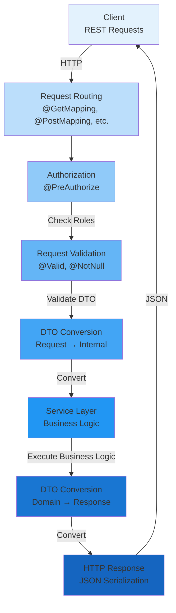
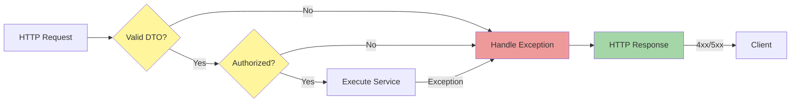

[⬅️ Back to Layers Overview](./overview.html)

# Controller Layer

## Overview

The **Controller Layer** serves as the HTTP API entry point for all client requests. It handles request routing, validation, authentication/authorization checks, and response formatting. Controllers act as the presentation layer interface, converting between HTTP requests/responses and domain-level operations.

**Location:** `src/main/java/com/smartsupplypro/inventory/controller/`

**Responsibility:** HTTP protocol handling, request validation, response building, error mapping

## Architecture



## Key Responsibilities

### 1. **Request Routing**

Maps HTTP endpoints to controller methods using Spring annotations:
- `@GetMapping` - Retrieve resources
- `@PostMapping` - Create resources
- `@PutMapping` - Update resources
- `@DeleteMapping` - Delete resources
- `@RequestMapping` - Base path configuration

**Example:**
```java
@RestController
@RequestMapping("/api/suppliers")
public class SupplierController {
    
    @GetMapping
    public ResponseEntity<List<SupplierDTO>> listAll() { ... }
    
    @PostMapping
    public ResponseEntity<SupplierDTO> create(@Valid @RequestBody CreateSupplierDTO dto) { ... }
}
```

### 2. **Request Validation**

Spring's validation framework ensures data integrity at the API boundary:
- `@Valid` - Triggers validation of nested DTO fields
- `@NotNull`, `@NotBlank` - Standard constraint annotations
- Custom validators for domain-specific rules

**Example:**
```java
@PostMapping
@PreAuthorize("hasRole('ADMIN')")
public ResponseEntity<SupplierDTO> create(@Valid @RequestBody CreateSupplierDTO dto) {
    // @Valid ensures all DTO fields meet constraints before method execution
    return ResponseEntity.ok(supplierService.create(dto));
}
```

### 3. **Authentication & Authorization**

Spring Security integration ensures only authorized users can access endpoints:
- `@PreAuthorize` - Method-level authorization checks
- `isAuthenticated()` - Verify user is logged in
- `hasRole('ADMIN')`, `hasRole('USER')` - Check user roles

**Example:**
```java
@PreAuthorize("isAuthenticated() or @appProperties.demoReadonly")
@GetMapping
public ResponseEntity<List<SupplierDTO>> listAll() { ... }

@PreAuthorize("hasRole('ADMIN')")
@DeleteMapping("/{id}")
public ResponseEntity<Void> delete(@PathVariable String id) { ... }
```

### 4. **DTO Conversion (Inbound)**

Converts incoming JSON to Data Transfer Objects (DTOs):
- HTTP request body automatically deserialized to DTO via Jackson
- Decouples API contract from internal domain models
- Enables versioning and forward compatibility

**Example:**
```java
@PostMapping
public ResponseEntity<SupplierDTO> create(
    @Valid @RequestBody CreateSupplierDTO dto  // Jackson deserializes JSON → DTO
) {
    SupplierDTO created = supplierService.create(dto);
    return ResponseEntity.status(HttpStatus.CREATED).body(created);
}
```

### 5. **DTO Conversion (Outbound)**

Converts domain objects to DTOs for JSON response serialization:
- Service returns domain DTOs
- Jackson serializes DTO → JSON
- Only API-relevant fields are exposed

**Example:**
```java
@GetMapping("/{id}")
public ResponseEntity<SupplierDTO> getById(@PathVariable String id) {
    return supplierService.findById(id)
        .map(ResponseEntity::ok)
        .orElseThrow(() -> new NoSuchElementException("Supplier not found"));
}
```

### 6. **Response Building**

Constructs proper HTTP responses with appropriate status codes:
- `200 OK` - Successful retrieval
- `201 CREATED` - Successful resource creation
- `204 NO CONTENT` - Successful deletion
- `400 BAD REQUEST` - Invalid input
- `404 NOT FOUND` - Resource not found
- `409 CONFLICT` - Business rule violation

**Example:**
```java
@PostMapping
public ResponseEntity<SupplierDTO> create(@Valid @RequestBody CreateSupplierDTO dto) {
    SupplierDTO created = supplierService.create(dto);
    URI location = ServletUriComponentsBuilder.fromCurrentRequest()
        .path("/{id}")
        .buildAndExpand(created.getId())
        .toUri();
    return ResponseEntity.created(location).body(created);
}
```

## Core Controllers

### SupplierController
**Purpose:** Manage suppliers (CRUD operations)
- `GET /api/suppliers` - List all suppliers
- `POST /api/suppliers` - Create supplier
- `GET /api/suppliers/{id}` - Get supplier by ID
- `PUT /api/suppliers/{id}` - Update supplier
- `DELETE /api/suppliers/{id}` - Delete supplier
- `GET /api/suppliers/search?name=...` - Search suppliers

**Authorization:** USER can read, ADMIN can modify

### InventoryItemController
**Purpose:** Manage inventory items with stock tracking
- `GET /api/inventory/items` - List items (paginated)
- `POST /api/inventory/items` - Create item
- `GET /api/inventory/items/{id}` - Get item details
- `PUT /api/inventory/items/{id}` - Update item
- `DELETE /api/inventory/items/{id}` - Delete item
- `POST /api/inventory/items/{id}/update-stock` - Update stock quantity

**Authorization:** USER can read, ADMIN can modify

### StockHistoryController
**Purpose:** Query stock change audit trail
- `GET /api/stock-history` - List all stock movements
- `GET /api/stock-history?itemId=...` - Filter by item
- `GET /api/stock-history/summary` - Aggregate statistics

**Authorization:** USER read-only (audit trail)

### AnalyticsController
**Purpose:** Provide analytics and reporting endpoints
- `GET /api/analytics/dashboard` - Dashboard summary (KPIs)
- `GET /api/analytics/financial-summary` - Financial metrics
- `GET /api/analytics/inventory-trends` - Trend analysis
- `GET /api/analytics/low-stock` - Low stock alerts

**Authorization:** USER can read analytics

### AuthController
**Purpose:** OAuth2 authentication endpoints
- `POST /api/auth/callback` - OAuth2 callback handler
- `GET /api/auth/user` - Current user info
- `POST /api/auth/logout` - User logout

**Authorization:** PUBLIC for login, AUTHENTICATED for logout

## Error Handling Flow



**Error Mapping:**
- `IllegalArgumentException` → 400 Bad Request
- `NoSuchElementException` → 404 Not Found
- `IllegalStateException` → 409 Conflict
- `AccessDeniedException` → 403 Forbidden
- Handled by `GlobalExceptionHandler`

## Best Practices

### 1. **Lean Controllers**
Controllers should only handle HTTP concerns. Complex business logic belongs in the service layer.

```java
// ✅ Good - Controller delegates to service
@PostMapping
public ResponseEntity<SupplierDTO> create(@Valid @RequestBody CreateSupplierDTO dto) {
    return ResponseEntity.ok(supplierService.create(dto));
}

// ❌ Bad - Business logic in controller
@PostMapping
public ResponseEntity<SupplierDTO> create(@Valid @RequestBody CreateSupplierDTO dto) {
    if (dto.getName().contains("bad")) throw new RuntimeException();
    // ... more business logic ...
}
```

### 2. **Consistent Response Structure**
All endpoints return `ResponseEntity<DTO>` for consistent response handling and status code control.

### 3. **Security-First Authorization**
Always use `@PreAuthorize` for sensitive operations. Never assume user is authorized.

```java
@PreAuthorize("hasRole('ADMIN')")
@DeleteMapping("/{id}")
public ResponseEntity<Void> delete(@PathVariable String id) { ... }
```

### 4. **Validation at Boundary**
Use `@Valid` on all user-submitted data. Never trust client input.

### 5. **Proper HTTP Status Codes**
- Create: `201 CREATED` with Location header
- Update: `200 OK` or `204 NO CONTENT`
- Delete: `204 NO CONTENT`
- Error: Appropriate 4xx or 5xx code

### 6. **URI Resource Location**
When creating resources, return Location header pointing to created resource.

```java
@PostMapping
public ResponseEntity<SupplierDTO> create(@Valid @RequestBody CreateSupplierDTO dto) {
    SupplierDTO created = supplierService.create(dto);
    URI location = ServletUriComponentsBuilder.fromCurrentRequest()
        .path("/{id}")
        .buildAndExpand(created.getId())
        .toUri();
    return ResponseEntity.created(location).body(created);
}
```

## Request/Response Lifecycle

```
1. HTTP Request arrives at Spring DispatcherServlet
   ↓
2. Request routing matches URL pattern to controller method
   ↓
3. Spring Security checks @PreAuthorize annotation
   ↓
4. @Valid triggers DTO field validation
   ↓
5. Jackson deserializes request body JSON → DTO
   ↓
6. Controller method executes, calls service layer
   ↓
7. Service returns domain DTO
   ↓
8. Jackson serializes DTO → JSON response body
   ↓
9. Controller builds ResponseEntity with status code
   ↓
10. HTTP Response returned to client
```

## Integration with Other Layers

```
Controller Layer
       ↓
Service Layer (Business Logic)
       ↓
Repository Layer (Data Access)
       ↓
Database
```

**Interaction Pattern:**
- Controller receives HTTP request + DTO
- Controller calls service method (no business logic here)
- Service performs validation, business logic, transactions
- Service calls repository for data persistence
- Service returns result to controller
- Controller builds HTTP response

## Testing Controller Layer

Controllers are tested via integration tests:
- Use `@SpringBootTest` with mock databases
- Test endpoint routing, status codes, response structure
- Mock service layer to isolate controller logic
- Verify error handling and exception mapping

**Example:**
```java
@SpringBootTest
class SupplierControllerTest {
    @MockBean
    private SupplierService supplierService;
    
    @Test
    void testCreateSupplier() {
        // Test controller endpoint
        mockMvc.perform(post("/api/suppliers")
            .contentType(MediaType.APPLICATION_JSON)
            .content(jsonOf(new CreateSupplierDTO(...))))
            .andExpect(status().isCreated());
    }
}
```

---

[⬅️ Back to Layers Overview](./overview.html)
