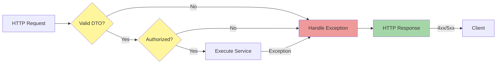

[⬅️ Back to Controller Index](./index.md)

# Error Handling Flow

The **Error Handling Flow** maps exceptions to appropriate HTTP responses ensuring consistent error communication.

## Error Handling Architecture



## Exception Mapping

The `GlobalExceptionHandler` maps domain exceptions to HTTP responses:

### 400 Bad Request
```
IllegalArgumentException
    ↓
GlobalExceptionHandler catches
    ↓
Returns ErrorResponse with status 400
```

**Use Case:** Invalid input, constraint violation by user
```
POST /api/suppliers
Body: { "name": "" }
    ↓
Response: 400 Bad Request
{
    "code": "BAD_REQUEST",
    "message": "Supplier name is required",
    "path": "/api/suppliers",
    "timestamp": "2024-11-19T10:30:45"
}
```

### 404 Not Found
```
NoSuchElementException
    ↓
GlobalExceptionHandler catches
    ↓
Returns ErrorResponse with status 404
```

**Use Case:** Resource does not exist
```
GET /api/suppliers/nonexistent
    ↓
Response: 404 Not Found
{
    "code": "NOT_FOUND",
    "message": "Resource not found",
    "path": "/api/suppliers/nonexistent",
    "timestamp": "2024-11-19T10:30:45"
}
```

### 409 Conflict
```
IllegalStateException
    ↓
GlobalExceptionHandler catches
    ↓
Returns ErrorResponse with status 409
```

**Use Case:** Business rule violation (e.g., duplicate supplier name)
```
POST /api/suppliers
Body: { "name": "ACME Corp" }  ← Duplicate
    ↓
Response: 409 Conflict
{
    "code": "CONFLICT",
    "message": "Supplier 'ACME Corp' already exists",
    "path": "/api/suppliers",
    "timestamp": "2024-11-19T10:30:45"
}
```

### 403 Forbidden
```
AccessDeniedException
    ↓
GlobalExceptionHandler catches
    ↓
Returns ErrorResponse with status 403
```

**Use Case:** User lacks required role/permission
```
DELETE /api/suppliers/123
(User has USER role, needs ADMIN)
    ↓
Response: 403 Forbidden
{
    "code": "FORBIDDEN",
    "message": "You do not have permission",
    "path": "/api/suppliers/123",
    "timestamp": "2024-11-19T10:30:45"
}
```

### 500 Internal Server Error
```
Generic Exception
    ↓
GlobalExceptionHandler catches
    ↓
Returns ErrorResponse with status 500
```

**Use Case:** Unexpected error in service layer
```
Service logic throws RuntimeException
    ↓
Response: 500 Internal Server Error
{
    "code": "INTERNAL_SERVER_ERROR",
    "message": "An unexpected error occurred",
    "path": "/api/suppliers",
    "timestamp": "2024-11-19T10:30:45"
}
```

---

[⬅️ Back to Controller Index](./index.md)
