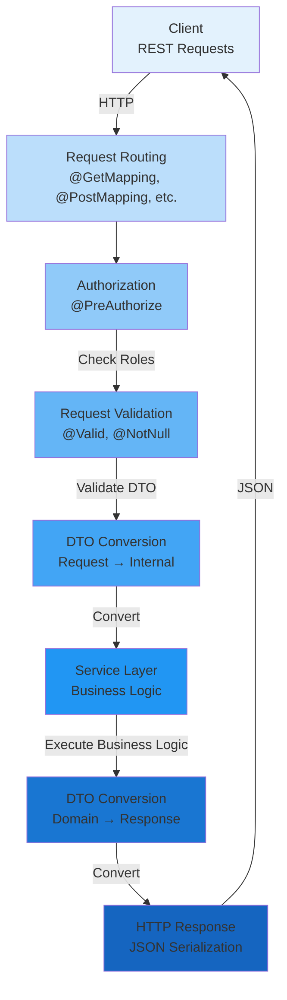

[⬅️ Back to Layers Overview](../overview.html)

# Controller Layer

The **Controller Layer** serves as the HTTP API entry point for all client requests. It handles request routing, validation, authentication/authorization checks, and response formatting.

**Location:** `src/main/java/com/smartsupplypro/inventory/controller/`

**Responsibility:** HTTP protocol handling, request validation, response building, error mapping

## Quick Navigation

### By Topic
- **[Routing](./routing.md)** - URL mapping and HTTP methods
- **[Validation](./validation.md)** - Input validation and constraints
- **[Authorization](./authorization.md)** - Authentication and role checks
- **[DTO Conversion (Inbound)](./dto-conversion-inbound.md)** - JSON → Object mapping
- **[DTO Conversion (Outbound)](./dto-conversion-outbound.md)** - Object → JSON mapping
- **[Response Building](./response-building.md)** - HTTP status codes and responses
- **[Core Controllers](./core-controllers.md)** - SupplierController, InventoryItemController, etc.
- **[Error Handling Flow](./error-handling-flow.md)** - Exception mapping to HTTP responses
- **[Best Practices](./best-practices.md)** - Standards and guidelines
- **[Request/Response Lifecycle](./lifecycle.md)** - Complete flow through the layer
- **[Integration](./integration.md)** - How controller connects to service layer
- **[Testing](./testing.md)** - Unit and integration testing strategies

### By Role
- **API Developers** → Start with [Routing](./routing.md) → [Core Controllers](./core-controllers.md)
- **Security Engineers** → Review [Authorization](./authorization.md)
- **QA/Testing** → Check [Testing](./testing.md) and [Validation](./validation.md)
- **New Team Members** → Begin with [Best Practices](./best-practices.md)

## Architecture Overview

---

[⬅️ Back to Layers Overview](../overview.html)
