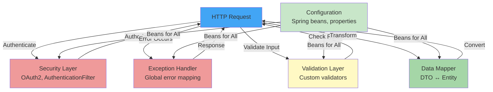
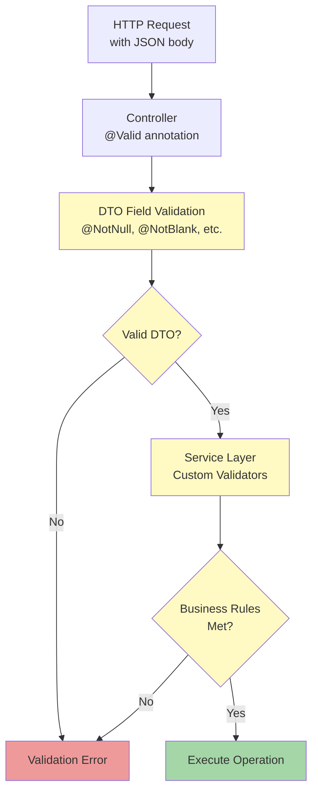

[⬅️ Back to Layers Overview](./overview.html)

# Infrastructure & Cross-Cutting Concerns Layer

## Overview

The **Infrastructure Layer** provides foundational services and handles cross-cutting concerns that span multiple layers. These include configuration, security, validation, exception handling, and data mapping. While not business logic themselves, these components are essential for the application to function correctly and securely.

**Location:** `src/main/java/com/smartsupplypro/inventory/`
- `config/` - Configuration classes
- `security/` - OAuth2 and authentication handlers
- `validation/` - Custom validators
- `exception/` - Exception handling and custom exceptions
- `mapper/` - Data mapping utilities

**Responsibility:** Cross-layer concerns, configuration, security, validation, exception handling, data transformation

## Architecture



## Configuration Layer

### Application Properties

Spring Boot configuration provides environment-specific settings:

```yaml
# application.yml
spring:
  datasource:
    url: jdbc:oracle:thin:@localhost:1521:ORCL
    username: inventory_user
    password: ${DB_PASSWORD}
  
  jpa:
    hibernate:
      ddl-auto: validate
    show-sql: false
  
  security:
    oauth2:
      client:
        registration:
          google:
            client-id: ${GOOGLE_CLIENT_ID}
            client-secret: ${GOOGLE_CLIENT_SECRET}
          github:
            client-id: ${GITHUB_CLIENT_ID}
            client-secret: ${GITHUB_CLIENT_SECRET}

app:
  demo:
    readonly: true  # Allow demo read-only access
```

### Spring Configuration Classes

Java-based configuration for beans and settings:

```java
@Configuration
public class AppConfig {
    
    // Register custom mappers as beans
    @Bean
    public SupplierMapper supplierMapper() {
        return new SupplierMapper();
    }
    
    // Configure async processing
    @Bean(name = "taskExecutor")
    public Executor taskExecutor() {
        ThreadPoolTaskExecutor executor = new ThreadPoolTaskExecutor();
        executor.setCorePoolSize(2);
        executor.setMaxPoolSize(2);
        executor.initialize();
        return executor;
    }
    
    // Configure HTTP client
    @Bean
    public RestTemplate restTemplate() {
        return new RestTemplate();
    }
}
```

### Security Configuration

Spring Security configuration for authentication/authorization:

```java
@Configuration
@EnableWebSecurity
public class SecurityConfig {
    
    @Bean
    public SecurityFilterChain filterChain(HttpSecurity http) throws Exception {
        http
            .authorizeRequests()
                .requestMatchers("/actuator/health").permitAll()
                .anyRequest().authenticated()
                .and()
            .oauth2Login()
                .successHandler(new OAuth2LoginSuccessHandler())
                .and()
            .logout()
                .permitAll();
        
        return http.build();
    }
}
```

## Security Layer

### OAuth2 Authentication

Handles third-party authentication (Google, GitHub, etc.):

```java
@Component
public class CustomOAuth2UserService extends DefaultOAuth2UserService {
    
    private final AppUserRepository userRepository;
    
    @Override
    public OAuth2User loadUser(OAuth2UserRequest userRequest) throws OAuth2AuthenticationException {
        OAuth2User oauth2User = super.loadUser(userRequest);
        
        // Extract user info from OAuth2 provider
        String email = oauth2User.getAttribute("email");
        String name = oauth2User.getAttribute("name");
        String oauth2Id = oauth2User.getName();
        
        // Find or create user in database
        AppUser user = userRepository.findByEmail(email)
            .orElseGet(() -> createNewUser(email, name, oauth2Id));
        
        // Update last login timestamp
        user.setLastLogin(LocalDateTime.now());
        userRepository.save(user);
        
        return new OAuth2User() {
            @Override
            public Collection<? extends GrantedAuthority> getAuthorities() {
                return List.of(new SimpleGrantedAuthority("ROLE_" + user.getRole()));
            }
            
            @Override
            public Map<String, Object> getAttributes() {
                return oauth2User.getAttributes();
            }
            
            @Override
            public String getName() {
                return user.getId();
            }
        };
    }
    
    private AppUser createNewUser(String email, String name, String oauth2Id) {
        return AppUser.builder()
            .id(UUID.randomUUID().toString())
            .email(email)
            .name(name)
            .oauth2Id(oauth2Id)
            .role(Role.USER)  // Default to USER, admin promotes as needed
            .createdAt(LocalDateTime.now())
            .build();
    }
}
```

### Authorization with @PreAuthorize

Method-level authorization checks:

```java
@Service
public class SupplierServiceImpl {
    
    @PreAuthorize("isAuthenticated()")
    public List<SupplierDTO> findAll() {
        return repository.findAll().stream()
            .map(mapper::toDTO)
            .toList();
    }
    
    @PreAuthorize("hasRole('ADMIN')")
    public SupplierDTO create(CreateSupplierDTO dto) {
        // Only ADMIN can create suppliers
        return mapper.toDTO(repository.save(mapper.toEntity(dto)));
    }
    
    @PreAuthorize("isAuthenticated() or @appProperties.demoReadonly")
    public Optional<SupplierDTO> findById(String id) {
        // Allows authenticated users or demo mode
        return repository.findById(id).map(mapper::toDTO);
    }
}
```

### Getting Current User

Access authenticated user from SecurityContext:

```java
@Service
public class SupplierServiceImpl {
    
    private String getCurrentUsername() {
        Authentication authentication = SecurityContextHolder.getContext()
            .getAuthentication();
        return authentication != null ? authentication.getName() : "SYSTEM";
    }
    
    @Transactional
    public SupplierDTO create(CreateSupplierDTO dto) {
        Supplier entity = mapper.toEntity(dto);
        entity.setCreatedBy(getCurrentUsername());  // Set from SecurityContext
        return mapper.toDTO(repository.save(entity));
    }
}
```

## Exception Handling Layer

### Global Exception Handler

Centralized exception handling maps domain exceptions to HTTP responses:

```java
@RestControllerAdvice
public class GlobalExceptionHandler {
    
    // 400 Bad Request
    @ExceptionHandler(IllegalArgumentException.class)
    public ResponseEntity<ErrorResponse> handleIllegalArgument(
            IllegalArgumentException ex, HttpServletRequest request) {
        ErrorResponse response = new ErrorResponse(
            "BAD_REQUEST",
            ex.getMessage(),
            request.getRequestURI()
        );
        return ResponseEntity.badRequest().body(response);
    }
    
    // 404 Not Found
    @ExceptionHandler(NoSuchElementException.class)
    public ResponseEntity<ErrorResponse> handleNotFound(
            NoSuchElementException ex, HttpServletRequest request) {
        ErrorResponse response = new ErrorResponse(
            "NOT_FOUND",
            "Resource not found: " + ex.getMessage(),
            request.getRequestURI()
        );
        return ResponseEntity.status(HttpStatus.NOT_FOUND).body(response);
    }
    
    // 409 Conflict
    @ExceptionHandler(IllegalStateException.class)
    public ResponseEntity<ErrorResponse> handleIllegalState(
            IllegalStateException ex, HttpServletRequest request) {
        ErrorResponse response = new ErrorResponse(
            "CONFLICT",
            ex.getMessage(),
            request.getRequestURI()
        );
        return ResponseEntity.status(HttpStatus.CONFLICT).body(response);
    }
    
    // 403 Forbidden
    @ExceptionHandler(AccessDeniedException.class)
    public ResponseEntity<ErrorResponse> handleAccessDenied(
            AccessDeniedException ex, HttpServletRequest request) {
        ErrorResponse response = new ErrorResponse(
            "FORBIDDEN",
            "You do not have permission to access this resource",
            request.getRequestURI()
        );
        return ResponseEntity.status(HttpStatus.FORBIDDEN).body(response);
    }
    
    // 500 Internal Server Error
    @ExceptionHandler(Exception.class)
    public ResponseEntity<ErrorResponse> handleGenericException(
            Exception ex, HttpServletRequest request) {
        ErrorResponse response = new ErrorResponse(
            "INTERNAL_SERVER_ERROR",
            "An unexpected error occurred",
            request.getRequestURI()
        );
        return ResponseEntity.status(HttpStatus.INTERNAL_SERVER_ERROR).body(response);
    }
}
```

### Error Response Structure

Consistent error response format:

```java
@Data
@AllArgsConstructor
public class ErrorResponse {
    private String code;              // Error code (BAD_REQUEST, NOT_FOUND, etc.)
    private String message;           // Human-readable message
    private String path;              // Request path where error occurred
    private LocalDateTime timestamp;  // When error occurred
    
    public ErrorResponse(String code, String message, String path) {
        this.code = code;
        this.message = message;
        this.path = path;
        this.timestamp = LocalDateTime.now();
    }
}
```

**Example Error Response:**
```json
{
    "code": "CONFLICT",
    "message": "Supplier with name 'ACME Corp' already exists",
    "path": "/api/suppliers",
    "timestamp": "2024-11-19T10:30:45.123456"
}
```

## Validation Layer

### Custom Validators

Domain-specific validation logic:

```java
@Component
public class SupplierValidator {
    
    private final SupplierRepository repository;
    
    public void validateUniquenessOnCreate(String name) {
        if (repository.existsByNameIgnoreCase(name)) {
            throw new IllegalStateException(
                "Supplier with name '" + name + "' already exists"
            );
        }
    }
    
    public void validateRequiredFields(CreateSupplierDTO dto) {
        if (dto.getName() == null || dto.getName().isBlank()) {
            throw new IllegalArgumentException("Supplier name is required");
        }
        if (dto.getContactName() == null || dto.getContactName().isBlank()) {
            throw new IllegalArgumentException("Contact name is required");
        }
    }
}
```

```java
@Component
public class InventoryItemValidator {
    
    private final InventoryItemRepository itemRepository;
    private final SupplierRepository supplierRepository;
    
    public void validateBeforeCreate(CreateInventoryItemDTO dto) {
        // Validate supplier exists
        if (!supplierRepository.existsById(dto.getSupplierId())) {
            throw new IllegalArgumentException(
                "Supplier with ID '" + dto.getSupplierId() + "' not found"
            );
        }
        
        // Validate name uniqueness
        if (itemRepository.existsByNameIgnoreCase(dto.getName())) {
            throw new IllegalStateException(
                "Item with name '" + dto.getName() + "' already exists"
            );
        }
        
        // Validate quantity
        if (dto.getInitialQuantity() < 0) {
            throw new IllegalArgumentException(
                "Initial quantity cannot be negative"
            );
        }
    }
}
```

### Validation Flow



## Data Mapping Layer

### MapStruct Mappers

Efficient object transformation:

```java
@Mapper(componentModel = "spring")
public interface SupplierMapper {
    
    // Entity → DTO
    SupplierDTO toDTO(Supplier supplier);
    
    // DTO → Entity
    Supplier toEntity(CreateSupplierDTO dto);
    
    // List transformation
    List<SupplierDTO> toDTOList(List<Supplier> suppliers);
    
    @Mapping(target = "id", ignore = true)  // Keep existing ID
    @Mapping(target = "createdAt", ignore = true)  // Keep creation time
    @Mapping(target = "createdBy", ignore = true)  // Keep creator
    void update(UpdateSupplierDTO dto, @MappingTarget Supplier supplier);
}
```

### Manual Mappers

For simple transformations:

```java
@Component
public class InventoryItemMapper {
    
    public InventoryItemDTO toDTO(InventoryItem entity) {
        if (entity == null) return null;
        
        return InventoryItemDTO.builder()
            .id(entity.getId())
            .name(entity.getName())
            .sku(entity.getSku())
            .supplierId(entity.getSupplierId())
            .supplierName(entity.getSupplier().getName())
            .quantity(entity.getQuantity())
            .unitPrice(entity.getUnitPrice())
            .totalValue(entity.getQuantity() * entity.getUnitPrice().doubleValue())
            .createdAt(entity.getCreatedAt())
            .createdBy(entity.getCreatedBy())
            .build();
    }
    
    public InventoryItem toEntity(CreateInventoryItemDTO dto) {
        if (dto == null) return null;
        
        return InventoryItem.builder()
            .id(UUID.randomUUID().toString())
            .name(dto.getName())
            .sku(dto.getSku())
            .supplierId(dto.getSupplierId())
            .quantity(dto.getInitialQuantity())
            .unitPrice(dto.getUnitPrice())
            .build();
    }
}
```

## Integration with Other Layers

```
Controller Layer
       ↓
INFRASTRUCTURE LAYER (You are here)
  ├─ Security (OAuth2, @PreAuthorize)
  ├─ Validation (Custom validators)
  ├─ Exception Handling (GlobalExceptionHandler)
  ├─ Data Mapping (Mappers)
  └─ Configuration (Spring beans)
       ↓
Service Layer
       ↓
Repository Layer
       ↓
Database
```

**Integration Points:**
1. **Controllers** use `@PreAuthorize` from security layer
2. **Services** throw exceptions caught by GlobalExceptionHandler
3. **Services** call validators before persistence
4. **Controllers/Services** use mappers for DTO ↔ Entity conversion
5. **Configuration** provides beans for all layers

## Best Practices

### 1. **Centralize Exception Handling**
Use `@RestControllerAdvice` for all exception mapping:

```java
// ✅ Good - One place for all error handling
@RestControllerAdvice
public class GlobalExceptionHandler {
    @ExceptionHandler(IllegalStateException.class)
    public ResponseEntity<ErrorResponse> handle(IllegalStateException ex) { ... }
}

// ❌ Bad - Exception handling scattered
@RestController
public class SupplierController {
    try { ... }
    catch (IllegalStateException e) { ... }  // Ad hoc handling
}
```

### 2. **Separate Validation from Business Logic**
Validators are single-responsibility:

```java
// ✅ Good - Validation in separate class
@Component
public class SupplierValidator {
    public void validateUniquenessOnCreate(String name) { ... }
}

// ❌ Bad - Validation mixed with business logic
@Service
public class SupplierServiceImpl {
    public SupplierDTO create(CreateSupplierDTO dto) {
        if (repository.existsByNameIgnoreCase(dto.getName())) {
            throw new IllegalStateException(...);
        }
        // More business logic here...
    }
}
```

### 3. **Use Consistent Error Response Format**
All errors follow same structure:

```json
{
    "code": "ERROR_CODE",
    "message": "Human-readable message",
    "path": "/api/endpoint",
    "timestamp": "2024-11-19T10:30:45"
}
```

### 4. **Validate at Multiple Layers**
Defense in depth:

```
Layer 1: DTO field validation (@Valid, @NotNull)
  ↓
Layer 2: Service business rule validation (custom validators)
  ↓
Layer 3: Database constraints (unique, not null, foreign keys)
```

### 5. **Always Check @PreAuthorize**
Never assume user is authorized:

```java
// ✅ Good - Explicitly check authorization
@PreAuthorize("hasRole('ADMIN')")
@DeleteMapping("/{id}")
public ResponseEntity<Void> delete(@PathVariable String id) { ... }

// ❌ Bad - No authorization check
@DeleteMapping("/{id}")
public ResponseEntity<Void> delete(@PathVariable String id) { ... }
```

### 6. **Get Current User from SecurityContext**
Never pass user info as parameter:

```java
// ✅ Good - SecurityContext is always available
String currentUser = SecurityContextHolder.getContext()
    .getAuthentication()
    .getName();

// ❌ Bad - User passed as parameter
public void create(CreateSupplierDTO dto, String userId) { ... }
```

---

[⬅️ Back to Layers Overview](./overview.html)
