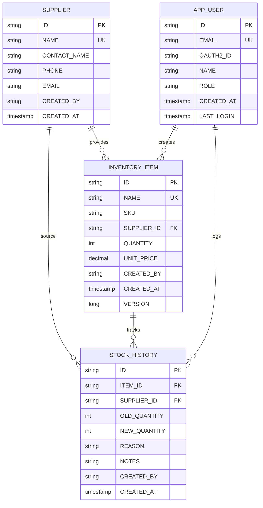

[⬅️ Back to Layers Overview](./overview.html)

# Domain Model & Data Layer

## Overview

The **Domain Model Layer** represents the core business entities and their relationships. These JPA entities map directly to database tables and form the foundation of the application's data persistence. The domain model encapsulates both data structure and business constraints through annotations and design patterns.

**Location:** `src/main/java/com/smartsupplypro/inventory/model/`

**Responsibility:** Entity definitions, relationships, constraints, audit tracking, enumeration types

## Core Entities

### Supplier Entity

**Purpose:** Represents inventory goods providers

**Database Table:** `SUPPLIER`

**Fields:**
```java
@Entity
@Table(name = "SUPPLIER")
public class Supplier {
    @Id
    @Column(name = "ID", nullable = false)
    private String id;  // UUID or custom ID
    
    @Column(name = "NAME", nullable = false, unique = true)
    private String name;  // Unique supplier name
    
    @Column(name = "CONTACT_NAME")
    private String contactName;  // Contact person
    
    @Column(name = "PHONE")
    private String phone;  // Phone number
    
    @Column(name = "EMAIL")
    private String email;  // Email address
    
    @Column(name = "CREATED_BY", nullable = false)
    private String createdBy;  // User who created
    
    @CreationTimestamp
    @Column(name = "CREATED_AT", nullable = false, updatable = false)
    private LocalDateTime createdAt;  // When created
}
```

**Business Rules:**
1. Supplier name must be unique across the system
2. Supplier cannot be deleted if linked to active inventory items
3. Supplier information is mostly immutable (read-heavy)
4. Audit fields track creator and creation timestamp

**Key Relationships:**
- One supplier can provide many inventory items (1:M)
- One supplier can have multiple stock history entries (1:M)

### InventoryItem Entity

**Purpose:** Represents individual products/items in inventory

**Database Table:** `INVENTORY_ITEM`

**Fields:**
```java
@Entity
@Table(name = "INVENTORY_ITEM")
@Data
@NoArgsConstructor
@AllArgsConstructor
@Builder
public class InventoryItem {
    @Id
    @Column(name = "ID", nullable = false)
    private String id;  // UUID
    
    @Column(name = "NAME", nullable = false, unique = true)
    private String name;  // Unique item name
    
    @Column(name = "SKU")
    private String sku;  // Stock keeping unit
    
    @Column(name = "SUPPLIER_ID", nullable = false)
    private String supplierId;  // Foreign key to SUPPLIER
    
    @ManyToOne(fetch = FetchType.EAGER)
    @JoinColumn(name = "SUPPLIER_ID", insertable = false, updatable = false)
    private Supplier supplier;  // Relationship object
    
    @Column(name = "QUANTITY", nullable = false)
    private int quantity;  // Current stock quantity
    
    @Column(name = "UNIT_PRICE", nullable = false)
    private BigDecimal unitPrice;  // Cost per unit
    
    @Column(name = "CREATED_BY", nullable = false)
    private String createdBy;
    
    @CreationTimestamp
    @Column(name = "CREATED_AT", nullable = false, updatable = false)
    private LocalDateTime createdAt;
    
    @Version  // Optimistic locking
    @Column(name = "VERSION")
    private Long version;  // Incremented on updates
}
```

**Business Rules:**
1. Item name must be unique within system
2. Item must reference existing supplier
3. Stock quantity must be >= 0
4. Unit price must be >= 0
5. Item cannot be deleted if stock > 0 (business policy)
6. Every stock change creates audit entry in STOCK_HISTORY

**Key Features:**
- **Optimistic Locking:** Version field prevents concurrent modification conflicts
- **Eager Supplier Loading:** Supplier always loaded with item (no N+1 queries)
- **Immutable Creation:** createdAt, createdBy not updatable

**Key Relationships:**
- Many items belong to one supplier (M:1)
- One item can have multiple stock history entries (1:M)

### StockHistory Entity

**Purpose:** Immutable audit trail of all stock movements

**Database Table:** `STOCK_HISTORY`

**Fields:**
```java
@Entity
@Table(name = "STOCK_HISTORY")
@Data
@NoArgsConstructor
@AllArgsConstructor
@Builder
public class StockHistory {
    @Id
    @Column(name = "ID", nullable = false)
    private String id;  // UUID
    
    @Column(name = "ITEM_ID", nullable = false)
    private String itemId;  // Foreign key to INVENTORY_ITEM
    
    @Column(name = "SUPPLIER_ID", nullable = false)
    private String supplierId;  // Denormalized for analytics
    
    @Column(name = "OLD_QUANTITY", nullable = false)
    private int oldQuantity;  // Previous quantity
    
    @Column(name = "NEW_QUANTITY", nullable = false)
    private int newQuantity;  // Updated quantity
    
    @Enumerated(EnumType.STRING)
    @Column(name = "REASON", nullable = false)
    private StockChangeReason reason;  // Why changed (PURCHASE/SALE/etc)
    
    @Column(name = "NOTES")
    private String notes;  // Additional details
    
    @Column(name = "CREATED_BY", nullable = false)
    private String createdBy;
    
    @CreationTimestamp
    @Column(name = "CREATED_AT", nullable = false, updatable = false)
    private LocalDateTime createdAt;
}
```

**Business Rules:**
1. Stock history entries are **immutable** (no update/delete)
2. Entries are created only through inventory item updates
3. Quantity change = newQuantity - oldQuantity
4. Reason explains why the change occurred
5. Supplier is denormalized for analytics efficiency

**Key Features:**
- **Audit Trail:** Complete history of all stock changes
- **Immutable:** Prevents data tampering
- **Reason Tracking:** Business reason for every change
- **Supplier Denormalization:** Enables direct supplier filtering without join

**Key Relationships:**
- Many entries for one item (M:1)
- Many entries for one supplier (M:1)

### AppUser Entity

**Purpose:** OAuth2 user principal with authentication and authorization

**Database Table:** `APP_USER`

**Fields:**
```java
@Entity
@Table(name = "APP_USER")
@Data
@NoArgsConstructor
@AllArgsConstructor
@Builder
public class AppUser {
    @Id
    @Column(name = "ID", nullable = false)
    private String id;  // UUID
    
    @Column(name = "EMAIL", nullable = false, unique = true)
    private String email;  // OAuth2 email
    
    @Column(name = "OAUTH2_ID")
    private String oauth2Id;  // OAuth2 provider ID
    
    @Column(name = "NAME")
    private String name;  // Display name
    
    @Enumerated(EnumType.STRING)
    @Column(name = "ROLE", nullable = false)
    private Role role;  // ADMIN or USER
    
    @CreationTimestamp
    @Column(name = "CREATED_AT", nullable = false, updatable = false)
    private LocalDateTime createdAt;
    
    @UpdateTimestamp
    @Column(name = "LAST_LOGIN")
    private LocalDateTime lastLogin;
}
```

**Business Rules:**
1. User email must be unique
2. User must have assigned role (ADMIN or USER)
3. Role determines system permissions
4. Creation timestamp immutable
5. Last login updated on each OAuth2 authentication

**Key Features:**
- **OAuth2 Integration:** Works with Google, GitHub, etc.
- **Role-Based Access:** ADMIN vs USER differentiation
- **Timestamp Tracking:** Creation and login timestamps

### Role Enumeration

**Purpose:** Define authorization levels

**Values:**
```java
public enum Role {
    ADMIN,   // Full system access, can modify data
    USER     // Read-only access, limited operations
}
```

## Enumeration Types

### StockChangeReason

**Purpose:** Categorize why stock quantity changed

**Values:**
```java
public enum StockChangeReason {
    PURCHASE,      // Stock increase from supplier purchase
    SALE,          // Stock decrease from customer sale
    ADJUSTMENT,    // Manual adjustment (damaged, lost, found)
    AUDIT,         // Inventory audit/count adjustment
    RETURN,        // Return from customer
    SHRINKAGE      // Unaccounted loss
}
```

**Usage:** Every stock history entry must specify reason for traceability

## Entity Relationships Diagram



## JPA Annotations

### Identity and Basic Mapping

```java
@Entity                          // Marks class as JPA entity
@Table(name = "SUPPLIER")        // Maps to database table
public class Supplier {
    
    @Id                          // Primary key
    @Column(name = "ID")         // Column name and constraints
    private String id;
    
    @Column(name = "NAME", unique = true)  // Unique constraint
    private String name;
    
    @Column(nullable = false)    // NOT NULL constraint
    private String createdBy;
}
```

### Timestamps and Audit

```java
@CreationTimestamp              // Auto-set on insert
@Column(updatable = false)      // Prevent updates
private LocalDateTime createdAt;

@UpdateTimestamp                // Auto-update on every change
private LocalDateTime updatedAt;
```

### Relationships

```java
@ManyToOne(fetch = FetchType.EAGER)  // Multiple items → one supplier
@JoinColumn(name = "SUPPLIER_ID")    // Foreign key column
private Supplier supplier;
```

### Enumerations

```java
@Enumerated(EnumType.STRING)   // Store enum as string (vs ordinal)
@Column(name = "REASON")        // Column for enum value
private StockChangeReason reason;
```

### Optimistic Locking

```java
@Version                        // Automatic version increment
@Column(name = "VERSION")
private Long version;           // Used to prevent concurrent updates
```

## Design Patterns

### 1. **Audit Fields**

Track who created/modified records:

```java
@Column(name = "CREATED_BY", nullable = false)
private String createdBy;  // Set from SecurityContext

@CreationTimestamp
@Column(name = "CREATED_AT", updatable = false)
private LocalDateTime createdAt;  // Auto-set
```

### 2. **Optimistic Locking**

Prevent concurrent modification conflicts:

```java
@Version
private Long version;  // Incremented on each update

// Update fails if another thread modified the record
// Hibernate checks version before UPDATE
supplier.setName("NewName");
repository.save(supplier);  // Throws OptimisticLockException if stale
```

### 3. **Soft Deletes**

Logical deletion instead of physical removal (optional for compliance):

```java
@Column(name = "DELETED_AT")
private LocalDateTime deletedAt;

// Query for active records
@Query("SELECT s FROM Supplier s WHERE s.deletedAt IS NULL")
List<Supplier> findActive();
```

### 4. **Denormalization for Analytics**

Include supplier info in stock history for efficient reporting:

```java
// Instead of joining STOCK_HISTORY → INVENTORY_ITEM → SUPPLIER
// We store SUPPLIER_ID directly in STOCK_HISTORY
@Column(name = "SUPPLIER_ID")
private String supplierId;  // Denormalized for analytics queries
```

## Data Integrity Constraints

### 1. **Primary Keys**

Each entity has unique identifier:
```
SUPPLIER.ID = UUID
INVENTORY_ITEM.ID = UUID
STOCK_HISTORY.ID = UUID
APP_USER.ID = UUID
```

### 2. **Unique Constraints**

Prevent duplicate data:
```
SUPPLIER.NAME - No two suppliers with same name
INVENTORY_ITEM.NAME - No two items with same name
APP_USER.EMAIL - No two users with same email
```

### 3. **Foreign Keys**

Ensure referential integrity:
```
INVENTORY_ITEM.SUPPLIER_ID → SUPPLIER.ID
STOCK_HISTORY.ITEM_ID → INVENTORY_ITEM.ID
STOCK_HISTORY.SUPPLIER_ID → SUPPLIER.ID
```

### 4. **NOT NULL Constraints**

Required fields:
```
SUPPLIER.NAME - Required
SUPPLIER.CREATED_BY - Required
INVENTORY_ITEM.QUANTITY - Required
STOCK_HISTORY.REASON - Required
```

## Model Lifecycle

```mermaid
graph TB
    New["New Entity<br/>Created in Code"]
    Transient["Transient State<br/>Not Yet Persisted"]
    Managed["Managed State<br/>Tracked by Hibernate"]
    Persistent["Persistent<br/>Saved to Database"]
    Detached["Detached State<br/>Transaction Ended"]
    Removed["Removed<br/>Marked for Delete"]

    New --> Transient
    Transient -->|repository.save()| Managed
    Managed -->|Transaction Commits| Persistent
    Persistent -->|Transaction Ends| Detached
    Persistent -->|repository.delete()| Removed
    Removed -->|Commit| Deleted["Deleted<br/>from Database"]

    style New fill:#bbdefb
    style Transient fill:#90caf9
    style Managed fill:#64b5f6
    style Persistent fill:#42a5f5
    style Detached fill:#2196f3
    style Removed fill:#ef9a9a
    style Deleted fill:#ef5350
```

## Best Practices

### 1. **Use Lombok for Boilerplate**
Reduces entity code clutter:

```java
@Entity
@Data                    // Generates getters/setters/equals/hashCode/toString
@NoArgsConstructor       // No-arg constructor required for JPA
@AllArgsConstructor      // Convenient for testing
@Builder                 // Builder pattern for creation
public class Supplier { ... }
```

### 2. **Use Appropriate Fetch Strategies**
Balance between query efficiency and lazy loading:

```java
// ✅ Good - Supplier always needed with item
@ManyToOne(fetch = FetchType.EAGER)
private Supplier supplier;

// ❌ Bad - Lazy loading causes N+1 queries
@OneToMany(fetch = FetchType.LAZY)
private List<InventoryItem> items;  // Loaded for each supplier
```

### 3. **Immutable Audit Fields**
Prevent accidental modification:

```java
@CreationTimestamp
@Column(updatable = false)  // Prevent updates
private LocalDateTime createdAt;

@Column(name = "CREATED_BY", updatable = false)
private String createdBy;
```

### 4. **Use Enums for Categories**
Type-safe enumeration storage:

```java
// ✅ Good - Type-safe
@Enumerated(EnumType.STRING)
private StockChangeReason reason;

// ❌ Bad - String prone to typos
private String reason = "PURCHASE";  // Easy to misspell
```

### 5. **Version Field for Optimistic Locking**
Prevent concurrent modification issues:

```java
@Version
private Long version;

// Hibernate automatically manages:
// - Increments on save
// - Checks in WHERE clause on update
// - Throws OptimisticLockException if stale
```

---

[⬅️ Back to Layers Overview](./overview.html)
