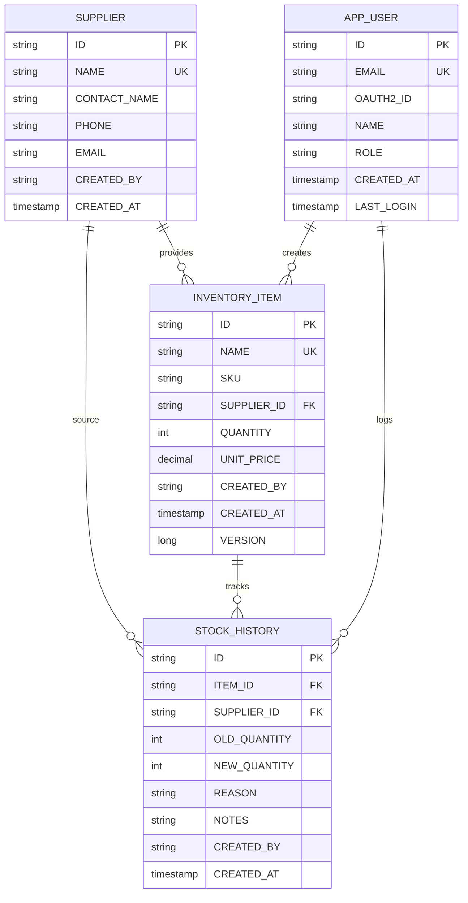

[⬅️ Back to Model Index](./index.md)

# Entity Relationships

The **Entity Relationships** describe how different domain entities connect and interact.

## Entity Relationship Diagram



## Relationship Types

### One-to-Many (1:M) Relationships

**Supplier → InventoryItem**
```
One supplier can provide many inventory items
SUPPLIER.ID (1) ──→ INVENTORY_ITEM.SUPPLIER_ID (M)
```
- One supplier supplies multiple products
- Query: "Get all items from ACME Corp"

**InventoryItem → StockHistory**
```
One inventory item has many stock changes
INVENTORY_ITEM.ID (1) ──→ STOCK_HISTORY.ITEM_ID (M)
```
- Each item has complete audit trail of changes
- Query: "Get stock change history for item X"

**AppUser → InventoryItem (Audit)**
```
One user creates many inventory items
APP_USER.ID (1) ──→ INVENTORY_ITEM.CREATED_BY (M)
```
- Tracks who created each item
- Query: "Show all items created by user Y"

**AppUser → StockHistory (Audit)**
```
One user creates many stock history entries
APP_USER.ID (1) ──→ STOCK_HISTORY.CREATED_BY (M)
```
- Tracks who made each stock change
- Query: "Show all changes made by user Z"

### Many-to-One (M:1) Relationships

**InventoryItem → Supplier** (inverse of 1:M above)
```
Many items belong to one supplier
INVENTORY_ITEM.SUPPLIER_ID → SUPPLIER.ID
```
- Every item must reference a supplier
- Foreign key constraint ensures referential integrity

**StockHistory → InventoryItem** (inverse of 1:M above)
```
Many stock changes tracked for one item
STOCK_HISTORY.ITEM_ID → INVENTORY_ITEM.ID
```
- Every stock change must reference an item
- Enables complete audit trail per item

## Relationship Cardinality

| Relationship | Supplier | InventoryItem | Notation |
|---|---|---|---|
| Supplier provides items | 1 | Many | 1:M |
| Item belongs to supplier | Many | 1 | M:1 |
| Item has history entries | 1 | Many | 1:M |
| History tracks item | Many | 1 | M:1 |

## Key Constraints

**Primary Keys (PK):**
- Every entity has unique ID (UUID)
- Uniquely identifies each record

**Foreign Keys (FK):**
- INVENTORY_ITEM.SUPPLIER_ID → SUPPLIER.ID
- STOCK_HISTORY.ITEM_ID → INVENTORY_ITEM.ID
- Enforces referential integrity

**Unique Keys (UK):**
- SUPPLIER.NAME - No duplicate supplier names
- INVENTORY_ITEM.NAME - No duplicate item names
- APP_USER.EMAIL - No duplicate user emails

---

[⬅️ Back to Model Index](./index.md)
