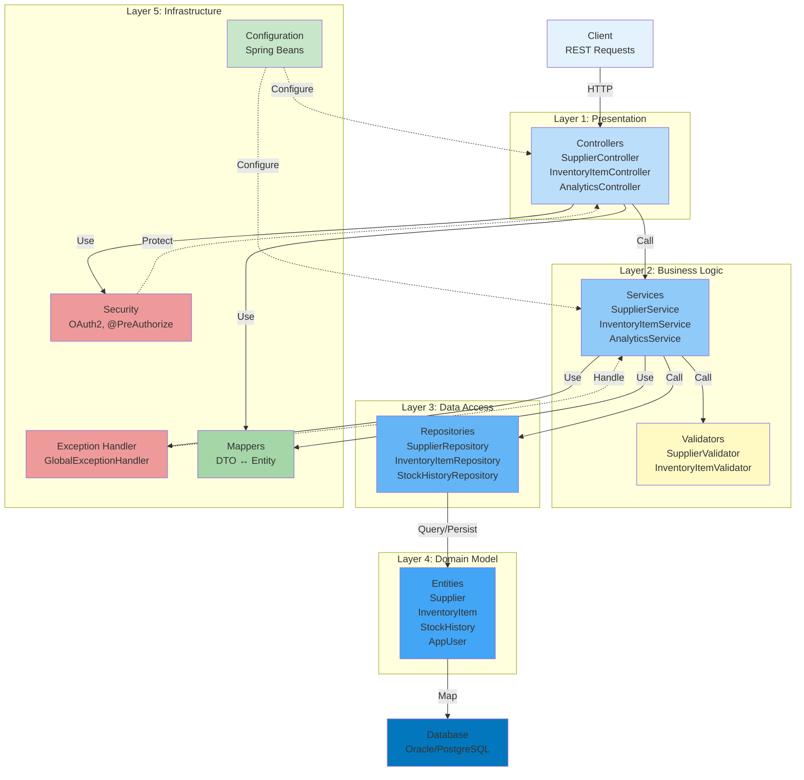

[⬅️ Back to Architecture Index](../index.html)

# Layers Architecture Overview

## Introduction

Smart Supply Pro's backend is organized into five distinct **logical layers**, each with specific responsibilities and clear separation of concerns. This layered architecture enables:

- **Maintainability:** Changes in one layer don't cascade to others
- **Testability:** Each layer can be tested independently with mocks
- **Scalability:** Layers can be scaled independently based on demand
- **Clarity:** Clear responsibility boundaries reduce cognitive overhead

## The Five Layers

### 1. **Controller Layer** (HTTP Entry Point)
**Location:** `src/main/java/.../controller/`

Handles all HTTP concerns: routing, request/response mapping, validation triggering, authorization checks.

**Key Components:**
- `SupplierController` - Supplier CRUD endpoints
- `InventoryItemController` - Inventory management
- `StockHistoryController` - Audit trail queries
- `AnalyticsController` - Reporting endpoints
- `AuthController` - OAuth2 callbacks

**Responsibilities:**
- [Route HTTP requests to handlers](./controller/routing.md)
- [Validate incoming DTOs](./controller/validation.md)
- [Check user authorization](./controller/authorization.md)
- [Convert HTTP ↔ DTOs](./controller/dto-conversion-inbound.md)
- [Build HTTP responses with proper status codes](./controller/response-building.md)

**Learn More:** [📄 Controller Layer](./controller/index.html)

---

### 2. **Service Layer** (Business Logic)
**Location:** `src/main/java/.../service/`

The business logic heart of the application. Services orchestrate complex operations, manage transactions, validate business rules, and handle domain logic.

**Key Services:**
- `SupplierService` - Supplier lifecycle management
- `InventoryItemService` - Item and stock tracking
- `StockHistoryService` - Audit trail management
- `AnalyticsService` - Business intelligence
- `CustomOAuth2UserService` - User authentication

**Responsibilities:**
- Execute business logic
- Manage transaction boundaries
- Coordinate data access across repositories
- Validate business rules
- Translate exceptions to HTTP status codes
- Transform between DTOs and entities

**Learn More:** [📄 Service Layer](./service-layer.html)

---

### 3. **Repository Layer** (Data Access)
**Location:** `src/main/java/.../repository/`

Abstracts database interactions behind repository interfaces. Built on Spring Data JPA, repositories provide CRUD operations and custom queries.

**Key Repositories:**
- `SupplierRepository` - Supplier data access
- `InventoryItemRepository` - Item persistence and queries
- `StockHistoryRepository` - Audit entry access
- `AppUserRepository` - User authentication data

**Responsibilities:**
- Encapsulate SQL/JPQL queries
- Manage entity persistence
- Handle pagination and sorting
- Provide query results to services
- Manage transaction boundaries with database

**Learn More:** [📄 Repository Layer](./repository-layer.html)

---

### 4. **Domain Model & Data Layer** (Entities)
**Location:** `src/main/java/.../model/` and `src/main/java/.../enums/`

Defines JPA entities that map to database tables. These are the core domain objects representing business concepts.

**Key Entities:**
- `Supplier` - Goods providers
- `InventoryItem` - Products in inventory
- `StockHistory` - Immutable audit trail
- `AppUser` - OAuth2 principals
- `Role` - Authorization levels
- `StockChangeReason` - Enumeration of change types

**Responsibilities:**
- Map database schema to Java objects
- Define entity relationships (foreign keys)
- Enforce data constraints (unique, not null)
- Track audit information (creator, timestamp)
- Support optimistic locking with version fields

**Learn More:** [📄 Domain Model & Data Layer](./model-layer.html)

---

### 5. **Infrastructure & Cross-Cutting Concerns** (Support Services)
**Location:** `src/main/java/.../config/`, `src/main/java/.../security/`, `src/main/java/.../validation/`, `src/main/java/.../exception/`, `src/main/java/.../mapper/`

Provides foundational services and handles concerns that span multiple layers.

**Key Components:**
- **[Security](./infrastructure/security.md):** OAuth2 authentication, authorization, `@PreAuthorize`
- **[Validation](./infrastructure/validation.md):** Custom validators for business rules
- **[Exception Handling](./infrastructure/exception-handling.md):** Global exception handler, error responses
- **[Data Mapping](./infrastructure/mapping.md):** DTO ↔ Entity converters
- **[Configuration](./infrastructure/configuration.md):** Spring beans, application properties

**Responsibilities:**
- Authenticate and authorize users
- Validate inputs across all layers
- Handle exceptions consistently
- Transform data between representations
- Configure Spring beans and properties

**Learn More:** [📄 Infrastructure & Cross-Cutting Concerns](./infrastructure/index.html)

---

## Layered Architecture Diagram



## Request Flow Through Layers

Here's how a typical request (creating a supplier) flows through all layers:

```
1. HTTP POST /api/suppliers
   Client → Network
   ↓
2. SupplierController.create(CreateSupplierDTO)
   - Receives JSON request body
   - @Valid validates DTO fields
   - @PreAuthorize("hasRole('ADMIN')") checks authorization
   ↓
3. SupplierService.create(CreateSupplierDTO)
   - SupplierValidator validates uniqueness
   - Converts DTO → Entity
   - Sets createdBy from SecurityContext
   ↓
4. SupplierRepository.save(Supplier)
   - Executes INSERT to SUPPLIER table
   - Handles primary key generation
   - Triggers database constraints
   ↓
5. Database executes INSERT
   - Validates UNIQUE constraint on NAME
   - Stores record in SUPPLIER table
   ↓
6. Repository returns saved entity
   - With generated ID
   ↓
7. Service converts Entity → DTO
   ↓
8. Controller builds HTTP response
   - Status: 201 CREATED
   - Body: SupplierDTO
   - Header: Location: /api/suppliers/{id}
   ↓
9. HTTP Response
   Client ← Network
```

## Layer Communication Patterns

### Downward Communication (Normal Flow)

Layers call the layer directly below them:

```
Controller → Service → Repository → Database
```

- Controllers delegate to services
- Services delegate to repositories
- Repositories delegate to database

### Upward Communication (Error Flow)

Exceptions propagate upward to be handled:

```
Database → Repository → Service → GlobalExceptionHandler → HTTP Response
```

- Database constraint violation
- Repository translates to domain exception
- Service lets exception propagate
- GlobalExceptionHandler catches and translates to HTTP response

### Cross-Layer Communication (Infrastructure)

Infrastructure components available to all layers:

```
All Layers ← Security, Validation, Exception Handling, Mapping, Configuration
```

## Benefits of Layered Architecture

### 1. **Separation of Concerns**
Each layer has one clear responsibility. You know where to look for specific code.

### 2. **Testability**
Each layer can be unit tested in isolation by mocking layers below it.

```java
// Test service without touching database
@ExtendWith(MockitoExtension.class)
class SupplierServiceTest {
    @Mock
    private SupplierRepository repository;
    
    @InjectMocks
    private SupplierService service;
    
    // Tests run without database
}
```

### 3. **Maintainability**
Changes in one layer don't cascade to others. Update database schema without touching services.

### 4. **Scalability**
Layers can be scaled independently. Cache the service layer, scale the database tier separately.

### 5. **Clarity**
New developers quickly understand where to add new features.

## Dependency Rules

**Key Principle:** Never skip layers or call downward incorrectly.

```
✅ Correct Dependencies:
  Controller → Service → Repository → Database
  
❌ Incorrect Dependencies:
  Controller → Repository (skips service logic)
  Repository → Controller (upward communication)
  Service → Service (cross-service dependencies)
```

## Layer Decision Flow

When adding a new feature, ask:

```
1. Is it HTTP concern? → Controller
2. Is it business logic? → Service
3. Is it data access? → Repository
4. Is it domain model? → Entity
5. Is it cross-cutting? → Infrastructure
```

## Files in This Directory

| File | Purpose | Audience |
|------|---------|----------|
| [controller-layer.html](./controller-layer.html) | HTTP API handling | API developers, Controllers |
| [service-layer.html](./service-layer.html) | Business logic | Feature developers, Services |
| [repository-layer.html](./repository-layer.html) | Data persistence | Database developers, Queries |
| [model-layer.html](./model-layer.html) | Domain entities | Data modelers, Entity authors |
| [infrastructure/index.html](./infrastructure/index.html) | Cross-cutting concerns | All developers, Security/Exceptions |

## Quick Navigation

**By Role:**

- **Backend Developer:** Start with [Service Layer](./service-layer.html) → [Controller Layer](./controller-layer.html)
- **Database Developer:** Focus on [Repository Layer](./repository-layer.html) → [Model Layer](./model-layer.html)
- **Security Engineer:** Review [Infrastructure Layer](./infrastructure/index.html)
- **DevOps/Infrastructure:** Check [Infrastructure Layer](./infrastructure/index.html) configuration

**By Activity:**

- **Adding a new endpoint:** [Controller Layer](./controller-layer.html) → [Service Layer](./service-layer.html)
- **Implementing business logic:** [Service Layer](./service-layer.html) → [Repository Layer](./repository-layer.html)
- **Working with data:** [Model Layer](./model-layer.html) → [Repository Layer](./repository-layer.html)
- **Fixing exceptions:** [Exception Handling](./infrastructure/exception-handling.html)
- **Adding validation:** [Validation](./infrastructure/validation.html) or [Service Layer](./service-layer.html)

---

[⬅️ Back to Architecture Index](../index.html)
