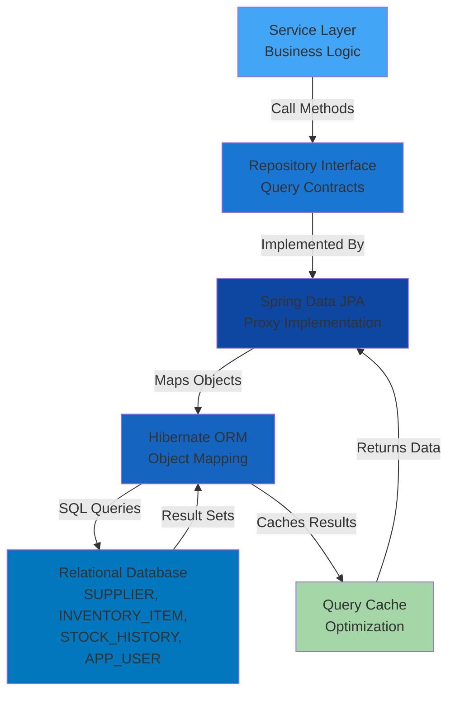
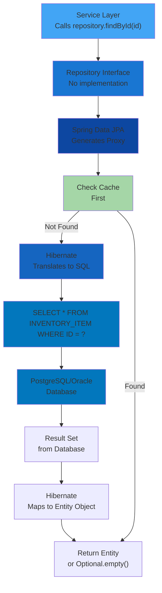
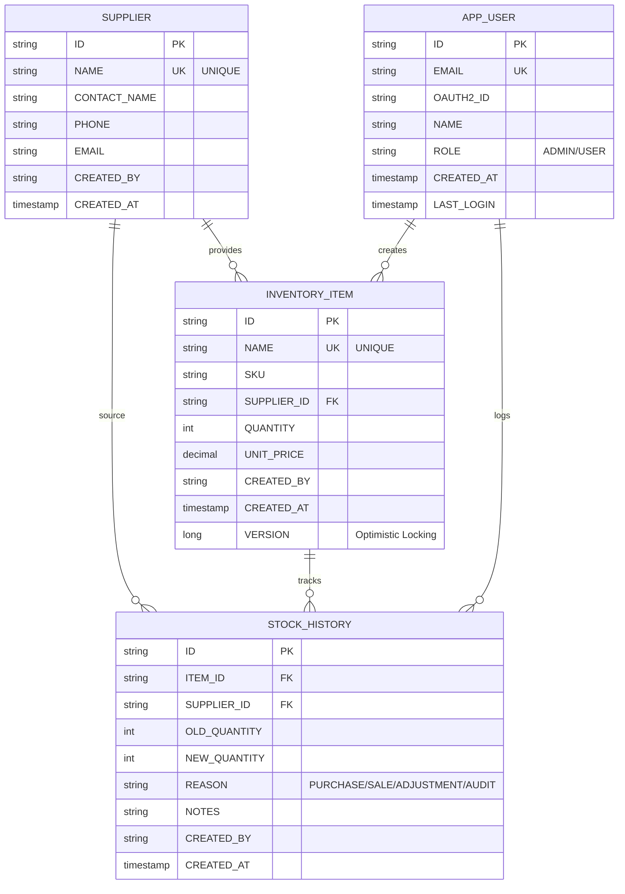

[⬅️ Back to Layers Overview](./overview.html)

# Repository Layer

## Overview

The **Repository Layer** encapsulates all data access logic and serves as the abstraction between the domain (services) and the persistence mechanism (database). Using Spring Data JPA, repositories provide a clean interface for CRUD operations, custom queries, and pagination while hiding database-specific implementation details.

**Location:** `src/main/java/com/smartsupplypro/inventory/repository/`

**Responsibility:** Data access, query operations, transaction boundaries with database

## Architecture



## Core Repositories

### SupplierRepository

**Purpose:** Data access for Supplier entities

**Interface Methods:**
```java
// Basic CRUD - provided by CrudRepository
Optional<Supplier> findById(String id);
Supplier save(Supplier entity);
void deleteById(String id);

// Spring Data derived queries
boolean existsByNameIgnoreCase(String name);
Optional<Supplier> findByNameIgnoreCase(String name);
List<Supplier> findByNameContainingIgnoreCase(String name);
```

**Database Table:** `SUPPLIER`
- ID (PK) - Unique identifier
- NAME (UNIQUE) - Supplier name
- CONTACT_NAME - Contact person
- PHONE, EMAIL - Contact info
- CREATED_BY, CREATED_AT - Audit fields

**Key Queries:**
- Find all suppliers - Used for listings
- Search by name - Used for search endpoints
- Check uniqueness - Validates before create/update
- Count - Used for KPIs in analytics

### InventoryItemRepository

**Purpose:** Data access for InventoryItem entities with advanced search

**Interface Methods:**
```java
// Basic CRUD
Optional<InventoryItem> findById(String id);
InventoryItem save(InventoryItem entity);
void deleteById(String id);

// Search and filtering
List<InventoryItem> findByNameContainingIgnoreCase(String name, Pageable pageable);
List<InventoryItem> findBySupplierIdOrderByNameAsc(String supplierId, Pageable pageable);
List<InventoryItem> findBySupplierId(String supplierId);

// Uniqueness checks
boolean existsByNameIgnoreCase(String name);
Optional<InventoryItem> findByNameIgnoreCase(String name);

// Custom queries
@Query("SELECT i FROM InventoryItem i WHERE i.quantity < :threshold")
List<InventoryItem> findLowStockItems(int threshold);
```

**Database Table:** `INVENTORY_ITEM`
- ID (PK) - Unique identifier
- NAME (UNIQUE) - Item name
- SKU - Stock keeping unit
- SUPPLIER_ID (FK) - Links to SUPPLIER
- QUANTITY - Current stock
- UNIT_PRICE - Cost per unit
- CREATED_BY, CREATED_AT - Audit fields
- VERSION - Optimistic locking

**Key Features:**
- Pagination support for large result sets
- Case-insensitive search
- Filtering by supplier
- Optimistic locking with version field

### StockHistoryRepository

**Purpose:** Data access for StockHistory audit trail

**Interface Methods:**
```java
// Basic CRUD
StockHistory save(StockHistory entity);

// Query by item
List<StockHistory> findByItemIdOrderByCreatedAtDesc(String itemId, Pageable pageable);

// Time-based queries
List<StockHistory> findByCreatedAtBetween(LocalDateTime start, LocalDateTime end, Pageable pageable);

// Filtering
List<StockHistory> findByReasonOrderByCreatedAtDesc(StockChangeReason reason);

// Custom aggregation
@Query("SELECT sh FROM StockHistory sh WHERE sh.itemId = :itemId ORDER BY sh.createdAt DESC")
List<StockHistory> findItemHistory(String itemId, Pageable pageable);
```

**Database Table:** `STOCK_HISTORY`
- ID (PK) - Entry identifier
- ITEM_ID (FK) - Links to INVENTORY_ITEM
- SUPPLIER_ID (FK) - Links to SUPPLIER (for reporting)
- OLD_QUANTITY - Previous quantity
- NEW_QUANTITY - Updated quantity
- REASON - Why changed (PURCHASE, SALE, ADJUSTMENT, AUDIT)
- NOTES - Additional details
- CREATED_BY, CREATED_AT - Who/when

**Key Features:**
- Immutable entries (create-only, no update/delete)
- Complete audit trail with reason
- Time-based filtering
- Supplier cross-reference for analytics

### AppUserRepository

**Purpose:** Data access for AppUser entities (OAuth2 principals)

**Interface Methods:**
```java
Optional<AppUser> findByEmail(String email);
Optional<AppUser> findByOAuth2Id(String oauth2Id);
AppUser save(AppUser entity);
boolean existsByEmail(String email);
```

**Database Table:** `APP_USER`
- ID (PK) - User identifier
- EMAIL - Unique email
- OAUTH2_ID - OAuth2 provider identifier
- NAME - Display name
- ROLE - User role (ADMIN, USER)
- CREATED_AT, LAST_LOGIN - Timestamps

## Spring Data JPA Features

### 1. **Derived Query Methods**

Spring Data generates queries from method names:

```java
// Spring Data generates SQL from method name
// SELECT * FROM SUPPLIER WHERE NAME = ? (case-insensitive)
Optional<Supplier> findByNameIgnoreCase(String name);

// SELECT * FROM INVENTORY_ITEM WHERE NAME LIKE ? AND SUPPLIER_ID = ?
List<InventoryItem> findByNameContainingIgnoreCaseAndSupplierId(String name, String supplierId);

// SELECT * FROM STOCK_HISTORY WHERE REASON = ? ORDER BY CREATED_AT DESC
List<StockHistory> findByReasonOrderByCreatedAtDesc(StockChangeReason reason);
```

**Query Syntax:**
- `findBy[Property]` - Exact match
- `findBy[Property]Containing` - LIKE search (partial match)
- `findBy[Property]IgnoreCase` - Case-insensitive
- `OrderBy[Property]Asc/Desc` - Sort results
- `existsBy[Property]` - Boolean check

### 2. **Custom Queries with @Query**

For complex queries, use `@Query` annotation with JPQL (HQL):

```java
@Repository
public interface InventoryItemRepository extends JpaRepository<InventoryItem, String> {
    
    // Custom JPQL query
    @Query("SELECT i FROM InventoryItem i WHERE i.quantity < :threshold")
    List<InventoryItem> findLowStockItems(@Param("threshold") int threshold);
    
    // Native SQL for complex logic
    @Query(value = "SELECT i.* FROM INVENTORY_ITEM i " +
           "WHERE i.UNIT_PRICE * i.QUANTITY > :minValue " +
           "ORDER BY i.UNIT_PRICE * i.QUANTITY DESC", 
           nativeQuery = true)
    List<InventoryItem> findHighValueItems(@Param("minValue") BigDecimal minValue);
    
    // With pagination
    @Query("SELECT i FROM InventoryItem i WHERE i.supplierId = :supplierId")
    Page<InventoryItem> findBySupplier(@Param("supplierId") String supplierId, Pageable pageable);
}
```

### 3. **Pagination and Sorting**

Handle large result sets with Spring's `Pageable`:

```java
// Method signature
List<InventoryItem> findAll(Pageable pageable);

// Service layer usage
Pageable pageable = PageRequest.of(0, 20, Sort.by("name").ascending());
List<InventoryItem> items = repository.findAll(pageable);

// Returns only 20 records starting at offset 0, sorted by name
```

**Benefits:**
- Reduces memory consumption
- Improves response time
- Client controls page size and sort order
- Database handles offset/limit efficiently

### 4. **Relationships and Cascading**

Repositories manage entity relationships:

```java
// InventoryItem references Supplier via foreign key
@Entity
public class InventoryItem {
    @ManyToOne(fetch = FetchType.EAGER)
    @JoinColumn(name = "SUPPLIER_ID")
    private Supplier supplier;
}

// Repository can filter by supplier
List<InventoryItem> findBySupplierId(String supplierId);

// Or fetch related entity along with item
@Query("SELECT i FROM InventoryItem i JOIN FETCH i.supplier WHERE i.id = :id")
Optional<InventoryItem> findByIdWithSupplier(@Param("id") String id);
```

### 5. **Optimistic Locking**

Prevents concurrent modification conflicts:

```java
@Entity
public class InventoryItem {
    @Id
    private String id;
    
    @Version  // Incremented on each update
    private Long version;
    
    private int quantity;
}

// Repository automatically handles versioning
// Update fails if another thread modified the record
InventoryItem item = repository.findById(id).orElseThrow();
item.setQuantity(100);
repository.save(item);  // Checks version before update
```

## Query Execution Flow



## Database Design

### Entity-Relationship Diagram



## Transaction Management

Repositories operate within service layer transactions:

```java
@Service
@RequiredArgsConstructor
public class InventoryItemServiceImpl {
    
    private final InventoryItemRepository itemRepository;
    private final StockHistoryRepository historyRepository;
    
    @Transactional  // Single transaction for entire method
    public InventoryItemDTO create(CreateInventoryItemDTO dto) {
        // Both saves in same transaction
        // Either both succeed or both rollback
        InventoryItem item = itemRepository.save(mapper.toEntity(dto));
        
        StockHistory history = new StockHistory();
        history.setItemId(item.getId());
        history.setOldQuantity(0);
        history.setNewQuantity(dto.getInitialQuantity());
        history.setReason(StockChangeReason.INITIAL);
        historyRepository.save(history);
        
        return mapper.toDTO(item);
    }
}
```

## Testing Repository Layer

Repositories are tested with `@DataJpaTest` and TestContainers:

```java
@DataJpaTest
class SupplierRepositoryTest {
    
    @Autowired
    private SupplierRepository repository;
    
    @Test
    void testFindByNameIgnoreCase() {
        // Arrange
        Supplier supplier = new Supplier("ACME Corp", ...);
        repository.save(supplier);
        
        // Act
        Optional<Supplier> found = repository.findByNameIgnoreCase("acme corp");
        
        // Assert
        assertTrue(found.isPresent());
        assertEquals("ACME Corp", found.get().getName());
    }
    
    @Test
    void testExistsByNameIgnoreCase() {
        // Arrange
        repository.save(new Supplier("ACME Corp", ...));
        
        // Act & Assert
        assertTrue(repository.existsByNameIgnoreCase("acme corp"));
        assertFalse(repository.existsByNameIgnoreCase("other"));
    }
}
```

## Performance Considerations

### 1. **N+1 Query Problem**

Be careful with lazy loading relationships:

```java
// ❌ Bad - Results in N+1 queries
List<InventoryItem> items = repository.findAll();
for (InventoryItem item : items) {
    System.out.println(item.getSupplier().getName());  // N additional queries!
}

// ✅ Good - Eager fetch with JOIN FETCH
@Query("SELECT i FROM InventoryItem i JOIN FETCH i.supplier")
List<InventoryItem> findAllWithSupplier();
```

### 2. **Pagination**

Always use pagination for large result sets:

```java
// ❌ Bad - Loads all records into memory
List<InventoryItem> items = repository.findAll();

// ✅ Good - Only loads one page
Pageable pageable = PageRequest.of(0, 20);
Page<InventoryItem> page = repository.findAll(pageable);
```

### 3. **Index Strategy**

Database indexes on frequently queried columns:

```java
// SUPPLIER.NAME indexed for search
@Index(name = "idx_supplier_name", columnList = "NAME")
@Table(name = "SUPPLIER")
public class Supplier { ... }

// INVENTORY_ITEM.SUPPLIER_ID indexed for joins
@Index(name = "idx_item_supplier", columnList = "SUPPLIER_ID")
@Table(name = "INVENTORY_ITEM")
public class InventoryItem { ... }
```

## Integration with Other Layers

```
Service Layer (uses repositories)
       ↓
REPOSITORY LAYER (You are here)
       ↓
Hibernate ORM
       ↓
Database
```

**Key Integration Points:**
1. **Services** call repository methods and handle returned entities
2. **Repositories** abstract database details from services
3. **Entities** mapped to database tables by Hibernate
4. **Transactions** managed by Spring at service layer

## Best Practices

### 1. **Extend JpaRepository**
Always extend `JpaRepository` for standard CRUD methods:

```java
// ✅ Good
public interface SupplierRepository extends JpaRepository<Supplier, String> {
    // Custom methods here
}

// ❌ Bad - Missing CRUD methods
public interface SupplierRepository extends Repository<Supplier, String> {
    // Must manually declare CRUD
}
```

### 2. **Use Derived Queries First**
Use method name queries before `@Query`:

```java
// ✅ Good - Clear and maintainable
Optional<Supplier> findByNameIgnoreCase(String name);

// ❌ Bad - Overengineered
@Query("SELECT s FROM Supplier s WHERE LOWER(s.name) = LOWER(:name)")
Optional<Supplier> findByName(@Param("name") String name);
```

### 3. **Custom Queries for Complex Logic**
Use `@Query` only when derived queries aren't sufficient:

```java
// ✅ Good - Necessary complexity
@Query("SELECT i FROM InventoryItem i WHERE i.quantity * i.unitPrice > :value")
List<InventoryItem> findHighValueItems(@Param("value") BigDecimal value);

// ❌ Bad - Simple query overcomplicates with @Query
@Query("SELECT s FROM Supplier s WHERE s.name = :name")
Optional<Supplier> findByName(@Param("name") String name);
```

### 4. **Test Database Queries**
Always test repository queries with actual database:

```java
@DataJpaTest  // Loads only JPA components
class SupplierRepositoryTest {
    // Tests run against test database (H2, TestContainers, etc)
}
```

### 5. **Handle Optional Properly**
Always unwrap Optional safely:

```java
// ✅ Good - Handles missing case
Optional<Supplier> supplier = repository.findById(id);
return supplier.map(mapper::toDTO)
    .orElseThrow(() -> new NoSuchElementException("Not found"));

// ❌ Bad - NPE risk
Supplier supplier = repository.findById(id).get();
```

---

[⬅️ Back to Layers Overview](./overview.html)
