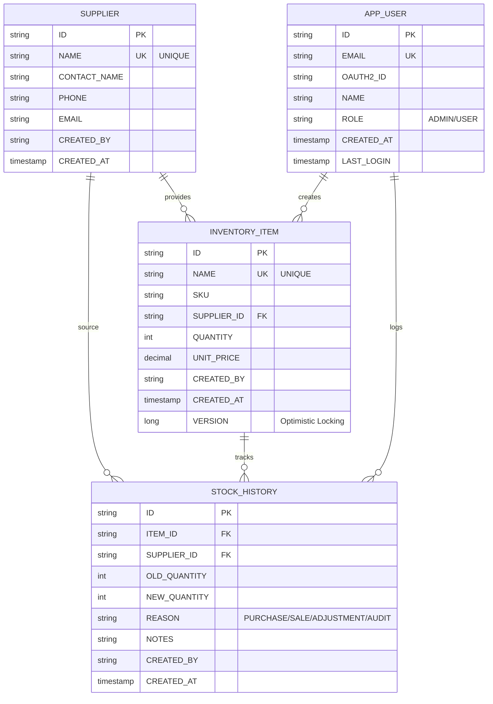

[⬅️ Back to Layers Overview](./index.md)

# Database Design

## Entity-Relationship Diagram



## Table Schemas

### SUPPLIER Table
```sql
CREATE TABLE SUPPLIER (
    ID VARCHAR(36) PRIMARY KEY,
    NAME VARCHAR(255) NOT NULL UNIQUE,
    CONTACT_NAME VARCHAR(255),
    PHONE VARCHAR(20),
    EMAIL VARCHAR(255),
    CREATED_BY VARCHAR(255) NOT NULL,
    CREATED_AT TIMESTAMP NOT NULL,
    
    KEY idx_supplier_name (NAME)
);
```

### INVENTORY_ITEM Table
```sql
CREATE TABLE INVENTORY_ITEM (
    ID VARCHAR(36) PRIMARY KEY,
    NAME VARCHAR(255) NOT NULL UNIQUE,
    SKU VARCHAR(100),
    SUPPLIER_ID VARCHAR(36) NOT NULL,
    QUANTITY INT NOT NULL DEFAULT 0,
    UNIT_PRICE DECIMAL(10, 2) NOT NULL,
    CREATED_BY VARCHAR(255) NOT NULL,
    CREATED_AT TIMESTAMP NOT NULL,
    VERSION BIGINT DEFAULT 0,
    
    CONSTRAINT fk_item_supplier FOREIGN KEY (SUPPLIER_ID) REFERENCES SUPPLIER(ID),
    KEY idx_item_supplier (SUPPLIER_ID),
    KEY idx_item_quantity (QUANTITY)
);
```

### STOCK_HISTORY Table
```sql
CREATE TABLE STOCK_HISTORY (
    ID VARCHAR(36) PRIMARY KEY,
    ITEM_ID VARCHAR(36) NOT NULL,
    SUPPLIER_ID VARCHAR(36) NOT NULL,
    OLD_QUANTITY INT,
    NEW_QUANTITY INT NOT NULL,
    REASON VARCHAR(50) NOT NULL,
    NOTES TEXT,
    CREATED_BY VARCHAR(255) NOT NULL,
    CREATED_AT TIMESTAMP NOT NULL,
    
    CONSTRAINT fk_history_item FOREIGN KEY (ITEM_ID) REFERENCES INVENTORY_ITEM(ID),
    CONSTRAINT fk_history_supplier FOREIGN KEY (SUPPLIER_ID) REFERENCES SUPPLIER(ID),
    KEY idx_history_item (ITEM_ID),
    KEY idx_history_supplier (SUPPLIER_ID),
    KEY idx_history_date (CREATED_AT),
    KEY idx_history_reason (REASON)
);
```

### APP_USER Table
```sql
CREATE TABLE APP_USER (
    ID VARCHAR(36) PRIMARY KEY,
    EMAIL VARCHAR(255) NOT NULL UNIQUE,
    OAUTH2_ID VARCHAR(255),
    NAME VARCHAR(255),
    ROLE VARCHAR(20) NOT NULL DEFAULT 'USER',
    CREATED_AT TIMESTAMP NOT NULL,
    LAST_LOGIN TIMESTAMP,
    
    KEY idx_user_email (EMAIL),
    KEY idx_user_oauth2 (OAUTH2_ID)
);
```

## Key Relationships

### Supplier → InventoryItem (1:M)
- One supplier can have many items
- Deletion: Constraint prevents deletion if items exist
- Querying: Find all items from supplier

### InventoryItem → StockHistory (1:M)
- One item can have many history entries
- Deletion: Constraint prevents deletion if history exists
- Querying: Get complete movement history

### Supplier → StockHistory (1:M via denormalization)
- Supplier ID stored in stock history for reporting
- Allows analytics without complex joins
- Maintains referential integrity with foreign key

### AppUser → InventoryItem/StockHistory (1:M)
- Audit trail: tracks who made changes
- Querying: Find all changes by user
- Reporting: Activity by user

## Constraints

### Primary Keys
- All tables use UUID primary keys
- Ensures unique identification across systems
- Supports distributed databases

### Unique Constraints
- SUPPLIER.NAME - No duplicate suppliers
- INVENTORY_ITEM.NAME - No duplicate items
- APP_USER.EMAIL - Each user has unique email

### Foreign Keys
- INVENTORY_ITEM.SUPPLIER_ID → SUPPLIER.ID
- STOCK_HISTORY.ITEM_ID → INVENTORY_ITEM.ID
- STOCK_HISTORY.SUPPLIER_ID → SUPPLIER.ID
- Ensures data consistency
- Prevents orphaned records

### Not Null Constraints
Required fields enforced at database level:
- SUPPLIER.NAME, CREATED_BY, CREATED_AT
- INVENTORY_ITEM.NAME, QUANTITY, UNIT_PRICE, CREATED_BY, CREATED_AT
- STOCK_HISTORY.ITEM_ID, NEW_QUANTITY, REASON, CREATED_BY, CREATED_AT

---

[⬅️ Back to Layers Overview](./index.md)
