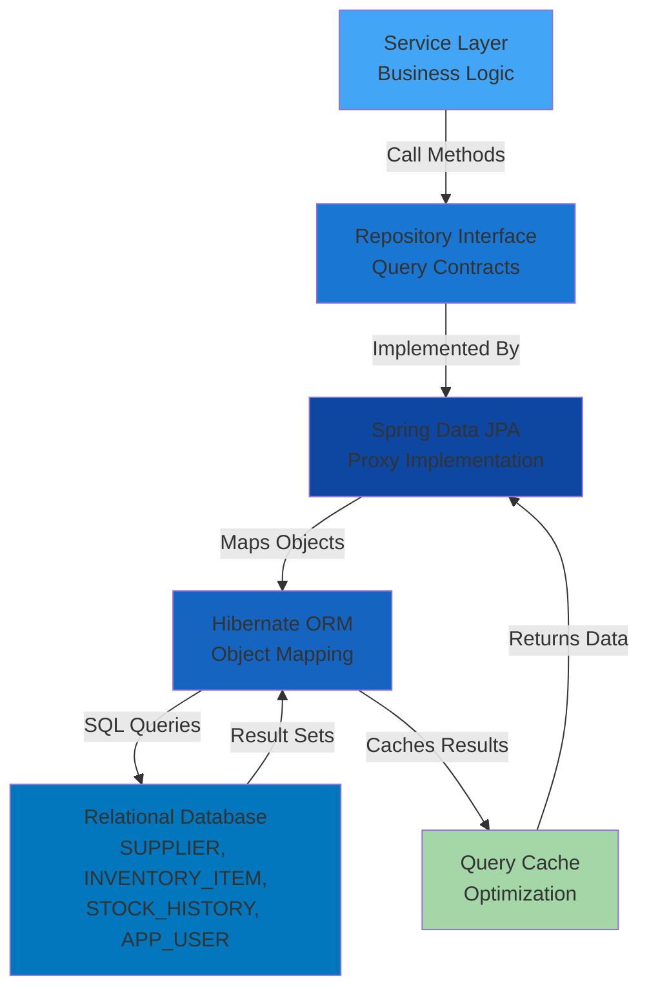

[⬅️ Back to Layers Overview](../index.html) | [⬅️ Back to Architecture](../overview.html)

# Repository Layer

## Overview

The **Repository Layer** encapsulates all data access logic and serves as the abstraction between the domain (services) and the persistence mechanism (database). Using Spring Data JPA, repositories provide a clean interface for CRUD operations, custom queries, and pagination while hiding database-specific implementation details.

**Location:** `src/main/java/com/smartsupplypro/inventory/repository/`

**Responsibility:** Data access, query operations, transaction boundaries with database

## Architecture

## Quick Navigation

### By Topic
- [**Core Repositories**](./supplier-repository.md) - Supplier, InventoryItem, StockHistory, AppUser
- [**Spring Data JPA Features**](./derived-queries.md) - Query methods, custom queries, pagination
- [**Query Execution**](./query-execution.md) - How queries are processed
- [**Database Design**](./database-design.md) - ERD diagram and schema
- [**Transaction Management**](./transaction-management.md) - @Transactional patterns
- [**Testing**](./testing.md) - @DataJpaTest examples
- [**Performance**](./performance.md) - N+1 queries, pagination, indexing
- [**Integration**](./integration.md) - Interaction with service layer
- [**Best Practices**](./best-practices.md) - Repository design guidelines

### By Feature
- [Derived Queries](./derived-queries.md) - Method name-based queries
- [Custom Queries](./custom-queries.md) - @Query annotations
- [Pagination & Sorting](./pagination-sorting.md) - Pageable interface
- [Relationships & Cascading](./relationships-cascading.md) - Entity associations
- [Optimistic Locking](./optimistic-locking.md) - Concurrency control

### By Role
- **Developers** → Start with [Core Repositories](./supplier-repository.md) and [Derived Queries](./derived-queries.md)
- **QA/Testers** → See [Testing](./testing.md) for test patterns
- **DBAs** → Review [Database Design](./database-design.md) and [Performance](./performance.md)
- **Architects** → Check [Integration](./integration.md) for layer design
- **Code Reviewers** → Use [Best Practices](./best-practices.md) as checklist

## Core Repositories Overview

The repository layer includes four primary repositories:

1. **SupplierRepository** - Data access for suppliers
2. **InventoryItemRepository** - Data access for inventory items with advanced search
3. **StockHistoryRepository** - Data access for immutable audit trail
4. **AppUserRepository** - Data access for OAuth2 users

See [supplier-repository.md](./supplier-repository.md) for detailed documentation of each repository.

---

[⬅️ Back to Layers Overview](../index.html) | [⬅️ Back to Architecture](../overview.html)
