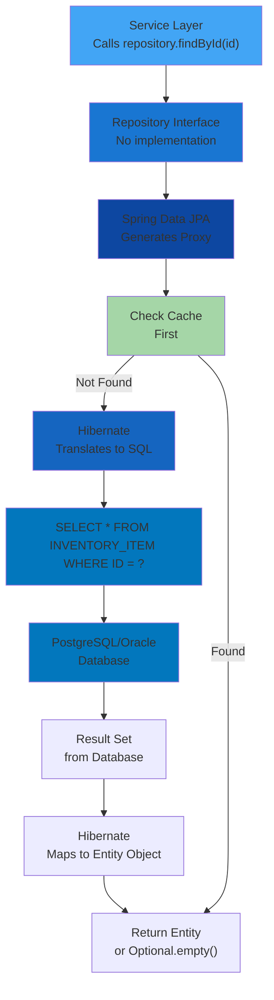

[⬅️ Back to Layers Overview](./index.md)

# Query Execution Flow

## Complete Execution Pipeline



## Step-by-Step Breakdown

### 1. Service Calls Repository
```java
@Service
public class InventoryItemServiceImpl {
    
    @Autowired
    private InventoryItemRepository repository;
    
    public InventoryItemDTO findById(String id) {
        Optional<InventoryItem> item = repository.findById(id);
        return item.map(mapper::toDTO).orElseThrow(...);
    }
}
```

### 2. Repository Interface
```java
@Repository
public interface InventoryItemRepository extends JpaRepository<InventoryItem, String> {
    // No implementation - Spring Data provides it
}
```

### 3. Spring Data JPA Proxy
Spring Data JPA creates a proxy at runtime that:
- Intercepts method calls
- Parses method names
- Generates appropriate SQL
- Manages transactions

### 4. Hibernate Translation
Hibernate converts to database-specific SQL:
```
Method: findById("item-123")
↓
Derived Query: SELECT * FROM INVENTORY_ITEM WHERE ID = ?
↓
Prepared Statement: SELECT * FROM INVENTORY_ITEM WHERE ID = ?
```

### 5. Database Execution
PostgreSQL/Oracle executes SQL and returns result set:
```
SELECT * FROM INVENTORY_ITEM WHERE ID = 'item-123'
→ Returns 1 row with columns: ID, NAME, QUANTITY, SUPPLIER_ID, etc.
```

### 6. Result Mapping
Hibernate maps ResultSet columns to entity fields:
```
ResultSet {
  ID: "item-123"
  NAME: "Component A"
  QUANTITY: 100
  SUPPLIER_ID: "supplier-1"
  ...
}
↓
InventoryItem {
  id: "item-123"
  name: "Component A"
  quantity: 100
  supplier: Supplier(id="supplier-1")
  ...
}
```

### 7. Return to Service
Entity returned as Optional, service unwraps:
```java
Optional<InventoryItem> item = repository.findById(id);
InventoryItem entity = item.orElseThrow(...);
```

## Query Caching

Queries may be cached at multiple levels:

### L1 Cache (Session/EntityManager)
```java
@Service
@Transactional  // Single persistence context
public class InventoryItemServiceImpl {
    
    public InventoryItemDTO getSameItemTwice(String id) {
        InventoryItem first = repository.findById(id).get();
        
        // Same query returns from L1 cache, no database hit
        InventoryItem second = repository.findById(id).get();
        
        return mapper.toDTO(first);  // Objects are same instance
    }
}
```

### L2 Cache (Configurable)
```java
@Entity
@Cacheable
@org.hibernate.annotations.Cache(usage = CacheConcurrencyStrategy.READ_ONLY)
public class Supplier {
    // Cached across sessions
}
```

### Query Result Cache
```java
@Entity
@NamedQuery(name = "Supplier.findByName",
    query = "SELECT s FROM Supplier s WHERE s.name = :name",
    hints = {
        @QueryHint(name = "org.hibernate.cacheable", value = "true")
    })
public class Supplier { ... }
```

## Transaction Boundaries

Queries execute within transaction context:

```java
@Service
@RequiredArgsConstructor
public class InventoryItemServiceImpl {
    
    private final InventoryItemRepository repository;
    
    @Transactional(readOnly = true)
    public List<InventoryItemDTO> findAll() {
        // Transaction starts
        List<InventoryItem> items = repository.findAll();
        // Lazy relationships can still load here
        // Transaction commits
        return items.stream()
            .map(mapper::toDTO)
            .collect(toList());
    }
    
    @Transactional  // Write transaction
    public InventoryItemDTO create(CreateInventoryItemDTO dto) {
        // Transaction starts
        InventoryItem item = mapper.toEntity(dto);
        InventoryItem saved = repository.save(item);
        // Transaction commits, changes persisted
        return mapper.toDTO(saved);
    }
}
```

---

[⬅️ Back to Layers Overview](./index.md)
