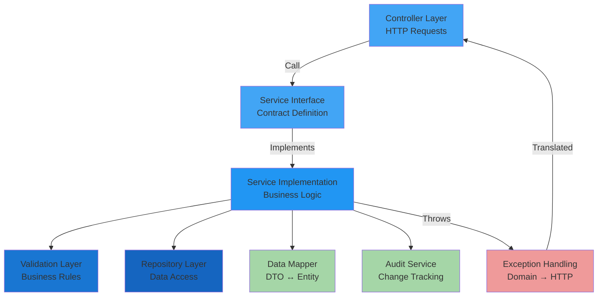
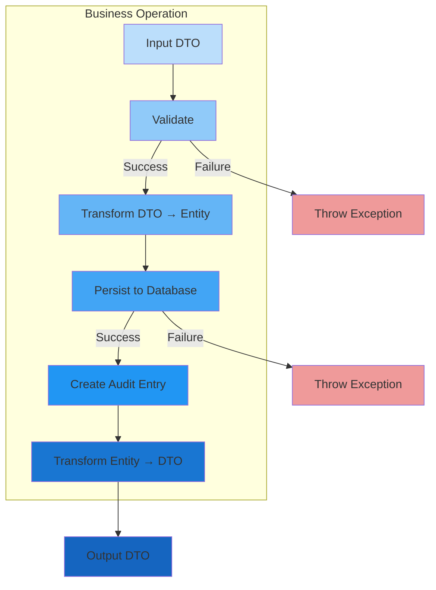

[⬅️ Back to Layers Overview](./overview.html)

# Service Layer

## Overview

The **Service Layer** contains all business logic and orchestrates operations across the application. Services handle transaction management, complex validation, exception translation, data transformation, and cross-cutting concerns. This layer acts as the core of business intelligence, translating domain requirements into executable operations.

**Location:** `src/main/java/com/smartsupplypro/inventory/service/`

**Responsibility:** Business logic execution, transaction boundaries, validation orchestration, exception translation

## Architecture



## Core Services

### SupplierService

**Purpose:** Manage supplier lifecycle (create, read, update, delete with validation)

**Key Responsibilities:**
- Create new suppliers with uniqueness validation
- Retrieve suppliers by ID or list all
- Search suppliers by name (partial matching)
- Update supplier information
- Delete suppliers with constraint validation (e.g., cannot delete if used in inventory)
- Count suppliers for KPIs

**Interface Methods:**
```java
List<SupplierDTO> findAll();
long countSuppliers();
Optional<SupplierDTO> findById(String id);
List<SupplierDTO> search(String name);
SupplierDTO create(CreateSupplierDTO dto);
SupplierDTO update(String id, UpdateSupplierDTO dto);
void delete(String id);
```

**Business Rules:**
1. Supplier names must be unique (case-insensitive)
2. All required fields (name, contact) must be provided
3. Supplier can only be deleted if no items are sourced from them
4. Update preserves audit fields (createdBy, createdAt)

**Exception Handling:**
- `DuplicateResourceException` (409) - Name already exists
- `NoSuchElementException` (404) - Supplier not found
- `IllegalStateException` (409) - Cannot delete (has items)

### InventoryItemService

**Purpose:** Manage inventory items with integrated stock tracking and auditing

**Key Responsibilities:**
- Create items with validation of supplier and uniqueness
- Retrieve items by ID or list with pagination
- Search items by name, SKU, or supplier
- Update item details (except stock, which goes through update-stock endpoint)
- Delete items from inventory
- Update stock quantity with reason tracking
- Calculate inventory metrics and analytics

**Interface Methods:**
```java
List<InventoryItemDTO> findAll(Pageable pageable);
Optional<InventoryItemDTO> findById(String id);
List<InventoryItemDTO> search(String query, Pageable pageable);
InventoryItemDTO create(CreateInventoryItemDTO dto);
InventoryItemDTO update(String id, UpdateInventoryItemDTO dto);
void delete(String id);
StockUpdateResultDTO updateStock(String id, int newQuantity, StockChangeReason reason, String notes);
```

**Business Rules:**
1. Item names must be unique within the system
2. Item must reference existing supplier
3. Stock quantity cannot be negative
4. Every stock change must have a reason (PURCHASE, SALE, ADJUSTMENT, AUDIT)
5. Initial stock creates audit entry automatically
6. Stock changes are immutable (create-only, no update/delete)

**Exception Handling:**
- `IllegalArgumentException` (400) - Invalid quantity or reason
- `NoSuchElementException` (404) - Item or supplier not found
- `DuplicateResourceException` (409) - Name already exists
- `IllegalStateException` (409) - Business rule violation

### StockHistoryService

**Purpose:** Log and query stock movement audit trail

**Key Responsibilities:**
- Create audit entries for stock changes
- Query stock history with filtering
- Generate stock movement reports
- Calculate inventory metrics from history

**Interface Methods:**
```java
StockHistoryDTO create(StockHistoryCreateDTO dto);
List<StockHistoryDTO> findByItemId(String itemId, Pageable pageable);
List<StockHistoryDTO> findAll(Pageable pageable);
StockMovementSummary getSummaryByPeriod(LocalDateTime from, LocalDateTime to);
```

**Business Rules:**
1. Stock history entries are immutable (create-only)
2. Every stock change must have reason and timestamp
3. Entries linked to both item and supplier for cross-reference
4. Historical data retained for compliance and analytics

### AnalyticsService

**Purpose:** Provide business intelligence and financial analysis

**Key Responsibilities:**
- Calculate dashboard KPIs (total items, suppliers, stock value)
- Compute financial metrics (total cost, weighted average cost - WAC)
- Analyze inventory trends (movement patterns, low stock)
- Generate price trends and seasonal analysis
- Calculate inventory turnover and efficiency metrics

**Interface Methods:**
```java
DashboardSummaryDTO getDashboardSummary();
FinancialSummaryDTO getFinancialSummary();
List<PriceTrendDTO> getPriceTrends(LocalDateTime from, LocalDateTime to);
List<LowStockItemDTO> getLowStockItems(int threshold);
List<MonthlyStockMovementDTO> getMonthlyMovements(String itemId);
```

**Calculation Patterns:**
- **WAC (Weighted Average Cost):** Total inventory cost / Total quantity = Average unit cost
- **Inventory Value:** Sum of (quantity × unit_cost) for all items
- **Turnover Rate:** Total sales / Average inventory value
- **Low Stock:** Items where current quantity < reorder point

**Exception Handling:**
- Returns empty results if no data available
- Handles date range validation gracefully

## Service Layer Patterns

### 1. **Dependency Injection**

All dependencies injected via constructor for testability:

```java
@Service
@RequiredArgsConstructor  // Lombok generates constructor
public class SupplierServiceImpl implements SupplierService {
    
    private final SupplierRepository repository;
    private final SupplierValidator validator;
    private final SupplierMapper mapper;
    
    // Constructor auto-generated by @RequiredArgsConstructor
}
```

### 2. **Transaction Management**

Business operations are transactional to ensure data consistency:

```java
@Service
@RequiredArgsConstructor
public class InventoryItemServiceImpl implements InventoryItemService {
    
    private final InventoryItemRepository itemRepository;
    private final StockHistoryService stockHistoryService;
    
    @Transactional  // Entire method is one transaction
    public InventoryItemDTO create(CreateInventoryItemDTO dto) {
        InventoryItem item = mapper.toEntity(dto);
        InventoryItem saved = itemRepository.save(item);
        
        // Create initial stock audit entry in same transaction
        stockHistoryService.logInitialStock(saved);
        
        return mapper.toDTO(saved);
    }
}
```

### 3. **Exception Translation**

Business exceptions mapped to appropriate HTTP status codes:

```java
@Service
public class SupplierServiceImpl implements SupplierService {
    
    public SupplierDTO create(CreateSupplierDTO dto) {
        // Throws IllegalStateException if duplicate
        validator.validateUniquenessOnCreate(dto.getName());
        
        // Exception caught by GlobalExceptionHandler
        // Mapped to HTTP 409 Conflict
        return mapper.toDTO(repository.save(mapper.toEntity(dto)));
    }
}
```

### 4. **Data Transformation (DTO ↔ Entity)**

Services convert between DTOs (API contracts) and entities (domain models):

```java
@Service
public class SupplierServiceImpl implements SupplierService {
    
    public SupplierDTO create(CreateSupplierDTO dto) {
        Supplier entity = mapper.toEntity(dto);  // DTO → Entity
        Supplier saved = repository.save(entity);
        return mapper.toDTO(saved);  // Entity → DTO
    }
}
```

### 5. **Validation Delegation**

Complex validation delegated to specialized validator classes:

```java
@Service
@RequiredArgsConstructor
public class SupplierServiceImpl implements SupplierService {
    
    private final SupplierValidator validator;
    
    public SupplierDTO create(CreateSupplierDTO dto) {
        validator.validateUniquenessOnCreate(dto.getName());
        validator.validateRequiredFields(dto);
        
        return mapper.toDTO(repository.save(mapper.toEntity(dto)));
    }
}
```

### 6. **Audit Logging**

Changes tracked through created_by and created_at fields:

```java
@Service
@RequiredArgsConstructor
public class InventoryItemServiceImpl implements InventoryItemService {
    
    @Transactional
    public InventoryItemDTO create(CreateInventoryItemDTO dto) {
        InventoryItem item = mapper.toEntity(dto);
        
        // Set audit fields from SecurityContext
        String currentUser = getCurrentUsername();
        item.setCreatedBy(currentUser);
        item.setCreatedAt(LocalDateTime.now());
        
        return mapper.toDTO(repository.save(item));
    }
    
    private String getCurrentUsername() {
        return SecurityContextHolder.getContext()
            .getAuthentication()
            .getName();
    }
}
```

## Service Interaction Diagram



## Cross-Cutting Concerns

### Exception Handling Strategy

Services throw domain exceptions, controller layer catches and translates:

```java
// Service throws domain exception
public SupplierDTO create(CreateSupplierDTO dto) {
    if (repository.existsByNameIgnoreCase(dto.getName())) {
        throw new IllegalStateException("Supplier exists");  // 409
    }
    return mapper.toDTO(repository.save(mapper.toEntity(dto)));
}

// GlobalExceptionHandler catches and translates
@ExceptionHandler(IllegalStateException.class)
public ResponseEntity<ErrorResponse> handleIllegalState(IllegalStateException ex) {
    return ResponseEntity.status(HttpStatus.CONFLICT)
        .body(new ErrorResponse("CONFLICT", ex.getMessage()));
}
```

### Logging

Services log important operations for debugging and compliance:

```java
@Service
@Slf4j
public class SupplierServiceImpl implements SupplierService {
    
    public SupplierDTO create(CreateSupplierDTO dto) {
        log.info("Creating supplier: {}", dto.getName());
        
        try {
            SupplierDTO result = doCreate(dto);
            log.info("Supplier created successfully: {}", result.getId());
            return result;
        } catch (Exception e) {
            log.error("Failed to create supplier", e);
            throw e;
        }
    }
}
```

## Testing Service Layer

Services are tested via unit tests with mocked repositories:

```java
@ExtendWith(MockitoExtension.class)
class SupplierServiceImplTest {
    
    @Mock
    private SupplierRepository repository;
    
    @Mock
    private SupplierValidator validator;
    
    @InjectMocks
    private SupplierServiceImpl service;
    
    @Test
    void testCreateDuplicate() {
        // Arrange
        doThrow(new IllegalStateException("Duplicate"))
            .when(validator).validateUniquenessOnCreate(any());
        
        // Act & Assert
        assertThrows(IllegalStateException.class, 
            () -> service.create(new CreateSupplierDTO(...)));
    }
}
```

## Integration with Other Layers

```
Controller Layer
       ↓
SERVICE LAYER (You are here)
  ├─ Validation Layer
  ├─ Repository Layer
  ├─ Data Mapper
  └─ Exception Translation
       ↓
Repository Layer
       ↓
Database
```

**Key Integration Points:**
1. **Controllers** call service methods and handle returned DTOs
2. **Validators** enforce business rules before persistence
3. **Repositories** execute data access operations
4. **Mappers** transform between DTOs and entities
5. **Exceptions** thrown by services, caught by global handler

## Best Practices

### 1. **Keep Services Focused**
Each service handles one business domain:
- `SupplierService` - Suppliers only
- `InventoryItemService` - Inventory only
- `AnalyticsService` - Analytics only

### 2. **Dependency Injection**
Always use constructor injection, never `new` keyword:

```java
// ✅ Good
public SupplierServiceImpl(SupplierRepository repo) {
    this.repository = repo;
}

// ❌ Bad
this.repository = new SupplierRepository();
```

### 3. **Transactional Boundaries**
Mark all write operations with `@Transactional`:

```java
// ✅ Good - Transaction managed by Spring
@Transactional
public void delete(String id) { ... }

// ❌ Bad - No transaction
public void delete(String id) { ... }
```

### 4. **Let Exceptions Propagate**
Don't catch exceptions in services unless you need to transform them:

```java
// ✅ Good - Exception propagates to handler
public SupplierDTO findById(String id) {
    return repository.findById(id)
        .map(mapper::toDTO)
        .orElseThrow(() -> new NoSuchElementException("Not found"));
}

// ❌ Bad - Silently failing
public SupplierDTO findById(String id) {
    try {
        return repository.findById(id).map(mapper::toDTO).orElse(null);
    } catch (Exception e) {
        return null;  // Bad: loses error information
    }
}
```

### 5. **Validate Early**
Validate inputs before any persistence operations:

```java
// ✅ Good - Validate first
@Transactional
public SupplierDTO create(CreateSupplierDTO dto) {
    validator.validateUniquenessOnCreate(dto.getName());  // First
    return mapper.toDTO(repository.save(mapper.toEntity(dto)));  // Then
}

// ❌ Bad - Persistence first
@Transactional
public SupplierDTO create(CreateSupplierDTO dto) {
    SupplierDTO saved = mapper.toDTO(repository.save(mapper.toEntity(dto)));
    validator.validateUniquenessOnCreate(dto.getName());  // Too late
    return saved;
}
```

---

[⬅️ Back to Layers Overview](./overview.html)
