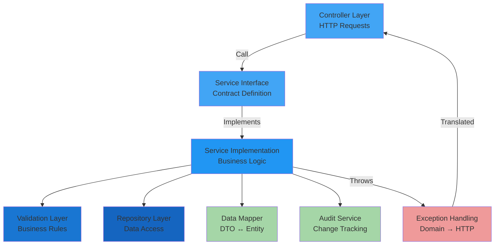

[⬅️ Back to Layers Overview](../index.html) | [⬅️ Back to Architecture](../overview.html)

# Service Layer

## Overview

The **Service Layer** contains all business logic and orchestrates operations across the application. Services handle transaction management, complex validation, exception translation, data transformation, and cross-cutting concerns. This layer acts as the core of business intelligence, translating domain requirements into executable operations.

**Location:** `src/main/java/com/smartsupplypro/inventory/service/`

**Responsibility:** Business logic execution, transaction boundaries, validation orchestration, exception translation

## Architecture

## Quick Navigation

### By Topic
- [**Core Services**](./supplier-service.md) - Supplier, InventoryItem, StockHistory, Analytics
- [**Service Patterns**](./service-patterns.md) - DI, Transactions, Exception Translation, DTOs, Validation, Audit
- [**Interaction Diagram**](./interaction-diagram.md) - Service operation flow visualization
- [**Cross-Cutting Concerns**](./cross-cutting-concerns.md) - Exception handling, logging strategies
- [**Testing**](./testing.md) - Unit test patterns with Mockito
- [**Integration**](./integration.md) - Interaction with other layers
- [**Best Practices**](./best-practices.md) - Service design guidelines

### By Role
- **Developers** → Start with [Core Services](./supplier-service.md) and [Service Patterns](./service-patterns.md)
- **QA/Testers** → See [Testing](./testing.md) for test patterns
- **Architects** → Review [Integration](./integration.md) for layer design
- **DevOps** → Check [Cross-Cutting Concerns](./cross-cutting-concerns.md) for logging/monitoring
- **Code Reviewers** → Use [Best Practices](./best-practices.md) as checklist

## Core Services Overview

The service layer includes four primary services:

1. **SupplierService** - Manage supplier lifecycle (create, read, update, delete)
2. **InventoryItemService** - Manage inventory items with integrated stock tracking
3. **StockHistoryService** - Log and query stock movement audit trail
4. **AnalyticsService** - Provide business intelligence and financial analysis

See [supplier-service.md](./supplier-service.md) for detailed documentation of each service.

## Service Patterns

Services use consistent patterns for dependency injection, transaction management, exception translation, and data transformation.

See [Service Patterns](./service-patterns.md) for detailed documentation:
- [Dependency Injection](./dependency-injection.md)
- [Transaction Management](./transaction-management.md)
- [Exception Translation](./exception-translation.md)
- [Data Transformation](./dto-transformation.md)
- [Validation Strategy](./validation-strategy.md)
- [Audit Logging](./audit-logging.md)

---

[⬅️ Back to Layers Overview](../index.html) | [⬅️ Back to Architecture](../overview.html)
