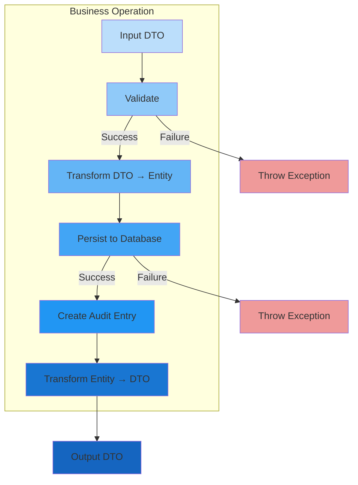

[⬅️ Back to Layers Overview](./index.md)

# Service Interaction Diagram

## Operation Flow

The following diagram illustrates how a typical business operation flows through the service layer:



## Step-by-Step Breakdown

### 1. Input DTO
Request arrives from controller with data transfer object:
```java
CreateSupplierDTO dto = new CreateSupplierDTO();
dto.setName("TechCorp");
dto.setContactName("John Doe");
```

### 2. Validate
Specialized validators check business rules before any persistence:
```java
validator.validateRequiredFields(dto);
validator.validateUniquenessOnCreate(dto.getName());
// Throws exception if validation fails
```

### 3. Transform DTO → Entity
Mapper converts API contract to domain model:
```java
Supplier entity = mapper.toEntity(dto);
// Result: Supplier with name="TechCorp", contactName="John Doe"
```

### 4. Persist to Database
Repository saves entity and returns with generated ID:
```java
Supplier saved = repository.save(entity);
// Result: Supplier with id="uuid-123", all fields populated
```

### 5. Create Audit Entry
Optional: Create related audit records (like stock history):
```java
stockHistoryService.logInitialStock(saved);
// Creates StockHistory entry linked to item
```

### 6. Transform Entity → DTO
Mapper converts persisted entity back to API response:
```java
SupplierDTO result = mapper.toDTO(saved);
// Result: SupplierDTO with all fields and audit timestamps
```

### 7. Return to Client
DTO returned with HTTP 200 OK:
```json
HTTP/1.1 201 Created
Content-Type: application/json

{
  "id": "uuid-123",
  "name": "TechCorp",
  "contactName": "John Doe",
  "createdBy": "admin",
  "createdAt": "2025-01-15T10:30:00"
}
```

## Example: Create Supplier

Complete example of a supplier creation operation:

```java
// 1. Controller receives request
@PostMapping
public ResponseEntity<SupplierDTO> create(
        @RequestBody CreateSupplierDTO dto) {
    SupplierDTO result = service.create(dto);
    return ResponseEntity.status(HttpStatus.CREATED).body(result);
}

// 2. Service orchestrates the flow
@Service
@RequiredArgsConstructor
@Transactional
public class SupplierServiceImpl implements SupplierService {
    
    private final SupplierRepository repository;
    private final SupplierValidator validator;
    private final SupplierMapper mapper;
    
    public SupplierDTO create(CreateSupplierDTO dto) {
        // Step 1: Validate input
        validator.validateRequiredFields(dto);
        validator.validateUniquenessOnCreate(dto.getName());
        
        // Step 2: Transform DTO → Entity
        Supplier entity = mapper.toEntity(dto);
        
        // Step 3: Set audit fields
        entity.setCreatedBy(getCurrentUsername());
        entity.setCreatedAt(LocalDateTime.now());
        
        // Step 4: Persist to database
        Supplier saved = repository.save(entity);
        
        // Step 5: Transform Entity → DTO
        return mapper.toDTO(saved);
    }
    
    private String getCurrentUsername() {
        return SecurityContextHolder.getContext()
            .getAuthentication()
            .getName();
    }
}

// 3. Exception handler catches failures
@RestControllerAdvice
public class GlobalExceptionHandler {
    
    @ExceptionHandler(IllegalStateException.class)
    public ResponseEntity<ErrorResponse> handleDuplicate(
            IllegalStateException ex) {
        return ResponseEntity.status(HttpStatus.CONFLICT)
            .body(new ErrorResponse("CONFLICT", ex.getMessage()));
    }
}
```

## Example: Update Supplier

Update follows similar pattern with slight variations:

```java
@Service
@RequiredArgsConstructor
@Transactional
public class SupplierServiceImpl implements SupplierService {
    
    public SupplierDTO update(String id, UpdateSupplierDTO dto) {
        // Step 1: Retrieve existing entity
        Supplier entity = repository.findById(id)
            .orElseThrow(() -> new NoSuchElementException(
                "Supplier not found: " + id));
        
        // Step 2: Validate changes
        validator.validateUpdateFields(dto);
        
        // Step 3: Apply changes
        entity.setName(dto.getName());
        entity.setContactName(dto.getContactName());
        
        // Step 4: Update audit fields
        entity.setUpdatedBy(getCurrentUsername());
        entity.setUpdatedAt(LocalDateTime.now());
        
        // Step 5: Persist (implicit via @Transactional)
        // entity is already managed, changes auto-persisted
        
        // Step 6: Return DTO
        return mapper.toDTO(entity);
    }
}
```

## Example: Delete Supplier

Deletion includes constraint validation:

```java
@Service
@RequiredArgsConstructor
@Transactional
public class SupplierServiceImpl implements SupplierService {
    
    public void delete(String id) {
        // Step 1: Check if entity exists
        Supplier entity = repository.findById(id)
            .orElseThrow(() -> new NoSuchElementException(
                "Supplier not found: " + id));
        
        // Step 2: Validate deletion is allowed
        validator.validateDeletionAllowed(id);
        // Throws exception if items exist
        
        // Step 3: Delete from database
        repository.delete(entity);
        
        // No response DTO needed for DELETE
    }
}
```

## Layered Interaction

Complete view of service within architecture:

```
┌─────────────────────────────────────┐
│     Controller Layer                 │
│  (HTTP Requests/Responses)           │
└────────────┬────────────────────────┘
             │
             │ Calls Service
             ↓
┌─────────────────────────────────────┐
│     SERVICE LAYER                    │
│  ┌─────────────────────────────────┐ │
│  │ 1. Input DTO                    │ │
│  ├─────────────────────────────────┤ │
│  │ 2. Validation                   │ │
│  ├─────────────────────────────────┤ │
│  │ 3. DTO → Entity Transform       │ │
│  ├─────────────────────────────────┤ │
│  │ 4. Business Logic               │ │
│  ├─────────────────────────────────┤ │
│  │ 5. Audit Logging                │ │
│  ├─────────────────────────────────┤ │
│  │ 6. Entity → DTO Transform       │ │
│  └─────────────────────────────────┘ │
└────────────┬────────────────────────┘
             │
             │ Calls Repository
             ↓
┌─────────────────────────────────────┐
│     Repository Layer                 │
│  (JPA/Database Operations)           │
└─────────────────────────────────────┘
```

---

[⬅️ Back to Layers Overview](./index.md)
