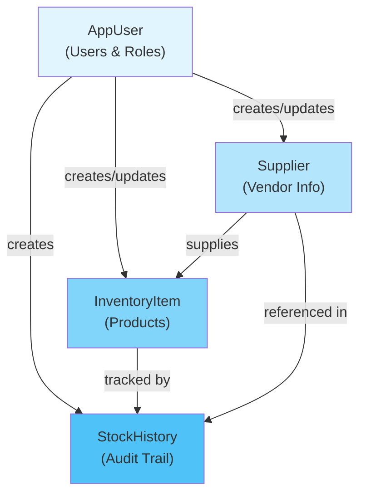

[⬅️ Back to Architecture Index](../index.html)

# Data Models & Entities

## Overview

This section documents all domain entities (JPA entities) that form the core of the Smart Supply Pro data model. These entities represent the business domain: suppliers, inventory items, stock movements, and users. All entities follow consistent patterns for auditing, persistence, and relationships.

**Fundamental Principle:** Entities are internal domain models, never exposed directly in APIs. DTOs serve as the boundary between entities and REST API contracts.

---

## Entity Architecture



---

## Quick Navigation

| Entity | Purpose | Related Enum | Documentation |
|--------|---------|--------------|---------------|
| **[Supplier](./supplier.html)** | Vendor/supplier information | - | Supplier entity with contact details |
| **[InventoryItem](./inventory-item.html)** | Product inventory with stock tracking | - | Item management with quantity and pricing |
| **[StockHistory](./stock-history.html)** | Audit trail of stock movements | StockChangeReason | Immutable history records |
| **[AppUser](./app-user.html)** | User accounts and OAuth2 authentication | Role | User management and authorization |

---

## Core Concepts

### 1. Entity vs DTO Pattern

**Entity (Domain Model):**
- Internal representation of business domain
- Used only in repository and service layers
- Contains all fields including computed/derived
- Persisted in database as-is

**DTO (Data Transfer Object):**
- API contract boundary
- What clients send in requests
- What clients receive in responses
- Selected fields only (no sensitive data)

**Flow:**
```
API Request (JSON)
    ↓
DTO validation (@Valid)
    ↓
Mapper: DTO → Entity
    ↓
Service layer (business logic)
    ↓
Entity persistence (JPA)
    ↓
Repository: Entity → DTO
    ↓
Mapper: Entity → DTO
    ↓
API Response (JSON)
```

### 2. Audit Trail Pattern

All entities include audit metadata:

```java
@Column(name="CREATED_BY", nullable=false)
private String createdBy;           // Who created

@Column(name="CREATED_AT", nullable=false)
@CreationTimestamp
private LocalDateTime createdAt;    // When created
```

**Why:**
- Compliance and regulatory requirements
- Accountability and change tracking
- Debugging and issue investigation
- Historical analysis

### 3. Lombok Annotations

All entities use Lombok for boilerplate reduction:

| Annotation | Purpose |
|-----------|---------|
| `@Data` | Generates getters, setters, toString, equals, hashCode |
| `@Builder` | Fluent builder pattern for object creation |
| `@NoArgsConstructor` | Default constructor (required by JPA) |
| `@AllArgsConstructor` | Constructor with all fields |

### 4. JPA Best Practices

**@ManyToOne Relationships:**
```java
@ManyToOne(fetch = FetchType.LAZY)
@JoinColumn(name = "SUPPLIER_ID", insertable = false, updatable = false)
private Supplier supplier;
```

- `FetchType.LAZY` - Don't load related entity unless explicitly accessed
- `insertable=false, updatable=false` - Foreign key managed separately
- Prevents N+1 query problems

**Indexes for Performance:**
```java
@Table(
    name = "STOCK_HISTORY",
    indexes = {
        @Index(name = "IX_SH_ITEM_TS", columnList = "ITEM_ID, CREATED_AT"),
        @Index(name = "IX_SH_TS", columnList = "CREATED_AT")
    }
)
```

---

## Database Schema Overview

### Tables

```
┌─────────────┐
│   SUPPLIER  │
├─────────────┤
│ ID (PK)     │
│ NAME        │
│ CONTACT_NAME│
│ PHONE       │
│ EMAIL       │
│ CREATED_BY  │
│ CREATED_AT  │
└─────────────┘
       ▲
       │ 1:N
       │
┌──────────────────┐       ┌──────────────────┐
│ INVENTORY_ITEM   │       │  STOCK_HISTORY   │
├──────────────────┤       ├──────────────────┤
│ ID (PK)          │◄──────┤ ITEM_ID (FK)     │
│ NAME             │   M:1 │ SUPPLIER_ID (FK) │
│ QUANTITY         │       │ QUANTITY_CHANGE  │
│ PRICE            │       │ REASON           │
│ SUPPLIER_ID (FK) │       │ CREATED_BY       │
│ CREATED_BY       │       │ CREATED_AT       │
│ MINIMUM_QUANTITY │       │ PRICE_AT_CHANGE  │
│ CREATED_AT       │       └──────────────────┘
└──────────────────┘

┌──────────────┐
│  USERS_APP   │
├──────────────┤
│ ID (PK)      │
│ EMAIL (UK)   │
│ NAME         │
│ ROLE         │
│ CREATED_AT   │
└──────────────┘
```

---

## Entity Relationships

### Supplier → InventoryItem

**Type:** One-to-Many (1:N)

**Definition:**
```java
// In InventoryItem
@Column(name = "SUPPLIER_ID", nullable=false)
private String supplierId;

@ManyToOne(fetch = FetchType.LAZY)
@JoinColumn(name = "SUPPLIER_ID", insertable = false, updatable = false)
private Supplier supplier;
```

**Cardinality:**
- One supplier can provide many items
- Each item references exactly one supplier
- Supplier deletion protected by foreign key constraint

---

### InventoryItem → StockHistory

**Type:** One-to-Many (1:N)

**Definition:**
```java
// In StockHistory
@Column(name = "ITEM_ID", nullable = false)
private String itemId;

@ManyToOne(fetch = FetchType.LAZY)
@JoinColumn(name = "ITEM_ID", insertable = false, updatable = false)
private InventoryItem inventoryItem;
```

**Cardinality:**
- One item can have many stock history records
- Each record references exactly one item
- StockHistory is append-only (immutable)

---

### Supplier → StockHistory

**Type:** One-to-Many (1:N) via denormalization

**Definition:**
```java
// In StockHistory
@Column(name = "SUPPLIER_ID")
private String supplierId;

@ManyToOne(fetch = FetchType.LAZY)
@JoinColumn(name = "SUPPLIER_ID", insertable = false, updatable = false)
private Supplier supplier;
```

**Why Denormalized:**
- Faster analytics queries (avoid joins through InventoryItem)
- Supplier context captured at time of transaction
- Enables "stock by supplier" analytics

---

### AppUser Relationships

**Type:** Implicit (audit trail)

**Usage:**
- `CREATED_BY` fields reference AppUser.email
- Not enforced via foreign key (allows system user)
- Used for accountability and audit trails

---

## Entity Descriptions

### [Supplier](./supplier.html)

Represents a vendor/supplier of inventory items.

**Key Fields:**
- `id` - Unique supplier identifier
- `name` - Company name (unique)
- `contactName` - Contact person
- `phone`, `email` - Contact information
- `createdBy`, `createdAt` - Audit trail

**Relationships:**
- Supplies many InventoryItems

**Storage:** SUPPLIER table

**See:** [Supplier Entity Documentation](./supplier.html)

---

### [InventoryItem](./inventory-item.html)

Represents a physical or digital product in inventory with stock tracking.

**Key Fields:**
- `id` - UUID identifier
- `name` - Item name (unique)
- `quantity` - Current stock
- `price` - Unit price (BigDecimal)
- `supplierId` - Reference to supplier
- `minimumQuantity` - Low-stock threshold
- `createdBy`, `createdAt` - Audit trail

**Relationships:**
- Belongs to one Supplier (M:1)
- Has many StockHistory records (1:N)

**Storage:** INVENTORY_ITEM table

**Pre-persist Logic:**
- Auto-generates UUID if not provided
- Sets creation timestamp
- Defaults creator to "system"
- Minimum quantity defaults to 10

**See:** [InventoryItem Entity Documentation](./inventory-item.html)

---

### [StockHistory](./stock-history.html)

Immutable audit trail of all stock movements (receives, sells, adjustments, etc.)

**Key Fields:**
- `id` - UUID identifier
- `itemId` - Reference to item
- `supplierId` - Denormalized supplier reference
- `change` - Quantity delta (positive/negative)
- `reason` - StockChangeReason enum
- `createdBy` - Who initiated change
- `timestamp` - When it occurred
- `priceAtChange` - Unit price at time of transaction

**Relationships:**
- References one InventoryItem (M:1)
- References one Supplier (M:1) - denormalized

**Storage:** STOCK_HISTORY table with three performance indexes

**Immutability:** Never updated or deleted, only created

**Indexes:**
- `IX_SH_ITEM_TS` - Item + timestamp (item history queries)
- `IX_SH_TS` - Timestamp (recent activity)
- `IX_SH_SUPPLIER_TS` - Supplier + timestamp (supplier analytics)

**See:** [StockHistory Entity Documentation](./stock-history.html)

---

### [AppUser](./app-user.html)

OAuth2 user account with role-based access control.

**Key Fields:**
- `id` - UUID identifier
- `email` - Google email (unique, login ID)
- `name` - Full name from OAuth2
- `role` - Role enum (ADMIN or USER)
- `createdAt` - Registration timestamp

**Relationships:**
- Audit trail reference (via CREATED_BY fields)

**Storage:** USERS_APP table

**Role Assignment:**
- Default: USER
- ADMIN: Email must be in `APP_ADMIN_EMAILS` config

**See:** [AppUser Entity Documentation](./app-user.html)

---

## Data Types and Constraints

### Key Data Types

| Type | Usage | Example |
|------|-------|---------|
| `String` (UUID) | Primary keys | `550e8400-e29b-41d4-a716-446655440000` |
| `String` (Name) | Text fields with UNIQUE | Supplier.name, InventoryItem.name |
| `int` | Quantity, counts | quantity, minimumQuantity, change |
| `BigDecimal` | Money, precise decimals | price, priceAtChange |
| `LocalDateTime` | Timestamps | createdAt, timestamp |
| `Enum` | Enumerated values | Role, StockChangeReason |

### Constraints

| Constraint | Enforced Where | Purpose |
|-----------|-----------------|---------|
| `NOT NULL` | Database & Entity | Ensures required data |
| `UNIQUE` | Database | Prevents duplicates (email, name) |
| `FOREIGN KEY` | Database | Enforces referential integrity |
| `CHECK` | Application | BigDecimal precision, quantity >= 0 |

---

## Performance Considerations

### 1. Lazy Loading

All `@ManyToOne` relationships use `FetchType.LAZY` to prevent N+1 queries:

```java
@ManyToOne(fetch = FetchType.LAZY)
private Supplier supplier;
```

**Implication:** Don't access supplier.name outside of transaction.

### 2. Indexes

Key indexes for query performance:

```
SUPPLIER:
  - PRIMARY KEY (id)
  - UNIQUE (name)

INVENTORY_ITEM:
  - PRIMARY KEY (id)
  - UNIQUE (name)
  - FOREIGN KEY (supplier_id)

STOCK_HISTORY:
  - PRIMARY KEY (id)
  - IX_SH_ITEM_TS (item_id, created_at)
  - IX_SH_TS (created_at)
  - IX_SH_SUPPLIER_TS (supplier_id, created_at)
```

### 3. Denormalization in StockHistory

`supplierId` is denormalized (not computed from itemId → supplierId) for:
- Faster analytics queries
- Resilience to supplier changes
- Reduced join complexity

---

## Testing Entities

### Builder Pattern for Test Data

```java
Supplier supplier = Supplier.builder()
    .id("SUP-001")
    .name("ACME Corp")
    .email("contact@acme.com")
    .createdBy("test-user")
    .createdAt(LocalDateTime.now())
    .build();

InventoryItem item = InventoryItem.builder()
    .id("ITEM-001")
    .name("Widget A")
    .quantity(100)
    .price(new BigDecimal("99.99"))
    .supplierId("SUP-001")
    .minimumQuantity(10)
    .createdBy("test-user")
    .createdAt(LocalDateTime.now())
    .build();
```

### Persistence Tests

```java
@SpringBootTest
@Transactional
class InventoryItemRepositoryIT {
    
    @Autowired
    private InventoryItemRepository repository;
    
    @Test
    void testPersistAndRetrieve() {
        InventoryItem item = InventoryItem.builder()
            .name("Test Item")
            .quantity(50)
            .price(new BigDecimal("25.00"))
            .supplierId("SUP-001")
            .minimumQuantity(5)
            .createdBy("test")
            .build();
        
        repository.save(item);
        
        InventoryItem retrieved = repository.findById(item.getId()).get();
        assertEquals("Test Item", retrieved.getName());
        assertEquals(50, retrieved.getQuantity());
    }
}
```

---

## Best Practices

✅ **DO:**
- Use Lombok annotations to reduce boilerplate
- Use BigDecimal for monetary values (never Double)
- Use LocalDateTime for all timestamps
- Add audit fields (createdBy, createdAt) to all entities
- Use @ManyToOne with FetchType.LAZY
- Use indexes for frequently queried columns
- Use UUIDs or meaningful codes for IDs
- Document entity purpose with JavaDoc
- Never expose entities directly in API responses

❌ **DON'T:**
- Use Float/Double for money (precision loss)
- Use Date/Timestamp (use LocalDateTime)
- Load all relationships eagerly (N+1 queries)
- Mix business logic into entities
- Expose sensitive fields in APIs
- Use ordinals for enum persistence
- Create circular relationships
- Add computed fields to entities
- Store derived data (calculate instead)

---

## Related Documentation

**Architecture:**
- [Enums Reference](../enums/index.html) - Role, StockChangeReason enums
- [DTOs & Data Transfer Objects](../dto/index.html) - Entity-to-DTO mapping patterns
- [Layers Architecture](../layers/overview.html) - Entity usage in layers
- [Repository Layer](../layers/repository-layer.html) - Database access patterns

**Code Examples:**
- [Supplier Entity](../../model/Supplier.java)
- [InventoryItem Entity](../../model/InventoryItem.java)
- [StockHistory Entity](../../model/StockHistory.java)
- [AppUser Entity](../../model/AppUser.java)

---

[⬅️ Back to Architecture Index](../index.html)
