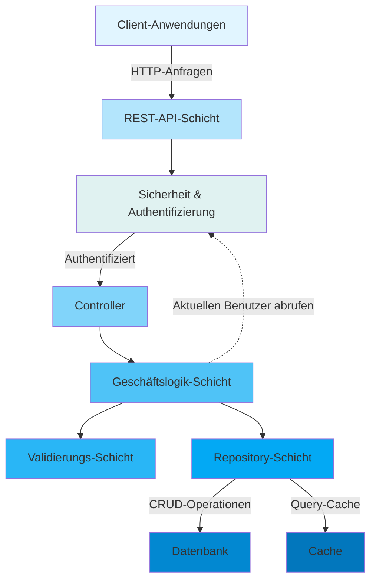
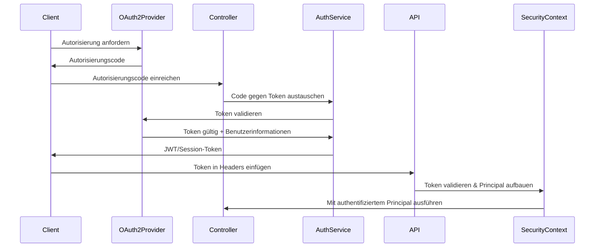
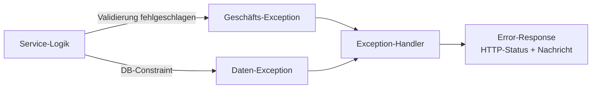
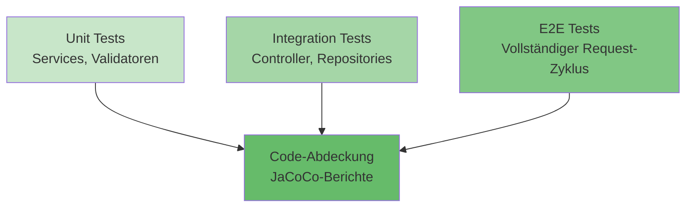

[⬅️ Zurück zum Architektur-Index](./index.html)

# Backend-Architektur-Überblick

## Einführung

Das Backend von Smart Supply Pro ist ein modernes, Spring-Boot-basiertes Lagerverwaltungssystem, das für die Verwaltung komplexer Lieferantenbeziehungen, Bestandsverfolgung und Echtzeit-Bestandsanalysen konzipiert ist. Die Architektur betont **Skalierbarkeit**, **Wartbarkeit** und **Sicherheit** durch wohldefinierteverstandteile Ebenen und klare Separation of Concerns.

## System-Architektur-Diagramm



## Kern-Schichten

### 1. **API/Controller-Schicht**

Der Einstiegspunkt für alle HTTP-Anfragen. Controller verwalten:
- **Request-Routing** - Ordnet HTTP-Endpunkte Controller-Methoden zu
- **DTO-Konvertierung** - Konvertiert eingehende JSON in DTOs
- **Response-Formatierung** - Serialisiert Domain-Objekte zu JSON
- **Basis-Parametervalidierung** - Spring's @Valid Annotation

**Wichtigste Komponenten:**
- `SupplierController` - Verwaltet CRUD-Operationen für Lieferanten
- `InventoryItemController` - Handhabt Bestandsverwaltung
- `StockHistoryController` - Verfolgt Bestandsänderungen und Auditing
- `AnalyticsController` - Stellt Analytics- und Report-Endpunkte bereit
- `AuthController` - OAuth2-Authentifizierungs-Endpunkte

**Beispiel-Muster:**
```java
@PostMapping("/suppliers")
@PreAuthorize("hasRole('ADMIN')")
public ResponseEntity<SupplierDTO> createSupplier(@Valid @RequestBody CreateSupplierDTO dto) {
    SupplierDTO created = supplierService.create(dto);
    return ResponseEntity.status(HttpStatus.CREATED).body(created);
}
```

### 2. **Service-Schicht**

Enthält die gesamte Geschäftslogik und koordiniert Operationen:
- **Geschäftsregel-Validierung** - Komplexe Validierung über einfache Constraints hinaus
- **Transaktionsverwaltung** - Koordiniert Datenbankoperationen
- **Cross-Cutting Concerns** - Logging, Auditing und Exception-Mapping
- **Datentransformation** - Konvertiert zwischen DTOs und Entities
- **Externe Integrationen** - Aufrufe zu externen APIs oder Services

**Wichtigste Services:**
- `SupplierService` - Lieferanten-Lebenszyklusverwaltung mit Lösch-Validierung
- `InventoryItemService` - Item-Verwaltung mit Bestandsverfolgung
- `StockHistoryService` - Audit-Trail und Bestandsbewegungsprotokollierung
- `AnalyticsService` - Finanzielle Analyse (WAC, FIFO) und Reporting

**Design-Muster:**
- **Dependency Injection** - Alle Abhängigkeiten von Spring autowired
- **Exception-Übersetzung** - Geschäftsexceptions auf HTTP-Status-Codes gemappt
- **Validierungs-Helfer** - Separate Helfer-Klassen für komplexe Validierungen
- **Audit-Protokollierung** - Integration mit Audit-Service für Änderungsverfolgung

### 3. **Validierungs-Schicht**

Multi-Ebenen-Validierung gewährleistet Datenintegrität:

**Ebene 1 - Controller-Ebene:** Spring's `@Valid` Annotation mit `@NotBlank`, `@NotNull`, etc.

**Ebene 2 - Service-Ebene:** Geschäftsregel-Validierung
- Eindeutigkeitsprüfungen (Lieferantenname, Item-Name)
- Beziehungsvalidierung (Items müssen gültigen Lieferanten haben)
- Zustandsvalidierung (können Lieferanten mit Bestand nicht löschen)

**Ebene 3 - Repository-Ebene:** Datenbank-Constraints und eindeutige Indizes

**Validierungs-Komponenten:**
- `SupplierValidator` - Lieferanten-spezifische Regeln
- `InventoryItemValidator` - Item-Eindeutigkeit und Lieferanten-Validierung
- Benutzerdefinierte Validatoren für Enums und Geschäftsregeln

**Beispiel:**
```java
public void validateUniquenessOnCreate(String name) {
    if (repository.existsByNameIgnoreCase(name)) {
        throw new IllegalStateException("Lieferantenname existiert bereits: " + name);
    }
}
```

### 4. **Repository-Schicht**

Verwaltet alle Datenbank-Interaktionen:
- **CRUD-Operationen** - Erstellen, Lesen, Aktualisieren, Löschen von Entities
- **Benutzerdefinierte Queries** - Komplexe Such- und Aggregationsabfragen
- **Pagination** - Paginierung großer Datenmengen
- **Performance-Optimierung** - Query-Optimierung und Indexierung

**Wichtigste Repositories:**
- `SupplierRepository` - Lieferanten-Datenzugriff
- `InventoryItemRepository` - Bestandsdatenzugriff mit erweiterter Suche
- `StockHistoryRepository` - Bestandsbewegung Audit-Trail und Analytics
- `CustomQueryRepository` - Komplexe Aggregation und Analytics-Abfragen

**Spring Data JPA Funktionen:**
- Automatische Pagination-Unterstützung via `Pageable` Interface
- Benutzerdefinierte `@Query` Methoden für komplexe Operationen
- Method-Name-Konventionen für einfache Queries
- Transaktionsverwaltung durch `@Transactional`

### 5. **Daten-Schicht**

Die Persistierungs-Ebene mit Entities und Beziehungen:
- `Supplier` - Lieferanten-Informationen und Kontaktdetails
- `InventoryItem` - Produkt-/Bestandsdaten
- `StockHistory` - Audit-Trail aller Bestandsbewegungen
- JPA-Beziehungen mit Cascading und Fetch-Strategien

**Wichtigste Design-Entscheidungen:**
- **Optimistic Locking** - Versionsfelde verhindern Konflikte bei gleichzeitigen Updates
- **Soft Deletes** - Logisches Löschen statt physischem Entfernen wo nötig
- **Audit-Felder** - `createdAt`, `updatedAt`, `createdBy` Verfolgung
- **Enum-Spalten** - Typsichere Aufzählungsspeicherung

## Authentifizierung & Sicherheit

### OAuth2-Integration

Smart Supply Pro verwendet **OAuth2** für Authentifizierung mit Unterstützung für mehrere Provider (z.B. Google, GitHub).



### Autorisierungs-Modell

**Rollenbasierte Zugriffskontrolle (RBAC):**
- **ADMIN** - Vollständiger Systemzugriff, kann alle Operationen durchführen
- **USER** - Limitierter Zugriff auf Bestandsanzeige und grundlegende Operationen

**Implementierung:**
```java
@PreAuthorize("hasRole('ADMIN')")
public void deleteSupplier(String id) { ... }

@PreAuthorize("hasRole('USER') or hasRole('ADMIN')")
public List<InventoryItemDTO> searchItems(String name) { ... }
```

### Request-Scoped Sicherheit

Jede Anfrage wird über Spring Security authentifiziert:
1. Token aus Authorization-Header extrahiert
2. Token gegen OAuth2-Provider validiert
3. Principal (Benutzer) im SecurityContext etabliert
4. @PreAuthorize Checks durchgeführt vor Method-Ausführung
5. Audit-Informationen erfasst (`createdBy` Feld) aus SecurityContext

## Exception-Handling

Konsistentes Exception-Handling in der gesamten Anwendung:



**Exception-Hierarchie:**
- `IllegalArgumentException` → HTTP 400 Bad Request
- `IllegalStateException` → HTTP 409 Conflict
- `DataIntegrityViolationException` → HTTP 409 Conflict
- `EntityNotFoundException` → HTTP 404 Not Found
- `AccessDeniedException` → HTTP 403 Forbidden
- `Exception` → HTTP 500 Internal Server Error

**Beispiel:**
```java
@ExceptionHandler(IllegalStateException.class)
public ResponseEntity<ErrorResponse> handleIllegalState(IllegalStateException ex) {
    return ResponseEntity.status(HttpStatus.CONFLICT)
        .body(new ErrorResponse("CONFLICT", ex.getMessage()));
}
```

## Datenfluss-Beispiel: Erstellen eines Bestandsitems

So fließt eine Anfrage durch die Architektur:

```
1. HTTP POST /inventory/items
   ↓
2. InventoryItemController.create(CreateItemDTO)
   - DTO-Struktur mit @Valid validieren
   ↓
3. InventoryItemService.save(CreateItemDTO)
   - DTO zu Entity konvertieren
   - Item-Namen-Eindeutigkeit validieren
   - Lieferant existiert validieren
   ↓
4. InventoryItemRepository.save(InventoryItem)
   - Datenbank INSERT mit Constraints
   ↓
5. StockHistoryService.logInitialStock(InventoryItem)
   - Audit-Eintrag erstellen
   ↓
6. Response: InventoryItemDTO mit generierter ID
```

## Wichtigste Design-Muster

### 1. **Dependency Injection**
Alle Komponenten verwenden Constructor Injection für bessere Testbarkeit und explizite Abhängigkeiten.

### 2. **Repository-Muster**
Abstrahiert Datenbankzugriff durch Repository-Interfaces, ermöglicht einfaches Testen mit Mocks.

### 3. **DTO-Muster**
Daten-Transfer-Objekte entkoppeln API-Verträge von internen Domain-Modellen.

### 4. **Service Locator (via Spring)**
Spring verwaltet Bean-Lebenszyklus und Abhängigkeitsauflösung.

### 5. **Exception-Übersetzung**
Geschäfts-Exceptions werden auf angemessene HTTP-Status-Codes und Error-Responses übersetzt.

### 6. **Validierungs-Helfer**
Separate Validator-Klassen für komplexe Geschäftsregel-Validierung.

## Performance-Überlegungen

1. **Pagination** - Große Ergebnis-Mengen sind standardmäßig paginiert
2. **Query-Optimierung** - Benutzerdefinierte `@Query` Methoden für komplexe Aggregationen
3. **Caching** - Strategisches Caching häufig abgerufener Daten
4. **Lazy Loading** - Sorgfältige Verwaltung von JPA-Beziehungen um N+1-Abfragen zu vermeiden
5. **Datenbank-Indexierung** - Indizes auf häufig gesuchten Spalten (Name, Lieferant, etc.)

## Skalierungsstrategie

1. **Stateless Services** - Kein Session-State auf Servern, ermöglicht horizontale Skalierung
2. **Datenbank-Optimierung** - Indizes und Query-Optimierung für Performance
3. **Async-Verarbeitung** - Langfristige Operationen werden asynchron verwaltet
4. **Load Balancing** - Mehrere Instanzen können hinter einem Load Balancer bereitgestellt werden
5. **Caching-Schichten** - Redis oder ähnlich für verteiltes Caching

## Test-Architektur



**Test-Muster:**
- **Unit Tests** - Alle externen Abhängigkeiten mocken, Fokus auf Logik
- **Integration Tests** - `@SpringBootTest` mit TestContainers für Datenbanken nutzen
- **Mocking** - Mockito für Service- und Repository-Mocking
- **Test-Fixtures** - Builder und Factory-Methoden für Test-Daten

## Nächste Schritte

1. **Erkunden Sie [Schichten-Architektur](./layers.html)** - Detaillierte Aufschlüsselung jeder Schicht
2. **Überprüfen Sie [Sicherheits-Architektur](./security.html)** - Detaillierte Sicherheitsimplementierung
3. **Überprüfen Sie [Datenmodelle](./model.html)** - Entity-Beziehungen und Schema
4. **Studieren Sie [Test-Strategie](./testing.html)** - Test-Muster und Best Practices
5. **Untersuchen Sie den Quellcode** - Navigieren Sie zu `/src/main/java/com/smartsupplypro/inventory/`

---

[⬅️ Zurück zum Architektur-Index](./index.html)
