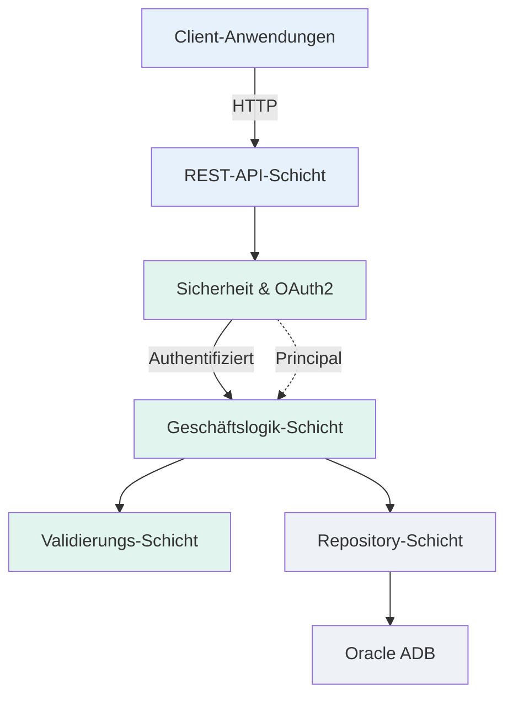
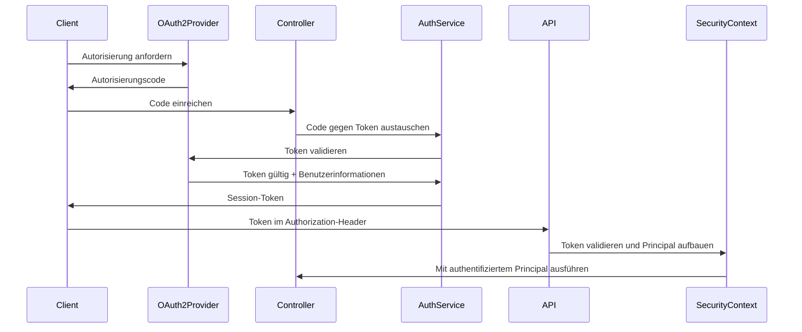
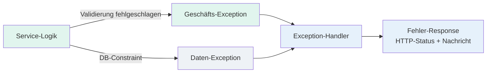
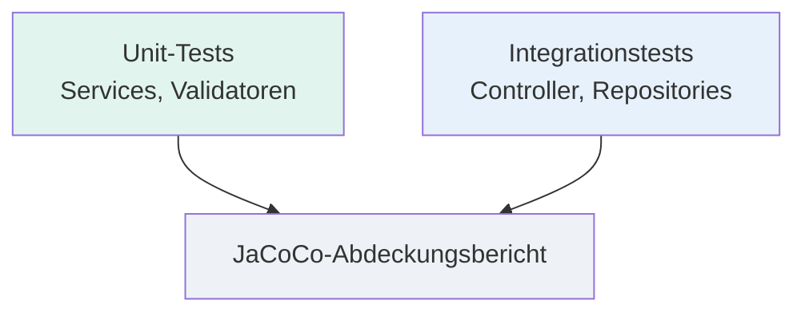

# Backend-Architektur

Das Backend von Smart Supply Pro ist ein Spring-Boot-Dienst zur Verwaltung von
Lieferantenbeziehungen, Bestandsverfolgung und Echtzeit-Bestandsanalysen.
Die Architektur legt den Schwerpunkt auf **Sicherheit**, **Wartbarkeit** und
**klare Trennung der Verantwortlichkeiten** durch klar definierte Schichten.

## Technologie-Stack

| Komponente       | Technologie                     | Version   |
|------------------|---------------------------------|-----------|
| Framework        | Spring Boot                     | 3.5.15    |
| Sprache          | Java                            | 17        |
| Datenbank        | Oracle Autonomous Database      | 23ai      |
| Build-Tool       | Maven                           | 3.x+      |
| Testing          | JUnit 5, Mockito                | Aktuell   |
| Sicherheit       | Spring Security, OAuth2         | 3.5.x     |
| Containerisierung| Docker                          | Aktuell   |

## Architekturprinzipien

1. **Trennung der Verantwortlichkeiten** — klare Grenzen zwischen Controller-, Service-, Repository- und Datenschicht
2. **Dependency Injection** — Spring verwaltet alle Bean-Lebenszyklen und Abhängigkeiten
3. **RESTful API-Design** — einheitliche HTTP-Methoden und Statuscodes in der gesamten Anwendung
4. **Sicherheit zuerst** — OAuth2-Authentifizierung mit rollenbasierter Zugriffskontrolle (RBAC)
5. **Mehrschichtige Validierung** — von DTO-Annotationen bis hin zu Datenbankconstraints
6. **Einheitliches Exception-Handling** — konsistentes Fehler-Response-Format mit passenden HTTP-Statuscodes
7. **Testbarkeit** — Constructor Injection und Repository-Abstraktion ermöglichen saubere Unit- und Integrationstests
8. **Dokumentation** — Javadoc-Kommentare erklären das *Warum*, nicht das Was; Architekturdokumentation wird von der Pipeline generiert

## Systemarchitektur


```mermaid
flowchart TB
  Client["Client-Anwendungen"]:::controller
  API["REST-API-Schicht"]:::controller
  Security["Sicherheit & OAuth2"]:::service
  Service["Geschäftslogik-Schicht"]:::service
  Validation["Validierungs-Schicht"]:::service
  Repository["Repository-Schicht"]:::repository
  Database["Oracle ADB"]:::repository

  Client -->|HTTP| API
  API --> Security
  Security -->|Authentifiziert| Service
  Service --> Validation
  Service --> Repository
  Repository --> Database
  Security -.->|Principal| Service

  classDef controller fill:#e6f1fb;
  classDef service    fill:#e1f5ee;
  classDef repository fill:#eef2f6;
```

## Kernschichten

### Controller-Schicht

Einstiegspunkt für alle HTTP-Anfragen. Die Controller übernehmen Request-Routing,
DTO-Konvertierung, Response-Serialisierung und Basisvalidierung über `@Valid`.

Wichtigste Controller: `SupplierController`, `InventoryItemController`,
`StockHistoryController`, `AnalyticsController`, `AuthController`.

```java
@PostMapping("/suppliers")
@PreAuthorize("hasRole('ADMIN')")
public ResponseEntity<SupplierDTO> createSupplier(@Valid @RequestBody CreateSupplierDTO dto) {
    return ResponseEntity.status(HttpStatus.CREATED).body(supplierService.create(dto));
}
```

### Service-Schicht

Enthält die gesamte Geschäftslogik und koordiniert Operationen: Geschäftsregel-Validierung,
Transaktionsverwaltung, Datentransformation und Audit-Protokollierung.

Wichtigste Services: `SupplierService`, `InventoryItemService`, `StockHistoryService`,
`AnalyticsService` (WAC- und FIFO-Finanzanalyse).

### Validierungs-Schicht

Drei Ebenen gewährleisten die Datenintegrität:

- **Controller-Ebene** — JSR-380-Annotationen (`@NotBlank`, `@NotNull` usw.) über `@Valid`
- **Service-Ebene** — Eindeutigkeitsprüfungen, Beziehungsvalidierung, Zustandsprüfungen
- **Datenbankebene** — Constraints und eindeutige Indizes als letzte Sicherheitsstufe

### Repository-Schicht

Spring Data JPA Repositories mit benutzerdefinierten `@Query`-Methoden für komplexe
Aggregationen, `Pageable`-Unterstützung für große Datenmengen und `@Transactional`-Verwaltung.

Wichtigste Repositories: `SupplierRepository`, `InventoryItemRepository`,
`StockHistoryRepository` sowie benutzerdefinierte Analytics-Mixins mit JPQL und nativem SQL.

### Datenschicht

JPA-Entities mit Optimistic Locking (`@Version`), Audit-Feldern
(`createdAt`, `updatedAt`, `createdBy`) und typsicheren Enum-Spalten.

Entities: `Supplier`, `InventoryItem`, `StockHistory`, `AppUser`.

## Authentifizierung und Sicherheit

OAuth2-Authentifizierung mit Google als Provider. Spring Security validiert jeden
Request-Token, erstellt den Principal im `SecurityContext` und setzt RBAC über
`@PreAuthorize` durch.

**Rollen:**
- `ADMIN` — vollständiger Systemzugriff
- `USER` — Bestandsanzeige und grundlegende Operationen


```mermaid
sequenceDiagram
  Client->>OAuth2Provider: Autorisierung anfordern
  OAuth2Provider->>Client: Autorisierungscode
  Client->>Controller: Code einreichen
  Controller->>AuthService: Code gegen Token austauschen
  AuthService->>OAuth2Provider: Token validieren
  OAuth2Provider->>AuthService: Token gültig + Benutzerinformationen
  AuthService->>Client: Session-Token
  Client->>API: Token im Authorization-Header
  API->>SecurityContext: Token validieren und Principal aufbauen
  SecurityContext->>Controller: Mit authentifiziertem Principal ausführen
```

## Exception-Handling

Geschäfts- und Framework-Exceptions werden über einen globalen `@ControllerAdvice`-Handler
geleitet und erzeugen eine einheitliche Fehler-Response — HTTP-Status, maschinenlesbares
Fehler-Token, Zeitstempel und Korrelations-ID. Stack-Traces werden in Responses
grundsätzlich nicht exponiert.


```mermaid
flowchart LR
  Service["Service-Logik"]:::service
  BusinessEx["Geschäfts-Exception"]:::service
  DataEx["Daten-Exception"]:::repository
  Handler["Exception-Handler"]:::controller
  Response["Fehler-Response\nHTTP-Status + Nachricht"]:::controller

  Service -->|Validierung fehlgeschlagen| BusinessEx
  Service -->|DB-Constraint| DataEx
  BusinessEx --> Handler
  DataEx --> Handler
  Handler --> Response

  classDef controller fill:#e6f1fb;
  classDef service    fill:#e1f5ee;
  classDef repository fill:#eef2f6;
```

## Datenfluss: Bestandsitem erstellen

```
POST /inventory/items
  → InventoryItemController   DTO-Struktur mit @Valid prüfen
  → InventoryItemService      DTO konvertieren, Namenseindeutigkeit prüfen, Lieferant validieren
  → InventoryItemRepository   INSERT mit Datenbankconstraints
  → StockHistoryService       Audit-Eintrag für Anfangsbestand schreiben
  → Response                  InventoryItemDTO mit generierter ID
```

## Wichtigste Design-Muster

| Muster | Zweck |
|---|---|
| Constructor Injection | Explizite Abhängigkeiten; Unit-Tests ohne Spring-Kontext möglich |
| Repository-Abstraktion | Austauschbarer Datenzugriff; in Service-Tests mockbar |
| DTO-Muster | Entkoppelt API-Vertrag vom internen Domain-Modell |
| Exception-Übersetzung | Geschäfts-Exceptions werden an einer Grenze auf HTTP-Statuscodes gemappt |
| Validierungs-Helfer | Komplexe Geschäftsregeln in dedizierten Validator-Klassen isoliert |
| Audit-Protokollierung | `createdBy` / `updatedAt` einheitlich aus dem `SecurityContext` erfasst |

## Performance-Überlegungen

- **Pagination** — alle Listen-Endpunkte akzeptieren `Pageable`; unbegrenzte Abfragen werden blockiert
- **`@EntityGraph`** — auf häufig genutzten Pfaden eingesetzt, um N+1-Abfragen zu vermeiden
- **Benutzerdefinierte `@Query`** — natives SQL für komplexe Aggregationen, wo JPQL nicht ausreicht
- **HikariCP-Tuning** — Connection Pool auf die RAM-Beschränkungen von Fly.io abgestimmt
- **Zustandslose Services** — kein serverseitiger Session-State; horizontale Skalierung ist direkt möglich

## Testing


```mermaid
flowchart TB
  Unit["Unit-Tests\nServices, Validatoren"]:::service
  Integration["Integrationstests\nController, Repositories"]:::controller
  Coverage["JaCoCo-Abdeckungsbericht"]:::repository

  Unit --> Coverage
  Integration --> Coverage

  classDef controller fill:#e6f1fb;
  classDef service    fill:#e1f5ee;
  classDef repository fill:#eef2f6;
```

- **Unit-Tests** — Mockito-Mocks für alle externen Abhängigkeiten; Fokus auf Geschäftslogik
- **Integrationstests** — `@SpringBootTest` mit H2 im Oracle-kompatiblen Modus
- **Test-Fixtures** — Builder- und Factory-Methoden für reproduzierbare Testdaten

## Konfiguration

Spring Boot externalisierte Konfiguration über `application.yml` mit drei Profilen:

- *(kein Profil)* — lokale Entwicklung, H2 In-Memory-Datenbank
- `test` — H2 im Oracle-kompatiblen Modus, DEBUG-Protokollierung
- `prod` — Oracle Autonomous Database über Wallet-Authentifizierung, INFO-Protokollierung

Umgebungsspezifische Secrets (OAuth2-Schlüssel, Datenbankzugangsdaten) werden über
Umgebungsvariablen injiziert und nie in die Versionsverwaltung eingecheckt.

## Bereitstellung

Das Backend wird über eine vollständig automatisierte GitHub-Actions-Pipeline auf **Fly.io** bereitgestellt:

```
Code-Push
  → 1-ci-backend.yml      Maven-Build, JUnit-Tests, JaCoCo-Abdeckung
  → 2-docker-backend.yml  Docker-Image-Build, Trivy-CVE-Scan, Push zu Docker Hub
  → 4-deploy-fly.yml      Vorgebautes Image auf Fly.io deployen, Health-Check
```

Das Docker-Image enthält ausschließlich das Produktions-JAR und `start.sh` —
keine Testquellen oder Dokumentation.
