[⬅️ Zurück zum Architektur-Index](./index.html)

# Backend-Architektur-Überblick

## Einführung

Das Backend von Smart Supply Pro ist ein modernes, Spring-Boot-basiertes Lagerverwaltungssystem, das für die Verwaltung komplexer Lieferantenbeziehungen, Bestandsverfolgung und Echtzeit-Bestandsanalysen konzipiert ist. Die Architektur betont **Skalierbarkeit**, **Wartbarkeit** und **Sicherheit** durch wohldefinierteverstandteile Ebenen und klare Separation of Concerns.

> **👉 Für eine detaillierte Aufschlüsselung jeder Architektur-Schicht, siehe [Schichten-Architektur](./layers/overview.html)** - Umfassende Dokumentation von Controller-, Service-, Repository-, Modell- und Infrastruktur-Schichten mit Codebeispielen und Interaktionsmustern.

## System-Architektur-Diagramm

```mermaid
graph TB
    Client["Client-Anwendungen"]
    API["REST-API-Schicht"]
    Controller["Controller"]
    Service["Geschäftslogik-Schicht"]
    Validation["Validierungs-Schicht"]
    Repository["Repository-Schicht"]
    Database["Datenbank"]
    Cache["Cache"]
    Security["Sicherheit & Authentifizierung"]

    Client -->|HTTP-Anfragen| API
    API --> Security
    Security -->|Authentifiziert| Controller
    Controller --> Service
    Service --> Validation
    Service --> Repository
    Repository -->|CRUD-Operationen| Database
    Repository -->|Query-Cache| Cache
    Service -.->|Aktuellen Benutzer abrufen| Security

    style Client fill:#e1f5ff
    style API fill:#b3e5fc
    style Controller fill:#81d4fa
    style Service fill:#4fc3f7
    style Validation fill:#29b6f6
    style Repository fill:#03a9f4
    style Database fill:#0288d1
    style Cache fill:#0277bd
    style Security fill:#e0f2f1
```



## Kern-Schichten

### 1. **API/Controller-Schicht**

Der Einstiegspunkt für alle HTTP-Anfragen. Controller verwalten:
- **Request-Routing** - Ordnet HTTP-Endpunkte Controller-Methoden zu
- **DTO-Konvertierung** - Konvertiert eingehende JSON in DTOs
- **Response-Formatierung** - Serialisiert Domain-Objekte zu JSON
- **Basis-Parametervalidierung** - Spring's @Valid Annotation

**Wichtigste Komponenten:**
- `SupplierController` - Verwaltet CRUD-Operationen für Lieferanten
- `InventoryItemController` - Handhabt Bestandsverwaltung
- `StockHistoryController` - Verfolgt Bestandsänderungen und Auditing
- `AnalyticsController` - Stellt Analytics- und Report-Endpunkte bereit
- `AuthController` - OAuth2-Authentifizierungs-Endpunkte

**Beispiel-Muster:**
```java
@PostMapping("/suppliers")
@PreAuthorize("hasRole('ADMIN')")
public ResponseEntity<SupplierDTO> createSupplier(@Valid @RequestBody CreateSupplierDTO dto) {
    SupplierDTO created = supplierService.create(dto);
    return ResponseEntity.status(HttpStatus.CREATED).body(created);
}
```

### 2. **Service-Schicht**

Enthält die gesamte Geschäftslogik und koordiniert Operationen:
- **Geschäftsregel-Validierung** - Komplexe Validierung über einfache Constraints hinaus
- **Transaktionsverwaltung** - Koordiniert Datenbankoperationen
- **Cross-Cutting Concerns** - Logging, Auditing und Exception-Mapping
- **Datentransformation** - Konvertiert zwischen DTOs und Entities
- **Externe Integrationen** - Aufrufe zu externen APIs oder Services

**Wichtigste Services:**
- `SupplierService` - Lieferanten-Lebenszyklusverwaltung mit Lösch-Validierung
- `InventoryItemService` - Item-Verwaltung mit Bestandsverfolgung
- `StockHistoryService` - Audit-Trail und Bestandsbewegungsprotokollierung
- `AnalyticsService` - Finanzielle Analyse (WAC, FIFO) und Reporting

**Design-Muster:**
- **Dependency Injection** - Alle Abhängigkeiten von Spring autowired
- **Exception-Übersetzung** - Geschäftsexceptions auf HTTP-Status-Codes gemappt
- **Validierungs-Helfer** - Separate Helfer-Klassen für komplexe Validierungen
- **Audit-Protokollierung** - Integration mit Audit-Service für Änderungsverfolgung

### 3. **Validierungs-Schicht**

Multi-Ebenen-Validierung gewährleistet Datenintegrität:

**Ebene 1 - Controller-Ebene:** Spring's `@Valid` Annotation mit `@NotBlank`, `@NotNull`, etc.

**Ebene 2 - Service-Ebene:** Geschäftsregel-Validierung
- Eindeutigkeitsprüfungen (Lieferantenname, Item-Name)
- Beziehungsvalidierung (Items müssen gültigen Lieferanten haben)
- Zustandsvalidierung (können Lieferanten mit Bestand nicht löschen)

**Ebene 3 - Repository-Ebene:** Datenbank-Constraints und eindeutige Indizes

**Validierungs-Komponenten:**
- `SupplierValidator` - Lieferanten-spezifische Regeln
- `InventoryItemValidator` - Item-Eindeutigkeit und Lieferanten-Validierung
- Benutzerdefinierte Validatoren für Enums und Geschäftsregeln

**Beispiel:**
```java
public void validateUniquenessOnCreate(String name) {
    if (repository.existsByNameIgnoreCase(name)) {
        throw new IllegalStateException("Lieferantenname existiert bereits: " + name);
    }
}
```

### 4. **Repository-Schicht**

Verwaltet alle Datenbank-Interaktionen:
- **CRUD-Operationen** - Erstellen, Lesen, Aktualisieren, Löschen von Entities
- **Benutzerdefinierte Queries** - Komplexe Such- und Aggregationsabfragen
- **Pagination** - Paginierung großer Datenmengen
- **Performance-Optimierung** - Query-Optimierung und Indexierung

**Wichtigste Repositories:**
- `SupplierRepository` - Lieferanten-Datenzugriff
- `InventoryItemRepository` - Bestandsdatenzugriff mit erweiterter Suche
- `StockHistoryRepository` - Bestandsbewegung Audit-Trail und Analytics
- `CustomQueryRepository` - Komplexe Aggregation und Analytics-Abfragen

**Spring Data JPA Funktionen:**
- Automatische Pagination-Unterstützung via `Pageable` Interface
- Benutzerdefinierte `@Query` Methoden für komplexe Operationen
- Method-Name-Konventionen für einfache Queries
- Transaktionsverwaltung durch `@Transactional`

### 5. **Daten-Schicht**

Die Persistierungs-Ebene mit Entities und Beziehungen:
- `Supplier` - Lieferanten-Informationen und Kontaktdetails
- `InventoryItem` - Produkt-/Bestandsdaten
- `StockHistory` - Audit-Trail aller Bestandsbewegungen
- JPA-Beziehungen mit Cascading und Fetch-Strategien

**Wichtigste Design-Entscheidungen:**
- **Optimistic Locking** - Versionsfelde verhindern Konflikte bei gleichzeitigen Updates
- **Soft Deletes** - Logisches Löschen statt physischem Entfernen wo nötig
- **Audit-Felder** - `createdAt`, `updatedAt`, `createdBy` Verfolgung
- **Enum-Spalten** - Typsichere Aufzählungsspeicherung

## Authentifizierung & Sicherheit

### OAuth2-Integration

Smart Supply Pro verwendet **OAuth2** für Authentifizierung mit Unterstützung für mehrere Provider (z.B. Google, GitHub).

```mermaid
sequenceDiagram
    Client->>OAuth2Provider: Autorisierung anfordern
    OAuth2Provider->>Client: Autorisierungscode
    Client->>Controller: Autorisierungscode einreichen
    Controller->>AuthService: Code gegen Token austauschen
    AuthService->>OAuth2Provider: Token validieren
    OAuth2Provider->>AuthService: Token gültig + Benutzerinformationen
    AuthService->>Client: JWT/Session-Token
    Client->>API: Token in Headers einfügen
    API->>SecurityContext: Token validieren & Principal aufbauen
    SecurityContext->>Controller: Mit authentifiziertem Principal ausführen
```



### Autorisierungs-Modell

**Rollenbasierte Zugriffskontrolle (RBAC):**
- **ADMIN** - Vollständiger Systemzugriff, kann alle Operationen durchführen
- **USER** - Limitierter Zugriff auf Bestandsanzeige und grundlegende Operationen

**Implementierung:**
```java
@PreAuthorize("hasRole('ADMIN')")
public void deleteSupplier(String id) { ... }

@PreAuthorize("hasRole('USER') or hasRole('ADMIN')")
public List<InventoryItemDTO> searchItems(String name) { ... }
```

### Request-Scoped Sicherheit

Jede Anfrage wird über Spring Security authentifiziert:
1. Token aus Authorization-Header extrahiert
2. Token gegen OAuth2-Provider validiert
3. Principal (Benutzer) im SecurityContext etabliert
4. @PreAuthorize Checks durchgeführt vor Method-Ausführung
5. Audit-Informationen erfasst (`createdBy` Feld) aus SecurityContext

## Exception-Handling

Konsistentes Exception-Handling in der gesamten Anwendung:



**Exception-Hierarchie:**
- `IllegalArgumentException` → HTTP 400 Bad Request
- `IllegalStateException` → HTTP 409 Conflict
- `DataIntegrityViolationException` → HTTP 409 Conflict
- `EntityNotFoundException` → HTTP 404 Not Found
- `AccessDeniedException` → HTTP 403 Forbidden
- `Exception` → HTTP 500 Internal Server Error

**Beispiel:**
```java
@ExceptionHandler(IllegalStateException.class)
public ResponseEntity<ErrorResponse> handleIllegalState(IllegalStateException ex) {
    return ResponseEntity.status(HttpStatus.CONFLICT)
        .body(new ErrorResponse("CONFLICT", ex.getMessage()));
}
```

```mermaid
graph LR
    Service["Service-Logik"]
    BusinessEx["Geschäfts-Exception"]
    DataEx["Daten-Exception"]
    ControllerAdv["Exception-Handler"]
    ErrorResponse["Error-Response<br/>HTTP-Status + Nachricht"]

    Service -->|Validierung fehlgeschlagen| BusinessEx
    Service -->|DB-Constraint| DataEx
    BusinessEx --> ControllerAdv
    DataEx --> ControllerAdv
    ControllerAdv --> ErrorResponse
```

## Datenfluss-Beispiel: Erstellen eines Bestandsitems

So fließt eine Anfrage durch die Architektur:

```
1. HTTP POST /inventory/items
   ↓
2. InventoryItemController.create(CreateItemDTO)
   - DTO-Struktur mit @Valid validieren
   ↓
3. InventoryItemService.save(CreateItemDTO)
   - DTO zu Entity konvertieren
   - Item-Namen-Eindeutigkeit validieren
   - Lieferant existiert validieren
   ↓
4. InventoryItemRepository.save(InventoryItem)
   - Datenbank INSERT mit Constraints
   ↓
5. StockHistoryService.logInitialStock(InventoryItem)
   - Audit-Eintrag erstellen
   ↓
6. Response: InventoryItemDTO mit generierter ID
```

## Wichtigste Design-Muster

### 1. **Dependency Injection**
Alle Komponenten verwenden Constructor Injection für bessere Testbarkeit und explizite Abhängigkeiten.

### 2. **Repository-Muster**
Abstrahiert Datenbankzugriff durch Repository-Interfaces, ermöglicht einfaches Testen mit Mocks.

### 3. **DTO-Muster**
Daten-Transfer-Objekte entkoppeln API-Verträge von internen Domain-Modellen.

### 4. **Service Locator (via Spring)**
Spring verwaltet Bean-Lebenszyklus und Abhängigkeitsauflösung.

### 5. **Exception-Übersetzung**
Geschäfts-Exceptions werden auf angemessene HTTP-Status-Codes und Error-Responses übersetzt.

### 6. **Validierungs-Helfer**
Separate Validator-Klassen für komplexe Geschäftsregel-Validierung.

## Performance-Überlegungen

1. **Pagination** - Große Ergebnis-Mengen sind standardmäßig paginiert
2. **Query-Optimierung** - Benutzerdefinierte `@Query` Methoden für komplexe Aggregationen
3. **Caching** - Strategisches Caching häufig abgerufener Daten
4. **Lazy Loading** - Sorgfältige Verwaltung von JPA-Beziehungen um N+1-Abfragen zu vermeiden
5. **Datenbank-Indexierung** - Indizes auf häufig gesuchten Spalten (Name, Lieferant, etc.)

## Skalierungsstrategie

1. **Stateless Services** - Kein Session-State auf Servern, ermöglicht horizontale Skalierung
2. **Datenbank-Optimierung** - Indizes und Query-Optimierung für Performance
3. **Async-Verarbeitung** - Langfristige Operationen werden asynchron verwaltet
4. **Load Balancing** - Mehrere Instanzen können hinter einem Load Balancer bereitgestellt werden
5. **Caching-Schichten** - Redis oder ähnlich für verteiltes Caching

## Test-Architektur


**Test-Muster:**
- **Unit Tests** - Alle externen Abhängigkeiten mocken, Fokus auf Logik
- **Integration Tests** - `@SpringBootTest` mit TestContainers für Datenbanken nutzen
- **Mocking** - Mockito für Service- und Repository-Mocking
- **Test-Fixtures** - Builder und Factory-Methoden für Test-Daten

## Nächste Schritte

1. **Erkunden Sie [Schichten-Architektur](./layers/overview.html)** - Detaillierte Aufschlüsselung jeder Schicht (Controller, Service, Repository, Modell, Infrastruktur)
2. **Überprüfen Sie [Controller-Dokumentation](./controller/index.html)** - REST-API-Endpunkte, Request/Response-Shapes und Controller-Muster
3. **Studieren Sie [Repository-Schicht](./repository/index.html)** - Datenzugriffs-Abstraktion mit 7 Repositories (SupplierRepository, InventoryItemRepository, StockHistoryRepository, AppUserRepository, plus 3 benutzerdefinierte Analytics-Mixins mit JPQL und nativem SQL)
4. **Überprüfen Sie [Konfigurations-Management](./config/index.html)** - Anwendungseigenschaften, Profile, Umgebungssetup
5. **Überprüfen Sie [Sicherheits-Architektur](./security/index.html)** - OAuth2-Authentifizierung, rollenbasierte Zugriffskontrolle, Datenbankver­schlüsselung, Docker-Sicherheit und Demo-Modus
6. **Überprüfen Sie [Datenmodelle](./model/index.html)** - Umfassende Entity-Dokumentation (Supplier, InventoryItem, StockHistory, AppUser) mit Beziehungen, Lebenszyklen, Verwendungsbeispielen und Testing
7. **Studieren Sie [Enums-Referenz](./enums/index.html)** - Typsichere Enumerationen und ihre Geschäftslogik (Role, StockChangeReason, AuditSeverity)
8. **Studieren Sie [DTOs und Data Transfer Objects](./dto/index.html)** - Umfassende Dokumentation aller DTOs mit Konventionen, Validierung, Mapper, Pagination und Response-Mustern
9. **Studieren Sie [Test-Strategie](./testing.html)** - Test-Muster und Best Practices
10. **Untersuchen Sie den Quellcode** - Navigieren Sie zu `/src/main/java/com/smartsupplypro/inventory/`

---

[⬅️ Zurück zum Architektur-Index](./index.html)
