[⬅️ Zurück zum Architektur-Index](./index.html)

# Backend-Architektur-Überblick

## Einführung

Das Backend von Smart Supply Pro ist ein modernes, Spring-Boot-basiertes Lagerverwaltungssystem, das für die Verwaltung komplexer Lieferantenbeziehungen, Bestandsverfolgung und Echtzeit-Bestandsanalysen konzipiert ist. Die Architektur betont **Skalierbarkeit**, **Wartbarkeit** und **Sicherheit** durch wohldefinierteverstandteile Ebenen und klare Separation of Concerns.

> **👉 Für eine detaillierte Aufschlüsselung jeder Architektur-Schicht, siehe [Schichten-Architektur](./layers/overview.html)** - Umfassende Dokumentation von Controller-, Service-, Repository-, Modell- und Infrastruktur-Schichten mit Codebeispielen und Interaktionsmustern.

## System-Architektur-Diagramm

```mermaid
graph TB
    Client["Client-Anwendungen"]
    API["REST-API-Schicht"]
    Controller["Controller"]
    Service["Geschäftslogik-Schicht"]
    Validation["Validierungs-Schicht"]
    Repository["Repository-Schicht"]
    Database["Datenbank"]
    Cache["Cache"]
    Security["Sicherheit & Authentifizierung"]

    Client -->|HTTP-Anfragen| API
    API --> Security
    Security -->|Authentifiziert| Controller
    Controller --> Service
    Service --> Validation
    Service --> Repository
    Repository -->|CRUD-Operationen| Database
    Repository -->|Query-Cache| Cache
    Service -.->|Aktuellen Benutzer abrufen| Security

    style Client fill:#e1f5ff
    style API fill:#b3e5fc
    style Controller fill:#81d4fa
    style Service fill:#4fc3f7
    style Validation fill:#29b6f6
    style Repository fill:#03a9f4
    style Database fill:#0288d1
    style Cache fill:#0277bd
    style Security fill:#e0f2f1
```



## Kern-Schichten

### 1. **API/Controller-Schicht**

Der Einstiegspunkt für alle HTTP-Anfragen. Controller verwalten:
- **Request-Routing** - Ordnet HTTP-Endpunkte Controller-Methoden zu
- **DTO-Konvertierung** - Konvertiert eingehende JSON in DTOs
- **Response-Formatierung** - Serialisiert Domain-Objekte zu JSON
- **Basis-Parametervalidierung** - Spring's @Valid Annotation

**Wichtigste Komponenten:**
- `SupplierController` - Verwaltet CRUD-Operationen für Lieferanten
- `InventoryItemController` - Handhabt Bestandsverwaltung
- `StockHistoryController` - Verfolgt Bestandsänderungen und Auditing
- `AnalyticsController` - Stellt Analytics- und Report-Endpunkte bereit
- `AuthController` - OAuth2-Authentifizierungs-Endpunkte

**Beispiel-Muster:**
```java
@PostMapping("/suppliers")
@PreAuthorize("hasRole('ADMIN')")
public ResponseEntity<SupplierDTO> createSupplier(@Valid @RequestBody CreateSupplierDTO dto) {
    SupplierDTO created = supplierService.create(dto);
    return ResponseEntity.status(HttpStatus.CREATED).body(created);
}
```

### 2. **Service-Schicht**

Enthält die gesamte Geschäftslogik und koordiniert Operationen:
- **Geschäftsregel-Validierung** - Komplexe Validierung über einfache Constraints hinaus
- **Transaktionsverwaltung** - Koordiniert Datenbankoperationen
- **Cross-Cutting Concerns** - Logging, Auditing und Exception-Mapping
- **Datentransformation** - Konvertiert zwischen DTOs und Entities
- **Externe Integrationen** - Aufrufe zu externen APIs oder Services

**Wichtigste Services:**
- `SupplierService` - Lieferanten-Lebenszyklusverwaltung mit Lösch-Validierung
- `InventoryItemService` - Item-Verwaltung mit Bestandsverfolgung
- `StockHistoryService` - Audit-Trail und Bestandsbewegungsprotokollierung
- `AnalyticsService` - Finanzielle Analyse (WAC, FIFO) und Reporting

**Design-Muster:**
- **Dependency Injection** - Alle Abhängigkeiten von Spring autowired
- **Exception-Übersetzung** - Geschäftsexceptions auf HTTP-Status-Codes gemappt
- **Validierungs-Helfer** - Separate Helfer-Klassen für komplexe Validierungen
- **Audit-Protokollierung** - Integration mit Audit-Service für Änderungsverfolgung

### 3. **Validierungs-Schicht**

Multi-Ebenen-Validierung gewährleistet Datenintegrität:

**Ebene 1 - Controller-Ebene:** Spring's `@Valid` Annotation mit `@NotBlank`, `@NotNull`, etc.

**Ebene 2 - Service-Ebene:** Geschäftsregel-Validierung
- Eindeutigkeitsprüfungen (Lieferantenname, Item-Name)
- Beziehungsvalidierung (Items müssen gültigen Lieferanten haben)
- Zustandsvalidierung (können Lieferanten mit Bestand nicht löschen)

**Ebene 3 - Repository-Ebene:** Datenbank-Constraints und eindeutige Indizes

**Validierungs-Komponenten:**
- `SupplierValidator` - Lieferanten-spezifische Regeln
- `InventoryItemValidator` - Item-Eindeutigkeit und Lieferanten-Validierung
- Benutzerdefinierte Validatoren für Enums und Geschäftsregeln

**Beispiel:**
```java
public void validateUniquenessOnCreate(String name) {
    if (repository.existsByNameIgnoreCase(name)) {
        throw new IllegalStateException("Lieferantenname existiert bereits: " + name);
    }
}
```

### 4. **Repository-Schicht**

Verwaltet alle Datenbank-Interaktionen:
- **CRUD-Operationen** - Erstellen, Lesen, Aktualisieren, Löschen von Entities
- **Benutzerdefinierte Queries** - Komplexe Such- und Aggregationsabfragen
- **Pagination** - Paginierung großer Datenmengen
- **Performance-Optimierung** - Query-Optimierung und Indexierung

**Wichtigste Repositories:**
- `SupplierRepository` - Lieferanten-Datenzugriff
- `InventoryItemRepository` - Bestandsdatenzugriff mit erweiterter Suche
- `StockHistoryRepository` - Bestandsbewegung Audit-Trail und Analytics
- `CustomQueryRepository` - Komplexe Aggregation und Analytics-Abfragen

**Spring Data JPA Funktionen:**
- Automatische Pagination-Unterstützung via `Pageable` Interface
- Benutzerdefinierte `@Query` Methoden für komplexe Operationen
- Method-Name-Konventionen für einfache Queries
- Transaktionsverwaltung durch `@Transactional`

### 5. **Daten-Schicht**

Die Persistierungs-Ebene mit Entities und Beziehungen:
- `Supplier` - Lieferanten-Informationen und Kontaktdetails
- `InventoryItem` - Produkt-/Bestandsdaten
- `StockHistory` - Audit-Trail aller Bestandsbewegungen
- JPA-Beziehungen mit Cascading und Fetch-Strategien

**Wichtigste Design-Entscheidungen:**
- **Optimistic Locking** - Versionsfelde verhindern Konflikte bei gleichzeitigen Updates
- **Soft Deletes** - Logisches Löschen statt physischem Entfernen wo nötig
- **Audit-Felder** - `createdAt`, `updatedAt`, `createdBy` Verfolgung
- **Enum-Spalten** - Typsichere Aufzählungsspeicherung

## Authentifizierung & Sicherheit

### OAuth2-Integration

Smart Supply Pro verwendet **OAuth2** für Authentifizierung mit Unterstützung für mehrere Provider (z.B. Google, GitHub).

```mermaid
sequenceDiagram
    Client->>OAuth2Provider: Autorisierung anfordern
    OAuth2Provider->>Client: Autorisierungscode
    Client->>Controller: Autorisierungscode einreichen
    Controller->>AuthService: Code gegen Token austauschen
    AuthService->>OAuth2Provider: Token validieren
    OAuth2Provider->>AuthService: Token gültig + Benutzerinformationen
    AuthService->>Client: JWT/Session-Token
    Client->>API: Token in Headers einfügen
    API->>SecurityContext: Token validieren & Principal aufbauen
    SecurityContext->>Controller: Mit authentifiziertem Principal ausführen
```



### Autorisierungs-Modell

**Rollenbasierte Zugriffskontrolle (RBAC):**
- **ADMIN** - Vollständiger Systemzugriff, kann alle Operationen durchführen
- **USER** - Limitierter Zugriff auf Bestandsanzeige und grundlegende Operationen

**Implementierung:**
```java
@PreAuthorize("hasRole('ADMIN')")
public void deleteSupplier(String id) { ... }

@PreAuthorize("hasRole('USER') or hasRole('ADMIN')")
public List<InventoryItemDTO> searchItems(String name) { ... }
```

### Request-Scoped Sicherheit

Jede Anfrage wird über Spring Security authentifiziert:
1. Token aus Authorization-Header extrahiert
2. Token gegen OAuth2-Provider validiert
3. Principal (Benutzer) im SecurityContext etabliert
4. @PreAuthorize Checks durchgeführt vor Method-Ausführung
5. Audit-Informationen erfasst (`createdBy` Feld) aus SecurityContext

## Exception-Handling

Umfassende, konsistente Fehlerbehandlung in der gesamten Anwendung:

**Vollständige Exception-Architektur-Dokumentation:**

- **[Exception-Architektur-Index](./exception/index.md)** - Zentrale Dokumentation für Fehlerbehandlung
  - Exception-Typen und Klassifizierung (Framework vs. Domain)
  - Handler-Ausführungsfluss und Reihenfolge
  - HTTP-Status-Code-Referenztabelle
  - Error-Response-Struktur und Korrelations-IDs

- **[Global Exception Handler](./exception/global-exception-handler.md)** - Framework-Level Fehlerbehandlung
  - 14 Exception-Handler-Methoden mit Implementierung
  - Handler-Reihenfolgestrategie (HIGHEST_PRECEDENCE)
  - Validierungsfehler (MethodArgumentNotValidException, ConstraintViolationException)
  - Parameter- und Formatfehler (HttpMessageNotReadableException, MissingServletRequestParameterException)
  - Authentifizierung & Autorisierung (AuthenticationException, AccessDeniedException)
  - Ressource nicht gefunden (NoSuchElementException)
  - Konflikte & gleichzeitige Updates (DataIntegrityViolationException, ObjectOptimisticLockingFailureException)
  - Muster für Sanitization von sensiblen Daten
  - Test-Strategien und Beispiele

- **[Error-Response-Struktur](./exception/error-response-structure.md)** - Standardisierte Error-DTO
  - JSON-Struktur mit maschinenlesbaren Error-Token
  - Timestamp- und Korrelations-ID-Generierung
  - Builder-Pattern-Implementierung
  - Frontend-Integrationsmuster
  - Sicherheitsaspekte (keine Stack-Traces exponiert)

- **[Exception-zu-HTTP-Mapping](./exception/exception-to-http-mapping.md)** - Vollständige Referenzanleitung
  - 400 Bad Request (Validierung, Parameter, fehlerhafte JSON)
  - 401 Unauthorized (Authentifizierungsfehler)
  - 403 Forbidden (Autorisierungsfehler)
  - 404 Not Found (fehlende Ressourcen)
  - 409 Conflict (Duplikate, gleichzeitige Updates, State-Verletzungen)
  - 500 Internal Server Error (unbehandelte Exceptions)
  - Entscheidungsbaum für Status-Code-Auswahl
  - Frontend-Fehlerbehandlungsmuster

- **[Domain-Exceptions](./exception/domain-exceptions.md)** - Benutzerdefinierte Geschäfts-Exceptions
  - InvalidRequestException mit Validierungs-Schweregrad-Level
  - DuplicateResourceException mit Ressourcen-Kontext
  - IllegalStateException für State-Verletzungen
  - Factory-Methoden für häufige Szenarien
  - BusinessExceptionHandler-Integration
  - Test- und Verwendungsbeispiele

- **[Validierungs-Exceptions](./exception/validation-exceptions.md)** - Field-Level Validierungsfehler
  - MethodArgumentNotValidException (Request-Body-Validierung)
  - ConstraintViolationException (Constraint-Verletzungen)
  - 14 JSR-380 Validierungs-Annotationen dokumentiert
  - Häufige Validierungs-Szenarien (E-Mail, numerisch, Pattern, Collection)
  - Spring-Validierungs-Integration
  - Benutzerdefinierte Validator-Implementierung
  - Frontend-Fehlerverarbeitungsmuster

- **[Sicherheits-Exceptions](./exception/security-exceptions.md)** - Authentifizierung & Autorisierung
  - AuthenticationException (401) mit Best Practices für Sicherheit
  - AccessDeniedException (403) Handling
  - Generische Fehlermeldungen (verhindert User-Enumeration)
  - Server-seitiges Logging und Korrelations-Tracking
  - JWT-Validierungsmuster
  - Production-Logging-Checkliste

- **[Richtlinien & Best Practices](./exception/guidelines-and-best-practices.md)** - Entwickler-Richtlinien
  - Entscheidungsbaum: Wann Exception werfen vs. Werte zurückgeben
  - Auswahl des richtigen Exception-Typs
  - Schreiben effektiver Fehlermeldungen
  - 5 häufige Anti-Patterns zu vermeiden
  - 4 Recovery-Strategien (Retry, Graceful Degradation, Fail-Fast, Fallback)
  - Testen von Exception-Handling
  - Logging-Richtlinien und Standards
  - Vollständige Entwickler-Checkliste

```mermaid
graph LR
    Service["Service-Logik"]
    BusinessEx["Geschäfts-Exception"]
    DataEx["Daten-Exception"]
    ControllerAdv["Exception-Handler"]
    ErrorResponse["Error-Response<br/>HTTP-Status + Nachricht"]

    Service -->|Validierung fehlgeschlagen| BusinessEx
    Service -->|DB-Constraint| DataEx
    BusinessEx --> ControllerAdv
    DataEx --> ControllerAdv
    ControllerAdv --> ErrorResponse
```



## Datenfluss-Beispiel: Erstellen eines Bestandsitems

So fließt eine Anfrage durch die Architektur:

```
1. HTTP POST /inventory/items
   ↓
2. InventoryItemController.create(CreateItemDTO)
   - DTO-Struktur mit @Valid validieren
   ↓
3. InventoryItemService.save(CreateItemDTO)
   - DTO zu Entity konvertieren
   - Item-Namen-Eindeutigkeit validieren
   - Lieferant existiert validieren
   ↓
4. InventoryItemRepository.save(InventoryItem)
   - Datenbank INSERT mit Constraints
   ↓
5. StockHistoryService.logInitialStock(InventoryItem)
   - Audit-Eintrag erstellen
   ↓
6. Response: InventoryItemDTO mit generierter ID
```

## Wichtigste Design-Muster

### 1. **Dependency Injection**
Alle Komponenten verwenden Constructor Injection für bessere Testbarkeit und explizite Abhängigkeiten.

### 2. **Repository-Muster**
Abstrahiert Datenbankzugriff durch Repository-Interfaces, ermöglicht einfaches Testen mit Mocks.

### 3. **DTO-Muster**
Daten-Transfer-Objekte entkoppeln API-Verträge von internen Domain-Modellen.

### 4. **Service Locator (via Spring)**
Spring verwaltet Bean-Lebenszyklus und Abhängigkeitsauflösung.

### 5. **Exception-Übersetzung**
Geschäfts-Exceptions werden auf angemessene HTTP-Status-Codes und Error-Responses übersetzt.

### 6. **Validierungs-Helfer**
Separate Validator-Klassen für komplexe Geschäftsregel-Validierung.

## Performance-Überlegungen

1. **Pagination** - Große Ergebnis-Mengen sind standardmäßig paginiert
2. **Query-Optimierung** - Benutzerdefinierte `@Query` Methoden für komplexe Aggregationen
3. **Caching** - Strategisches Caching häufig abgerufener Daten
4. **Lazy Loading** - Sorgfältige Verwaltung von JPA-Beziehungen um N+1-Abfragen zu vermeiden
5. **Datenbank-Indexierung** - Indizes auf häufig gesuchten Spalten (Name, Lieferant, etc.)

## Skalierungsstrategie

1. **Stateless Services** - Kein Session-State auf Servern, ermöglicht horizontale Skalierung
2. **Datenbank-Optimierung** - Indizes und Query-Optimierung für Performance
3. **Async-Verarbeitung** - Langfristige Operationen werden asynchron verwaltet
4. **Load Balancing** - Mehrere Instanzen können hinter einem Load Balancer bereitgestellt werden
5. **Caching-Schichten** - Redis oder ähnlich für verteiltes Caching

## Test-Architektur


**Test-Muster:**
- **Unit Tests** - Alle externen Abhängigkeiten mocken, Fokus auf Logik
- **Integration Tests** - `@SpringBootTest` mit TestContainers für Datenbanken nutzen
- **Mocking** - Mockito für Service- und Repository-Mocking
- **Test-Fixtures** - Builder und Factory-Methoden für Test-Daten

## Konfiguration & Ressourcen

Smart Supply Pro nutzt **externalisierte Konfiguration**, um Code unabhängig von umgebungsspezifischen Einstellungen zu halten:

**Wichtige Konfigurationsbereiche:**

- **[Ressourcen & Konfiguration](./resources/index.html)** - Hub für alle Konfigurationsdateien und externalisierte Eigenschaften
  - YAML/Properties-Dateien: `application.yml`, `application-prod.yml`, `application-test.yml`
  - Umgebungsvariablen: Datenbankzugang, OAuth2-Schlüssel, API-URLs
  - Spring-Profile: `test`, `prod` (kein Profil = lokale Entwicklung)

- **[Application YAML & Properties](./resources/application-yaml-and-properties.html)** - Struktur der Spring-Boot-Konfiguration
  - Datenbankverbindung (Treiber, URL, Anmeldeinformationen)
  - JPA/Hibernate-Einstellungen (DDL Auto, SQL-Protokollierung)
  - OAuth2-Anbieter-Registrierung (Google SSO)
  - Benutzerdefinierte App-Eigenschaften (Demo-Modus, Frontend-URLs)

- **[Umgebungsspezifische Konfiguration](./resources/environment-specific-config.html)** - Profilbasierte Konfiguration und .env-Setup
  - Lokale Entwicklung (.env-Vorlage mit Datenbankzugang/OAuth2-Anmeldeinformationen)
  - Test-Profil (H2 In-Memory-Datenbank, Debug-Protokollierung)
  - Produktions-Profil (Oracle Autonomous DB, optimiertes Connection Pooling)

- **[Protokollierungs-Konfiguration](./resources/logging-config.html)** - Logger-Ebenen und Ausgabe nach Umgebung
  - Entwicklung/Test: DEBUG/TRACE (SQL-Abfragen, Sicherheitsdetails)
  - Produktion: INFO (minimale Protokollierung für Performance)

- **[Datenbank-Konfiguration & Oracle Wallet](./resources/database-config-and-oracle-wallet.html)** - Datenbankverbindungs-Setup und sichere Anmeldeinformationen-Verwaltung
  - H2 zum Testen (Oracle-kompatibler Modus)
  - Oracle Autonomous DB für Produktion (Wallet-basierte Anmeldeinformationen)
  - HikariCP-Connection-Pooling (optimiert für Fly.io-RAM-Einschränkungen)

- **[Statische Ressourcen & Templates](./resources/static-resources-and-templates.html)** - Erklärung der API-Only-Architektur
  - Backend ist reines REST-API (gibt JSON zurück, nicht HTML)
  - Frontend lebt in `/frontend` (separate React/TypeScript-Anwendung)
  - Keine Server-seitigen Templates (Thymeleaf, etc.)

- **[Nachrichten & Internationalisierung](./resources/messages-and-i18n.html)** - Externalisierte benutzerfreundliche Nachrichten
  - Validierungsfehlermeldungen (Englisch, Deutsch)
  - Fehler-Codes und Beschreibungen
  - Unterstützung für mehrere Sprachen über Message-Properties-Dateien

## Bereitstellung & Operationen

Smart Supply Pro verwendet eine **vollständig automatisierte Bereitstellungs-Pipeline** vom Quellcode zur Produktions-Cloud-Infrastruktur:

**Umfassende Bereitstellungsdokumentation:**

- **[Bereitstellungsindex](./deployment/index.html)** - Hub für alle Bereitstellungs- und Infrastrukturdokumentation
  - End-to-End-Bereitstellungsfluss: Quellcode → Maven → Docker → Fly.io
  - Beteiligte Dateien, Ordner und Querverweise
  - Schnellgarde für die Fehlerbehebung

- **[Build & Docker-Image](./deployment/build-and-docker-image.html)** - Wie das Backend kompiliert und verpackt wird
  - Maven-Build-Pipeline (Compile-, Test-, Package-Phasen)
  - Multi-Stage-Dockerfile (Builder-Phase, Runtime-Phase)
  - Docker-Image-Validierung und Inhaltsverifikation
  - Build-Argumente und umgebungsspezifische Images

- **[CI/CD & Dokumentations-Pipeline](./deployment/ci-cd-and-docs-pipeline.html)** - GitHub Actions-Automatisierung
  - 1-ci-test.yml: Build, Test, Docker-Image, Sicherheitsscan
  - docs-pipeline.yml: Generieren Sie OpenAPI- und Architektur-Dokumentation
  - 2-deploy-ghpages.yml: Veröffentlichen Sie Docs auf GitHub Pages
  - Tools: Redocly, Pandoc, Lua-Filter für Mermaid-Diagramme
  - Artefakt-Fluss und GitHub Actions-Secrets

- **[Fly.io-Infrastruktur](./deployment/flyio-infrastructure.html)** - Cloud-Hosting-Konfiguration
  - fly.toml: App-Name, Regionen, Maschinen-Ressourcen, Umgebungsvariablen, Secrets
  - Integritätsprüfungen und Bereitstellungsstrategien (unmittelbar, Canary, Rolling)
  - Skalierung und Instanz-Management
  - TLS/HTTPS-Konfiguration und Domain-Setup
  - Fehlerbehebung bei häufigen Bereitstellungsproblemen

- **[Nginx & Routing](./deployment/nginx-and-routing.html)** - Umgekehrter Proxy und Request-Routing
  - Nginx-Konfigurationsstruktur und Zweck
  - Umgekehrter Proxy zum Backend, Frontend-Dateiservering
  - SPA-Routing, GZIP-Komprimierung, Header-Weiteleitung
  - Multi-Process-Container-Setup mit start.sh
  - Performance-Optimierung und Connection Pooling

- **[Umgebungen & Secrets](./deployment/environments-and-secrets.html)** - Konfigurationsverwaltung über Umgebungen
  - Lokale Entwicklung (.env-Datei, lokales Datenbank-Setup)
  - GitHub Actions CI (Secrets-Vault, Umgebungsvariablen)
  - Fly.io Produktion (verschlüsselte Secrets, Umgebungskonfiguration)
  - Secret-Mapping: ENV VAR → Spring-Property-Konvention
  - Sensitive Values Checklist und Schutzstrategien

- **[Protokolle & Observability](./deployment/logs-and-observability.html)** - Protokollierung und Debugging in der Produktion
  - SLF4J + Logback-Architektur
  - Log-Ebenen nach Umgebung (DEBUG dev, INFO prod)
  - Wohin Logs gehen (Konsole, Dateien, Fly.io)
  - Logs mit flyctl CLI anzeigen
  - Häufige Protokollierungsmuster und Fehlerbehebung
  - Zukünftige Monitoring-Hooks (Micrometer, Sleuth, Health Checks)

## Nächste Schritte

1. **Erkunden Sie [Schichten-Architektur](./layers/overview.html)** - Detaillierte Aufschlüsselung jeder Schicht (Controller, Service, Repository, Modell, Infrastruktur)
2. **Überprüfen Sie [Controller-Dokumentation](./controller/index.html)** - REST-API-Endpunkte, Request/Response-Shapes und Controller-Muster
3. **Studieren Sie [Repository-Schicht](./repository/index.html)** - Datenzugriffs-Abstraktion mit 7 Repositories (SupplierRepository, InventoryItemRepository, StockHistoryRepository, AppUserRepository, plus 3 benutzerdefinierte Analytics-Mixins mit JPQL und nativem SQL)
4. **Überprüfen Sie [Konfigurations-Management](./config/index.html)** - Anwendungseigenschaften, Profile, Umgebungssetup
5. **Überprüfen Sie [Sicherheits-Architektur](./security/index.html)** - OAuth2-Authentifizierung, rollenbasierte Zugriffskontrolle, Datenbankver­schlüsselung, Docker-Sicherheit und Demo-Modus
6. **Erkunden Sie [Validierungs-Framework](./validation/index.html)** - Multi-Layer-Validierung mit JSR-380-Constraints, benutzerdefinierten Validierern, Exception-Handling und Validierungs-Mustern
7. **Überprüfen Sie [Datenmodelle](./model/index.html)** - Umfassende Entity-Dokumentation (Supplier, InventoryItem, StockHistory, AppUser) mit Beziehungen, Lebenszyklen, Verwendungsbeispielen und Testing
8. **Studieren Sie [Enums-Referenz](./enums/index.html)** - Typsichere Enumerationen und ihre Geschäftslogik (Role, StockChangeReason, AuditSeverity)
9. **Studieren Sie [DTOs und Data Transfer Objects](./dto/index.html)** - Umfassende Dokumentation aller DTOs mit Konventionen, Validierung, Mapper, Pagination und Response-Mustern
10. **Studieren Sie [Test-Strategie](./testing.html)** - Test-Muster und Best Practices
11. **Überprüfen Sie [Bereitstellung & Operationen](./deployment/index.html)** - Vollständige Bereitstellungs-Pipeline und Infrastruktur
12. **Untersuchen Sie den Quellcode** - Navigieren Sie zu `/src/main/java/com/smartsupplypro/inventory/`

---

[⬅️ Zurück zum Architektur-Index](./index.html)
