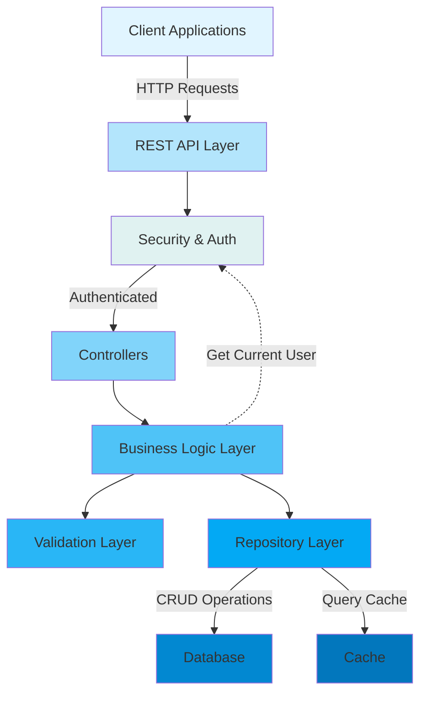
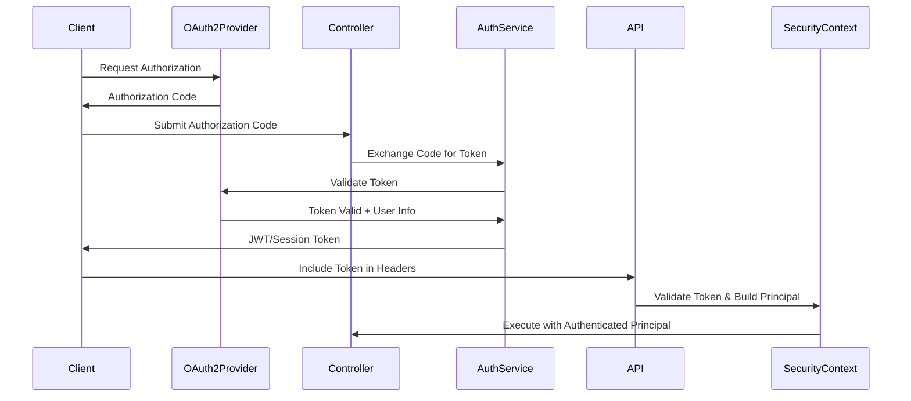
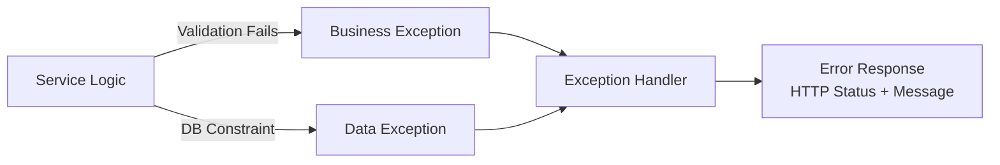
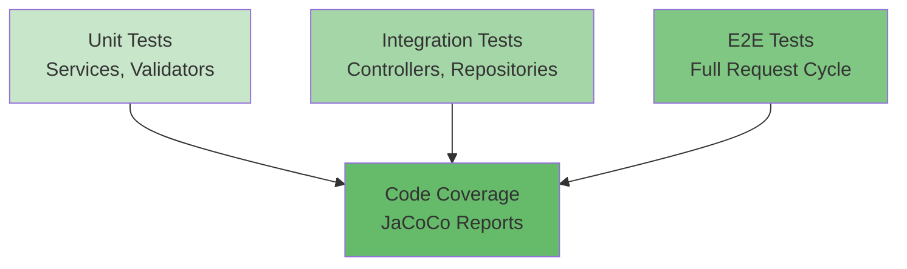

[⬅️ Back to Architecture Index](./index.html)

# Backend Architecture Overview

## Introduction

Smart Supply Pro's backend is a modern, Spring Boot-based inventory management system designed to handle complex supplier relationships, inventory tracking, and real-time stock analytics. The architecture emphasizes **scalability**, **maintainability**, and **security** through well-defined layers and clear separation of concerns.

> **👉 For a detailed breakdown of each architectural layer, see [Layers Architecture](./layers/overview.html)** - Comprehensive documentation of Controller, Service, Repository, Model, and Infrastructure layers with code examples and interaction patterns.

## System Architecture Diagram



## Core Layers

### 1. **API/Controller Layer**

The entry point for all HTTP requests. Controllers handle:
- **Request routing** - Maps HTTP endpoints to controller methods
- **DTO conversion** - Converts incoming JSON to DTOs
- **Response formatting** - Serializes domain objects to JSON
- **Basic parameter validation** - Spring's @Valid annotation

**Key Components:**
- `SupplierController` - Manages supplier CRUD operations
- `InventoryItemController` - Handles inventory item management
- `StockHistoryController` - Tracks stock changes and auditing
- `AnalyticsController` - Provides analytics and reporting endpoints
- `AuthController` - OAuth2 authentication endpoints

**Example Pattern:**
```java
@PostMapping("/suppliers")
@PreAuthorize("hasRole('ADMIN')")
public ResponseEntity<SupplierDTO> createSupplier(@Valid @RequestBody CreateSupplierDTO dto) {
    SupplierDTO created = supplierService.create(dto);
    return ResponseEntity.status(HttpStatus.CREATED).body(created);
}
```

### 2. **Service Layer**

Contains all business logic and orchestrates operations:
- **Business rule validation** - Complex validation beyond simple constraints
- **Transaction management** - Coordinates database operations
- **Cross-cutting concerns** - Logging, auditing, and exception mapping
- **Data transformation** - Converts between DTOs and entities
- **External integrations** - Calls to external APIs or services

**Key Services:**
- `SupplierService` - Supplier lifecycle management with deletion validation
- `InventoryItemService` - Item management with stock history tracking
- `StockHistoryService` - Audit trail and stock movement logging
- `AnalyticsService` - Financial analysis (WAC, FIFO) and reporting

**Design Patterns:**
- **Dependency Injection** - All dependencies autowired by Spring
- **Exception Translation** - Business exceptions mapped to HTTP status codes
- **Validation Helpers** - Separate helper classes for complex validations
- **Audit Logging** - Integration with audit service for tracking changes

### 3. **Validation Layer**

Multi-layer validation ensures data integrity:

**Layer 1 - Controller Level:** Spring's `@Valid` annotation with `@NotBlank`, `@NotNull`, etc.

**Layer 2 - Service Level:** Business rule validation
- Uniqueness checks (supplier name, item name)
- Relationship validation (items must have valid supplier)
- State validation (can't delete supplier with stock)

**Layer 3 - Repository Level:** Database constraints and unique indexes

**Validation Components:**
- `SupplierValidator` - Supplier-specific rules
- `InventoryItemValidator` - Item uniqueness and supplier validation
- Custom validators for enums and business rules

**Example:**
```java
public void validateUniquenessOnCreate(String name) {
    if (repository.existsByNameIgnoreCase(name)) {
        throw new IllegalStateException("Supplier name already exists: " + name);
    }
}
```

### 4. **Repository Layer**

Handles all database interactions:
- **CRUD operations** - Create, Read, Update, Delete entities
- **Custom queries** - Complex search and aggregation queries
- **Pagination** - Result set pagination for large datasets
- **Performance optimization** - Query optimization and indexing

**Key Repositories:**
- `SupplierRepository` - Supplier data access
- `InventoryItemRepository` - Inventory item data access with advanced search
- `StockHistoryRepository` - Stock movement audit trail and analytics
- `CustomQueryRepository` - Complex aggregation and analytics queries

**Spring Data JPA Features:**
- Automatic pagination support via `Pageable` interface
- Custom `@Query` methods for complex operations
- Method name conventions for simple queries
- Transaction management through `@Transactional`

### 5. **Data Layer**

The persistence tier with entities and relationships:
- `Supplier` - Supplier information and contact details
- `InventoryItem` - Product/inventory item data
- `StockHistory` - Audit trail of all stock movements
- JPA relationships with cascading and fetch strategies

**Key Design Decisions:**
- **Optimistic Locking** - Version fields prevent concurrent update conflicts
- **Soft Deletes** - Logical deletion instead of physical removal where needed
- **Audit Fields** - `createdAt`, `updatedAt`, `createdBy` tracking
- **Enum Columns** - Type-safe enumeration storage

## Authentication & Security

### OAuth2 Integration

Smart Supply Pro uses **OAuth2** for authentication with support for multiple providers (e.g., Google, GitHub).



### Authorization Model

**Role-Based Access Control (RBAC):**
- **ADMIN** - Full system access, can perform all operations
- **USER** - Limited access to inventory viewing and basic operations

**Implementation:**
```java
@PreAuthorize("hasRole('ADMIN')")
public void deleteSupplier(String id) { ... }

@PreAuthorize("hasRole('USER') or hasRole('ADMIN')")
public List<InventoryItemDTO> searchItems(String name) { ... }
```

### Request-Scoped Security

Each request is authenticated using Spring Security:
1. Token extracted from Authorization header
2. Token validated against OAuth2 provider
3. Principal (user) established in SecurityContext
4. @PreAuthorize checks performed before method execution
5. Audit information captured (`createdBy` field) from SecurityContext

## Exception Handling

Consistent exception handling throughout the application:



**Exception Hierarchy:**
- `IllegalArgumentException` → HTTP 400 Bad Request
- `IllegalStateException` → HTTP 409 Conflict
- `DataIntegrityViolationException` → HTTP 409 Conflict
- `EntityNotFoundException` → HTTP 404 Not Found
- `AccessDeniedException` → HTTP 403 Forbidden
- `Exception` → HTTP 500 Internal Server Error

**Example:**
```java
@ExceptionHandler(IllegalStateException.class)
public ResponseEntity<ErrorResponse> handleIllegalState(IllegalStateException ex) {
    return ResponseEntity.status(HttpStatus.CONFLICT)
        .body(new ErrorResponse("CONFLICT", ex.getMessage()));
}
```

## Data Flow Example: Creating an Inventory Item

Here's how a request flows through the architecture:

```
1. HTTP POST /inventory/items
   ↓
2. InventoryItemController.create(CreateItemDTO)
   - Validate DTO structure with @Valid
   ↓
3. InventoryItemService.save(CreateItemDTO)
   - Convert DTO to entity
   - Validate item name uniqueness
   - Validate supplier exists
   ↓
4. InventoryItemRepository.save(InventoryItem)
   - Database INSERT with constraints
   ↓
5. StockHistoryService.logInitialStock(InventoryItem)
   - Create audit entry
   ↓
6. Response: InventoryItemDTO with generated ID
```

## Key Design Patterns

### 1. **Dependency Injection**
All components use constructor injection for better testability and explicit dependencies.

### 2. **Repository Pattern**
Abstracts database access through repository interfaces, enabling easy testing with mocks.

### 3. **DTO Pattern**
Data Transfer Objects decouple API contracts from internal domain models.

### 4. **Service Locator (via Spring)**
Spring manages bean lifecycle and dependency resolution.

### 5. **Exception Translation**
Business exceptions translated to appropriate HTTP status codes and error responses.

### 6. **Validation Helpers**
Separate validator classes for complex business rule validation.

## Performance Considerations

1. **Pagination** - Large result sets are paginated by default
2. **Query Optimization** - Custom `@Query` methods for complex aggregations
3. **Caching** - Strategic caching of frequently accessed data
4. **Lazy Loading** - Careful management of JPA relationships to avoid N+1 queries
5. **Database Indexing** - Indexes on frequently searched columns (name, supplier, etc.)

## Scalability Strategy

1. **Stateless Services** - No session state on servers, enabling horizontal scaling
2. **Database Optimization** - Indexes and query optimization for performance
3. **Async Processing** - Long-running operations handled asynchronously
4. **Load Balancing** - Multiple instances can be deployed behind a load balancer
5. **Caching Layers** - Redis or similar for distributed caching

## Testing Architecture



**Testing Patterns:**
- **Unit Tests** - Mock all external dependencies, focus on logic
- **Integration Tests** - Use `@SpringBootTest` with TestContainers for databases
- **Mocking** - Mockito for service and repository mocking
- **Test Fixtures** - Builders and factory methods for test data

## Next Steps

1. **Explore [Layers Architecture](./layers/overview.html)** - Detailed breakdown of each layer (Controller, Service, Repository, Model, Infrastructure)
2. **Review [Controller Documentation](./controller/index.html)** - REST API endpoints, request/response shapes, and controller patterns
3. **Check [Configuration Management](./config/index.html)** - Application properties, profiles, environment setup
4. **Review [Security Architecture](./security.html)** - Detailed security implementation
5. **Check [Data Models](./model.html)** - Entity relationships and schema
6. **Study [Enums Reference](./enums/index.html)** - Type-safe enumerations and their business logic (Role, StockChangeReason, AuditSeverity)
7. **Study [DTOs & Data Transfer Objects](./dto/index.html)** - Comprehensive documentation of all DTOs with conventions, validation, mappers, pagination, and response patterns
8. **Study [Testing Strategy](./testing.html)** - Testing patterns and best practices
9. **Examine the source code** - Navigate `/src/main/java/com/smartsupplypro/inventory/`

---

[⬅️ Back to Architecture Index](./index.html)
