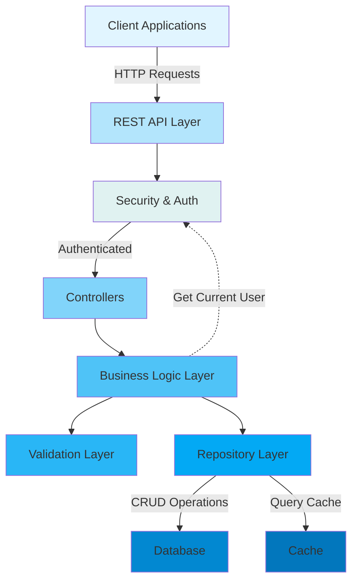
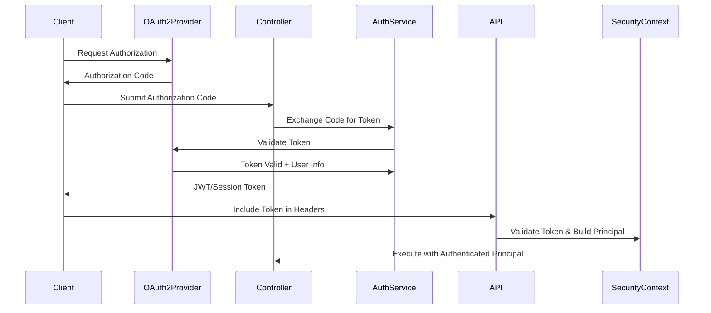
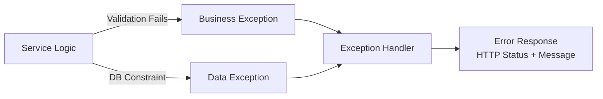
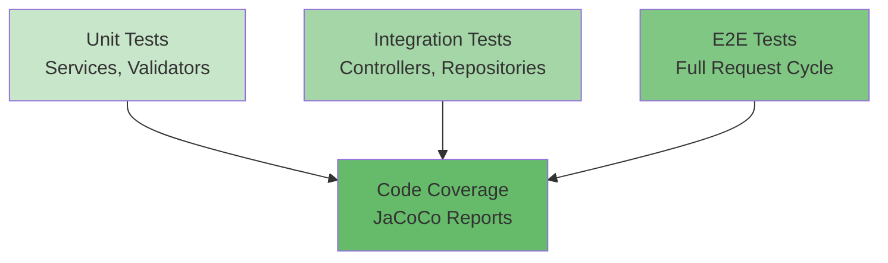

[⬅️ Back to Architecture Index](./index.html)

# Backend Architecture Overview

## Introduction

Smart Supply Pro's backend is a modern, Spring Boot-based inventory management system designed to handle complex supplier relationships, inventory tracking, and real-time stock analytics. The architecture emphasizes **scalability**, **maintainability**, and **security** through well-defined layers and clear separation of concerns.

> **👉 For visual diagrams of the architecture, see [Architectural Diagrams](./diagrams/index.html)** - Context diagram, logical layers, deployment topology, request flow, database schema, security flows, and analytics architecture.

> **👉 For a detailed breakdown of each architectural layer, see [Layers Architecture](./layers/overview.html)** - Comprehensive documentation of Controller, Service, Repository, Model, and Infrastructure layers with code examples and interaction patterns.

## System Architecture Diagram



## Core Layers

### 1. **API/Controller Layer**

The entry point for all HTTP requests. Controllers handle:
- **Request routing** - Maps HTTP endpoints to controller methods
- **DTO conversion** - Converts incoming JSON to DTOs
- **Response formatting** - Serializes domain objects to JSON
- **Basic parameter validation** - Spring's @Valid annotation

**Key Components:**
- `SupplierController` - Manages supplier CRUD operations
- `InventoryItemController` - Handles inventory item management
- `StockHistoryController` - Tracks stock changes and auditing
- `AnalyticsController` - Provides analytics and reporting endpoints
- `AuthController` - OAuth2 authentication endpoints

**Example Pattern:**
```java
@PostMapping("/suppliers")
@PreAuthorize("hasRole('ADMIN')")
public ResponseEntity<SupplierDTO> createSupplier(@Valid @RequestBody CreateSupplierDTO dto) {
    SupplierDTO created = supplierService.create(dto);
    return ResponseEntity.status(HttpStatus.CREATED).body(created);
}
```

### 2. **Service Layer**

Contains all business logic and orchestrates operations:
- **Business rule validation** - Complex validation beyond simple constraints
- **Transaction management** - Coordinates database operations
- **Cross-cutting concerns** - Logging, auditing, and exception mapping
- **Data transformation** - Converts between DTOs and entities
- **External integrations** - Calls to external APIs or services

**Key Services:**
- `SupplierService` - Supplier lifecycle management with deletion validation
- `InventoryItemService` - Item management with stock history tracking
- `StockHistoryService` - Audit trail and stock movement logging
- `AnalyticsService` - Financial analysis (WAC, FIFO) and reporting

**Design Patterns:**
- **Dependency Injection** - All dependencies autowired by Spring
- **Exception Translation** - Business exceptions mapped to HTTP status codes
- **Validation Helpers** - Separate helper classes for complex validations
- **Audit Logging** - Integration with audit service for tracking changes

### 3. **Validation Layer**

Multi-layer validation ensures data integrity:

**Layer 1 - Controller Level:** Spring's `@Valid` annotation with `@NotBlank`, `@NotNull`, etc.

**Layer 2 - Service Level:** Business rule validation
- Uniqueness checks (supplier name, item name)
- Relationship validation (items must have valid supplier)
- State validation (can't delete supplier with stock)

**Layer 3 - Repository Level:** Database constraints and unique indexes

**Validation Components:**
- `SupplierValidator` - Supplier-specific rules
- `InventoryItemValidator` - Item uniqueness and supplier validation
- Custom validators for enums and business rules

**Example:**
```java
public void validateUniquenessOnCreate(String name) {
    if (repository.existsByNameIgnoreCase(name)) {
        throw new IllegalStateException("Supplier name already exists: " + name);
    }
}
```

### 4. **Repository Layer**

Handles all database interactions:
- **CRUD operations** - Create, Read, Update, Delete entities
- **Custom queries** - Complex search and aggregation queries
- **Pagination** - Result set pagination for large datasets
- **Performance optimization** - Query optimization and indexing

**Key Repositories:**
- `SupplierRepository` - Supplier data access
- `InventoryItemRepository` - Inventory item data access with advanced search
- `StockHistoryRepository` - Stock movement audit trail and analytics
- `CustomQueryRepository` - Complex aggregation and analytics queries

**Spring Data JPA Features:**
- Automatic pagination support via `Pageable` interface
- Custom `@Query` methods for complex operations
- Method name conventions for simple queries
- Transaction management through `@Transactional`

### 5. **Data Layer**

The persistence tier with entities and relationships:
- `Supplier` - Supplier information and contact details
- `InventoryItem` - Product/inventory item data
- `StockHistory` - Audit trail of all stock movements
- JPA relationships with cascading and fetch strategies

**Key Design Decisions:**
- **Optimistic Locking** - Version fields prevent concurrent update conflicts
- **Soft Deletes** - Logical deletion instead of physical removal where needed
- **Audit Fields** - `createdAt`, `updatedAt`, `createdBy` tracking
- **Enum Columns** - Type-safe enumeration storage

## Authentication & Security

### OAuth2 Integration

Smart Supply Pro uses **OAuth2** for authentication with support for multiple providers (e.g., Google, GitHub).



### Authorization Model

**Role-Based Access Control (RBAC):**
- **ADMIN** - Full system access, can perform all operations
- **USER** - Limited access to inventory viewing and basic operations

**Implementation:**
```java
@PreAuthorize("hasRole('ADMIN')")
public void deleteSupplier(String id) { ... }

@PreAuthorize("hasRole('USER') or hasRole('ADMIN')")
public List<InventoryItemDTO> searchItems(String name) { ... }
```

### Request-Scoped Security

Each request is authenticated using Spring Security:
1. Token extracted from Authorization header
2. Token validated against OAuth2 provider
3. Principal (user) established in SecurityContext
4. @PreAuthorize checks performed before method execution
5. Audit information captured (`createdBy` field) from SecurityContext

## Exception Handling

Consistent, comprehensive exception handling throughout the application:

**Complete Exception Architecture Documentation:**

- **[Exception Architecture Index](./exception/index.md)** - Hub for all exception handling documentation
  - Exception types and classifications (framework vs. domain)
  - Handler execution flow and ordering
  - HTTP status code reference table
  - Error response structure and correlation IDs

- **[Global Exception Handler](./exception/global-exception-handler.md)** - Framework-level exception handling
  - 14 exception handler methods with implementation
  - Handler ordering strategy (HIGHEST_PRECEDENCE)
  - Validation errors (MethodArgumentNotValidException, ConstraintViolationException)
  - Parameter and format errors (HttpMessageNotReadableException, MissingServletRequestParameterException)
  - Authentication & authorization (AuthenticationException, AccessDeniedException)
  - Resource not found (NoSuchElementException)
  - Conflicts & concurrent updates (DataIntegrityViolationException, ObjectOptimisticLockingFailureException)
  - Sensitive data sanitization patterns
  - Testing strategies and examples

- **[Error Response Structure](./exception/error-response-structure.md)** - Standardized error DTO
  - JSON structure with machine-readable error tokens
  - Timestamp and correlation ID generation
  - Builder pattern implementation
  - Frontend integration patterns
  - Security considerations (no stack traces exposed)

- **[Exception to HTTP Mapping](./exception/exception-to-http-mapping.md)** - Complete reference guide
  - 400 Bad Request (validation, parameters, malformed JSON)
  - 401 Unauthorized (authentication failures)
  - 403 Forbidden (authorization failures)
  - 404 Not Found (missing resources)
  - 409 Conflict (duplicates, concurrent updates, state violations)
  - 500 Internal Server Error (unhandled exceptions)
  - Decision tree for status code selection
  - Frontend error handling patterns

- **[Domain Exceptions](./exception/domain-exceptions.md)** - Custom business exceptions
  - InvalidRequestException with validation severity levels
  - DuplicateResourceException with resource context
  - IllegalStateException for state violations
  - Factory methods for common scenarios
  - BusinessExceptionHandler integration
  - Testing and usage examples

- **[Validation Exceptions](./exception/validation-exceptions.md)** - Field-level validation errors
  - MethodArgumentNotValidException (request body validation)
  - ConstraintViolationException (constraint violations)
  - 14 JSR-380 validation annotations documented
  - Common validation scenarios (email, numeric, pattern, collection)
  - Spring validation integration
  - Custom validator implementation
  - Frontend error parsing patterns

- **[Security Exceptions](./exception/security-exceptions.md)** - Authentication & authorization
  - AuthenticationException (401) with security best practices
  - AccessDeniedException (403) handling
  - Generic error messaging (prevents user enumeration)
  - Server-side logging and correlation tracking
  - JWT validation patterns
  - Production logging checklist

- **[Guidelines & Best Practices](./exception/guidelines-and-best-practices.md)** - Developer guidelines
  - Decision tree: When to throw vs. return values
  - Choosing the right exception type
  - Writing effective error messages
  - 5 common anti-patterns to avoid
  - 4 recovery strategies (retry, graceful degradation, fail-fast, fallback)
  - Testing exception handling
  - Logging guidelines and standards
  - Complete developer checklist



## Data Flow Example: Creating an Inventory Item

Here's how a request flows through the architecture:

```
1. HTTP POST /inventory/items
   ↓
2. InventoryItemController.create(CreateItemDTO)
   - Validate DTO structure with @Valid
   ↓
3. InventoryItemService.save(CreateItemDTO)
   - Convert DTO to entity
   - Validate item name uniqueness
   - Validate supplier exists
   ↓
4. InventoryItemRepository.save(InventoryItem)
   - Database INSERT with constraints
   ↓
5. StockHistoryService.logInitialStock(InventoryItem)
   - Create audit entry
   ↓
6. Response: InventoryItemDTO with generated ID
```

## Key Design Patterns

### 1. **Dependency Injection**
All components use constructor injection for better testability and explicit dependencies.

### 2. **Repository Pattern**
Abstracts database access through repository interfaces, enabling easy testing with mocks.

### 3. **DTO Pattern**
Data Transfer Objects decouple API contracts from internal domain models.

### 4. **Service Locator (via Spring)**
Spring manages bean lifecycle and dependency resolution.

### 5. **Exception Translation**
Business exceptions translated to appropriate HTTP status codes and error responses.

### 6. **Validation Helpers**
Separate validator classes for complex business rule validation.

## Performance Considerations

1. **Pagination** - Large result sets are paginated by default
2. **Query Optimization** - Custom `@Query` methods for complex aggregations
3. **Caching** - Strategic caching of frequently accessed data
4. **Lazy Loading** - Careful management of JPA relationships to avoid N+1 queries
5. **Database Indexing** - Indexes on frequently searched columns (name, supplier, etc.)

## Scalability Strategy

1. **Stateless Services** - No session state on servers, enabling horizontal scaling
2. **Database Optimization** - Indexes and query optimization for performance
3. **Async Processing** - Long-running operations handled asynchronously
4. **Load Balancing** - Multiple instances can be deployed behind a load balancer
5. **Caching Layers** - Redis or similar for distributed caching

## Testing Architecture



**Testing Patterns:**
- **Unit Tests** - Mock all external dependencies, focus on logic
- **Integration Tests** - Use `@SpringBootTest` with TestContainers for databases
- **Mocking** - Mockito for service and repository mocking
- **Test Fixtures** - Builders and factory methods for test data

## Configuration & Resources

Smart Supply Pro uses **externalized configuration** to keep code independent from environment-specific settings:

**Key Configuration Areas:**

- **[Resources & Configuration](./resources/index.html)** - Hub for all configuration files and externalized properties
  - YAML/Properties files: `application.yml`, `application-prod.yml`, `application-test.yml`
  - Environment variables: Database credentials, OAuth2 keys, API URLs
  - Spring profiles: `test`, `prod` (no profile = local development)

- **[Application YAML & Properties](./resources/application-yaml-and-properties.html)** - Structure of Spring Boot configuration
  - Datasource config (driver, URL, credentials)
  - JPA/Hibernate settings (DDL auto, SQL logging)
  - OAuth2 provider registration (Google SSO)
  - Custom app properties (demo mode, frontend URLs)

- **[Environment-Specific Configuration](./resources/environment-specific-config.html)** - Profile-based configuration and .env setup
  - Local development (.env template with database/OAuth2 credentials)
  - Testing profile (H2 in-memory database, debug logging)
  - Production profile (Oracle Autonomous DB, optimized connection pooling)

- **[Logging Configuration](./resources/logging-config.html)** - Logger levels and output by environment
  - Development/Test: DEBUG/TRACE (SQL queries, security details)
  - Production: INFO (minimal logging for performance)

- **[Database Configuration & Oracle Wallet](./resources/database-config-and-oracle-wallet.html)** - Datasource setup and secure credential management
  - H2 for testing (Oracle-compatible mode)
  - Oracle Autonomous DB for production (wallet-based credentials)
  - HikariCP connection pooling (tuned for Fly.io RAM constraints)

- **[Static Resources & Templates](./resources/static-resources-and-templates.html)** - Explanation of API-only architecture
  - Backend is pure REST API (returns JSON, not HTML)
  - Frontend lives in `/frontend` (separate React/TypeScript application)
  - No server-side templates (Thymeleaf, etc.)

- **[Messages & Internationalization](./resources/messages-and-i18n.html)** - Externalized user-facing messages
  - Validation error messages (English, German)
  - Error codes and descriptions
  - Support for multiple languages via message properties files

## Deployment & Operations

Smart Supply Pro uses a **fully automated deployment pipeline** from source code to production cloud infrastructure:

**Complete Deployment Documentation:**

- **[Deployment Index](./deployment/index.html)** - Hub for all deployment and infrastructure documentation
  - End-to-end deployment flow: Source → Maven → Docker → Fly.io
  - Involved files, folders, and cross-references
  - Quick troubleshooting guide

- **[Build & Docker Image](./deployment/build-and-docker-image.html)** - How backend is compiled and packaged
  - Maven build pipeline (compile, test, package stages)
  - Multi-stage Dockerfile (builder stage, runtime stage)
  - Docker image validation and contents verification
  - Build arguments and environment-specific images

- **[CI/CD & Documentation Pipeline](./deployment/ci-cd-and-docs-pipeline.html)** - GitHub Actions automation
  - 1-ci-test.yml: Build, test, Docker image, security scanning
  - docs-pipeline.yml: Generate OpenAPI and architecture documentation
  - 2-deploy-ghpages.yml: Publish docs to GitHub Pages
  - Tools: Redocly, Pandoc, Lua filters for Mermaid diagrams
  - Artifact flow and GitHub Actions secrets

- **[Fly.io Infrastructure](./deployment/flyio-infrastructure.html)** - Cloud hosting configuration
  - fly.toml: App name, regions, machine resources, environment variables, secrets
  - Health checks and deployment strategies (immediate, canary, rolling)
  - Scaling and instance management
  - TLS/HTTPS configuration and domain setup
  - Troubleshooting common deployment issues

- **[Nginx & Routing](./deployment/nginx-and-routing.html)** - Reverse proxy and request routing
  - Nginx configuration structure and purpose
  - Reverse proxy to backend, frontend static file serving
  - SPA routing, GZIP compression, header forwarding
  - Multi-process container setup with start.sh
  - Performance tuning and connection pooling

- **[Environments & Secrets](./deployment/environments-and-secrets.html)** - Configuration management across environments
  - Local development (.env file, local database setup)
  - GitHub Actions CI (secrets vault, environment variables)
  - Fly.io production (encrypted secrets, environment configuration)
  - Secret mapping: ENV VAR → Spring property convention
  - Sensitive values checklist and protection strategies

- **[Logs & Observability](./deployment/logs-and-observability.html)** - Logging and debugging in production
  - SLF4J + Logback architecture
  - Log levels by environment (DEBUG dev, INFO prod)
  - Where logs go (console, files, Fly.io)
  - Viewing logs with flyctl CLI
  - Common logging patterns and troubleshooting
  - Future monitoring hooks (Micrometer, Sleuth, health checks)

## Next Steps

1. **Explore [Layers Architecture](./layers/overview.html)** - Detailed breakdown of each layer (Controller, Service, Repository, Model, Infrastructure)
2. **Review [Controller Documentation](./controller/index.html)** - REST API endpoints, request/response shapes, and controller patterns
3. **Study [Repository Layer](./repository/index.html)** - Data access abstraction with 7 repositories (SupplierRepository, InventoryItemRepository, StockHistoryRepository, AppUserRepository, plus 3 custom analytics mixins using JPQL and native SQL)
4. **Check [Configuration Management](./config/index.html)** - Application properties, profiles, environment setup
5. **Review [Security Architecture](./security/index.html)** - OAuth2 authentication, role-based access control, database encryption, Docker security, and demo mode
6. **Explore [Validation Framework](./validation/index.html)** - Multi-layer validation with JSR-380 constraints, custom validators, exception handling, and validation patterns
7. Check [Data Models](./model/index.html) - Comprehensive entity documentation (Supplier, InventoryItem, StockHistory, AppUser) with relationships, lifecycle, usage examples, and testing
8. Study [Enums Reference](./enums/index.html) - Type-safe enumerations and their business logic (Role, StockChangeReason, AuditSeverity)
9. Study [DTOs & Data Transfer Objects](./dto/index.html) - Comprehensive documentation of all DTOs with conventions, validation, mappers, pagination, and response patterns
10. Study [Testing Strategy](./testing.html) - Testing patterns and best practices
11. **Review [Deployment & Operations](./deployment/index.html)** - Complete deployment pipeline and infrastructure
12. Examine the source code - Navigate `/src/main/java/com/smartsupplypro/inventory/`

---

[⬅️ Back to Architecture Index](./index.html)
