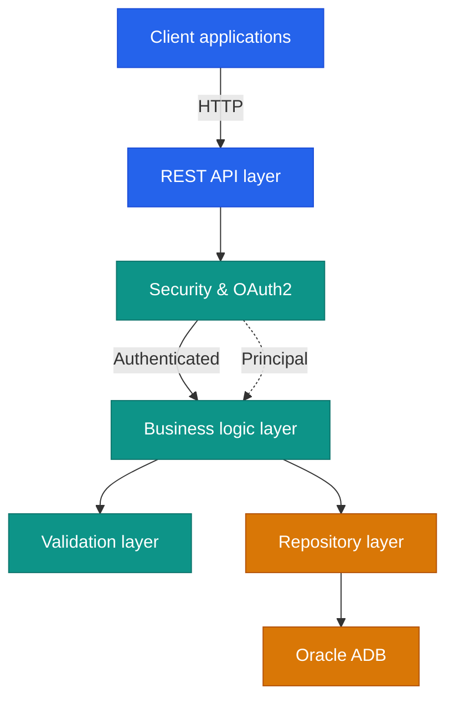
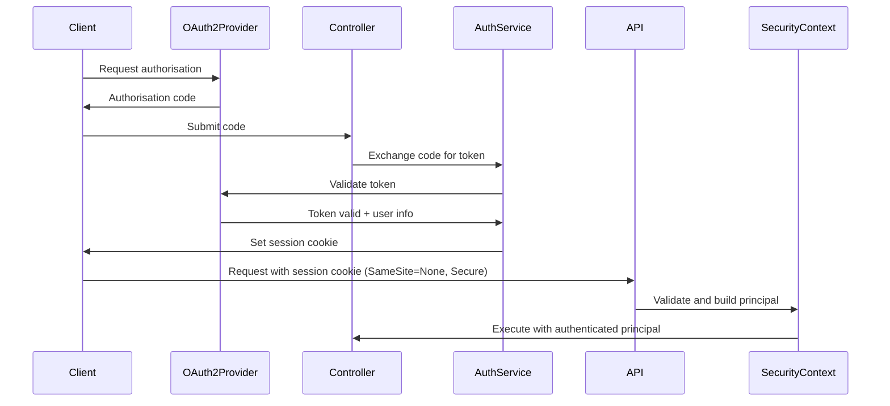
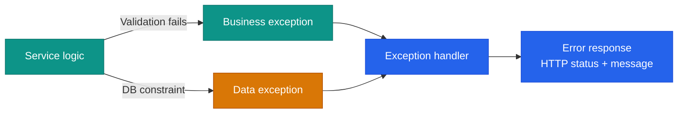
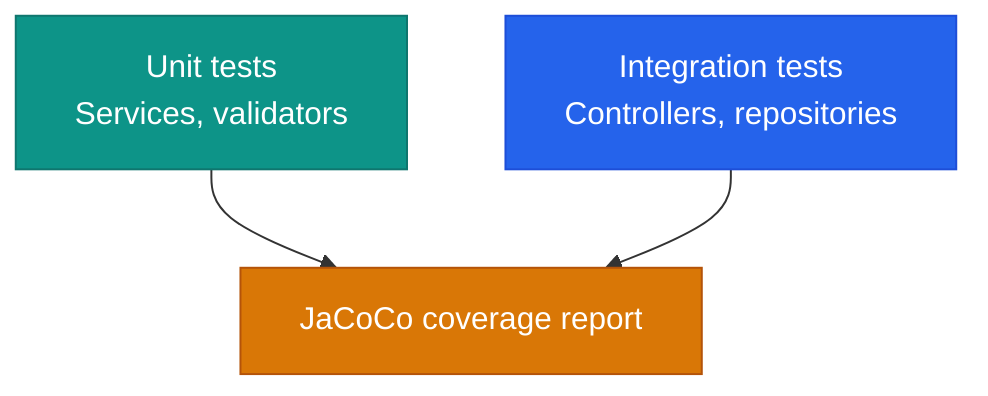

# Backend Architecture

Smart Supply Pro's backend is a Spring Boot service handling supplier relationships,
inventory tracking, and real-time stock analytics. The architecture prioritises
**security**, **maintainability**, and **clear separation of concerns** through
well-defined layers.

## Technology stack

| Component        | Technology                     | Version   |
|------------------|--------------------------------|-----------|
| Framework        | Spring Boot                    | 3.5.15    |
| Language         | Java                           | 17        |
| Database         | Oracle Autonomous Database     | 23ai      |
| Build tool       | Maven                          | 3.x+      |
| Testing          | JUnit 5, Mockito               | Latest    |
| Security         | Spring Security, OAuth2        | 3.5.x     |
| Containerisation | Docker                         | Latest    |

## Key architectural principles

1. **Separation of concerns** — clear boundaries between controller, service, repository, and data layers
2. **Dependency injection** — Spring manages all bean lifecycles and dependencies
3. **RESTful API design** — standard HTTP methods and status codes throughout
4. **Security first** — OAuth2 authentication with role-based access control (RBAC)
5. **Multi-layer validation** — from DTO annotation constraints down to database constraints
6. **Consistent exception handling** — uniform error response format with appropriate HTTP status codes
7. **Testability** — constructor injection and repository abstraction enable clean unit and integration tests
8. **Documentation** — Javadoc comments explaining *why*, not what; architectural docs generated by the pipeline

## System architecture


```mermaid
flowchart TB
  Client["Client applications"]:::controller
  API["REST API layer"]:::controller
  Security["Security & OAuth2"]:::service
  Service["Business logic layer"]:::service
  Validation["Validation layer"]:::service
  Repository["Repository layer"]:::repository
  Database["Oracle ADB"]:::repository

  Client -->|HTTP| API
  API --> Security
  Security -->|Authenticated| Service
  Service --> Validation
  Service --> Repository
  Repository --> Database
  Security -.->|Principal| Service

  classDef controller fill:#2563eb,color:#fff,stroke:#1d4ed8;
  classDef service    fill:#0d9488,color:#fff,stroke:#0f766e;
  classDef repository fill:#d97706,color:#fff,stroke:#b45309;
```

## Core layers

### Controller layer

Entry point for all HTTP requests. Handles request routing, DTO conversion,
response serialisation, and basic parameter validation via `@Valid`.

Key controllers: `SupplierController`, `InventoryItemController`,
`StockHistoryController`, `AnalyticsController`, `AuthController`.

```java
@PostMapping("/suppliers")
@PreAuthorize("hasRole('ADMIN')")
public ResponseEntity<SupplierDTO> createSupplier(@Valid @RequestBody CreateSupplierDTO dto) {
    return ResponseEntity.status(HttpStatus.CREATED).body(supplierService.create(dto));
}
```

### Service layer

Contains all business logic and orchestrates operations: business rule validation,
transaction management, data transformation, and audit logging.

Key services: `SupplierService`, `InventoryItemService`, `StockHistoryService`,
`AnalyticsService` (WAC and FIFO financial analysis).

### Validation layer

Three distinct tiers ensure data integrity:

- **Controller level** — JSR-380 annotations (`@NotBlank`, `@NotNull`, etc.) via `@Valid`
- **Service level** — uniqueness checks, relationship validation, state guards
- **Database level** — constraints and unique indexes as the final safety net

### Repository layer

Spring Data JPA repositories with custom `@Query` methods for complex aggregations,
`Pageable` support for large result sets, and `@Transactional` management.

Key repositories: `SupplierRepository`, `InventoryItemRepository`,
`StockHistoryRepository`, plus custom analytics mixins using JPQL and native SQL.

### Data layer

JPA entities with audit fields
(`createdAt`, `createdBy`) set via `@PrePersist` / `@CreationTimestamp`, and type-safe enum columns.

Entities: `Supplier`, `InventoryItem`, `StockHistory`, `AppUser`.

## Authentication and security

OAuth2 authentication with Google as the provider. Spring Security validates each
request token, builds the principal in `SecurityContext`, and enforces RBAC via
`@PreAuthorize`.

**Roles:**
- `ADMIN` — full system access
- `USER` — inventory viewing and basic operations


```mermaid
sequenceDiagram
  Client->>OAuth2Provider: Request authorisation
  OAuth2Provider->>Client: Authorisation code
  Client->>Controller: Submit code
  Controller->>AuthService: Exchange code for token
  AuthService->>OAuth2Provider: Validate token
  OAuth2Provider->>AuthService: Token valid + user info
  AuthService->>Client: Set session cookie
  Client->>API: Request with session cookie (SameSite=None, Secure)
  API->>SecurityContext: Validate and build principal
  SecurityContext->>Controller: Execute with authenticated principal
```

## Exception handling

Business exceptions and framework exceptions are both routed through a global
`@ControllerAdvice` handler, producing a consistent error response — HTTP status,
the HTTP status code carries the result and the body holds exactly three fields: a machine-readable error token, a human-readable message, and a timestamp. There is no correlation ID, and stack traces are never exposed in responses.


```mermaid
flowchart LR
  Service["Service logic"]:::service
  BusinessEx["Business exception"]:::service
  DataEx["Data exception"]:::repository
  Handler["Exception handler"]:::controller
  Response["Error response\nHTTP status + message"]:::controller

  Service -->|Validation fails| BusinessEx
  Service -->|DB constraint| DataEx
  BusinessEx --> Handler
  DataEx --> Handler
  Handler --> Response

  classDef controller fill:#2563eb,color:#fff,stroke:#1d4ed8;
  classDef service    fill:#0d9488,color:#fff,stroke:#0f766e;
  classDef repository fill:#d97706,color:#fff,stroke:#b45309;
```

## Data flow: creating an inventory item

```
POST /inventory/items
  → InventoryItemController   validates DTO structure (@Valid)
  → InventoryItemService      converts DTO, checks name uniqueness, validates supplier
  → InventoryItemRepository   INSERT with database constraints
  → StockHistoryService       writes audit entry for initial stock
  → Response                  InventoryItemDTO with generated ID
```

## Key design patterns

| Pattern | Purpose |
|---|---|
| Constructor injection | Explicit dependencies; easier unit testing without Spring context |
| Repository abstraction | Swappable data access; mockable in service tests |
| DTO pattern | Decouples API contract from internal domain model |
| Exception translation | Business exceptions mapped to HTTP status codes at one boundary |
| Validation helpers | Complex business rules isolated in dedicated validator classes |
| Audit logging | `createdAt` set by `@PrePersist` / `@CreationTimestamp`; `createdBy` defaulted to `"system"` in `@PrePersist`, or set by the service before persist |

## Performance considerations

- **Pagination** — all list endpoints accept `Pageable`; unbounded queries are blocked
- **`@EntityGraph`** — used on hot paths to avoid N+1 queries
- **Custom `@Query`** — native SQL for complex aggregations where JPQL falls short
- **HikariCP tuning** — connection pool sized for Fly.io RAM constraints
- **Stateless services** — no server-side session state; horizontal scaling is straightforward

## Testing


```mermaid
flowchart TB
  Unit["Unit tests\nServices, validators"]:::service
  Integration["Integration tests\nControllers, repositories"]:::controller
  Coverage["JaCoCo coverage report"]:::repository

  Unit --> Coverage
  Integration --> Coverage

  classDef controller fill:#2563eb,color:#fff,stroke:#1d4ed8;
  classDef service    fill:#0d9488,color:#fff,stroke:#0f766e;
  classDef repository fill:#d97706,color:#fff,stroke:#b45309;
```

- **Unit tests** — Mockito mocks for all external dependencies; focus on business logic
- **Integration tests** — `@SpringBootTest` with H2 (Oracle-compatible mode)
- **Test fixtures** — builder and factory methods for repeatable test data

## Configuration

Spring Boot externalised configuration via `application.yml` with three profiles:

- *(no profile)* — local development, H2 in-memory database
- `test` — H2 in Oracle-compatible mode, DEBUG logging
- `prod` — Oracle Autonomous Database via wallet authentication, INFO logging

Environment-specific secrets (OAuth2 keys, database credentials) are injected via
environment variables and never committed to source control.

## Deployment

The backend is deployed to **Fly.io** via a fully automated GitHub Actions pipeline:

```
Source push
  → 1-ci-test.yml         Maven build, JUnit tests, JaCoCo coverage
  → 2-docker-backend.yml  Docker image build, Trivy CVE scan, push to Docker Hub
  → 4-deploy-fly.yml      Deploy pre-built image to Fly.io, health check
```

The Docker image contains only the production JAR and `start.sh`; no test sources
or documentation are included.
