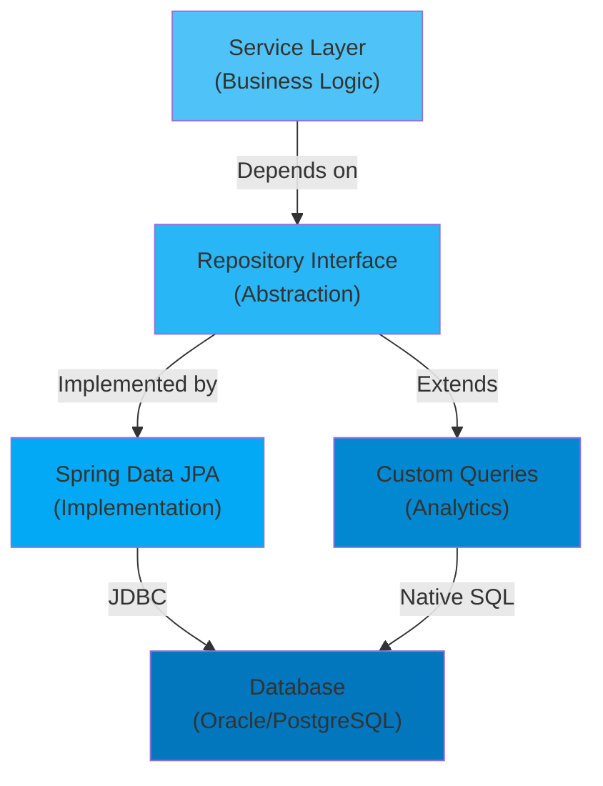

[⬅️ Back to Architecture Index](../index.html)

# Repository Layer

## Overview

The Repository Layer is the **data access abstraction** that handles all database operations. It implements the Repository Pattern, providing a collection-like interface for accessing persisted entities while isolating the database specifics from business logic.

**Core Principle:** Repositories enable domain-driven design by providing an abstraction that makes the domain model independent of data access concerns.

---

## Architecture



---

## Quick Navigation

### Core Repositories

| Repository | Purpose | Key Methods | Documentation |
|------------|---------|------------|---------------|
| **SupplierRepository** | Supplier CRUD & search | findByNameIgnoreCase, existsByNameIgnoreCase | [Read →](./supplier-repository.html) |
| **InventoryItemRepository** | Item CRUD with analytics | findByNameSortedByPrice, findItemsBelowMinimumStockFiltered | [Read →](./inventory-item-repository.html) |
| **StockHistoryRepository** | Stock audit trail & trends | findByItemIdOrderByTimestampDesc, findFiltered, getPriceTrend | [Read →](./stock-history-repository.html) |
| **AppUserRepository** | OAuth2 user management | findByEmail, count | [Read →](./app-user-repository.html) |

### Custom Analytics Repositories

| Repository | Purpose | Key Methods | Documentation |
|------------|---------|------------|---------------|
| **StockMetricsRepository** | KPI dashboard metrics | getTotalStockBySupplier, getUpdateCountByItem | [Read →](./stock-metrics-repository.html) |
| **StockTrendAnalyticsRepository** | Time-series analytics | getMonthlyStockMovement, getDailyStockValuation, getItemPriceTrend | [Read →](./stock-trend-analytics-repository.html) |
| **StockDetailQueryRepository** | Advanced filtering & WAC | searchStockUpdates, streamEventsForWAC | [Read →](./stock-detail-query-repository.html) |

---

## Design Patterns

### 1. Repository Pattern

**What it is:**
A repository mediates between the domain and data mapping layers, acting like an in-memory collection of domain objects.

**Benefits:**
- ✅ Centralizes database access logic
- ✅ Makes business logic independent of data access
- ✅ Simplifies unit testing (easy to mock)
- ✅ Supports multiple data sources with same interface

**Implementation:**
```java
public interface SupplierRepository extends JpaRepository<Supplier, String> {
    Optional<Supplier> findByNameIgnoreCase(String name);
    boolean existsByNameIgnoreCase(String name);
}
```

### 2. Spring Data JPA

All repositories extend `JpaRepository<Entity, ID>` which provides:

**Inherited Methods:**
```java
// Create/Update
save(entity)           // Persist or update
saveAll(entities)      // Batch persist

// Read
findById(id)           // Optional<Entity>
findAll()              // List<Entity>
exists(id)             // boolean

// Delete (discouraged in this system)
deleteById(id)         // void
delete(entity)         // void
```

**Query Methods:**
Spring Data derives queries from method names:
```java
// Method name → Generated SQL
findByNameIgnoreCase(String name)
→ SELECT * FROM supplier WHERE LOWER(name) = LOWER(?)

existsBySupplierIdAndQuantityGreaterThan(String id, int qty)
→ SELECT COUNT(*) > 0 FROM inventory_item 
  WHERE supplier_id = ? AND quantity > ?
```

### 3. Custom Queries with @Query

For complex queries, use explicit `@Query`:

**JPQL (Java Persistence Query Language):**
```java
@Query("""
    SELECT COUNT(i)
    FROM InventoryItem i
    WHERE COALESCE(i.quantity, 0) < :threshold
""")
long countWithQuantityBelow(@Param("threshold") int threshold);
```

**Native SQL (for performance):**
```java
@Query(value = """
    SELECT name, quantity, minimum_quantity
    FROM inventory_item
    WHERE quantity < minimum_quantity
    ORDER BY quantity ASC
""", nativeQuery = true)
List<Object[]> findItemsBelowMinimumStock();
```

### 4. Custom Repository Extensions

For specialized analytics, create intermediate interfaces:

```java
// Marker interface for custom implementation
public interface StockMetricsRepository {
    List<Object[]> getTotalStockBySupplier();
}

// Main repository extends custom interface
public interface StockHistoryRepository extends JpaRepository<StockHistory, String>,
                                                 StockMetricsRepository {
}

// Custom implementation (separate class)
@Repository
public class StockHistoryRepositoryCustom implements StockMetricsRepository {
    @Autowired private EntityManager em;
    
    @Override
    public List<Object[]> getTotalStockBySupplier() {
        // Complex query implementation
    }
}
```

---

## Repository Hierarchy

```
JpaRepository<Entity, ID>
├── Standard CRUD methods
├── Pagination support
└── Custom @Query support
    │
    ├── SupplierRepository
    │   └── Simple searches (name-based)
    │
    ├── InventoryItemRepository
    │   └── Stock analysis queries
    │
    ├── StockHistoryRepository
    │   ├── Extends StockMetricsRepository
    │   ├── Extends StockTrendAnalyticsRepository
    │   └── Extends StockDetailQueryRepository
    │
    └── AppUserRepository
        └── OAuth2 user lookups
```

---

## Repositories by Concern

### Entity CRUD Repositories

**Standard create, read, update, delete operations:**

- `SupplierRepository` - Supplier management
- `InventoryItemRepository` - Inventory item management
- `StockHistoryRepository` - Stock history logging
- `AppUserRepository` - User account management

### Custom Analytics Repositories

**Extended repositories for complex business logic:**

- `StockMetricsRepository` - KPI metrics and dashboard data
- `StockTrendAnalyticsRepository` - Time-series analysis and reporting
- `StockDetailQueryRepository` - Advanced filtering and cost-flow algorithms

---

## Key Design Decisions

### 1. Immutable Append-Only StockHistory

**Design:** StockHistory records are never updated or deleted, only created.

**Benefits:**
- Audit compliance (tamper-proof)
- No concurrent update conflicts
- Optimized for append-only performance
- Historical accuracy preserved

**Implementation:**
```java
// Repository only saves, never updates/deletes
StockHistory created = stockHistoryRepository.save(history);
// No update or delete methods exposed
```

### 2. Lazy Loading with FetchType.LAZY

**Design:** Foreign key relationships use `FetchType.LAZY` by default.

**Rationale:**
- Prevents N+1 query problems
- Allows flexibility in query optimization
- Supports explicit eager loading when needed

**Access Pattern:**
```java
// Must be within @Transactional to access lazy fields
@Transactional(readOnly = true)
public String getSupplierName(String itemId) {
    InventoryItem item = repository.findById(itemId).get();
    return item.getSupplier().getName();  // Lazy loaded
}
```

### 3. Pagination for Large Result Sets

**Design:** All search/list endpoints use pagination.

**Benefit:** Prevents memory overload with large datasets.

**Implementation:**
```java
Page<InventoryItem> results = repository.findByNameContainingIgnoreCase(
    "widget", 
    PageRequest.of(0, 20)  // Page 0, 20 items per page
);

// Convenient properties
results.getContent()         // List<InventoryItem>
results.getTotalElements()   // long
results.getTotalPages()      // int
results.hasNext()            // boolean
```

### 4. Case-Insensitive Searches

**Design:** All text searches use `IgnoreCase` variants.

**Rationale:**
- User-friendly (don't require exact casing)
- Prevents duplicate entries (e.g., "ACME", "acme", "Acme")
- Industry standard for inventory systems

**Implementation:**
```java
// Method-derived query
List<Supplier> suppliers = repository.findByNameContainingIgnoreCase("acme");

// Works for: "ACME", "acme", "AcMe", "Acme Corporation"
```

### 5. Native SQL for Performance-Critical Queries

**Design:** Complex analytics use native SQL for optimization.

**Rationale:**
- JPQL can generate suboptimal queries
- Native SQL allows database-specific optimizations
- Critical for dashboard performance

**Example:**
```java
@Query(value = """
    SELECT s.name, SUM(sh.change) as total
    FROM stock_history sh
    JOIN inventory_item i ON sh.item_id = i.id
    JOIN supplier s ON i.supplier_id = s.id
    WHERE sh.reason = 'PURCHASE'
    GROUP BY s.id, s.name
    ORDER BY total DESC
""", nativeQuery = true)
List<Object[]> getSupplierDeliveryStats();
```

---

## Common Query Patterns

### 1. Find by Exact Value (Case-Insensitive)

```java
// Supplier by name
Optional<Supplier> supplier = repository.findByNameIgnoreCase("ACME Corp");

// Item by name
List<InventoryItem> items = repository.findByNameIgnoreCase("Widget A");
```

### 2. Search by Partial Match

```java
// Paginated search
Page<InventoryItem> results = repository.findByNameContainingIgnoreCase(
    "wid",  // matches "Widget", "Widgets", etc.
    PageRequest.of(0, 20)
);

// All matches (no pagination)
List<Supplier> suppliers = repository.findByNameContainingIgnoreCase("corp");
```

### 3. Check Existence with Conditions

```java
// Does supplier have items?
boolean hasItems = repository.existsBySupplier_Id(supplierId);

// Does supplier have items with stock above threshold?
boolean hasStock = repository.existsBySupplier_IdAndQuantityGreaterThan(
    supplierId, 
    minimumQuantity
);

// Check for duplicates
boolean exists = repository.existsByNameAndPrice(name, price);
```

### 4. Paginated Queries with Filters

```java
// Multiple filter criteria
Page<StockHistory> history = repository.findFiltered(
    startDate,      // Optional: LocalDateTime
    endDate,        // Optional: LocalDateTime
    itemName,       // Optional: String (partial match)
    supplierId,     // Optional: String
    PageRequest.of(pageNumber, pageSize)
);
```

### 5. Ordered Results

```java
// Newest first (for audit trails)
List<StockHistory> recent = repository
    .findByItemIdOrderByTimestampDesc(itemId);

// Sorting by business logic
Page<InventoryItem> sorted = repository
    .findByNameSortedByPrice("widget", pageable);
```

### 6. Time-Range Queries

```java
// Price trend over date range
List<PriceTrendDTO> trend = repository.getPriceTrend(
    itemId,
    LocalDateTime.of(2024, 1, 1, 0, 0),
    LocalDateTime.of(2024, 3, 31, 23, 59)
);

// Monthly aggregations
List<Object[]> monthly = repository.getMonthlyStockMovement(start, end);
```

---

## Performance Optimization Strategies

### 1. Indexes

Database indexes on frequently queried columns:

```sql
-- From entity @Index annotations
CREATE INDEX IX_SUPPLIER_NAME ON SUPPLIER(NAME);
CREATE INDEX IX_ITEM_NAME ON INVENTORY_ITEM(NAME);
CREATE INDEX IX_ITEM_SUPPLIER_ID ON INVENTORY_ITEM(SUPPLIER_ID);
CREATE INDEX IX_SH_ITEM_TS ON STOCK_HISTORY(ITEM_ID, CREATED_AT);
CREATE INDEX IX_SH_TS ON STOCK_HISTORY(CREATED_AT);
CREATE INDEX IX_SH_SUPPLIER_TS ON STOCK_HISTORY(SUPPLIER_ID, CREATED_AT);
```

### 2. Query Projection

Return only needed fields, not entire entities:

```java
// ❌ Inefficient: Load entire entities
List<Supplier> suppliers = repository.findAll();

// ✅ Efficient: Project specific fields
@Query("SELECT new SupplierDTO(s.id, s.name) FROM Supplier s")
List<SupplierDTO> findAllForListing();
```

### 3. Join Optimization

Use FETCH joins to prevent N+1 queries:

```java
// ❌ N+1 problem: 1 query for items + N queries for suppliers
List<InventoryItem> items = repository.findAll();
for (InventoryItem item : items) {
    System.out.println(item.getSupplier().getName());  // N queries!
}

// ✅ Single query with join
@Query("""
    SELECT DISTINCT i FROM InventoryItem i
    LEFT JOIN FETCH i.supplier
""")
List<InventoryItem> findAllWithSuppliers();
```

### 4. Pagination

Limit result set size:

```java
// Get page 0 with 20 items
Pageable pageable = PageRequest.of(0, 20);
Page<InventoryItem> page = repository.findAll(pageable);

// Check for more pages
if (page.hasNext()) {
    Page<InventoryItem> nextPage = repository.findAll(
        page.nextPageable()
    );
}
```

---

## Testing Repositories

### Unit Tests with @DataJpaTest

```java
@DataJpaTest
class SupplierRepositoryTest {
    
    @Autowired
    private SupplierRepository repository;
    
    @Test
    void testFindByNameIgnoreCase() {
        Supplier supplier = Supplier.builder()
            .name("Test Supplier")
            .email("test@example.com")
            .createdBy("test")
            .createdAt(LocalDateTime.now())
            .build();
        
        repository.save(supplier);
        
        Optional<Supplier> found = repository.findByNameIgnoreCase("test supplier");
        assertTrue(found.isPresent());
        assertEquals("Test Supplier", found.get().getName());
    }
}
```

### Integration Tests with Full Context

```java
@SpringBootTest
class InventoryItemRepositoryIT {
    
    @Autowired
    private InventoryItemRepository repository;
    
    @Test
    void testFindBelowMinimumStock() {
        // Create test data
        InventoryItem item = createTestItem();
        item.setQuantity(5);
        item.setMinimumQuantity(10);
        repository.save(item);
        
        // Test query
        List<Object[]> results = repository
            .findItemsBelowMinimumStockFiltered(null);
        
        assertEquals(1, results.size());
    }
}
```

---

## Best Practices

✅ **DO:**
- Use method-derived queries for simple operations
- Use @Query for complex operations
- Use pagination for list endpoints
- Use case-insensitive searches
- Document custom query logic with JavaDoc
- Test repository methods in isolation
- Use lazy loading for relationships
- Use native SQL when JPQL is inefficient

❌ **DON'T:**
- Load all entities without pagination
- Create circular relationship fetches
- Use eager loading by default (causes N+1)
- Ignore database indexes
- Write business logic in repositories
- Use repositories in controllers directly (use services)
- Ignore null values in optional parameters
- Create super repositories (split by concern)

---

## Entity-Repository Mapping

| Entity | Repository | Purpose |
|--------|------------|---------|
| `Supplier` | `SupplierRepository` | Supplier CRUD & search |
| `InventoryItem` | `InventoryItemRepository` | Item CRUD with analytics |
| `StockHistory` | `StockHistoryRepository` | Stock audit with metrics & trends |
| `AppUser` | `AppUserRepository` | OAuth2 user management |

---

## Next Steps

1. **Explore Core Repositories:**
   - [SupplierRepository](./supplier-repository.html) - Supplier data access
   - [InventoryItemRepository](./inventory-item-repository.html) - Inventory queries
   - [StockHistoryRepository](./stock-history-repository.html) - Audit trail access
   - [AppUserRepository](./app-user-repository.html) - User management

2. **Explore Custom Analytics:**
   - [StockMetricsRepository](./stock-metrics-repository.html) - KPI metrics
   - [StockTrendAnalyticsRepository](./stock-trend-analytics-repository.html) - Time-series data
   - [StockDetailQueryRepository](./stock-detail-query-repository.html) - Advanced filtering

3. **Related Documentation:**
   - [Data Models & Entities](../model/index.html) - Entity definitions
   - [Service Layer](../layers/service-layer.html) - Business logic
   - [Database Schema](../deployment.html) - Database design

---

[⬅️ Back to Architecture Index](../index.html)
