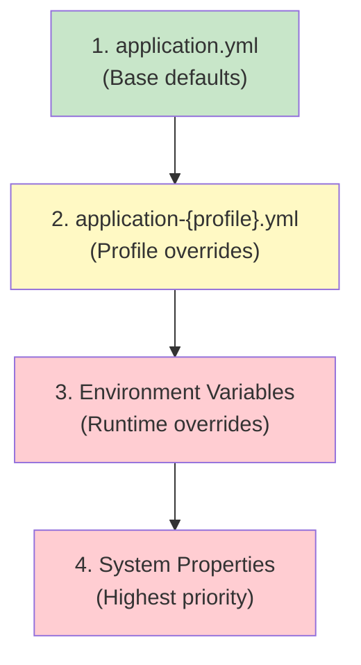
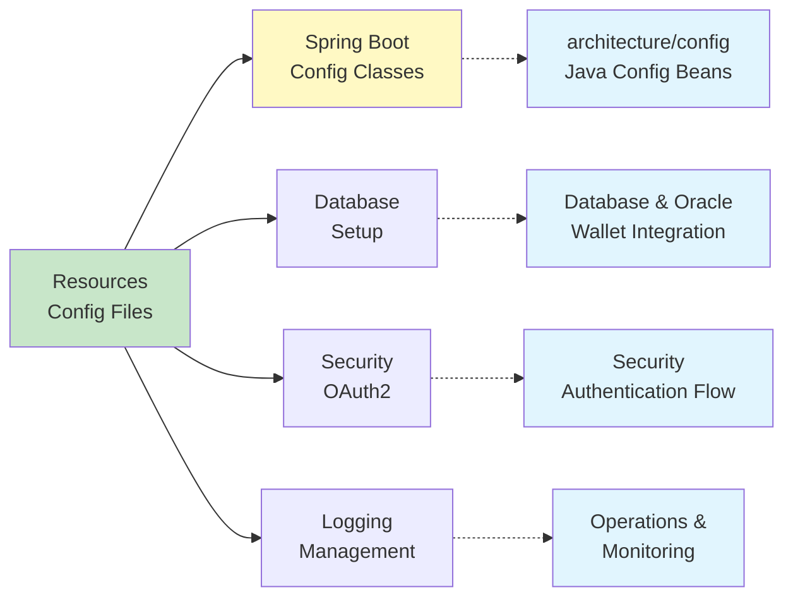

[⬅️ Back to Architecture Index](../index.html)

# Resources Architecture

**Overview:** This section documents all externalized configuration and resource files used by the Spring Boot application, including profiles, environment variables, logging, and database configuration.

---

## Table of Contents

1. [Resources Folder Purpose](#resources-folder-purpose)
2. [File Mapping](#file-mapping)
3. [Configuration Hierarchy](#configuration-hierarchy)
4. [Environment Variables](#environment-variables)
5. [Related Configuration](#related-configuration)
6. [Quick Navigation](#quick-navigation)

---

## Resources Folder Purpose

The `src/main/resources/` folder contains all externalized configuration that **varies by environment** or **sensitive data injected at runtime**. This keeps application behavior flexible without recompilation.

```
Principle: Code → Compiled once
          Configuration → Injected per environment
          Secrets → Managed externally
```

### What Goes in Resources

✅ **Configuration Files:**
- `application.yml` - Base config for all profiles
- `application-prod.yml` - Production overrides
- `application-test.yml` - Test overrides
- `application.properties` - Application metadata

✅ **Environment-Specific:**
- `.env.example` - Template for local development
- `fly.toml` - Fly.io deployment config (root)
- Oracle Wallet path references (to `/oracle_wallet`)

❌ **What Does NOT Go Here:**
- Secrets (OAuth2 tokens, DB passwords) - use environment variables
- Build artifacts - use `target/` directory
- Static HTML/CSS - backend is API-only; see `/frontend`
- Java code - use `src/main/java/`

---

## File Mapping

### Spring Boot Configuration Files

| File | Profile | Purpose | Use Case |
|------|---------|---------|----------|
| **application.yml** | All | Base defaults, shared config | Common settings, OAuth2 provider URLs, server setup |
| **application-prod.yml** | `prod` | Production overrides | Oracle connection pool, performance tuning, security |
| **application-test.yml** | `test` | Test overrides | H2 in-memory DB, debug logging, test data |
| **application.properties** | All | App metadata | Application name only |

### Environment & Deployment Files

| File | Location | Purpose | Used By |
|------|----------|---------|---------|
| **.env.example** | Root | Template for local development | Developers setting up locally |
| **fly.toml** | Root | Fly.io deployment config | CI/CD and cloud deployment |

### Database & Oracle Files (References)

| Location | Purpose | Role in Resources |
|----------|---------|-------------------|
| **/oracle_wallet** | Oracle Wallet (TNS_ADMIN) | Referenced via env var `TNS_ADMIN` |
| **/lib/ojdbc11.jar** | Oracle JDBC driver | Maven dependency, not in resources |

---

## Configuration Hierarchy

### How Spring Boot Loads Configuration



### Example: Database Configuration

**application.yml:**
```yaml
spring:
  datasource:
    url: ${DB_URL}              # Placeholder - actual value from env
    username: ${DB_USER}        # Placeholder - actual value from env
    password: ${DB_PASS}        # Placeholder - actual value from env
```

**application-test.yml:**
```yaml
spring:
  datasource:
    url: jdbc:h2:mem:ssp;...    # Override: H2 in-memory for tests
    driver-class-name: org.h2.Driver
```

**Local Environment (export or .env):**
```bash
export DB_URL=jdbc:oracle:thin:@localhost:1521/xe
export DB_USER=inventory_admin
export DB_PASS=secret123
```

**Result at Runtime:**
- `test` profile → H2 (from application-test.yml)
- local dev (no profile) → Oracle (from environment variables)
- production → Oracle (from fly.toml secrets)

---

## Environment Variables

### Required Variables by Profile

#### Production (via fly.toml)
```toml
[env]
  SPRING_PROFILES_ACTIVE = "prod"
  DB_URL = "jdbc:oracle:thin:@..."
  DB_USER = "admin"
  DB_PASS = "***"
  SPRING_SECURITY_OAUTH2_CLIENT_REGISTRATION_GOOGLE_CLIENT_ID = "***"
  SPRING_SECURITY_OAUTH2_CLIENT_REGISTRATION_GOOGLE_CLIENT_SECRET = "***"
  TNS_ADMIN = "/path/to/wallet"
```

#### Local Development (via .env.example)
```bash
# Database (Oracle or PostgreSQL)
DB_URL=jdbc:oracle:thin:@localhost:1521/xe
DB_USER=inventory_admin
DB_PASS=password

# OAuth2
SPRING_SECURITY_OAUTH2_CLIENT_REGISTRATION_GOOGLE_CLIENT_ID=your_client_id
SPRING_SECURITY_OAUTH2_CLIENT_REGISTRATION_GOOGLE_CLIENT_SECRET=your_secret

# Oracle Wallet (if using Oracle Autonomous DB)
TNS_ADMIN=/path/to/wallet
ORACLE_WALLET_PASSWORD=wallet_password
```

#### Testing
```bash
export SPRING_PROFILES_ACTIVE=test
# H2 database configured in application-test.yml - no DB_URL needed
```

### How Variables Are Referenced

**Pattern:** `${VARIABLE_NAME}` in YAML/properties files

**With Default Values:** `${APP_DEMO_READONLY:true}`
- If `APP_DEMO_READONLY` not set, use `true` as default

**Example from application.yml:**
```yaml
app:
  demo-readonly: ${APP_DEMO_READONLY:true}   # Default: true if not set
  frontend:
    base-url: ${APP_FRONTEND_BASE_URL:https://localhost:5173}  # Default for local dev
```

---

## Related Configuration

### How Resources Connect to Other Documentation



### Java Configuration Classes

Resources are **loaded by Spring** into `@ConfigurationProperties` and `@Value` fields:

| Resource Config | Java Class | Purpose |
|-----------------|-----------|---------|
| `spring.datasource.*` | `DataSourceProperties` (Spring) | Database connection |
| `spring.security.oauth2.*` | `OAuth2ClientProperties` (Spring) | OAuth2 registration |
| `app.*` | `AppProperties` | Custom app configuration |

**See:** [Configuration (Java) Documentation](../config/index.html)

### Oracle Wallet Integration

Database credentials are stored in Oracle Wallet instead of hardcoded:

| Resource | Purpose | Documentation |
|----------|---------|---|
| `/oracle_wallet` | Physical wallet files (encrypted) | [Database & Oracle Wallet](./database-config-and-oracle-wallet.html) |
| `TNS_ADMIN` env var | Points Spring to wallet location | [Database Config](./database-config-and-oracle-wallet.html) |
| `application-prod.yml` | References Oracle via JDBC URL | [Environment-Specific Config](./environment-specific-config.html) |

---

## Quick Navigation

### Configuration Deep Dives

- **[Application YAML & Properties](./application-yaml-and-properties.html)** - Structure of base config files, which keys go where
- **[Environment-Specific Config](./environment-specific-config.html)** - Profiles (prod/test), .env usage, how Fly.io injects variables
- **[Logging Configuration](./logging-config.html)** - Log levels by profile, where logs are written, debug logging
- **[Database Config & Oracle Wallet](./database-config-and-oracle-wallet.html)** - Datasource setup, connection pools, wallet integration
- **[Static Resources & Templates](./static-resources-and-templates.html)** - Why backend is API-only, frontend location

### Related Architecture Documentation

- **[Configuration Management (Java)](../config/index.html)** - Spring `@Configuration` classes that use these resources
- **[Security Architecture](../security/index.html)** - OAuth2 config, authentication setup
- **[Testing Strategy](../testing/index.html)** - How test profile overrides work
- **[Deployment](../deployment.html)** - How resources deploy to Fly.io, Docker

---

## Common Tasks

### Local Development Setup

```bash
# 1. Copy environment template
cp .env.example .env

# 2. Edit .env with your database connection
nano .env

# 3. Source variables
export $(cat .env | xargs)

# 4. Run application (no profile = uses application.yml + env vars)
mvn spring-boot:run
```

### Run Tests

```bash
# No env vars needed - uses application-test.yml with H2
mvn clean test
```

### Deploy to Production

```bash
# Fly.io reads fly.toml for env and SPRING_PROFILES_ACTIVE=prod
fly deploy
# Automatically uses application-prod.yml
```

---

## Summary Table

| Aspect | File | Configured In | Overridable By |
|--------|------|---|---|
| Base server port | application.yml | Config file | application-{profile}.yml |
| Database URL | application.yml (placeholder) | Environment variable | application-{profile}.yml |
| OAuth2 provider URLs | application.yml | Config file | Not overridable (hardcoded) |
| Logging levels | application.yml | Config file | application-{profile}.yml |
| Demo mode | application.yml (default true) | Default value | Application argument or env |
| H2 database | application-test.yml | Test profile | N/A |
| Oracle connection pool | application-prod.yml | Prod profile | Environment variables |
| Admin email list | Environment variable | APP_ADMIN_EMAILS | Application startup |

---

## Troubleshooting

### Configuration Not Being Picked Up

**Check:** Is the right profile active?
```bash
# See active profiles in logs during startup
# Look for: "The following profiles are active: prod,test"
```

**Solution:** Set `SPRING_PROFILES_ACTIVE` environment variable
```bash
export SPRING_PROFILES_ACTIVE=prod
mvn spring-boot:run
```

### Environment Variables Not Resolved

**Check:** Variable name matches placeholder
```yaml
# In application.yml
DB_URL: ${DB_URL}

# Must export with exact name
export DB_URL="jdbc:oracle:..."
```

**Solution:** Use `${VAR_NAME:defaultValue}` with defaults if variable is optional

### Oracle Wallet Connection Fails

**Check:** `TNS_ADMIN` points to wallet directory
```bash
ls -la $TNS_ADMIN  # Should show sqlnet.ora, tnsnames.ora, etc.
```

**Solution:** See [Database Config & Oracle Wallet](./database-config-and-oracle-wallet.html)

---

[⬅️ Back to Architecture Index](../index.html)
