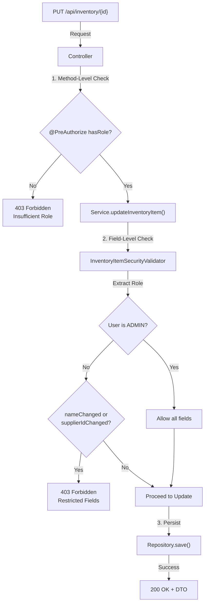

[⬅️ Back to Security Index](./index.html)

# Field-Level Security Validation

## Overview

Smart Supply Pro implements **field-level security validation** to restrict which user roles can modify specific inventory item fields. This layer complements method-level security (@PreAuthorize) by enforcing fine-grained authorization before the service layer commits database changes.

---

## Field-Level Authorization Model

### Role-Based Field Restrictions

**USER Role** (Read-only contributors):
- ✅ Can modify: `quantity`, `price`
- ❌ Cannot modify: `name`, `supplierId`, other fields
- Use case: Inventory coordinators updating stock levels and pricing

**ADMIN Role** (Full control):
- ✅ Can modify: All fields
- Use case: System administrators, business managers

### Access Control Matrix

| Field | USER | ADMIN | GET Access |
|-------|------|-------|-----------|
| `id` | ❌ | ❌ | ✅ (Read) |
| `name` | ❌ | ✅ | ✅ (Read) |
| `supplierId` | ❌ | ✅ | ✅ (Read) |
| `quantity` | ✅ | ✅ | ✅ (Read) |
| `price` | ✅ | ✅ | ✅ (Read) |
| `description` | ❌ | ✅ | ✅ (Read) |
| `createdAt` | ❌ | ❌ | ✅ (Read) |
| `updatedAt` | ❌ | ❌ | ✅ (Read) |

---

## InventoryItemSecurityValidator

### Location and Purpose

**File:** `src/main/java/com/smartsupplypro/inventory/validation/InventoryItemSecurityValidator.java`

**Purpose:** 
- Validates user permissions before inventory item field modifications
- Throws HTTP 403 if unauthorized field change attempted
- Integrates with service layer for pre-commit validation

### Implementation

```java
/**
 * Security validator for role-based inventory item update restrictions.
 *
 * <p><strong>Access Control</strong>:
 * <ul>
 *   <li><strong>ADMIN</strong>: Full update permissions (name, supplier, quantity, price)</li>
 *   <li><strong>USER</strong>: Restricted to quantity and price updates only</li>
 * </ul>
 *
 * <p><strong>Design</strong>:
 * Validates field-level permissions before service layer commits changes.
 * Throws HTTP 403 for unauthorized field modifications.
 *
 * @see InventoryItemService
 */
public class InventoryItemSecurityValidator {

    /**
     * Validates user has permission to update specific inventory item fields.
     * USER role: only quantity and price changes allowed.
     * ADMIN role: full update permissions.
     *
     * @param existing current inventory item entity
     * @param incoming updated item DTO from request
     * @throws ResponseStatusException 401 if not authenticated, 403 if unauthorized field change
     */
    public static void validateUpdatePermissions(InventoryItem existing, InventoryItemDTO incoming) {
        // Get current authenticated user
        Authentication auth = SecurityContextHolder.getContext().getAuthentication();
        if (auth == null || !(auth.getPrincipal() instanceof OAuth2User)) {
            throw new ResponseStatusException(HttpStatus.UNAUTHORIZED, "Unauthorized access");
        }

        // Extract user role from OAuth2 authorities
        OAuth2User user = (OAuth2User) auth.getPrincipal();
        String role = user.getAuthorities().stream()
                .map(a -> a.getAuthority())
                .filter(r -> r.equals("ROLE_ADMIN") || r.equals("ROLE_USER"))
                .findFirst()
                .orElse("ROLE_USER"); // Default to USER if not explicitly found

        // Enforce field-level restrictions for USER role
        if (role.equals("ROLE_USER")) {
            boolean nameChanged = !existing.getName().equals(incoming.getName());
            boolean supplierChanged = !existing.getSupplierId().equals(incoming.getSupplierId());

            if (nameChanged || supplierChanged) {
                throw new ResponseStatusException(
                    HttpStatus.FORBIDDEN,
                    "Users are only allowed to change quantity or price."
                );
            }
        }
        // ADMIN role: no field-level restrictions (method-level @PreAuthorize already verified)
    }
}
```

### Key Design Decisions

**1. Static Method Pattern**
```java
public static void validateUpdatePermissions(InventoryItem existing, InventoryItemDTO incoming)
```
- Utility method (no instance state)
- Easy to call from service layer
- Composable with other validators

**2. Fail-Secure Approach**
```java
String role = ... .orElse("ROLE_USER");  // Default to most-restrictive role
```
- Defaults to USER if role cannot be determined
- Prevents accidental privilege escalation

**3. Explicit Field Comparison**
```java
boolean nameChanged = !existing.getName().equals(incoming.getName());
```
- Only raises exception if field actually changed
- Allows re-submission of same data
- Clear intent in error message

---

## Service Layer Integration

### InventoryItemService Usage

```java
@Service
public class InventoryItemService {

    /**
     * Updates inventory item with field-level security validation.
     */
    public InventoryItemDTO updateInventoryItem(Long id, InventoryItemDTO updateDto) {
        // 1. Retrieve existing item
        InventoryItem existing = inventoryItemRepository
            .findById(id)
            .orElseThrow(() -> new ResourceNotFoundException("Item not found"));

        // 2. Validate field-level permissions (throws 403 if unauthorized)
        InventoryItemSecurityValidator.validateUpdatePermissions(existing, updateDto);

        // 3. Update allowed fields
        existing.setQuantity(updateDto.getQuantity());
        existing.setPrice(updateDto.getPrice());
        
        // 4. If ADMIN, allow additional fields
        if (isAdmin()) {
            existing.setName(updateDto.getName());
            existing.setSupplierId(updateDto.getSupplierId());
        }

        // 5. Persist changes
        InventoryItem saved = inventoryItemRepository.save(existing);
        return mapper.toDto(saved);
    }

    private boolean isAdmin() {
        Authentication auth = SecurityContextHolder.getContext().getAuthentication();
        return auth.getAuthorities().stream()
            .anyMatch(a -> a.getAuthority().equals("ROLE_ADMIN"));
    }
}
```

### Call Stack

```
Controller.updateInventoryItem(@PathVariable id, @RequestBody updateDto)
    ↓
SecurityConfig.authorizeHttpRequests()
    ├─ @PreAuthorize("hasRole('ADMIN')") at method level
    └─ Checks: User authenticated AND has ADMIN role
    ↓
Service.updateInventoryItem(id, updateDto)
    ├─ InventoryItemSecurityValidator.validateUpdatePermissions()
    │   └─ Checks: If USER role, only quantity/price allowed
    │   └─ Throws 403 if field restriction violated
    ├─ Update allowed fields
    └─ Return DTO
```

---

## Authorization Flow Diagram



---

## Error Scenarios

### Scenario 1: USER Attempts to Change Item Name

**Request:**
```json
PUT /api/inventory/42
Content-Type: application/json

{
  "name": "New Item Name",      // ❌ Restricted field
  "quantity": 100,
  "price": 15.99
}
```

**Response:**
```json
HTTP/1.1 403 Forbidden
Content-Type: application/json

{
  "timestamp": "2024-01-15T10:30:00Z",
  "status": 403,
  "error": "Forbidden",
  "message": "Users are only allowed to change quantity or price.",
  "path": "/api/inventory/42"
}
```

### Scenario 2: USER Updates Only Quantity (Allowed)

**Request:**
```json
PUT /api/inventory/42
Content-Type: application/json

{
  "name": "Current Name",       // ✅ Not changed
  "quantity": 150,              // ✅ Allowed field
  "price": 15.99                // ✅ Allowed field
}
```

**Response:**
```json
HTTP/1.1 200 OK
Content-Type: application/json

{
  "id": 42,
  "name": "Current Name",
  "quantity": 150,
  "price": 15.99,
  "supplierId": 5,
  "createdAt": "2023-12-01T08:00:00Z",
  "updatedAt": "2024-01-15T10:30:00Z"
}
```

### Scenario 3: ADMIN Updates All Fields

**Request:**
```json
PUT /api/inventory/42
Content-Type: application/json

{
  "name": "Renamed Item",       // ✅ ADMIN allowed
  "supplierId": 8,              // ✅ ADMIN allowed
  "quantity": 150,
  "price": 25.99
}
```

**Response:**
```json
HTTP/1.1 200 OK
Content-Type: application/json

{
  "id": 42,
  "name": "Renamed Item",
  "supplierId": 8,
  "quantity": 150,
  "price": 25.99,
  "createdAt": "2023-12-01T08:00:00Z",
  "updatedAt": "2024-01-15T10:30:00Z"
}
```

---

## Security Considerations

### 1. Defense in Depth

**Layers of Authorization:**

1. **Entry Point** - Authentication (OAuth2)
   - Verify user identity
   
2. **Method Level** - @PreAuthorize with role check
   - Enforce ADMIN role requirement
   
3. **Field Level** - InventoryItemSecurityValidator
   - Restrict field modifications by role
   
4. **Database Level** - Oracle row-level security (optional)
   - Restrict data access at database layer

**Benefit:** Multiple layers prevent privilege escalation

### 2. Role-Based vs Attribute-Based

**Current Approach (Role-Based):**
```java
if (role.equals("ROLE_USER")) {
    // Restrict fields
}
```
- Simple, fast, easy to understand
- Suitable for 2-3 role systems

**Future Extension (Attribute-Based):**
```java
if (!hasPermission(user, "inventory.edit.name")) {
    throw forbidden();
}
```
- More flexible for complex permissions
- Requires permission matrix database
- Scales to many roles/permissions

### 3. Fail-Safe Defaults

```java
String role = ... .orElse("ROLE_USER");  // Most restrictive
```
- Defaults to USER (least privilege)
- Never grants unintended access
- Prevents null pointer exploits

### 4. Immutable Field Protection

**Fields that should never change after creation:**
```java
// These are handled at repository/database layer
// - id (primary key)
// - createdAt (audit timestamp)
// - version (optimistic locking)
```

**Why not include in validator?**
- Prevented by database schema (not nullable, immutable)
- Service layer never attempts to update them
- Validator focuses on business-logic field restrictions

---

## Testing Patterns

### Unit Test Example

```java
@Test
void testUserCannotUpdateItemName() {
    // Given: Existing item and USER attempting to change name
    InventoryItem existing = new InventoryItem();
    existing.setId(1L);
    existing.setName("Original Name");
    existing.setQuantity(100);
    existing.setPrice(10.0);

    InventoryItemDTO incoming = new InventoryItemDTO();
    incoming.setName("New Name");        // Name change attempted
    incoming.setQuantity(100);
    incoming.setPrice(10.0);

    // Mock security context with USER role
    OAuth2User oauth2User = createOAuth2UserWithRole("ROLE_USER");
    Authentication auth = new OAuth2AuthenticationToken(oauth2User, oauth2User.getAuthorities(), "google");
    SecurityContextHolder.getContext().setAuthentication(auth);

    // When/Then: Should throw 403 Forbidden
    ResponseStatusException ex = assertThrows(
        ResponseStatusException.class,
        () -> InventoryItemSecurityValidator.validateUpdatePermissions(existing, incoming)
    );
    assertThat(ex.getStatusCode()).isEqualTo(HttpStatus.FORBIDDEN);
    assertThat(ex.getReason()).contains("only allowed to change quantity or price");
}

@Test
void testAdminCanUpdateAllFields() {
    // Given: Existing item and ADMIN attempting to change all fields
    InventoryItem existing = new InventoryItem();
    existing.setName("Original");
    existing.setSupplierId(1L);

    InventoryItemDTO incoming = new InventoryItemDTO();
    incoming.setName("Updated");
    incoming.setSupplierId(2L);

    // Mock security context with ADMIN role
    OAuth2User oauth2User = createOAuth2UserWithRole("ROLE_ADMIN");
    Authentication auth = new OAuth2AuthenticationToken(oauth2User, oauth2User.getAuthorities(), "google");
    SecurityContextHolder.getContext().setAuthentication(auth);

    // When/Then: Should NOT throw exception
    assertDoesNotThrow(() -> 
        InventoryItemSecurityValidator.validateUpdatePermissions(existing, incoming)
    );
}

@Test
void testUserCanUpdateQuantityWithoutNameChange() {
    // Given: Existing item and USER updating quantity (same name)
    InventoryItem existing = new InventoryItem();
    existing.setName("Item A");
    existing.setQuantity(100);

    InventoryItemDTO incoming = new InventoryItemDTO();
    incoming.setName("Item A");        // Same, not changed
    incoming.setQuantity(150);         // Changed

    // Mock USER security context
    OAuth2User oauth2User = createOAuth2UserWithRole("ROLE_USER");
    Authentication auth = new OAuth2AuthenticationToken(oauth2User, oauth2User.getAuthorities(), "google");
    SecurityContextHolder.getContext().setAuthentication(auth);

    // When/Then: Should NOT throw exception
    assertDoesNotThrow(() -> 
        InventoryItemSecurityValidator.validateUpdatePermissions(existing, incoming)
    );
}
```

### Integration Test Example

```java
@SpringBootTest
@AutoConfigureMockMvc
class InventoryItemSecurityValidationIT {

    @Autowired
    private MockMvc mvc;

    @Test
    @WithMockUser(roles = "USER")
    void testUserPatchRejectsNameChange() throws Exception {
        // Given: Item with id=1
        // When: USER attempts PATCH to change name
        mvc.perform(patch("/api/inventory/1")
            .contentType(MediaType.APPLICATION_JSON)
            .content("""
                {
                  "name": "Forbidden Change",
                  "quantity": 100
                }
            """))
            // Then: 403 Forbidden
            .andExpect(status().isForbidden())
            .andExpect(jsonPath("$.message").value(containsString("only allowed to change")));
    }

    @Test
    @WithMockUser(roles = "ADMIN")
    void testAdminPatchAllowsNameChange() throws Exception {
        // Given: Item with id=1
        // When: ADMIN attempts PATCH to change name
        mvc.perform(patch("/api/inventory/1")
            .contentType(MediaType.APPLICATION_JSON)
            .content("""
                {
                  "name": "Allowed Change",
                  "quantity": 100
                }
            """))
            // Then: 200 OK
            .andExpect(status().isOk())
            .andExpect(jsonPath("$.name").value("Allowed Change"));
    }
}
```

---

## Comparison with Method-Level Security

| Aspect | Method-Level (@PreAuthorize) | Field-Level (Validator) |
|--------|------------------------------|------------------------|
| **Scope** | Entire method/endpoint | Specific fields |
| **Check Point** | Before method execution | Inside method logic |
| **Example** | `@PreAuthorize("hasRole('ADMIN')")` | Restricts `name` field |
| **Use Case** | Admin-only endpoints | Multi-role with field restrictions |
| **Error Response** | 403 Forbidden (no details) | 403 Forbidden (field-specific) |
| **Performance** | Fast (single check) | Slightly slower (field comparison) |

**When to use each:**

```java
// Method-level: Block entire endpoint
@DeleteMapping("/{id}")
@PreAuthorize("hasRole('ADMIN')")
public void delete(@PathVariable Long id) { ... }

// Field-level: Allow endpoint but restrict field changes
@PutMapping("/{id}")
@PreAuthorize("authenticated()")  // All authenticated users
public void update(@PathVariable Long id, @RequestBody InventoryItemDTO dto) {
    InventoryItemSecurityValidator.validateUpdatePermissions(existing, dto);
    // ... proceed with update
}
```

---

## Related Documentation

- **[Security Index](./index.html)** - Master security overview
- **[Authorization & RBAC](./authorization-rbac.html)** - Role-based access control architecture
- **[OAuth2 Authentication](./oauth2-authentication.html)** - User authentication flows

---

[⬅️ Back to Security Index](./index.html)
