[⬅️ Back to Architecture Index](../index.html)

# Security Architecture

## Overview

The Smart Supply Pro inventory management system implements a **comprehensive security architecture** based on OAuth2 authentication, role-based access control (RBAC), and multiple security layers. The design emphasizes:

- **Enterprise OAuth2 authentication** with automatic user provisioning
- **Role-based access control (RBAC)** for fine-grained authorization
- **Secure credential management** using Oracle Wallet encryption
- **Container security** with non-root execution and minimal attack surface
- **Demo mode support** for development and public showcases

---

## Quick Navigation

| Topic | Purpose | Documentation |
|-------|---------|---|
| **OAuth2 Authentication** | Login flow, user provisioning, session management | [Read →](./oauth2-authentication.html) |
| **Authorization & RBAC** | Role-based access control, API endpoint protection | [Read →](./authorization-rbac.html) |
| **Field-Level Validation** | Role-based field update restrictions, USER vs ADMIN permissions | [Read →](./field-level-validation.html) |
| **Oracle Wallet** | Database credential encryption, TNS_ADMIN setup | [Read →](./oracle-wallet.html) |
| **Docker Security** | Container hardening, non-root user, secret management | [Read →](./docker-security.html) |
| **Demo Mode** | Read-only public access, configuration, use cases | [Read →](./demo-mode.html) |

---

## Security Architecture Diagram


---

## Security Layers

### 1. **Authentication Layer**

**OAuth2 with Automatic User Provisioning**

- External identity providers (Google, GitHub, etc.) handle password security
- Upon successful login, user is automatically provisioned in local database
- Email used as unique identifier for user identity
- Session managed via secure HTTP-only cookies with SameSite=None for cross-origin

**Key Components:**
- `CustomOAuth2UserService` - OAuth2 user loading with local user creation
- `CustomOidcUserService` - OIDC token validation (for Google OpenID Connect)
- `OAuth2LoginSuccessHandler` - Post-authentication user provisioning and redirect
- `CookieOAuth2AuthorizationRequestRepository` - Stateless auth request persistence

---

### 2. **Authorization Layer**

**Role-Based Access Control (RBAC)**

Two roles defined:
- **ADMIN** - Full system access (create, update, delete)
- **USER** - Read-only and limited write access

**Role Assignment:**
- Admin emails configured via `APP_ADMIN_EMAILS` environment variable
- All other users default to USER role
- Role "healing" occurs on each login (dynamic allow-list updates)

**Authorization Rules:**
- Public endpoints: /login, /logout, /actuator/**, /api/health/** (no auth required)
- Demo mode GET endpoints: Read-only access to /api/inventory/*, /api/analytics/*, /api/suppliers/* (when APP_DEMO_READONLY=true)
- Authenticated read: GET /api/inventory/*, GET /api/suppliers/* (normal mode)
- Write operations: POST/PUT/PATCH/DELETE require USER or ADMIN role
- Demo mode blocks all writes: Write operations fail with 403 if isDemo()=true

**Enforcement:**
- `@PreAuthorize` method-level security
- `SecurityAuthorizationHelper` for HTTP request matching
- SpEL expressions for dynamic demo mode control

---

### 3. **Field-Level Validation**

**Role-Based Field Restrictions**

Restricts which user roles can modify specific inventory item fields:
- **ADMIN** - Can modify all fields (name, supplier, quantity, price)
- **USER** - Can only modify quantity and price

**Validation Points:**
- `InventoryItemSecurityValidator` enforces field-level permissions
- Integrated into service layer before database commit
- Returns HTTP 403 if unauthorized field change attempted

**Use Case:**
- Inventory coordinators (USER) can adjust stock levels without changing item metadata
- Managers/admins (ADMIN) have full item control

---

### 4. **Request/Response Security**

**CORS Configuration**
- Allows cross-origin requests from frontend domains
- Credentials included in cookies (SameSite=None)
- Specific methods allowed: GET, POST, PUT, PATCH, DELETE, OPTIONS

**Entry Point Handling**
- API requests return JSON 401 on auth failure
- Browser requests redirect to frontend login page
- Detection via Accept header and /api/ path matching

**CSRF Protection**
- CSRF tokens ignored for /api/**, /logout, /actuator/**
- Stateless API design (no session state in forms)

---

### 5. **Data Access Security**

**Oracle Wallet (TLS/SSL for Database)**

- Database credentials encrypted using Oracle PKI infrastructure
- Wallet files (`ewallet.p12`, `tnsnames.ora`) loaded at runtime
- Password protection via `ORACLE_WALLET_PASSWORD` environment variable
- Connection pooling with secure TLS handshakes

**Environment Variable Injection:**
```bash
ORACLE_WALLET_B64=<base64-encoded-wallet.zip>
ORACLE_WALLET_PASSWORD=<wallet-password>
DB_URL=<jdbc-connect-string>
DB_USER=<db-username>
DB_PASS=<db-password>
```

---

### 6. **Container Security**

**Docker Best Practices**

- Multi-stage build: separates build tools from runtime
- Non-root user execution (appuser:appgroup)
- Minimal JRE runtime (17-jre-alpine)
- Secrets injected at runtime, not baked into image
- Wallet extraction happens only at container startup

**Hardening:**
- Base image updated: `apk upgrade --no-cache`
- Required tools only: unzip, coreutils
- File permissions: umask 077 for sensitive files
- Secrets unset after use: no wallet logs, no env exposure

---

## Authentication Flow Sequence

```mermaid
sequenceDiagram
    participant User as 👤 User
    participant Browser as 🌐 Browser
    participant Frontend as 📱 Frontend App
    participant GoogleOAuth as 🔐 Google OAuth2
    participant BackendAPI as 🖥️ Backend API
    participant Database as 🗄️ Database

    User->>Browser: Click "Login with Google"
    Browser->>Frontend: Navigate to /login
    Frontend->>GoogleOAuth: Redirect to authorization endpoint
    GoogleOAuth->>Browser: Authorization consent form
    User->>GoogleOAuth: Grant permissions
    GoogleOAuth->>Frontend: Redirect with authorization code
    Frontend->>BackendAPI: POST /oauth2/code/google + code
    
    BackendAPI->>GoogleOAuth: Exchange code for ID token
    GoogleOAuth->>BackendAPI: ID token + user info (email, name)
    
    BackendAPI->>BackendAPI: CustomOAuth2UserService.loadUser()
    BackendAPI->>Database: Check if user exists by email
    
    alt User not found
        BackendAPI->>Database: INSERT new AppUser (role=USER by default)
        Database-->>BackendAPI: User created
    else User found
        BackendAPI->>BackendAPI: Role healing: update if in ADMIN allow-list
    end
    
    BackendAPI->>BackendAPI: Generate session cookie
    BackendAPI->>Frontend: 302 Redirect + Set-Cookie (JSESSIONID)
    Frontend->>Browser: Store session cookie
    Frontend->>Frontend: Navigate to /auth (landing page)
    Frontend-->>User: Dashboard loaded
```



---

## Authorization Decision Tree


---

## Key Configuration Points

### Application Properties (application.yml)

```yaml
spring:
  security:
    oauth2:
      client:
        registration:
          google:
            client-id: ${SPRING_SECURITY_OAUTH2_CLIENT_REGISTRATION_GOOGLE_CLIENT_ID}
            client-secret: ${SPRING_SECURITY_OAUTH2_CLIENT_REGISTRATION_GOOGLE_CLIENT_SECRET}
            
app:
  demo-readonly: ${APP_DEMO_READONLY:true}
  frontend:
    base-url: ${APP_FRONTEND_BASE_URL:https://localhost:5173}
```

### Environment Variables (Required at Runtime)

```bash
# OAuth2 Provider Credentials (from Google Cloud Console)
SPRING_SECURITY_OAUTH2_CLIENT_REGISTRATION_GOOGLE_CLIENT_ID=<id>
SPRING_SECURITY_OAUTH2_CLIENT_REGISTRATION_GOOGLE_CLIENT_SECRET=<secret>

# Database Access (Oracle/PostgreSQL)
DB_URL=jdbc:oracle:thin:@localhost:1521:SSPDB
DB_USER=inventory_user
DB_PASS=password123

# Oracle Wallet (base64-encoded)
ORACLE_WALLET_B64=<base64-encoded-wallet.zip>
ORACLE_WALLET_PASSWORD=wallet_password

# Admin User Allow-List (comma-separated emails)
APP_ADMIN_EMAILS=admin@company.com, supervisor@company.de

# Demo Mode (for public showcases)
APP_DEMO_READONLY=true

# Frontend URL (for OAuth2 redirects)
APP_FRONTEND_BASE_URL=https://inventory.example.com
```

---

## Security Best Practices Implemented

| Practice | Implementation | Benefit |
|----------|---|---|
| **OAuth2 for Auth** | Delegate password security to Google/GitHub | No password storage, automatic MFA support |
| **Email as Identity** | Use email as unique user identifier | Consistent identity across systems |
| **Role Healing** | Update role on every login | Dynamic RBAC (allow-list changes take effect) |
| **Demo Mode** | Allow read-only without authentication | Public product demos without login gates |
| **Non-Root Docker** | Run as appuser:appgroup | Container breakout less impactful |
| **Wallet Encryption** | Oracle PKI for DB credentials | Database credentials never exposed |
| **Secret Injection** | Runtime environment variables only | No secrets in Docker image layers |
| **Secure Cookies** | SameSite=None, Secure, HttpOnly | CSRF and XSS attack resistance |
| **API vs Web Detection** | Different error responses (JSON vs redirect) | Better UX for both API clients and browsers |

---

## Related Documentation

- **[OAuth2 Authentication](./oauth2-authentication.html)** - Detailed authentication flows and user provisioning
- **[Authorization & RBAC](./authorization-rbac.html)** - Role assignment and endpoint protection
- **[Oracle Wallet](./oracle-wallet.html)** - Database credential encryption and setup
- **[Docker Security](./docker-security.html)** - Container hardening and deployment
- **[Demo Mode](./demo-mode.html)** - Public access configuration
- **[Backend Architecture Overview](../overview.html)** - Full system architecture context
- **[Repository Layer - AppUserRepository](../repository/app-user-repository.html)** - User data access patterns

---

[⬅️ Back to Architecture Index](../index.html)
