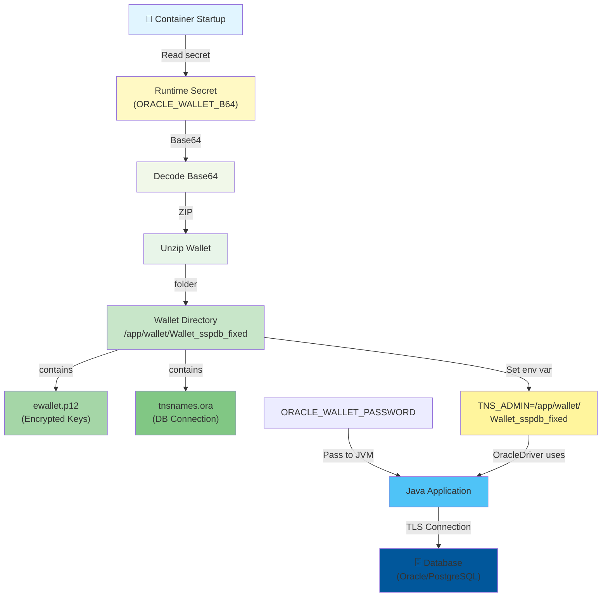

[⬅️ Back to Security Index](./index.html)

# Oracle Wallet & Database Encryption

## Overview

Smart Supply Pro uses **Oracle Wallet** to encrypt database credentials using **Public Key Infrastructure (PKI)**. The wallet contains:
- `ewallet.p12` - Encrypted key store with private keys
- `tnsnames.ora` - Oracle TNS naming directory (maps database aliases to connection strings)

This ensures database credentials are never stored in plaintext.

---

## Architecture



---

## Wallet Setup Process

### Step 1: Export Wallet from Oracle

Using Oracle Wallet Manager or `mkwallet` command:

```bash
# Create wallet with auto-open enabled
mkwallet -wallet /path/to/wallet -pwd <password>

# Add database connection credentials
mkstore -wrl /path/to/wallet -create
mkstore -wrl /path/to/wallet -modifyEntry DB_ALIAS "<connection-string>" -pwd <password>
```

**Result Files:**
- `ewallet.p12` - PKCS#12 keystore with encrypted credentials
- `cwallet.sso` - Single-sign-on wallet (optional)
- `tnsnames.ora` - TNS connection definitions

### Step 2: Create tnsnames.ora

**tnsnames.ora** maps database aliases to connection strings:

```
SSPDB =
  (DESCRIPTION =
    (ADDRESS = (PROTOCOL = TCP)(HOST = oracle.example.com)(PORT = 1521))
    (CONNECT_DATA =
      (SERVICE_NAME = SSPDB)
      (SECURITY = (SSL_SERVER_CERT_DN = "CN=oracle.example.com"))
    )
  )
```

### Step 3: Encrypt Wallet as Base64

```bash
# ZIP the wallet directory
zip -r wallet.zip Wallet_sspdb_fixed/

# Encode to Base64
base64 wallet.zip > wallet_b64.txt

# Result: very long string of Base64 characters
cat wallet_b64.txt
# UEsDBAoAAAAAAPZo...AAAAAAAAAAAAA==
```

### Step 4: Store as Runtime Secret

Store the Base64 string as a secret:

**Fly.io secrets:**
```bash
flyctl secrets set ORACLE_WALLET_B64=<base64-string> \
                   ORACLE_WALLET_PASSWORD=<wallet-password>
```

**Kubernetes secrets:**
```yaml
apiVersion: v1
kind: Secret
metadata:
  name: oracle-wallet
type: Opaque
data:
  wallet_b64: <base64-encoded-wallet.zip>
  wallet_password: <encoded-password>
```

**GitHub Secrets:**
```bash
gh secret set ORACLE_WALLET_B64 < wallet_b64.txt
gh secret set ORACLE_WALLET_PASSWORD -b "<password>"
```

---

## Runtime Extraction (start.sh)

The `start.sh` script extracts the wallet at container startup:

```bash
#!/bin/sh
set -eu

# Require runtime secrets
if [ -z "${ORACLE_WALLET_B64:-}" ]; then
  echo "ERROR: ORACLE_WALLET_B64 not set"; exit 1
fi
if [ -z "${ORACLE_WALLET_PASSWORD:-}" ]; then
  echo "ERROR: ORACLE_WALLET_PASSWORD not set"; exit 1
fi

# 1. Decode Base64 wallet
mkdir -p /app/wallet
printf "%s" "${ORACLE_WALLET_B64}" | base64 -d > /app/wallet.zip

# 2. Extract ZIP
unzip -o -q /app/wallet.zip -d /app/wallet

# 3. Verify wallet files exist
export TNS_ADMIN="/app/wallet/Wallet_sspdb_fixed"
if [ ! -f "$TNS_ADMIN/ewallet.p12" ] || [ ! -f "$TNS_ADMIN/tnsnames.ora" ]; then
  echo "ERROR: Wallet files missing"; exit 1
fi

# 4. Clean up Base64 secret (reduce exposure)
rm -f /app/wallet.zip
unset ORACLE_WALLET_B64

# 5. Set JVM options with wallet password
JAVA_OPTS="$JAVA_OPTS \
 -Doracle.net.tns_admin=${TNS_ADMIN} \
 -Doracle.net.wallet_password=${ORACLE_WALLET_PASSWORD}"

# 6. Unset password env var (already in JAVA_OPTS)
unset ORACLE_WALLET_PASSWORD

# 7. Start Spring Boot
exec java ${JAVA_OPTS} -jar /app/app.jar
```

**Key Security Points:**
- ✅ Base64 string decoded only at runtime
- ✅ ZIP extracted only to ephemeral container filesystem
- ✅ Secrets cleaned up after use (unset env vars)
- ✅ JVM system properties used instead of env vars
- ✅ Wallet files never logged or exposed

---

## Database Connection Configuration

### Application Properties

**application.yml:**
```yaml
spring:
  datasource:
    url: ${DB_URL}                              # jdbc:oracle:thin:@SSPDB
    username: ${DB_USER}                        # database username
    password: ${DB_PASS}                        # database password
    driver-class-name: oracle.jdbc.OracleDriver
```

### Connection String (from TNS)

The JDBC driver uses Oracle Net to resolve connection:

```
DB_URL=jdbc:oracle:thin:@SSPDB
```

**Oracle Net Resolution:**
```
1. JDBC reads: jdbc:oracle:thin:@SSPDB
2. Oracle Net Client looks up: SSPDB in tnsnames.ora
3. Finds connection descriptor with HOST, PORT, SERVICE_NAME
4. Looks up wallet at TNS_ADMIN environment variable
5. Decrypts with ORACLE_WALLET_PASSWORD
6. Opens TLS connection to database
```

### Environment Variables at Runtime

```bash
# Database connection (resolved via tnsnames.ora)
DB_URL=jdbc:oracle:thin:@SSPDB
DB_USER=inventory_user
DB_PASS=<database-password>

# Wallet for encryption (set by start.sh from Base64)
ORACLE_WALLET_B64=<base64-encoded-wallet.zip>
ORACLE_WALLET_PASSWORD=<wallet-encryption-password>
```

---

## PostgreSQL Alternative (No Wallet)

For PostgreSQL deployments, skip wallet:

**application-postgres.yml:**
```yaml
spring:
  datasource:
    url: jdbc:postgresql://db.example.com:5432/inventory
    username: ${DB_USER}
    password: ${DB_PASS}
    driver-class-name: org.postgresql.Driver
```

**Dockerfile (PostgreSQL):**
```dockerfile
# No Oracle wallet extraction needed
# Just set environment variables
ENV DB_URL=jdbc:postgresql://db.example.com:5432/inventory
ENV SPRING_PROFILES_ACTIVE=prod
CMD exec java -jar /app/app.jar
```

---

## Troubleshooting

### Error: "Wallet Location not set"

**Cause:** TNS_ADMIN not set in JVM

**Solution:**
```bash
# start.sh sets this:
export TNS_ADMIN="/app/wallet/Wallet_sspdb_fixed"

# Verify in JVM:
System.getenv("TNS_ADMIN")  // Should be set
System.getProperty("oracle.net.tns_admin")  // Should be set
```

### Error: "Connection refused" or Timeout

**Cause:** Database host/port unreachable

**Solution:**
1. Verify tnsnames.ora has correct HOST and PORT
2. Check network connectivity from container to database
3. Verify database is accepting TLS connections

### Error: "Invalid wallet password"

**Cause:** ORACLE_WALLET_PASSWORD mismatch

**Solution:**
```bash
# Verify password matches wallet creation
# If password changed, re-create wallet
mkwallet -wallet /path/to/wallet -pwd <new-password>

# Re-encode wallet and update secret
```

### Error: "ewallet.p12 not found"

**Cause:** Wallet extraction failed

**Solution:**
1. Verify ORACLE_WALLET_B64 is valid Base64
2. Check unzip compatibility (Windows ZIP quirk):
   ```bash
   unzip -l /app/wallet.zip  # List contents
   ```
3. Manually test extraction locally:
   ```bash
   base64 -d wallet_b64.txt > test.zip
   unzip test.zip
   ```

---

## Security Best Practices

| Practice | Implementation | Benefit |
|----------|---|---|
| **No plaintext creds** | Use wallet encryption | Credentials protected at rest |
| **Runtime injection** | Extract from Base64 at startup | Never in Docker layers |
| **Secret cleanup** | Unset env vars after JVM options | Reduce process memory exposure |
| **TLS for DB** | Oracle Net uses wallet for SSL | Encrypted database connections |
| **Isolated wallets** | Separate wallet per environment | Production isolation |

---

## Related Documentation

- **[Security Index](./index.html)** - Master security overview
- **[Docker Security](./docker-security.html)** - Container security practices
- **[Deployment Guide](../deployment.html)** - Production deployment

---

[⬅️ Back to Security Index](./index.html)
