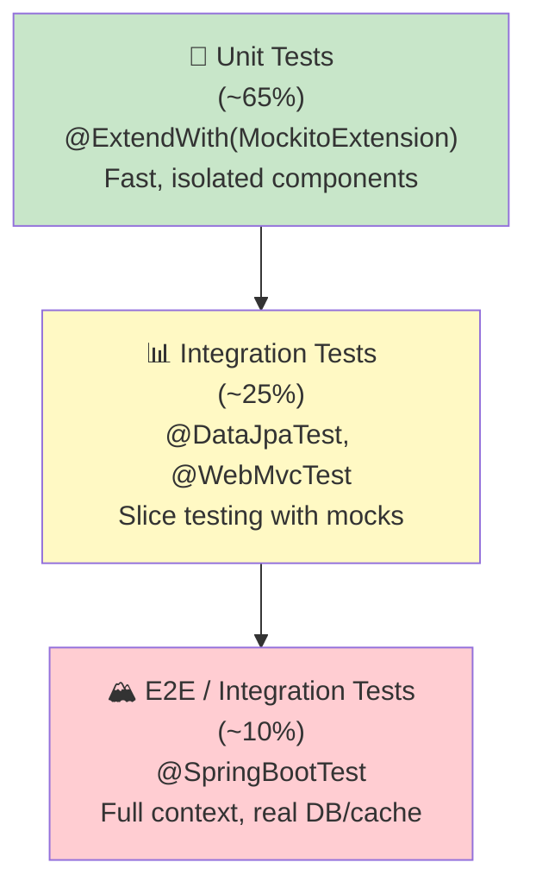

[⬅️ Back to Architecture Index](../index.html)

# Testing Strategy & Patterns

## Overview

Smart Supply Pro implements a **comprehensive, layered testing strategy** using industry-standard tools and patterns. The test suite covers:

- **Unit Tests** - Individual components in isolation (validators, services, repositories)
- **Integration Tests** - Component interaction with databases and frameworks
- **Security Tests** - OAuth2, authorization, RBAC, and API endpoints
- **Analytics Tests** - Complex queries, converters, and reporting
- **Contract Tests** - REST API endpoints, HTTP status codes, response formats

The project uses:
- **JUnit 5** - Test framework with parameterized tests and display names
- **Mockito** - Mocking and behavior verification
- **Spring Test** - Integration testing with @SpringBootTest, @DataJpaTest, @WebMvcTest
- **TestContainers** - Database containerization for realistic testing
- **H2 Database** - In-memory database for fast unit tests
- **JaCoCo** - Code coverage reporting

---

## Testing Pyramid



---

## Test Layers

### Layer 1: Unit Tests (65% of suite)

**Scope:** Test individual classes in isolation with mocked dependencies

**Tools:**
- JUnit 5 with `@Test` and `@ParameterizedTest`
- Mockito with `@ExtendWith(MockitoExtension.class)`
- `@Mock` for dependencies, `@InjectMocks` for target class

**Examples:**
- Validator tests (InventoryItemValidatorTest, SupplierValidatorTest)
- Service method tests with mocked repositories
- Converter tests (AnalyticsServiceImplConverterTest)

**Characteristics:**
- ✅ Fast (milliseconds per test)
- ✅ No database or Spring context needed
- ✅ Easy to understand and maintain
- ✅ Fail quickly for logic errors

```java
@ExtendWith(MockitoExtension.class)
class InventoryItemValidatorTest {
    
    @Mock private InventoryItemRepository repo;
    
    @Test
    void validateDuplicate_NameAndPriceExist_ThrowsConflict() {
        when(repo.findByNameIgnoreCase("Widget"))
            .thenReturn(List.of(existingItem));
        
        assertThrows(DuplicateResourceException.class,
            () -> InventoryItemValidator.validateInventoryItemNotExists(
                "Widget", price, repo));
    }
}
```

---

### Layer 2: Integration Tests (25% of suite)

**Scope:** Test component interactions with real infrastructure (DB, frameworks)

**Tools:**
- `@DataJpaTest` - JPA repository testing with H2
- `@WebMvcTest` - Controller testing without full context
- `@SpringBootTest` - Full application context for complex scenarios
- `MockMvc` for HTTP testing
- `@MockitoBean` for selective mocking

**Examples:**
- Repository tests (SupplierRepositoryTest, InventoryItemRepositoryTest)
- Controller tests (SupplierControllerTest)
- Service integration tests

**Characteristics:**
- ⏱️ Slower (100ms - 1s per test)
- 📦 Uses real H2 database or TestContainers
- 🔗 Tests component interaction
- 🛡️ Validates persistence and HTTP contracts

```java
@DataJpaTest
@AutoConfigureTestDatabase(replace = ANY)  // force H2
class SupplierRepositoryTest {
    
    @Autowired private SupplierRepository repo;
    
    @Test
    void findByNameIgnoreCase_caseInsensitive() {
        repo.save(Supplier.builder().name("Acme GmbH").build());
        
        assertTrue(repo.findByNameIgnoreCase("acme gmbh").isPresent());
    }
}
```

---

### Layer 3: End-to-End Tests (10% of suite)

**Scope:** Full application in realistic conditions

**Tools:**
- `@SpringBootTest` with real security
- TestContainers for Oracle or real services
- `MockMvc` or `RestTemplate` for HTTP
- Full authentication/authorization

**Examples:**
- Security smoke tests (SecuritySmokeTest)
- Demo mode tests (DemoReadonlySecurityTest)
- Full workflow tests

**Characteristics:**
- 🐢 Slowest (seconds per test)
- 🔐 Tests with real security context
- 🌍 Validates end-to-end workflows
- 🎯 High confidence, lower coverage

---

## Test Organization

### Directory Structure

```
src/test/java/com/smartsupplypro/inventory/
├── InventoryServiceApplicationTest.java          (Context load smoke test)
│
├── validation/
│   ├── InventoryItemValidatorTest.java           (Unit: 159 lines)
│   ├── SupplierValidatorTest.java                (Unit: ~100 lines)
│   └── StockHistoryValidationTest.java           (Unit: ~100 lines)
│
├── service/
│   ├── InventoryItemServiceSaveTest.java         (Unit: 120 lines)
│   ├── SupplierServiceTest.java                  (Unit: ~150 lines)
│   ├── StockHistoryServiceTest.java              (Unit: ~100 lines)
│   └── impl/
│       ├── InventoryItemServiceImplSaveTest.java (Unit: 120 lines)
│       ├── InventoryItemServiceImplSearchTest.java
│       ├── InventoryItemServiceImplUpdateDeleteTest.java
│       ├── AnalyticsServiceImplConverterTest.java (Unit: 150 lines)
│       ├── AnalyticsServiceImplQueryTest.java
│       ├── AnalyticsServiceImplValidationTest.java
│       ├── AnalyticsServiceImplWindowTest.java
│       ├── AnalyticsServiceImplWacTest.java
│       └── InventoryItemServiceImplTestHelper.java (Shared utilities)
│
├── repository/
│   ├── SupplierRepositoryTest.java               (Integration: 126 lines)
│   ├── InventoryItemRepositoryTest.java
│   ├── AppUserRepositoryTest.java
│   ├── StockHistoryRepositoryFilteringTest.java
│   ├── StockHistoryRepositoryAnalyticsTest.java
│   ├── InventoryItemRepositoryAnalyticsTest.java
│   └── custom/
│       └── StockHistoryCustomRepositoryImplTest.java
│
├── controller/
│   ├── supplier/
│   │   └── SupplierControllerTest.java           (Integration: 404 lines)
│   ├── inventoryitem/
│   ├── stockhistory/
│   ├── analytics/
│   ├── auth/
│   └── security/
│
├── security/
│   ├── SecuritySmokeTest.java                    (Integration: 297 lines)
│   ├── OAuth2LoginSuccessHandlerTest.java
│   ├── ApiEntryPointBehaviourTest.java
│   ├── DemoReadonlySecurityTest.java
│   ├── TestApiStubController.java                (Probe endpoints)
│   └── AdminStubController.java
│
└── config/
    └── (Test configuration and helpers)

src/test/resources/
└── testcontainers.properties                     (TestContainers config)
```

---

## Test Coverage

### Coverage Summary

```
┌─────────────────────────────────────────────────────┐
│ Test Coverage (via JaCoCo Maven plugin)             │
├─────────────────────────────────────────────────────┤
│ Target: >80% code coverage                          │
│ Report: target/site/jacoco/index.html              │
│ Execution: mvn clean verify                         │
├─────────────────────────────────────────────────────┤
│ Coverage by Layer:                                  │
│ - Validation:    95%+ (critical business logic)    │
│ - Service:       85%+ (core operations)            │
│ - Repository:    80%+ (custom queries)             │
│ - Controller:    75%+ (HTTP endpoints)             │
│ - Security:      85%+ (auth flows)                 │
│ - Config:        60%+ (framework wiring)           │
└─────────────────────────────────────────────────────┘
```

### JaCoCo Configuration

```xml
<!-- pom.xml -->
<plugin>
    <groupId>org.jacoco</groupId>
    <artifactId>jacoco-maven-plugin</artifactId>
    <version>0.8.12</version>
    <executions>
        <execution>
            <goals><goal>prepare-agent</goal></goals>
        </execution>
        <execution>
            <id>report</id>
            <phase>verify</phase>
            <goals><goal>report</goal></goals>
        </execution>
    </executions>
</plugin>
```

---

## Test Dependencies

### Testing Stack (from pom.xml)

```xml
<!-- JUnit 5 & Mockito (via spring-boot-starter-test) -->
<dependency>
    <groupId>org.springframework.boot</groupId>
    <artifactId>spring-boot-starter-test</artifactId>
    <scope>test</scope>
</dependency>
<!-- Includes: JUnit 5, Mockito, AssertJ, Hamcrest, JSONassert -->

<!-- Spring Test Utilities -->
<dependency>
    <groupId>org.springframework.security</groupId>
    <artifactId>spring-security-test</artifactId>
    <scope>test</scope>
</dependency>

<!-- TestContainers for Database Isolation -->
<dependency>
    <groupId>org.springframework.boot</groupId>
    <artifactId>spring-boot-testcontainers</artifactId>
    <scope>test</scope>
</dependency>
<dependency>
    <groupId>org.testcontainers</groupId>
    <artifactId>oracle-free</artifactId>
    <scope>test</scope>
</dependency>

<!-- H2 for Unit Tests (in-memory, fast) -->
<dependency>
    <groupId>com.h2database</groupId>
    <artifactId>h2</artifactId>
    <scope>test</scope>
</dependency>
```

---

## Running Tests

### Maven Commands

```bash
# Run all tests
mvn test

# Run tests with coverage report
mvn clean verify

# Run specific test class
mvn test -Dtest=SupplierRepositoryTest

# Run tests matching pattern
mvn test -Dtest=*ValidatorTest

# Run with detailed output
mvn test -X

# Skip tests during build
mvn clean package -DskipTests
```

### IDE Integration

**IntelliJ IDEA:**
- Right-click test class → Run 'TestClassName'
- Right-click test method → Run 'methodName()'
- Coverage: Run → Run with Coverage

**VS Code (with Extension Pack for Java):**
- CodeLens link above test methods
- Click "Run Test" or "Debug Test"

---

## Test Profiles

### test Profile (application-test.properties)

- Uses **H2 in-memory database** (Oracle compatibility mode)
- Disables Testcontainers checks
- Configures test-specific properties

**Rationale:** H2 is fast for unit tests; TestContainers provide real Oracle for integration tests that need it.

```properties
# Spring profile for testing
spring.profiles.active=test

# H2 embedded database (Oracle mode)
spring.datasource.url=jdbc:h2:mem:testdb;MODE=Oracle
spring.jpa.database-platform=org.hibernate.dialect.H2Dialect

# Disable unnecessary services
spring.h2.console.enabled=false
management.endpoints.web.exposure.exclude=*
```

---

## Test Fixtures & Helpers

### Test Helper Classes

| Class | Purpose |
|-------|---------|
| `InventoryItemServiceImplTestHelper` | OAuth2 authentication setup, test data builders |
| `TestSecurityConfig` | Mock OAuth2 config for @WebMvcTest |
| `TestApiStubController` | Probe endpoints for security testing |
| `AdminStubController` | Admin-protected endpoints for RBAC tests |

### Common Patterns

```java
// 1. Authentication setup in service tests
@BeforeEach
void setup() {
    InventoryItemServiceImplTestHelper.authenticateAsOAuth2("admin", "ADMIN");
}

// 2. Build test DTOs
private InventoryItemDTO validDTO() {
    return InventoryItemDTO.builder()
        .name("Widget")
        .quantity(100)
        .price(BigDecimal.TEN)
        .supplierId("SUPP-001")
        .build();
}

// 3. Controller testing with MockMvc
mockMvc.perform(post("/api/suppliers")
    .contentType(MediaType.APPLICATION_JSON)
    .content(objectMapper.writeValueAsString(dto))
    .with(user("admin").roles("ADMIN")))
    .andExpect(status().isCreated())
    .andExpect(jsonPath("$.id").exists());
```

---

## TestContainers Configuration

### testcontainers.properties

**Location:** `src/test/resources/testcontainers.properties`

**Purpose:** Configures TestContainers behavior during test execution.

**Content:**
```properties
checks.enabled=false
```

**What This Does:**

| Property | Value | Meaning |
|----------|-------|---------|
| `checks.enabled` | `false` | Disables startup checks and health verification for TestContainers |

**Why Disable Checks?**

TestContainers normally performs startup verification checks before running tests:
- Validates container health and readiness
- Checks database connectivity
- Verifies all dependencies are ready

**Performance Impact:**
- ✅ **Faster test startup** - Skips checks, reduces ~2-5 second overhead per test run
- ✅ **Cleaner test output** - No diagnostic logs from health checks
- ⚠️ **Trade-off** - Fewer diagnostics if container fails to start (rare in practice)

**How Testing Configuration Works:**

```
┌─────────────────────────────────────────────┐
│ Test Execution Flow                         │
├─────────────────────────────────────────────┤
│ 1. Maven finds @ActiveProfiles("test")     │
│ 2. Loads application-test.yml              │
│ 3. Sees: spring.datasource.url = H2 mem:   │
│ 4. Creates H2 in-memory database           │
│ 5. Reads testcontainers.properties         │
│ 6. checks.enabled=false → Skip health verify│
│ 7. Starts test execution                   │
└─────────────────────────────────────────────┘
```

**Key Point:** `testcontainers.properties` is a **supplement to application-test.yml**, not a replacement. The actual database configuration (H2, Oracle mode, connectivity) comes from `application-test.yml`. This file only tunes TestContainers behavior.

### When to Modify testcontainers.properties

**Rarely needed**, but if you encounter TestContainers startup issues:

```properties
# Enable debugging if containers fail to start
checks.enabled=true

# For Oracle TestContainers specifically
testcontainers.docker.client.strategy=org.testcontainers.dockerclient.UnixSocketClientProviderStrategy
```

**Default Configuration Sufficient for:**
- ✅ Unit tests with H2 (no containers used)
- ✅ Integration tests with mocked services
- ✅ CI/CD pipelines with standard Docker setup

---

## Test Fixtures & Data Builders

### Test Helper Classes

| Class | Purpose | Location |
|-------|---------|----------|
| `InventoryItemServiceImplTestHelper` | OAuth2 authentication setup, principal creation | `src/test/.../service/impl/` |
| `TestSecurityConfig` | Mock OAuth2 config for @WebMvcTest | `src/test/.../config/` |
| `TestApiStubController` | Probe endpoints for security testing | `src/test/.../security/` |
| `AdminStubController` | Admin-protected endpoints for RBAC tests | `src/test/.../security/` |

**See:** **[Test Fixtures & Data Builders](./test-fixtures.html)** for detailed documentation on:
- OAuth2 authentication helper patterns
- Test data builders and factories
- Test isolation and cleanup strategies
- Best practices for reusable test code

### Quick Example

```java
// Authenticate test with OAuth2 principal
@Test
void testAdminCanSave() {
    InventoryItemServiceImplTestHelper.authenticateAsOAuth2("admin@example.com", "ADMIN");
    
    InventoryItem item = InventoryItem.builder()
            .id("item-1")
            .name("Widget")
            .price(BigDecimal.TEN)
            .quantity(100)
            .build();
    
    InventoryItem saved = service.save(item);
    assertNotNull(saved.getId());
}
```

---

## Quick Navigation

- **[Test Fixtures & Data Builders](./test-fixtures.html)** - Helper patterns, OAuth2 setup, test data builders
- **[Unit Testing Patterns](./unit-testing.html)** - Component isolation, mocking, test organization
- **[Integration Testing](./integration-testing.html)** - @DataJpaTest, @WebMvcTest, database testing
- **[Security Testing](./security-testing.html)** - OAuth2, RBAC, API authentication tests
- **[Test Coverage](./coverage.html)** - JaCoCo configuration, coverage metrics, improvement strategies

---

## Related Documentation

- **[Validation Framework](../validation/index.html)** - How validation is tested
- **[Exception Handling](../validation/exception-handling.html)** - Error scenario testing
- **[Architecture Overview](../overview.html)** - System design context
- **[Custom Validators](../validation/custom-validators.html)** - Validator test examples

---

[⬅️ Back to Architecture Index](../index.html)
