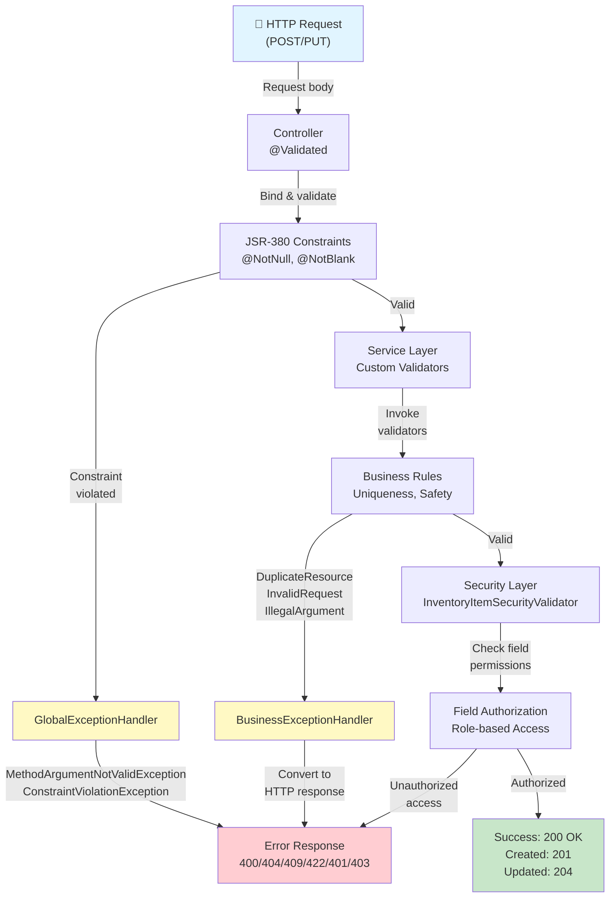

[⬅️ Back to Validation Index](./index.html)

# Exception Handling

## Overview

Exception handling is the **final validation layer**, converting validation failures into standardized HTTP responses. Smart Supply Pro uses two exception handlers:

- **GlobalExceptionHandler** - Framework-level (JSR-380, HTTP errors, authentication)
- **BusinessExceptionHandler** - Domain-level (business rule violations)

This layered approach ensures validation failures at every level map to appropriate HTTP status codes and error responses.

---

## Validation Exception Flow



---

## Exception Hierarchy

```
Exception
├── RuntimeException
│   ├── InvalidRequestException        ← 400 (custom validation)
│   ├── DuplicateResourceException     ← 409 (business conflict)
│   └── IllegalStateException          ← 409 (state conflict)
│
└── Spring Framework
    ├── MethodArgumentNotValidException    ← 400 (JSR-380)
    ├── ConstraintViolationException       ← 400 (JSR-380)
    ├── HttpMessageNotReadableException    ← 400 (JSON parsing)
    ├── ResponseStatusException            ← 404/422/500 (explicit)
    ├── AuthenticationException            ← 401 (authentication)
    └── AccessDeniedException              ← 403 (authorization)
```

---

## BusinessExceptionHandler

### Location
```
src/main/java/com/smartsupplypro/inventory/exception/BusinessExceptionHandler.java
```

### Responsibilities

| Exception | Status | Handler | Scenario |
|-----------|--------|---------|----------|
| InvalidRequestException | 400 | `handleInvalidRequest()` | Custom validation failure |
| DuplicateResourceException | 409 | `handleDuplicateResource()` | Uniqueness constraint violation |
| IllegalStateException | 409 | `handleBusinessStateConflict()` | Invalid state transition |

### Implementation

```java
/**
 * Business exception handler for domain-specific application logic failures.
 * Complements GlobalExceptionHandler by focusing on Smart Supply Pro business rules.
 */
@Order(Ordered.HIGHEST_PRECEDENCE)  // Runs BEFORE GlobalExceptionHandler
@RestControllerAdvice
public class BusinessExceptionHandler {

    /**
     * Handles custom validation failures with field-level details.
     * Example: Quantity validation, price validation, format validation
     */
    @ExceptionHandler(InvalidRequestException.class)
    public ResponseEntity<ErrorResponse> handleInvalidRequest(InvalidRequestException ex) {
        String message = ex.hasFieldErrors()
            ? "Validation failed: " + ex.getFieldErrors().size() + " field error(s)"
            : (ex.getMessage() != null ? ex.getMessage() : "Invalid request");
        
        return ErrorResponse.builder()
                .status(HttpStatus.BAD_REQUEST)
                .message(message)
                .build();
    }

    /**
     * Handles uniqueness constraint violations.
     * Example: Duplicate supplier name, duplicate item (name + price)
     */
    @ExceptionHandler(DuplicateResourceException.class)
    public ResponseEntity<ErrorResponse> handleDuplicateResource(DuplicateResourceException ex) {
        String message = ex.hasDetailedContext()
            ? ex.getClientMessage()
            : (ex.getMessage() != null ? ex.getMessage() : "Duplicate resource");
        
        return ErrorResponse.builder()
                .status(HttpStatus.CONFLICT)
                .message(message)
                .build();
    }

    /**
     * Handles business state violations.
     * Example: Cannot delete supplier with linked items
     */
    @ExceptionHandler(IllegalStateException.class)
    public ResponseEntity<ErrorResponse> handleBusinessStateConflict(IllegalStateException ex) {
        String message = (ex.getMessage() != null && !ex.getMessage().isBlank())
            ? ex.getMessage()
            : "Business rule conflict";
        
        return ErrorResponse.builder()
                .status(HttpStatus.CONFLICT)
                .message(message)
                .build();
    }
}
```

---

## GlobalExceptionHandler

### Location
```
src/main/java/com/smartsupplypro/inventory/exception/GlobalExceptionHandler.java
```

### Scope

| Category | Status | Handler | Handles |
|----------|--------|---------|---------|
| Validation | 400 | `handleValidation()` | MethodArgumentNotValidException (@Valid) |
| Constraints | 400 | `handleConstraint()` | ConstraintViolationException (JSR-380) |
| Parsing | 400 | `handleParsingError()` | HttpMessageNotReadableException (JSON) |
| Parameters | 400 | `handleParameterError()` | Missing/type-mismatch parameters |
| Authentication | 401 | `handleAuthentication()` | AuthenticationException |
| Authorization | 403 | `handleAuthorization()` | AccessDeniedException |
| Not Found | 404 | `handleNotFound()` | NoSuchElementException |
| Conflicts | 409 | `handleDataIntegrity()` | DataIntegrityViolationException |
| Concurrency | 409 | `handleOptimisticLock()` | ObjectOptimisticLockingFailureException |
| Pass-Through | 404/422/500 | `handleResponseStatus()` | ResponseStatusException |
| Fallback | 500 | `handleUnexpected()` | Any uncaught Exception |

### Key Features

```java
@Order(Ordered.HIGHEST_PRECEDENCE + 1)  // Runs AFTER BusinessExceptionHandler as catch-all
@RestControllerAdvice
public class GlobalExceptionHandler {

    // 1. JSR-380 VALIDATION FAILURES
    
    @ExceptionHandler(MethodArgumentNotValidException.class)
    public ResponseEntity<ErrorResponse> handleValidation(MethodArgumentNotValidException ex) {
        // Extracts first @Valid error for client feedback
        String message = ex.getBindingResult().getFieldErrors().stream()
                .findFirst()
                .map(fe -> fe.getField() + " " + fe.getDefaultMessage())
                .orElse("Validation failed");
        
        return ErrorResponse.builder()
                .status(HttpStatus.BAD_REQUEST)
                .message(sanitize(message))
                .build();
    }

    @ExceptionHandler(ConstraintViolationException.class)
    public ResponseEntity<ErrorResponse> handleConstraint(ConstraintViolationException ex) {
        // Extracts JSR-380 constraint violation (@NotNull, @NotBlank, etc.)
        String message = ex.getConstraintViolations().stream()
                .findFirst()
                .map(v -> v.getPropertyPath() + " " + v.getMessage())
                .orElse("Constraint violation");
        
        return ErrorResponse.builder()
                .status(HttpStatus.BAD_REQUEST)
                .message(sanitize(message))
                .build();
    }

    // 2. SECURITY EXCEPTIONS
    
    @ExceptionHandler(AuthenticationException.class)
    public ResponseEntity<ErrorResponse> handleAuthentication(AuthenticationException ex) {
        // Generic message prevents user enumeration attacks
        return ErrorResponse.builder()
                .status(HttpStatus.UNAUTHORIZED)
                .message("Authentication required")
                .build();
    }

    @ExceptionHandler(AccessDeniedException.class)
    public ResponseEntity<ErrorResponse> handleAuthorization(AccessDeniedException ex) {
        // Generic message prevents unauthorized access hints
        return ErrorResponse.builder()
                .status(HttpStatus.FORBIDDEN)
                .message("Access denied")
                .build();
    }

    // 3. SAFETY NET - Sanitizes error messages to prevent information disclosure
    
    private String sanitize(String message) {
        if (message == null) return "Unknown error";
        
        return message
            .replaceAll("\\b[A-Za-z]:\\\\[\\w\\\\.-]+", "[PATH]")           // Windows paths
            .replaceAll("/[\\w/.-]+\\.(java|class)", "[INTERNAL]")         // Unix paths
            .replaceAll("\\bcom\\.smartsupplypro\\.[\\w.]+", "[INTERNAL]") // Package names
            .replaceAll("(?i)\\bSQL.*", "Database operation failed")       // SQL fragments
            .replaceAll("(?i)\\bPassword.*", "Authentication failed")      // Credentials
            .replaceAll("(?i)\\bToken.*", "Authentication failed")         // Tokens
            .trim();
    }
}
```

---

## Custom Exceptions

### InvalidRequestException

```java
/**
 * Enterprise exception for validation failures.
 * Supports field-level errors and severity classification.
 */
public class InvalidRequestException extends RuntimeException {
    
    private final ValidationSeverity severity;
    private final String validationCode;
    private final Map<String, String> fieldErrors;
    private final List<String> generalErrors;

    // Constructors
    public InvalidRequestException(String message) { }
    
    public InvalidRequestException(String message, ValidationSeverity severity, 
                                   String validationCode) { }
    
    public InvalidRequestException(String message, Map<String, String> fieldErrors) { }

    // Accessors
    public ValidationSeverity getSeverity() { }
    public String getValidationCode() { }
    public Map<String, String> getFieldErrors() { }
}

// Severity levels
public enum ValidationSeverity {
    LOW,      // Informational - doesn't block operation
    MEDIUM,   // Standard validation failure - operation blocked
    HIGH      // Critical - security or integrity concern
}
```

### DuplicateResourceException

```java
/**
 * Enterprise exception for uniqueness constraint violations.
 * Provides detailed conflict context for client error handling.
 */
public class DuplicateResourceException extends RuntimeException {
    
    private final String conflictField;
    private final String existingResourceId;
    private final Map<String, String> conflictDetails;

    public DuplicateResourceException(String message) { }
    
    public DuplicateResourceException(String message, String conflictField, 
                                      String existingResourceId) { }
    
    // Accessors for conflict resolution
    public String getConflictField() { }
    public String getExistingResourceId() { }
}
```

---

## HTTP Status Mapping

### Status Code by Exception Type

```
┌──────────────────────────────────────────────────────────────────┐
│ STATUS CODE │ EXCEPTION CLASS              │ USE CASE            │
├──────────────┼──────────────────────────────┼─────────────────────┤
│ 400          │ MethodArgumentNotValidException  │ @Valid fails    │
│ 400          │ ConstraintViolationException     │ JSR-380 fails   │
│ 400          │ HttpMessageNotReadableException  │ Bad JSON        │
│ 400          │ InvalidRequestException          │ Custom validation fail │
│ 400          │ IllegalArgumentException         │ Invalid argument  │
├──────────────┼──────────────────────────────────┼─────────────────────┤
│ 401          │ AuthenticationException          │ No credentials    │
├──────────────┼──────────────────────────────────┼─────────────────────┤
│ 403          │ AccessDeniedException            │ User lacks role   │
├──────────────┼──────────────────────────────────┼─────────────────────┤
│ 404          │ NoSuchElementException           │ Resource not found│
│ 404          │ ResponseStatusException (404)    │ Custom 404        │
├──────────────┼──────────────────────────────────┼─────────────────────┤
│ 409          │ DuplicateResourceException       │ Duplicate entity  │
│ 409          │ DataIntegrityViolationException  │ DB constraint     │
│ 409          │ ObjectOptimisticLockingFailure   │ Concurrent update │
│ 409          │ IllegalStateException            │ Invalid state     │
├──────────────┼──────────────────────────────────┼─────────────────────┤
│ 422          │ ResponseStatusException (422)    │ Unprocessable     │
├──────────────┼──────────────────────────────────┼─────────────────────┤
│ 500          │ Exception (any other)            │ Server error      │
└──────────────┴──────────────────────────────────┴─────────────────────┘
```

---

## Error Response Format

### Response Structure

```json
{
  "status": "BAD_REQUEST",
  "statusCode": 400,
  "message": "Validation failed: name cannot be empty",
  "timestamp": "2024-01-15T10:30:45.123Z",
  "path": "/api/inventory/items"
}
```

### Example Error Scenarios

#### Scenario 1: JSR-380 Constraint Violation (400)

**Request:**
```json
POST /api/inventory/items
{
  "name": "",
  "quantity": 100,
  "price": 25.50,
  "supplierId": "SUPP-001"
}
```

**Response:**
```json
HTTP/1.1 400 Bad Request
Content-Type: application/json

{
  "status": "BAD_REQUEST",
  "statusCode": 400,
  "message": "name cannot be empty",
  "timestamp": "2024-01-15T10:30:45.123Z",
  "path": "/api/inventory/items"
}
```

**Handler:** `GlobalExceptionHandler.handleValidation()` (catches MethodArgumentNotValidException from @NotBlank)

---

#### Scenario 2: Custom Validation Failure (400)

**Request:**
```json
PUT /api/inventory/items/ITEM-123
{
  "name": "Widget A",
  "quantity": 100,
  "price": 25.50,
  "supplierId": "SUPP-001"
}
```

**Validation Chain:**
1. ✅ JSR-380 constraints pass
2. ❌ InventoryItemValidator.validateBase() passes
3. ❌ InventoryItemValidator.validateInventoryItemNotExists() fails (duplicate found)

**Response:**
```json
HTTP/1.1 409 Conflict
Content-Type: application/json

{
  "status": "CONFLICT",
  "statusCode": 409,
  "message": "Another inventory item with this name and price already exists",
  "timestamp": "2024-01-15T10:30:45.123Z",
  "path": "/api/inventory/items/ITEM-123"
}
```

**Handler:** `BusinessExceptionHandler.handleDuplicateResource()` (catches DuplicateResourceException)

---

#### Scenario 3: Negative Stock Adjustment (422)

**Request:**
```json
POST /api/inventory/items/ITEM-123/adjust
{
  "delta": -150
}
```

**Current quantity:** 100

**Validation Chain:**
1. ✅ JSR-380 constraints pass
2. ✅ Item exists check passes
3. ❌ assertFinalQuantityNonNegative(100 + (-150) = -50) fails

**Response:**
```json
HTTP/1.1 422 Unprocessable Entity
Content-Type: application/json

{
  "status": "UNPROCESSABLE_ENTITY",
  "statusCode": 422,
  "message": "Resulting stock cannot be negative",
  "timestamp": "2024-01-15T10:30:45.123Z",
  "path": "/api/inventory/items/ITEM-123/adjust"
}
```

**Handler:** `GlobalExceptionHandler.handleResponseStatus()` (catches ResponseStatusException with 422 status)

---

#### Scenario 4: Unauthorized Field Access (403)

**Request (USER role, attempting to update price):**
```json
PUT /api/inventory/items/ITEM-123
{
  "name": "Widget A",
  "quantity": 150,
  "price": 99.99,  ← USER cannot modify price
  "supplierId": "SUPP-001"
}
```

**Validation Chain:**
1. ✅ JSR-380 constraints pass
2. ✅ Custom validators pass
3. ❌ InventoryItemSecurityValidator.validateUpdatePermissions() fails (role insufficient)

**Response:**
```json
HTTP/1.1 403 Forbidden
Content-Type: application/json

{
  "status": "FORBIDDEN",
  "statusCode": 403,
  "message": "Access denied",
  "timestamp": "2024-01-15T10:30:45.123Z",
  "path": "/api/inventory/items/ITEM-123"
}
```

**Handler:** `GlobalExceptionHandler.handleAuthorization()` (catches AccessDeniedException)

---

## Best Practices

### 1. Exception Specificity
```java
// ✅ Good: Specific exception for business context
throw new DuplicateResourceException("Supplier already exists");
throw new InvalidRequestException("Quantity must be non-negative");
throw new ResponseStatusException(HttpStatus.NOT_FOUND, "Item not found");

// ❌ Avoid: Generic exceptions
throw new RuntimeException("Error");
throw new Exception("Something failed");
```

### 2. Handler Ordering (Precedence)

```
Order 1 (HIGHEST_PRECEDENCE)        → BusinessExceptionHandler
Order 2 (HIGHEST_PRECEDENCE + 1)    → GlobalExceptionHandler (catch-all)
Order 3 (default)                   → Spring framework handlers

This ensures:
- Domain exceptions caught first
- Framework exceptions caught second
- Prevents masking business logic with framework details
```

### 3. Message Sanitization (Security)
```java
// ✅ Good: Sanitized messages prevent information disclosure
throw new ResponseStatusException(HttpStatus.NOT_FOUND, "Item not found");

// ❌ Avoid: Exposing internal details
throw new ResponseStatusException(HttpStatus.NOT_FOUND, 
    "Item not found in inventory_items table on sspdb database");

// GlobalExceptionHandler automatically removes:
// - File paths: C:\Users\... → [PATH]
// - Class names: com.smartsupplypro.* → [INTERNAL]
// - SQL fragments: SQL syntax error → Database operation failed
// - Credentials: password, token fields → Authentication failed
```

### 4. Logging with Correlation

```java
@ExceptionHandler(Exception.class)
public ResponseEntity<ErrorResponse> handleUnexpected(Exception ex) {
    String correlationId = MDC.get("correlationId");  // From request context
    
    logger.error("Unexpected error [{}]", correlationId, ex);
    
    return ErrorResponse.builder()
            .status(HttpStatus.INTERNAL_SERVER_ERROR)
            .message("Unexpected server error")
            .build();
}
```

---

## Related Documentation

- **[Validation Index](./index.html)** - Multi-layer validation framework overview
- **[JSR-380 Constraints](./jsr-380-constraints.html)** - Declarative field validation
- **[Custom Validators](./custom-validators.html)** - Domain-specific validation logic
- **[Validation Patterns](./patterns.html)** - Best practices

---

[⬅️ Back to Validation Index](./index.html)
