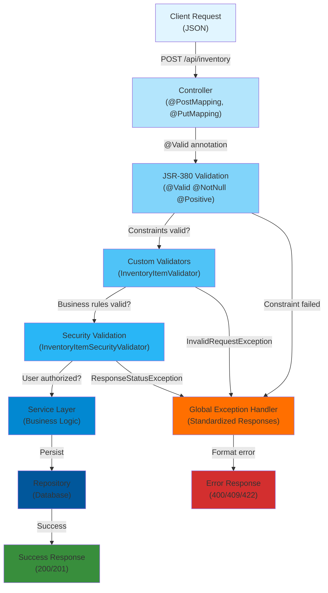

[⬅️ Back to Architecture Index](../index.html)

# Input Validation Framework

## Overview

Smart Supply Pro implements a **multi-layer validation framework** that ensures data integrity, business rule compliance, and security across all API operations. The framework combines:

- **JSR-380 Bean Validation** (Jakarta Validation) for declarative constraints
- **Custom validators** for domain-specific business rules
- **Global exception handling** for standardized error responses
- **Security validation** for role-based field restrictions

---

## Quick Navigation

| Component | Purpose | Documentation |
|-----------|---------|---|
| **JSR-380 Constraints** | Declarative DTO field validation (@NotNull, @Positive, etc.) | [Read →](./jsr-380-constraints.html) |
| **Custom Validators** | Domain logic validation (uniqueness, existence, business rules) | [Read →](./custom-validators.html) |
| **Exception Handling** | Global error mapping to standardized HTTP responses | [Read →](./exception-handling.html) |
| **Security Validation** | Field-level authorization checks (Role-based restrictions) | [Read →](../security/field-level-validation.html) |
| **Validation Patterns** | Best practices for multi-layer validation architecture | [Read →](./patterns.html) |

---

## Validation Architecture Diagram



---

## Validation Layers

### 1. **Presentation Layer (Controller)**

**Entry point for all validation.**

```java
@PostMapping
public ResponseEntity<InventoryItemDTO> create(
    @Valid @RequestBody InventoryItemDTO dto  // JSR-380 validation
) {
    // JSR-380 constraints automatically checked by Spring
    // If validation fails, 400 Bad Request returned
    return ResponseEntity.ok(service.create(dto));
}
```

**Responsibility:**
- ✅ Accept @Valid annotated DTOs
- ✅ Spring automatically triggers JSR-380 validation
- ✅ MethodArgumentNotValidException caught by GlobalExceptionHandler

---

### 2. **JSR-380 Bean Validation Layer**

**Declarative field-level constraints.**

```java
@Data
public class InventoryItemDTO {
    @NotBlank(message = "Name is required")
    private String name;
    
    @NotNull(message = "Quantity is required")
    @PositiveOrZero(message = "Quantity must be >= 0")
    private Integer quantity;
    
    @NotNull(message = "Price is required")
    @Positive(message = "Price must be > 0")
    private BigDecimal price;
}
```

**Triggers automatically on:**
- POST/PUT requests with @Valid annotation
- Validates before method body executes

**Common Constraints:**
| Constraint | Usage | Example |
|-----------|-------|---------|
| `@NotNull` | Field cannot be null | Price must exist |
| `@NotBlank` | String cannot be blank | Name required |
| `@Positive` | Number > 0 | Price > 0 |
| `@PositiveOrZero` | Number >= 0 | Quantity >= 0 |
| `@Email` | Valid email format | Email address |
| `@Null` | Field must be null | ID null on create |

---

### 3. **Custom Validator Layer**

**Domain-specific business rules.**

```java
public class InventoryItemValidator {
    
    // Check for duplicates
    public static void validateInventoryItemNotExists(
        String name, BigDecimal price, InventoryItemRepository repo) {
        // Enforce unique (name, price) combination
    }
    
    // Check for existence
    public static void validateExists(String id, InventoryItemRepository repo) {
        // Verify item exists before update/delete
    }
    
    // Business rule validation
    public static void assertFinalQuantityNonNegative(int resultingQuantity) {
        // Prevent negative stock after adjustment
    }
}
```

**Triggers from:**
- Service layer (before persistence)
- Business logic validation point
- After JSR-380 constraints pass

---

### 4. **Security Validation Layer**

**Role-based field authorization.**

```java
public class InventoryItemSecurityValidator {
    
    public static void validateUpdatePermissions(
        InventoryItem existing, 
        InventoryItemDTO incoming) {
        
        // USER role: only quantity/price updates allowed
        // ADMIN role: all fields allowed
    }
}
```

**Integrated in:**
- Service layer (after custom validation)
- Enforces role-based field restrictions

---

### 5. **Exception Handling Layer**

**Standardized error response mapping.**

```java
@RestControllerAdvice
public class GlobalExceptionHandler {
    
    @ExceptionHandler(MethodArgumentNotValidException.class)
    public ResponseEntity<ErrorResponse> handleValidation(...) {
        // JSR-380 violations → 400 Bad Request
    }
    
    @ExceptionHandler(InvalidRequestException.class)
    public ResponseEntity<ErrorResponse> handleInvalidRequest(...) {
        // Custom validators → 400 Bad Request
    }
    
    @ExceptionHandler(DuplicateResourceException.class)
    public ResponseEntity<ErrorResponse> handleDuplicate(...) {
        // Uniqueness violations → 409 Conflict
    }
}
```

**Responsibility:**
- Catch all validation exceptions
- Format as standardized ErrorResponse
- Return appropriate HTTP status codes

---

## Validation Flow Example

### Create Inventory Item Request

**1. Client sends POST request:**
```json
POST /api/inventory
Content-Type: application/json

{
  "name": "Widget A",
  "quantity": 100,
  "price": 25.50,
  "supplierId": "SUPP-001"
}
```

**2. Controller receives and validates:**
```java
@PostMapping
public ResponseEntity<InventoryItemDTO> create(
    @Valid @RequestBody InventoryItemDTO dto  // ← JSR-380 triggered
) {
    return ResponseEntity.ok(service.create(dto));
}
```

**3. JSR-380 checks:**
- ✅ `name` is not blank
- ✅ `quantity` is >= 0
- ✅ `price` is positive
- ✅ `supplierId` is not blank

**4. Service performs custom validation:**
```java
public InventoryItemDTO create(InventoryItemDTO dto) {
    InventoryItemValidator.validateBase(dto);           // Field existence
    InventoryItemValidator.validateInventoryItemNotExists(
        dto.getName(), dto.getPrice(), repo);           // Uniqueness check
    // ... create item
}
```

**5. Service calls security validator:**
```java
InventoryItemSecurityValidator.validateUpdatePermissions(
    existing, incoming);  // Field-level authorization
```

**6. Success response:**
```json
HTTP/1.1 201 Created
Content-Type: application/json

{
  "id": "item-123",
  "name": "Widget A",
  "quantity": 100,
  "price": 25.50,
  "supplierId": "SUPP-001",
  "createdAt": "2024-01-15T10:30:00Z"
}
```

---

## Error Scenarios

### Scenario 1: JSR-380 Constraint Violation

**Request (missing required field):**
```json
POST /api/inventory
{
  "name": "Widget A",
  "quantity": 100
  // Missing: price (required)
}
```

**Response (400 Bad Request):**
```json
HTTP/1.1 400 Bad Request
Content-Type: application/json

{
  "timestamp": "2024-01-15T10:30:00Z",
  "status": 400,
  "error": "Bad Request",
  "message": "price Price must be greater than zero",
  "path": "/api/inventory"
}
```

### Scenario 2: Custom Validator Violation

**Request (duplicate item):**
```json
POST /api/inventory
{
  "name": "Widget A",
  "quantity": 100,
  "price": 25.50,
  "supplierId": "SUPP-001"
}
```

**Response (409 Conflict - item already exists):**
```json
HTTP/1.1 409 Conflict
Content-Type: application/json

{
  "timestamp": "2024-01-15T10:30:00Z",
  "status": 409,
  "error": "Conflict",
  "message": "An inventory item with this name and price already exists",
  "path": "/api/inventory"
}
```

### Scenario 3: Security Validation Failure

**Request (USER role tries to change supplier):**
```json
PUT /api/inventory/item-123
{
  "name": "Widget A",
  "supplierId": "SUPP-002",  // ← USER cannot change this
  "quantity": 100,
  "price": 25.50
}
```

**Response (403 Forbidden):**
```json
HTTP/1.1 403 Forbidden
Content-Type: application/json

{
  "timestamp": "2024-01-15T10:30:00Z",
  "status": 403,
  "error": "Forbidden",
  "message": "Users are only allowed to change quantity or price",
  "path": "/api/inventory/item-123"
}
```

---

## Validation Entities

### InventoryItemValidator

**Validates inventory item operations:**
- Base field validation (name, quantity, price)
- Duplicate detection (name + price combination)
- Existence checks before update/delete
- Quantity safety checks (non-negative after adjustments)

### SupplierValidator

**Validates supplier operations:**
- Required field checks (name must be non-blank)
- Uniqueness enforcement (case-insensitive names)
- Deletion safety (prevents deletion with linked items)

### StockHistoryValidator

**Validates stock change operations:**
- DTO field validation (item ID, change value, reason)
- Enum validation (StockChangeReason whitelist)
- Business rules (zero-delta only for PRICE_CHANGE)
- Audit field requirements (createdBy mandatory)

### InventoryItemSecurityValidator

**Validates field-level authorization:**
- Role-based field update restrictions
- USER role: quantity/price only
- ADMIN role: all fields allowed

---

## Exception Types

### InvalidRequestException

**400 Bad Request - Validation Failure**

```java
throw new InvalidRequestException(
    "Supplier name must not be blank",
    ValidationSeverity.MEDIUM,
    "BLANK_FIELD"
);
```

**Mapped by:** GlobalExceptionHandler → 400 Bad Request

---

### DuplicateResourceException

**409 Conflict - Uniqueness Violation**

```java
throw new DuplicateResourceException(
    "An inventory item with this name and price already exists"
);
```

**Mapped by:** BusinessExceptionHandler → 409 Conflict

---

### ResponseStatusException (Spring)

**Custom HTTP status exceptions:**

```java
throw new ResponseStatusException(
    HttpStatus.NOT_FOUND,
    "Item not found"
);

throw new ResponseStatusException(
    HttpStatus.UNPROCESSABLE_ENTITY,
    "Resulting stock cannot be negative"
);
```

---

## Validation Groups (Advanced)

Some DTOs support validation groups for different operations:

```java
public class InventoryItemDTO {
    
    public interface Create {}   // Create-specific constraints
    public interface Update {}   // Update-specific constraints
    
    @Null(groups = Create.class)  // ID must be null on create
    private String id;
    
    @NotBlank(groups = {Create.class, Update.class})
    private String name;
}
```

**Usage in controllers:**
```java
@PostMapping
public void create(@Validated(Create.class) @RequestBody InventoryItemDTO dto) {
    // Only Create group constraints checked
}

@PutMapping
public void update(@Validated(Update.class) @RequestBody InventoryItemDTO dto) {
    // Only Update group constraints checked
}
```

---

## Related Documentation

- **[JSR-380 Constraints](./jsr-380-constraints.html)** - Declarative field validation
- **[Custom Validators](./custom-validators.html)** - Domain-specific business rules
- **[Exception Handling](./exception-handling.html)** - Error response mapping
- **[Validation Patterns](./patterns.html)** - Best practices and design patterns
- **[Security Validation](../security/field-level-validation.html)** - Role-based field restrictions

---

[⬅️ Back to Architecture Index](../index.html)
