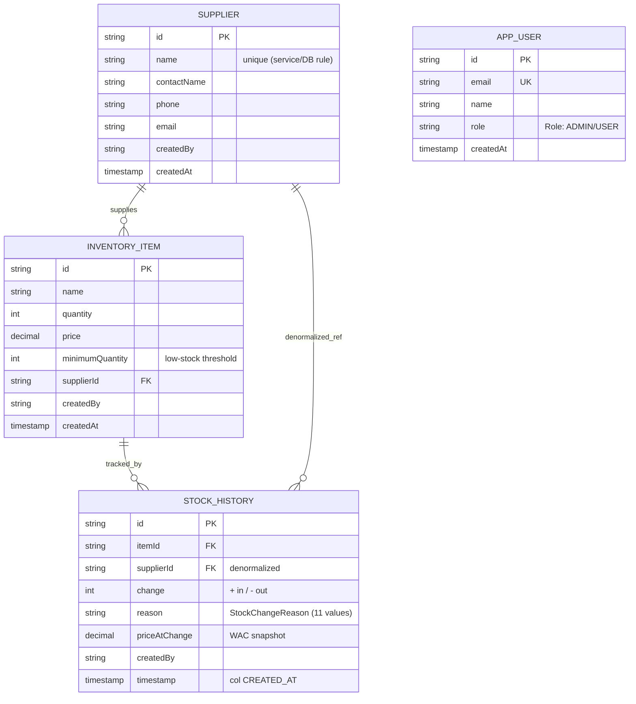

# SmartSupplyPro — Backend Docs Migration Spec (arc42)

Source of truth for the `docs/backend/architecture/` restructure. Feed Claude
Code ONE section at a time. Have it show each file before moving on. Commit this
file as `docs/backend/_migration-spec.md`.

Scope: only `docs/backend/architecture/`. Do NOT touch `docs/_theme/` or
`docs/frontend/`.

Principle: **each concept has exactly one home.** Everything else links to it.
arc42 is mostly narrative `.md` files — only `09-decisions/` and `reference/`
stay folder-shaped.

Method: rebuild fresh. The new arc42 files are written from scratch; the old
files are treated as **source material only** (copy out good sentences,
diagrams, tables), then deleted per section once their content is migrated.

---

## 1. Target tree

```
docs/backend/architecture/
  index.md                 # §1  Introduction & Goals
  02-constraints.md        # §2  Constraints
  03-context.md            # §3  Context & Scope        (+ context diagram, C4 L1)
  04-solution-strategy.md  # §4  Solution Strategy
  05-building-blocks.md    # §5  Building Block View     <- layers/ COLLAPSES here
  06-runtime.md            # §6  Runtime View            (sequence diagrams)
  07-deployment.md         # §7  Deployment View         <- deployment/ collapses here
  08-concepts.md           # §8  Cross-cutting Concepts  <- security/validation/exception/config/enums/resources concepts
  09-decisions/            # §9  ADRs (mirror frontend ADR format EXACTLY)
    index.md
    0001-oracle-wallet-autologin.md
    0002-manual-mapping-over-mapstruct.md
    0003-dto-boundary-no-entity-exposure.md
    0004-http-status-as-envelope.md
  10-quality.md            # §10 Quality Requirements    (test strategy, JaCoCo, CI gates)
  11-risks.md              # §11 Risks & Technical Debt
  12-glossary.md           # §12 Glossary

docs/backend/architecture/reference/   # per-Java-package. PURE reference, NOT architecture.
  controller/   index.md + per-controller (THIN — point to OpenAPI)
  dto/          index.md + per-domain
  model/        entities
  repository/
  config/  enums/  exception/  resources/
```

Note: numbered prefixes only on the narrative files so they sort in arc42 order.
`index.md` IS §1 (serves the `docs/backend/architecture/` URL).

Bilingual note: you have `overview.md` + `overview-de.md`, and German is limited
to landing + overview. Before deleting `overview.md`, decide the German entry
point — likely `index.md` / `index-de.md` become the bilingual pair and
`overview-de.md` folds into `index-de.md`. Confirm against how the language
switcher resolves the §1 page so the German version is not orphaned.

---

## 2. Delete (LAST, after content is migrated)

| Delete | Why | Where its content goes |
|---|---|---|
| `architecture/layers/` (whole folder, all micro-files) | Over-fragmented; 10–17 files per layer; duplicates per-package + overview | §5 (one narrative) + `reference/` for class detail |
| `architecture/diagrams/index.md` (the hub) | Meta-index *about* diagrams adds a layer with no content | each diagram moves into its section (map below) |
| `architecture/overview.md` | Folds into §1 + the sections its content belongs to | §1 (intro/goals), §5 (layers), §7 (deployment), §8 (security/validation) |

Diagram relocation:
- context-diagram -> §3
- logical-architecture -> §5
- database-er -> §5 (and/or reference/model)
- request-lifecycle -> §6
- security-flow -> §6
- analytics-flow -> §6
- deployment-diagram -> §7

---

## 3. Content contract — architecture/ (narrative)

For each: **Contains / Excludes / Source / Size.** Size = soft cap; split if >150 lines (your discipline).

### index.md — §1 Introduction & Goals  (~60–80)
- Contains: one-paragraph purpose; quality-goals table (pick 3–5 real ones, e.g. security, maintainability, separation of concerns); stakeholder table (end users, admins, developers); list/links to the 12 sections.
- Excludes: tech-stack table (-> §2); layer explanations (-> §5).
- Source: `overview.md` intro + principles list.

### 02-constraints.md — §2  (~40)
- Contains: technical constraints (Java 17, Spring Boot 3.5.15, Oracle 23ai, Maven, Docker), organizational (solo dev / portfolio), conventions (REST, RBAC). **Tech-stack table lives here.**
- Source: `overview.md` tech-stack table.

### 03-context.md — §3  (~50)
- Contains: business context (what SSP does, who uses it); technical context (external systems: React FE, Oracle ADB, Google OAuth2); context diagram (C4 L1).
- Source: `integration/`, `diagrams/context-diagram`.

### 04-solution-strategy.md — §4  (~40)
- Contains: one short paragraph per key strategic choice — layered architecture, JPA/Hibernate, DTO+mapper boundary, OAuth2/RBAC, stateless for horizontal scaling. Each links to its ADR for the "why."
- Source: `overview.md` principles + design-patterns table.

### 05-building-blocks.md — §5  (~100–120, the big one)
- Contains: C4 L2/L3. Layer breakdown (controller -> service -> repository -> model) as ONE narrative with the logical-architecture diagram; ER diagram for the domain model. Links DOWN to `reference/` for class detail.
- **Replaces the entire `layers/` folder.**
- Source: `layers/` (collapsed), `diagrams/logical-architecture`, `diagrams/database-er`, `overview.md` "core layers".

### 06-runtime.md — §6  (~80)
- Contains: key runtime scenarios as sequences — request lifecycle (happy + error path), OAuth2 login, analytics computation.
- Source: `diagrams/request-lifecycle`, `security-flow`, `analytics-flow`; the "data flow" blocks in `overview.md`.

### 07-deployment.md — §7  (~90)
- Contains: deployment topology, CI/CD pipeline (CORRECT file names — see global fix #2), Fly.io + Oracle ADB + Koyeb/Nginx, immutable SHA strategy, env/secrets, deployment diagram.
- **Replaces `deployment/index.md`.** Apply global fixes #2–#6.
- Source: `deployment/index.md` (cleaned), `diagrams/deployment-diagram`.

### 08-concepts.md — §8 Cross-cutting  (~100, split if over)
- Contains: short subsection per concept, each linking to reference for detail —
  Security (OAuth2/RBAC), Validation (3 tiers), Exception handling (global handler + the ONE error contract), Configuration/profiles, Persistence (audit fields, optimistic locking), Logging/correlation ID.
- Absorbs the *concept* half of `config/`, `security/`, `validation/`, `exception/`, `enums/`, `resources/`. The *reference* half (class-by-class) goes to `reference/`.
- Source: those index files, deduped.

### 09-decisions/ — §9 ADRs  (~30–40 each)
- Mirror the frontend ADR template EXACTLY (same headings, same numbering) so FE+BE read as one system. Standard: Context / Decision / Consequences / Status.
- First four (all are decisions already stated in current docs):
  - 0001 Oracle wallet auto-login (passwordless `cwallet.sso`, only `TNS_ADMIN` at runtime)
  - 0002 Manual mapping over MapStruct (clarity/control)
  - 0003 DTO boundary — entities never exposed by controllers, DTOs never in repositories
  - 0004 HTTP status as envelope — no generic success wrapper

### 10-quality.md — §10  (~50)
- Contains: quality scenarios + test strategy (unit/integration/coverage), JaCoCo, CI gates, Trivy scan.
- Source: `testing/`, `overview.md` testing section.

### 11-risks.md — §11  (~30)
- Contains: risk/tech-debt table — Spring Boot 3.5 EOL (2026-06-30), TS version mismatch FE/Docker, Lua filter `gsub("^api/","")` suspect rule, double scrollbars, JaCoCo "back to docs" link. Naming your own debt reads as senior.

### 12-glossary.md — §12  (~30)
- Domain + technical terms: WAC, FIFO, RBAC, DTO, ADB, wallet, correlation ID, optimistic locking, demo mode.

---

## 4. Content contract — reference/ (per-package)

Mechanical. Two file types:

**`<package>/index.md`** (~30): 2–3 sentences on the package's purpose ("why it exists"), then a linked table of the files in it. No content the child files already hold.

**`controller/*-controller.md` (THIN, ~60):** base path, auth model — especially the demo-mode logic OpenAPI can't express — and business rules. Link to the live ReDoc/OpenAPI for the full request/response/status contract. **Do NOT re-document every field and status code; OpenAPI owns that.** The current `supplier-controller.md` is ~2x too heavy and has already drifted — trim it and align its error shape to the canonical one.

Other reference files (dto, model, repository): keep current depth, apply global fixes.

---

## 5. Global fixes — apply across ALL files

1. **Error contract — pick ONE shape, make every doc match.** Canonical (from `dto/index.md`): `{ "error": "<token>", "message": "...", "timestamp": "...", "correlationId": "..." }`. Delete the `{error, message, status}` variant in `supplier-controller.md` and anywhere else. CONFIRM against `GlobalExceptionHandler` / `ErrorResponse` in code before locking.
2. **Workflow file names.** Workflow file names (VERIFIED against .github/workflows/):
   `1-ci-test.yml`, `2-docker-backend.yml`, `3-deploy-ghpages.yml`, `4-deploy-fly.yml`,
   `5-frontend-ci.yml`. Port 8081 (not 8080), `6-deploy-frontend.yml`, `docs-pipeline.yml`. Fix every reference. Health: /api/health. ops/nginx/ EXISTS.
3. **No Postgres.** `config/index.md` says default profile uses "PostgreSQL/Oracle." Stack is Oracle + H2. Remove Postgres.
4. **Remove all emojis.** German enterprise docs don't use them; also your stated preference.
5. **Mermaid palette.** Use the established `classDef` with literal hex: controller `#2563eb`, service `#0d9488`, repository `#d97706`, `color:#fff`. Remove the random inline `style X fill:#e1f5ff` pastels.
6. **Links: `.md` everywhere** (Pandoc rewrites the extension at build). Fix the `.html` links in `deployment/`. Remove dead refs: `../devops/`, `../resources/` (if absent), `/ops/nginx/`.
7. **Footers.** Either every file gets an identical metadata block or none do. For a portfolio, drop the "Last Updated / Audience: DevOps, SRE…" footers — dates rot and invite "this is stale."

---

## 6. Execution order

1. Create the empty arc42 skeleton (stubs, headings only). Delete nothing.
2. §1–§4 first — mostly from `overview.md`, lowest risk. Confirm before continuing.
3. §5 next — the `layers/` collapse, the big one. Review carefully.
4. §6–§8, then §9 ADRs, then §10–§12.
5. `reference/` last (mechanical), applying global fixes.
6. Delete `layers/`, the `diagrams/` hub, and `overview.md` only after their content is confirmed migrated.

---

## VERIFIED FACTS
### Source-code-confirmed. Apply to every doc written after this point; correct any prior doc that contradicts these.

- **Audit fields**: entities have ONLY `createdBy` (plain `String`, not a FK to `AppUser`) and
  `createdAt`. There is no `updatedAt`, no `updatedBy`, no `@Version`, and no optimistic
  locking. Remove any claim of `updatedAt`/`updatedBy`/`@Version`/optimistic locking from
  all docs.

- **Error response**: `ErrorResponse` has exactly three fields — `error`, `message`,
  `timestamp`. There is no `correlationId`. The error token is
  `HttpStatus.name().toLowerCase()` (e.g. `bad_request`, `not_found`, `conflict`).
  Remove every mention of `correlationId` from all docs.

- **InventoryItem fields**: `name`, `quantity`, `price`, `minimumQuantity`, `supplierId`.
  There is no `sku` field.

- **StockHistory fields**: `change`, `reason` (type `StockChangeReason`), `priceAtChange`,
  `createdAt` (the timestamp column; not named `timestamp` or `transaction_date`). There
  is no `severity` field and no `transaction_date` column.

- **AppUser** (table `users_app`): `id`, `email` (unique), `name`, `role`, `createdAt`.
  There is no `google_sub`, no `active`, no `last_login`.

- **ER diagram**: use the corrected Mermaid diagram below verbatim in §5 and
  `reference/model/index.md`.



