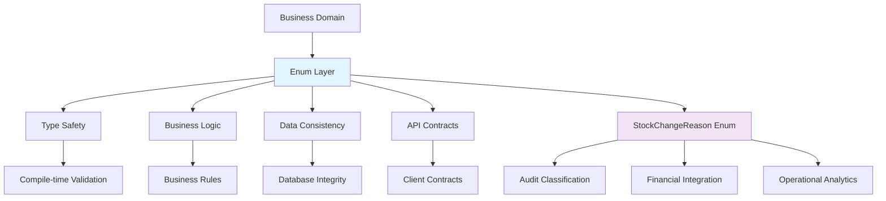
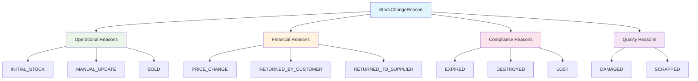

# Enums Layer Architecture Documentation

**Version:** 1.0  
**Date:** October 8, 2025  
**Layer:** Business Enumeration Architecture  
**Scope:** Enterprise Enum Design Patterns and Standards  

## Table of Contents

1. [Architecture Overview](#architecture-overview)
2. [Business Enumeration Strategy](#business-enumeration-strategy)
3. [Enterprise Design Patterns](#enterprise-design-patterns)
4. [Integration Architecture](#integration-architecture)
5. [Performance Characteristics](#performance-characteristics)
6. [Compliance and Audit Framework](#compliance-and-audit-framework)
7. [Extensibility and Evolution](#extensibility-and-evolution)
8. [Future Architecture Considerations](#future-architecture-considerations)

## Architecture Overview

The Enums layer provides **standardized business vocabulary** through type-safe enumeration patterns, ensuring consistent data classification across all enterprise systems. This layer serves as the **authoritative reference** for business constants and categorical data.

### Core Architecture Principles



### Enterprise Design Philosophy

1. **Business-Driven Design**: Enums reflect real business concepts and terminology
2. **Type Safety First**: Compile-time guarantees for business rule enforcement
3. **Immutable Constants**: Thread-safe, singleton pattern for performance
4. **Semantic Clarity**: Self-documenting business vocabulary
5. **Integration Readiness**: Optimized for cross-system communication

## Business Enumeration Strategy

### StockChangeReason Enumeration Analysis

The `StockChangeReason` enum serves as the **central classification system** for inventory movements, supporting multiple enterprise concerns:

#### Business Category Classification



#### Enterprise Use Case Mapping

| **Enum Value** | **Business Domain** | **Financial Impact** | **Audit Requirement** | **Operational Impact** |
|----------------|--------------------|--------------------|----------------------|----------------------|
| `INITIAL_STOCK` | Inventory Setup | Asset Recognition | High - Baseline | Medium - Setup |
| `MANUAL_UPDATE` | Operations | Adjustment Required | High - Governance | High - Process |
| `PRICE_CHANGE` | Finance | Valuation Only | Medium - Financial | Low - No Quantity |
| `SOLD` | Sales | Revenue Recognition | High - Transaction | High - Fulfillment |
| `SCRAPPED` | Quality Control | Asset Write-off | High - Loss | Medium - Disposal |
| `DESTROYED` | Risk Management | Insurance Claim | Critical - Legal | High - Safety |
| `DAMAGED` | Quality Control | Hold Assessment | Medium - Quality | High - Quarantine |
| `EXPIRED` | Compliance | Asset Write-off | High - Regulatory | Medium - Disposal |
| `LOST` | Security | Shrinkage Loss | Critical - Investigation | High - Security |
| `RETURNED_TO_SUPPLIER` | Procurement | Vendor Credit | Medium - Commercial | Medium - Logistics |
| `RETURNED_BY_CUSTOMER` | Customer Service | Refund Processing | Medium - Customer | High - Service |

### Business Logic Integration Points

#### Financial Integration
```java
// Cost of Goods Sold (COGS) calculation integration
public BigDecimal calculateCOGSImpact(StockChangeReason reason, BigDecimal value) {
    return switch (reason) {
        case SOLD -> value; // Direct COGS impact
        case SCRAPPED, DESTROYED, EXPIRED, LOST -> value; // Loss recognition
        case RETURNED_BY_CUSTOMER -> value.negate(); // COGS reversal
        case PRICE_CHANGE, INITIAL_STOCK, MANUAL_UPDATE -> BigDecimal.ZERO; // No COGS impact
        case DAMAGED, RETURNED_TO_SUPPLIER -> BigDecimal.ZERO; // Pending assessment
    };
}
```

#### Audit Trail Classification
```java
// Audit severity classification based on business rules
public AuditSeverity getAuditSeverity(StockChangeReason reason) {
    return switch (reason) {
        case DESTROYED, LOST -> AuditSeverity.CRITICAL; // Investigation required
        case INITIAL_STOCK, SOLD -> AuditSeverity.HIGH; // Financial significance
        case MANUAL_UPDATE, SCRAPPED, EXPIRED -> AuditSeverity.MEDIUM; // Process compliance
        case PRICE_CHANGE, DAMAGED, RETURNED_TO_SUPPLIER, RETURNED_BY_CUSTOMER -> AuditSeverity.LOW;
    };
}
```

## Enterprise Design Patterns

### Pattern 1: Type-Safe Business Constants

**Strategy**: Use enums to replace string constants and magic numbers.

#### Before: String-Based Classification (Anti-Pattern)
```java
// ❌ Error-prone: No compile-time validation
public class StockHistoryService {
    public void recordChange(String reason) {
        if ("sold".equals(reason) || "SOLD".equals(reason)) { // Case sensitivity issues
            // Process sales
        } else if ("manual_update".equals(reason)) { // Typo-prone
            // Process manual update
        }
        // Potential runtime errors, no IDE support
    }
}
```

#### After: Enum-Based Classification (Best Practice)
```java
// ✅ Type-safe: Compile-time validation and IDE support
public class StockHistoryService {
    public void recordChange(StockChangeReason reason) {
        switch (reason) {
            case SOLD -> processSales(reason);
            case MANUAL_UPDATE -> processManualUpdate(reason);
            case SCRAPPED, DESTROYED, EXPIRED, LOST -> processLoss(reason);
            // Compile-time exhaustiveness checking
        }
    }
}
```

### Pattern 2: Business Rule Encapsulation

**Strategy**: Embed business logic within enum-related utility methods.

#### Business Logic Utilities
```java
public final class StockChangeReasonUtils {
    
    private StockChangeReasonUtils() {
        throw new UnsupportedOperationException("Utility class");
    }
    
    /**
     * Determines if the reason requires manager approval.
     */
    public static boolean requiresManagerApproval(StockChangeReason reason) {
        return switch (reason) {
            case MANUAL_UPDATE, DESTROYED, LOST -> true;
            default -> false;
        };
    }
    
    /**
     * Categorizes reason by financial impact type.
     */
    public static FinancialImpactType getFinancialImpactType(StockChangeReason reason) {
        return switch (reason) {
            case SOLD -> FinancialImpactType.REVENUE;
            case SCRAPPED, DESTROYED, EXPIRED, LOST -> FinancialImpactType.LOSS;
            case RETURNED_BY_CUSTOMER -> FinancialImpactType.REFUND;
            case RETURNED_TO_SUPPLIER -> FinancialImpactType.CREDIT;
            case PRICE_CHANGE -> FinancialImpactType.VALUATION;
            default -> FinancialImpactType.NONE;
        };
    }
    
    /**
     * Groups reasons by operational category.
     */
    public static Set<StockChangeReason> getLossReasons() {
        return EnumSet.of(
            StockChangeReason.SCRAPPED,
            StockChangeReason.DESTROYED,
            StockChangeReason.EXPIRED,
            StockChangeReason.LOST
        );
    }
    
    /**
     * Determines if reason affects available quantity.
     */
    public static boolean affectsAvailableQuantity(StockChangeReason reason) {
        return reason != StockChangeReason.PRICE_CHANGE;
    }
}
```

### Pattern 3: Enum Extension Strategy

**Strategy**: Design enums for future extensibility without breaking changes.

#### Backward-Compatible Extension Pattern
```java
// Future-proof enum design
public enum StockChangeReason {
    // Core business reasons (v1.0)
    INITIAL_STOCK,
    MANUAL_UPDATE,
    PRICE_CHANGE,
    SOLD,
    
    // Quality management reasons (v1.0)
    SCRAPPED,
    DESTROYED,
    DAMAGED,
    EXPIRED,
    
    // Loss prevention reasons (v1.0)
    LOST,
    
    // Return management reasons (v1.0)
    RETURNED_TO_SUPPLIER,
    RETURNED_BY_CUSTOMER;
    
    // Future extensions (maintain ordinal stability):
    // TRANSFERRED_TO_WAREHOUSE,    // v1.1
    // PROMOTIONAL_GIVEAWAY,        // v1.1
    // BULK_DISCOUNT_ADJUSTMENT,    // v1.2
    // SEASONAL_ADJUSTMENT          // v1.2
    
    /**
     * Checks if this reason was introduced in a specific version.
     */
    public boolean isAvailableInVersion(String version) {
        // Version compatibility checking for API evolution
        return switch (this) {
            case INITIAL_STOCK, MANUAL_UPDATE, PRICE_CHANGE, SOLD,
                 SCRAPPED, DESTROYED, DAMAGED, EXPIRED, LOST,
                 RETURNED_TO_SUPPLIER, RETURNED_BY_CUSTOMER -> 
                 compareVersions(version, "1.0.0") >= 0;
            // Future versions would add cases here
        };
    }
    
    private int compareVersions(String v1, String v2) {
        // Semantic version comparison logic
        return v1.compareTo(v2);
    }
}
```

## Integration Architecture

### API Integration Patterns

#### JSON Serialization Strategy
```java
// Optimal JSON serialization configuration
@JsonFormat(shape = JsonFormat.Shape.STRING)
public enum StockChangeReason {
    // Enum values serialize as strings for API stability
}

// Controller integration pattern
@RestController
public class StockHistoryController {
    
    @PostMapping("/stock-history")
    public ResponseEntity<StockHistoryDTO> createStockHistory(
            @RequestBody @Valid CreateStockHistoryRequest request) {
        
        // Type-safe enum parameter handling
        StockChangeReason reason = request.getReason(); // Already validated by framework
        
        // Business logic with compile-time safety
        if (StockChangeReasonUtils.requiresManagerApproval(reason)) {
            validateManagerApproval(request);
        }
        
        return ResponseEntity.ok(stockHistoryService.create(request));
    }
}
```

#### Database Integration Patterns
```java
// JPA enum integration with optimal storage
@Entity
public class StockHistory {
    
    @Enumerated(EnumType.STRING) // Store as strings for readability
    @Column(name = "change_reason", nullable = false)
    private StockChangeReason reason;
    
    // Alternative: Ordinal storage for performance
    // @Enumerated(EnumType.ORDINAL) // More efficient storage, less readable
    
    // Custom converter for advanced scenarios
    @Convert(converter = StockChangeReasonConverter.class)
    private StockChangeReason reasonWithConverter;
}

// Custom JPA converter for complex enum handling
@Converter(autoApply = true)
public class StockChangeReasonConverter implements AttributeConverter<StockChangeReason, String> {
    
    @Override
    public String convertToDatabaseColumn(StockChangeReason reason) {
        return reason != null ? reason.name() : null;
    }
    
    @Override
    public StockChangeReason convertToEntityAttribute(String dbData) {
        try {
            return dbData != null ? StockChangeReason.valueOf(dbData) : null;
        } catch (IllegalArgumentException e) {
            log.warn("Unknown stock change reason in database: {}", dbData);
            return null; // Or default value for graceful degradation
        }
    }
}
```

### Service Layer Integration

#### Business Logic Integration
```java
@Service
@Transactional
public class InventoryService {
    
    /**
     * Process inventory change with business rule validation.
     */
    public StockHistory processInventoryChange(
            Long itemId, 
            Integer quantityChange, 
            StockChangeReason reason,
            String notes) {
        
        // Enum-based business rule validation
        validateReasonForOperation(reason, quantityChange);
        
        // Financial impact calculation
        FinancialImpactType impactType = StockChangeReasonUtils.getFinancialImpactType(reason);
        BigDecimal financialImpact = calculateFinancialImpact(itemId, quantityChange, impactType);
        
        // Audit trail with enum classification
        AuditSeverity severity = getAuditSeverity(reason);
        auditService.logInventoryChange(itemId, reason, severity, financialImpact);
        
        // Create history record
        return createStockHistory(itemId, quantityChange, reason, notes, financialImpact);
    }
    
    private void validateReasonForOperation(StockChangeReason reason, Integer quantityChange) {
        // Business rule: PRICE_CHANGE should not affect quantity
        if (reason == StockChangeReason.PRICE_CHANGE && quantityChange != 0) {
            throw new BusinessRuleViolationException(
                "Price changes cannot modify quantity. Use MANUAL_UPDATE for quantity adjustments.");
        }
        
        // Business rule: Positive quantity for inbound operations
        if (isInboundOperation(reason) && quantityChange <= 0) {
            throw new BusinessRuleViolationException(
                "Inbound operations require positive quantity change");
        }
    }
    
    private boolean isInboundOperation(StockChangeReason reason) {
        return EnumSet.of(
            StockChangeReason.INITIAL_STOCK,
            StockChangeReason.RETURNED_BY_CUSTOMER
        ).contains(reason);
    }
}
```

## Performance Characteristics

### Memory Efficiency Analysis

#### Enum Instance Management
```java
// Enum performance characteristics
public class EnumPerformanceAnalysis {
    
    /**
     * Memory footprint: Single instance per enum value (singleton pattern)
     * - StockChangeReason.SOLD: 1 instance across entire JVM
     * - Comparison: Reference equality (==) is fastest
     * - Serialization: Optimized ordinal-based serialization available
     */
    
    // Performance comparison: Enum vs String constants
    public void performanceComparison() {
        // ✅ Enum comparison (fastest - reference equality)
        StockChangeReason reason1 = StockChangeReason.SOLD;
        StockChangeReason reason2 = StockChangeReason.SOLD;
        boolean isEqual = reason1 == reason2; // Reference equality - O(1)
        
        // ❌ String comparison (slower - content comparison)
        String stringReason1 = "SOLD";
        String stringReason2 = "SOLD";
        boolean isStringEqual = stringReason1.equals(stringReason2); // Content comparison - O(n)
    }
    
    /**
     * Switch expression performance: Optimized by JVM
     * - Compile-time optimization for enum switches
     * - Jump table generation for O(1) case selection
     * - No string hashing overhead
     */
    public void switchPerformance(StockChangeReason reason) {
        // JVM optimizes enum switches to jump tables
        String category = switch (reason) {
            case SOLD -> "Sales";
            case SCRAPPED, DESTROYED, EXPIRED, LOST -> "Loss";
            case RETURNED_BY_CUSTOMER, RETURNED_TO_SUPPLIER -> "Returns";
            default -> "Other";
        }; // O(1) performance after JIT compilation
    }
}
```

### Serialization Performance

#### JSON Serialization Optimization
```java
// High-performance JSON serialization configuration
@JsonSerialize(using = StockChangeReasonSerializer.class)
@JsonDeserialize(using = StockChangeReasonDeserializer.class)
public enum StockChangeReason {
    // Enum values with custom serialization for optimal performance
}

// Custom serializer for performance optimization
public class StockChangeReasonSerializer extends JsonSerializer<StockChangeReason> {
    
    // Pre-computed JSON values for maximum performance
    private static final Map<StockChangeReason, String> JSON_CACHE = 
        Arrays.stream(StockChangeReason.values())
              .collect(Collectors.toMap(
                  Function.identity(),
                  reason -> "\"" + reason.name() + "\""
              ));
    
    @Override
    public void serialize(StockChangeReason value, JsonGenerator gen, SerializerProvider serializers) 
            throws IOException {
        // O(1) lookup vs O(n) string processing
        gen.writeRawValue(JSON_CACHE.get(value));
    }
}
```

## Compliance and Audit Framework

### Regulatory Compliance Integration

#### Audit Trail Classification
```java
// Compliance-aware enum usage
public class ComplianceAuditService {
    
    /**
     * SOX compliance: Financial reporting requirements
     */
    public boolean requiresSOXAudit(StockChangeReason reason) {
        return EnumSet.of(
            StockChangeReason.SOLD,           // Revenue recognition
            StockChangeReason.SCRAPPED,       // Asset write-off
            StockChangeReason.DESTROYED,      // Insurance claims
            StockChangeReason.LOST            // Inventory shrinkage
        ).contains(reason);
    }
    
    /**
     * FDA compliance: Pharmaceutical inventory tracking
     */
    public boolean requiresFDATracking(StockChangeReason reason) {
        return EnumSet.of(
            StockChangeReason.EXPIRED,        // Drug expiration tracking
            StockChangeReason.DESTROYED,      // Controlled substance destruction
            StockChangeReason.RETURNED_TO_SUPPLIER, // Recall processing
            StockChangeReason.DAMAGED         // Quality control
        ).contains(reason);
    }
    
    /**
     * Security compliance: Loss prevention requirements
     */
    public boolean requiresSecurityInvestigation(StockChangeReason reason) {
        return EnumSet.of(
            StockChangeReason.LOST,           // Theft investigation
            StockChangeReason.DESTROYED       // Incident documentation
        ).contains(reason);
    }
}
```

### Data Governance Framework

#### Business Vocabulary Management
```java
// Centralized business vocabulary management
public final class BusinessVocabulary {
    
    /**
     * Human-readable descriptions for UI display
     */
    private static final Map<StockChangeReason, String> DISPLAY_NAMES = Map.of(
        StockChangeReason.INITIAL_STOCK, "Initial Inventory",
        StockChangeReason.MANUAL_UPDATE, "Manual Adjustment",
        StockChangeReason.PRICE_CHANGE, "Price Update",
        StockChangeReason.SOLD, "Customer Sale",
        StockChangeReason.SCRAPPED, "Quality Control Removal",
        StockChangeReason.DESTROYED, "Asset Destruction",
        StockChangeReason.DAMAGED, "Damage Assessment",
        StockChangeReason.EXPIRED, "Expiration Removal",
        StockChangeReason.LOST, "Inventory Loss",
        StockChangeReason.RETURNED_TO_SUPPLIER, "Supplier Return",
        StockChangeReason.RETURNED_BY_CUSTOMER, "Customer Return"
    );
    
    /**
     * Detailed descriptions for audit documentation
     */
    private static final Map<StockChangeReason, String> AUDIT_DESCRIPTIONS = Map.of(
        StockChangeReason.INITIAL_STOCK, 
            "Initial inventory quantity established during item setup for baseline tracking",
        StockChangeReason.MANUAL_UPDATE, 
            "Administrative correction for inventory discrepancies requiring management approval",
        StockChangeReason.LOST, 
            "Unaccounted inventory loss requiring security investigation and process review"
        // Additional descriptions for comprehensive audit trail
    );
    
    public static String getDisplayName(StockChangeReason reason) {
        return DISPLAY_NAMES.getOrDefault(reason, reason.name());
    }
    
    public static String getAuditDescription(StockChangeReason reason) {
        return AUDIT_DESCRIPTIONS.getOrDefault(reason, "Standard inventory adjustment");
    }
}
```

## Extensibility and Evolution

### Version Management Strategy

#### Backward-Compatible Evolution
```java
// Enum evolution management
public class EnumEvolutionManager {
    
    /**
     * Migration strategy for new enum values
     */
    public void handleEnumEvolution() {
        // Strategy 1: Additive changes (safe)
        // - Add new enum values at the end
        // - Maintain existing ordinal values
        // - Update business logic with default cases
        
        // Strategy 2: Deprecation handling (controlled)
        // - Mark old values as @Deprecated
        // - Provide migration utilities
        // - Maintain backward compatibility
        
        // Strategy 3: Breaking changes (versioned)
        // - Create new enum versions
        // - Provide conversion utilities
        // - Implement API versioning
    }
    
    /**
     * Safe enum extension pattern
     */
    public void safeExtensionExample() {
        // Current enum handling with future-proof design
        StockChangeReason reason = getCurrentReason();
        
        // Defensive programming for unknown enum values
        String category = switch (reason) {
            case SOLD -> "Sales";
            case SCRAPPED, DESTROYED, EXPIRED, LOST -> "Loss";
            case RETURNED_BY_CUSTOMER, RETURNED_TO_SUPPLIER -> "Returns";
            // Default case handles future enum additions gracefully
            default -> "Other";
        };
    }
}
```

### Future Architecture Considerations

#### Extensibility Patterns
```java
// Future-ready enum architecture
public interface EnumExtensionStrategy {
    
    /**
     * Plugin-based enum behavior extension
     */
    default void registerEnumBehavior(StockChangeReason reason, EnumBehavior behavior) {
        EnumBehaviorRegistry.register(reason, behavior);
    }
    
    /**
     * Dynamic enum value handling for future extensions
     */
    default Optional<String> getCustomProperty(StockChangeReason reason, String propertyName) {
        return EnumPropertyRegistry.getProperty(reason, propertyName);
    }
}

// Internationalization support
public class EnumInternationalization {
    
    /**
     * Multi-language support for enum display
     */
    public String getLocalizedDisplayName(StockChangeReason reason, Locale locale) {
        String key = "stockChangeReason." + reason.name().toLowerCase();
        return messageSource.getMessage(key, null, locale);
    }
}
```

---

## Architecture Summary

The Enums layer provides:

1. **Type Safety**: Compile-time validation and IDE support for business constants
2. **Performance**: Optimized memory usage and comparison operations
3. **Integration**: Seamless database, API, and service layer integration
4. **Compliance**: Built-in support for audit, regulatory, and security requirements
5. **Extensibility**: Future-proof design for business vocabulary evolution

This architecture ensures that business enumerations serve as a reliable, performant, and maintainable foundation for enterprise inventory management systems.

---

*This architecture documentation provides comprehensive guidance for enterprise-grade enum design patterns and integration strategies in Spring Boot applications.*