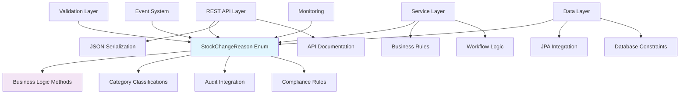

# Enum Integration Patterns Documentation

**Version:** 1.0  
**Date:** October 8, 2025  
**Purpose:** Enterprise Integration Patterns for Business Enums  
**Scope:** API, Service, and Data Layer Integration Strategies  

## Table of Contents

1. [Integration Overview](#integration-overview)
2. [API Integration Patterns](#api-integration-patterns)
3. [Service Layer Integration](#service-layer-integration)
4. [Data Persistence Integration](#data-persistence-integration)
5. [Validation Framework Integration](#validation-framework-integration)
6. [Event-Driven Integration](#event-driven-integration)
7. [Internationalization Integration](#internationalization-integration)
8. [Monitoring and Observability](#monitoring-and-observability)

## Integration Overview

The enhanced `StockChangeReason` enum integrates seamlessly across all application layers, providing **type-safe business logic** and **consistent data classification** throughout the enterprise system.

### Integration Architecture



### Integration Principles

1. **Type Safety**: Compile-time validation across all integration points
2. **Business Logic Consistency**: Single source of truth for business rules
3. **Performance Optimization**: Efficient enum operations in high-traffic scenarios
4. **Enterprise Compatibility**: Seamless integration with enterprise frameworks

## API Integration Patterns

### Pattern 1: REST Controller Integration

**Strategy**: Leverage enum business methods for API validation and processing.

#### Enhanced Controller with Enum Integration
```java
@RestController
@RequestMapping("/api/v1/inventory")
@Validated
@Slf4j
public class InventoryController {
    
    private final InventoryService inventoryService;
    private final NotificationService notificationService;
    
    /**
     * Create stock change with integrated enum validation.
     */
    @PostMapping("/stock-changes")
    @ResponseStatus(HttpStatus.CREATED)
    public StockChangeResponseDTO createStockChange(
            @Valid @RequestBody CreateStockChangeRequest request) {
        
        StockChangeReason reason = request.getReason();
        
        // Direct enum method usage for business logic
        if (reason.requiresManagerApproval() && !hasManagerApproval(request)) {
            throw new ValidationException(
                "Manager approval required for " + reason + " operations");
        }
        
        if (reason.requiresComplianceDocumentation() && request.getDocumentation() == null) {
            throw new ComplianceException(
                "Compliance documentation required for " + reason);
        }
        
        // Audit logging with enum classification
        auditService.logStockChange(request, reason.getAuditSeverity());
        
        // Process stock change
        StockChange result = inventoryService.processStockChange(request);
        
        // Conditional notifications based on enum properties
        if (reason.isLossReason()) {
            notificationService.notifyLossEvent(result);
        }
        
        if (StockChangeReason.getSecuritySensitiveReasons().contains(reason)) {
            securityService.flagForReview(result);
        }
        
        return stockChangeMapper.toDTO(result);
    }
    
    /**
     * Batch stock changes with category-based processing.
     */
    @PostMapping("/stock-changes/batch")
    public BatchStockChangeResponseDTO processBatchStockChanges(
            @Valid @RequestBody BatchStockChangeRequest request) {
        
        List<CreateStockChangeRequest> changes = request.getChanges();
        
        // Category-based batch optimization
        Map<Boolean, List<CreateStockChangeRequest>> partitioned = changes.stream()
            .collect(Collectors.partitioningBy(
                change -> change.getReason().requiresManagerApproval()));
        
        // Process non-approval items immediately
        List<StockChangeResponseDTO> immediateResults = partitioned.get(false)
            .parallelStream()
            .map(this::processImmediateChange)
            .toList();
        
        // Queue approval-required items for manager review
        List<StockChangeResponseDTO> pendingResults = partitioned.get(true)
            .stream()
            .map(this::queueForApproval)
            .toList();
        
        return BatchStockChangeResponseDTO.builder()
            .immediateResults(immediateResults)
            .pendingApproval(pendingResults)
            .summary(createBatchSummary(changes))
            .build();
    }
    
    /**
     * Analytics endpoint with enum category filtering.
     */
    @GetMapping("/analytics/stock-changes")
    public StockChangeAnalyticsDTO getStockChangeAnalytics(
            @RequestParam(required = false) Set<StockChangeReason> reasons,
            @RequestParam(defaultValue = "30") int days) {
        
        // Default to all loss reasons if not specified
        Set<StockChangeReason> filterReasons = reasons != null && !reasons.isEmpty() 
            ? reasons 
            : StockChangeReason.getLossReasons();
        
        return analyticsService.generateStockChangeAnalytics(filterReasons, days);
    }
}
```

### Pattern 2: OpenAPI Documentation Integration

**Strategy**: Automatically generate comprehensive API documentation with enum details.

#### OpenAPI Configuration for Enums
```java
@Configuration
public class OpenAPIEnumConfiguration {
    
    @Bean
    public OpenAPI customOpenAPI() {
        return new OpenAPI()
            .components(new Components()
                .addSchemas("StockChangeReason", createStockChangeReasonSchema())
                .addSchemas("AuditSeverity", createAuditSeveritySchema()));
    }
    
    private Schema<?> createStockChangeReasonSchema() {
        return new StringSchema()
            .description("Stock change reason with integrated business logic")
            ._enum(Arrays.stream(StockChangeReason.values())
                        .map(Enum::name)
                        .toList())
            .addExtension("x-business-rules", Map.of(
                "managerApprovalRequired", Arrays.stream(StockChangeReason.values())
                    .filter(StockChangeReason::requiresManagerApproval)
                    .map(Enum::name)
                    .toList(),
                "lossReasons", StockChangeReason.getLossReasons().stream()
                    .map(Enum::name)
                    .toList(),
                "securitySensitive", StockChangeReason.getSecuritySensitiveReasons().stream()
                    .map(Enum::name)
                    .toList()
            ));
    }
}

// Enhanced DTO with enum documentation
@Schema(description = "Stock change request with business rule validation")
public class CreateStockChangeRequest {
    
    @Schema(
        description = "Reason for stock change with integrated business logic",
        example = "MANUAL_UPDATE",
        implementation = StockChangeReason.class
    )
    @NotNull(message = "Stock change reason is required")
    private StockChangeReason reason;
    
    @Schema(
        description = "Manager approval token (required for certain reasons)",
        example = "MGR-APPROVAL-12345"
    )
    @ConditionalValidation(
        condition = "reason.requiresManagerApproval()",
        message = "Manager approval required for this reason"
    )
    private String managerApprovalToken;
}
```

### Pattern 3: Client SDK Generation

**Strategy**: Generate type-safe client libraries with enum business logic.

#### TypeScript Client Generation
```typescript
// Generated TypeScript client with enum integration
export enum StockChangeReason {
  INITIAL_STOCK = 'INITIAL_STOCK',
  MANUAL_UPDATE = 'MANUAL_UPDATE',
  PRICE_CHANGE = 'PRICE_CHANGE',
  SOLD = 'SOLD',
  SCRAPPED = 'SCRAPPED',
  DESTROYED = 'DESTROYED',
  DAMAGED = 'DAMAGED',
  EXPIRED = 'EXPIRED',
  LOST = 'LOST',
  RETURNED_TO_SUPPLIER = 'RETURNED_TO_SUPPLIER',
  RETURNED_BY_CUSTOMER = 'RETURNED_BY_CUSTOMER'
}

// Generated business logic utilities
export class StockChangeReasonUtils {
  
  static requiresManagerApproval(reason: StockChangeReason): boolean {
    return [
      StockChangeReason.MANUAL_UPDATE,
      StockChangeReason.DESTROYED,
      StockChangeReason.LOST
    ].includes(reason);
  }
  
  static getLossReasons(): StockChangeReason[] {
    return [
      StockChangeReason.SCRAPPED,
      StockChangeReason.DESTROYED,
      StockChangeReason.EXPIRED,
      StockChangeReason.LOST
    ];
  }
  
  static getAuditSeverity(reason: StockChangeReason): AuditSeverity {
    switch (reason) {
      case StockChangeReason.DESTROYED:
      case StockChangeReason.LOST:
        return AuditSeverity.CRITICAL;
      case StockChangeReason.INITIAL_STOCK:
      case StockChangeReason.SOLD:
        return AuditSeverity.HIGH;
      default:
        return AuditSeverity.LOW;
    }
  }
}
```

## Service Layer Integration

### Pattern 1: Business Logic Workflow Integration

**Strategy**: Use enum methods to drive business workflow decisions.

#### Enhanced Service Layer Implementation
```java
@Service
@Transactional
@Slf4j
public class InventoryService {
    
    private final InventoryRepository inventoryRepository;
    private final StockHistoryRepository stockHistoryRepository;
    private final NotificationService notificationService;
    private final ComplianceService complianceService;
    
    /**
     * Process stock change with enum-driven workflow.
     */
    public StockChange processStockChange(CreateStockChangeRequest request) {
        StockChangeReason reason = request.getReason();
        InventoryItem item = findInventoryItem(request.getItemId());
        
        // Pre-processing validation using enum methods
        validateStockChange(item, request, reason);
        
        // Create stock change record
        StockChange stockChange = createStockChangeRecord(item, request);
        
        // Enum-driven processing workflow
        processReasonSpecificLogic(stockChange, reason);
        
        // Update inventory based on reason properties
        if (reason.affectsQuantity()) {
            updateInventoryQuantity(item, request.getQuantityChange());
        }
        
        // Audit logging with enum classification
        createAuditTrail(stockChange, reason);
        
        // Conditional post-processing
        executePostProcessingActions(stockChange, reason);
        
        return stockChange;
    }
    
    private void processReasonSpecificLogic(StockChange stockChange, StockChangeReason reason) {
        // Loss tracking for financial reporting
        if (reason.isLossReason()) {
            BigDecimal lossValue = calculateLossValue(stockChange);
            financialService.recordLoss(lossValue, reason);
            lossPreventionService.analyzePattern(stockChange);
        }
        
        // Customer relationship management
        if (StockChangeReason.getCustomerReasons().contains(reason)) {
            customerService.updateInteractionHistory(stockChange);
        }
        
        // Supplier relationship management
        if (StockChangeReason.getSupplierReasons().contains(reason)) {
            supplierService.updatePerformanceMetrics(stockChange);
        }
        
        // Security investigation triggers
        if (StockChangeReason.getSecuritySensitiveReasons().contains(reason)) {
            securityService.initiateInvestigation(stockChange);
        }
    }
    
    private void executePostProcessingActions(StockChange stockChange, StockChangeReason reason) {
        // Compliance documentation
        if (reason.requiresComplianceDocumentation()) {
            complianceService.generateDocumentation(stockChange);
        }
        
        // Notification dispatch based on audit severity
        StockChangeReason.AuditSeverity severity = reason.getAuditSeverity();
        switch (severity) {
            case CRITICAL -> notificationService.sendCriticalAlert(stockChange);
            case HIGH -> notificationService.sendHighPriorityNotification(stockChange);
            case MEDIUM -> notificationService.sendStandardNotification(stockChange);
            case LOW -> log.debug("Low priority stock change: {}", stockChange.getId());
        }
    }
}
```

### Pattern 2: Analytics and Reporting Integration

**Strategy**: Leverage enum categories for intelligent analytics.

#### Analytics Service with Enum Integration
```java
@Service
public class StockChangeAnalyticsService {
    
    /**
     * Generate comprehensive analytics using enum categorization.
     */
    public StockChangeAnalyticsDTO generateAnalytics(LocalDate startDate, LocalDate endDate) {
        List<StockChange> allChanges = stockChangeRepository.findByDateRange(startDate, endDate);
        
        // Category-based analytics using enum methods
        Map<String, List<StockChange>> categorizedChanges = allChanges.stream()
            .collect(Collectors.groupingBy(this::categorizeChange));
        
        // Loss analysis using enum classification
        LossAnalysisDTO lossAnalysis = analyzeLosses(
            allChanges.stream()
                .filter(change -> change.getReason().isLossReason())
                .toList()
        );
        
        // Compliance analysis
        ComplianceAnalysisDTO complianceAnalysis = analyzeCompliance(
            allChanges.stream()
                .filter(change -> change.getReason().requiresComplianceDocumentation())
                .toList()
        );
        
        // Security analysis
        SecurityAnalysisDTO securityAnalysis = analyzeSecurity(
            allChanges.stream()
                .filter(change -> StockChangeReason.getSecuritySensitiveReasons()
                    .contains(change.getReason()))
                .toList()
        );
        
        return StockChangeAnalyticsDTO.builder()
            .categorizedChanges(categorizedChanges)
            .lossAnalysis(lossAnalysis)
            .complianceAnalysis(complianceAnalysis)
            .securityAnalysis(securityAnalysis)
            .build();
    }
    
    private String categorizeChange(StockChange change) {
        StockChangeReason reason = change.getReason();
        
        if (reason.isLossReason()) return "Loss";
        if (StockChangeReason.getCustomerReasons().contains(reason)) return "Customer";
        if (StockChangeReason.getSupplierReasons().contains(reason)) return "Supplier";
        if (reason.requiresManagerApproval()) return "Administrative";
        return "Operational";
    }
}
```

## Data Persistence Integration

### Pattern 1: JPA Integration with Business Logic

**Strategy**: Integrate enum business logic with JPA entity lifecycle.

#### Enhanced Entity with Enum Integration
```java
@Entity
@Table(name = "stock_changes")
@EntityListeners(StockChangeEntityListener.class)
public class StockChange {
    
    @Id
    @GeneratedValue(strategy = GenerationType.IDENTITY)
    private Long id;
    
    @Enumerated(EnumType.STRING)
    @Column(name = "reason", nullable = false)
    private StockChangeReason reason;
    
    @Enumerated(EnumType.STRING)
    @Column(name = "audit_severity", nullable = false)
    private StockChangeReason.AuditSeverity auditSeverity;
    
    @Column(name = "requires_approval")
    private Boolean requiresApproval;
    
    @Column(name = "affects_quantity")
    private Boolean affectsQuantity;
    
    // Business logic integration in entity
    @PrePersist
    @PreUpdate
    private void updateDerivedFields() {
        if (reason != null) {
            this.auditSeverity = reason.getAuditSeverity();
            this.requiresApproval = reason.requiresManagerApproval();
            this.affectsQuantity = reason.affectsQuantity();
        }
    }
}

// Entity listener for additional business logic
@Component
public class StockChangeEntityListener {
    
    @Autowired
    private AuditService auditService;
    
    @PostPersist
    public void afterCreate(StockChange stockChange) {
        StockChangeReason reason = stockChange.getReason();
        
        // Automatic audit trail creation
        auditService.createAuditEntry(
            stockChange.getId(),
            reason.getAuditSeverity(),
            "Stock change created: " + reason
        );
        
        // Compliance documentation trigger
        if (reason.requiresComplianceDocumentation()) {
            complianceService.scheduleDocumentationGeneration(stockChange);
        }
    }
}
```

### Pattern 2: Repository Query Integration

**Strategy**: Create repository methods that leverage enum categories.

#### Enhanced Repository with Enum-Based Queries
```java
@Repository
public interface StockChangeRepository extends JpaRepository<StockChange, Long> {
    
    /**
     * Find stock changes by enum category using business logic.
     */
    @Query("""
        SELECT sc FROM StockChange sc 
        WHERE sc.reason IN :reasons 
        AND sc.createdAt BETWEEN :startDate AND :endDate
        """)
    List<StockChange> findByReasonsAndDateRange(
        @Param("reasons") Set<StockChangeReason> reasons,
        @Param("startDate") LocalDateTime startDate,
        @Param("endDate") LocalDateTime endDate
    );
    
    /**
     * Convenience method for loss analysis using enum categories.
     */
    default List<StockChange> findLossChangesByDateRange(
            LocalDateTime startDate, LocalDateTime endDate) {
        return findByReasonsAndDateRange(
            StockChangeReason.getLossReasons(), startDate, endDate);
    }
    
    /**
     * Security-sensitive changes for investigation.
     */
    default List<StockChange> findSecuritySensitiveChanges(
            LocalDateTime startDate, LocalDateTime endDate) {
        return findByReasonsAndDateRange(
            StockChangeReason.getSecuritySensitiveReasons(), startDate, endDate);
    }
    
    /**
     * High-severity changes requiring attention.
     */
    @Query("""
        SELECT sc FROM StockChange sc 
        WHERE sc.auditSeverity IN ('HIGH', 'CRITICAL')
        AND sc.createdAt >= :since
        ORDER BY sc.auditSeverity DESC, sc.createdAt DESC
        """)
    List<StockChange> findHighSeverityChangesSince(@Param("since") LocalDateTime since);
}
```

## Validation Framework Integration

### Pattern 1: Custom Validation Annotations

**Strategy**: Create validation annotations that use enum business logic.

#### Custom Validation with Enum Integration
```java
// Custom validation annotation
@Constraint(validatedBy = ManagerApprovalValidator.class)
@Target({ElementType.TYPE})
@Retention(RetentionPolicy.RUNTIME)
@Documented
public @interface ValidManagerApproval {
    String message() default "Manager approval required for this stock change reason";
    Class<?>[] groups() default {};
    Class<? extends Payload>[] payload() default {};
}

// Validator implementation using enum business logic
public class ManagerApprovalValidator 
        implements ConstraintValidator<ValidManagerApproval, CreateStockChangeRequest> {
    
    @Override
    public boolean isValid(CreateStockChangeRequest request, ConstraintValidatorContext context) {
        if (request == null || request.getReason() == null) {
            return true; // Let @NotNull handle null validation
        }
        
        StockChangeReason reason = request.getReason();
        
        // Use enum business logic for validation
        if (reason.requiresManagerApproval()) {
            boolean hasApproval = request.getManagerApprovalToken() != null 
                && !request.getManagerApprovalToken().trim().isEmpty();
            
            if (!hasApproval) {
                context.disableDefaultConstraintViolation();
                context.buildConstraintViolationWithTemplate(
                    "Manager approval required for " + reason + " operations")
                    .addPropertyNode("managerApprovalToken")
                    .addConstraintViolation();
                return false;
            }
        }
        
        return true;
    }
}

// Usage in request DTOs
@ValidManagerApproval
@ValidComplianceDocumentation
public class CreateStockChangeRequest {
    
    @NotNull(message = "Stock change reason is required")
    private StockChangeReason reason;
    
    private String managerApprovalToken;
    private String complianceDocumentation;
    
    // Additional validation using enum properties
    @AssertTrue(message = "Quantity change required for reasons that affect quantity")
    public boolean isQuantityChangeValid() {
        if (reason == null) return true;
        
        if (reason.affectsQuantity()) {
            return quantityChange != null && quantityChange != 0;
        } else {
            return quantityChange == null || quantityChange == 0;
        }
    }
}
```

## Event-Driven Integration

### Pattern 1: Event Publishing with Enum Context

**Strategy**: Publish domain events with enum-driven context and routing.

#### Event-Driven Architecture Integration
```java
// Domain event with enum context
@DomainEvent
public class StockChangeCreatedEvent {
    
    private final Long stockChangeId;
    private final StockChangeReason reason;
    private final StockChangeReason.AuditSeverity severity;
    private final boolean requiresApproval;
    private final boolean isSecuritySensitive;
    
    public StockChangeCreatedEvent(StockChange stockChange) {
        this.stockChangeId = stockChange.getId();
        this.reason = stockChange.getReason();
        this.severity = reason.getAuditSeverity();
        this.requiresApproval = reason.requiresManagerApproval();
        this.isSecuritySensitive = StockChangeReason.getSecuritySensitiveReasons()
            .contains(reason);
    }
}

// Event listeners using enum properties for routing
@Component
@EventListener
@Slf4j
public class StockChangeEventHandlers {
    
    /**
     * Handle high-severity events requiring immediate attention.
     */
    @EventListener
    @Conditional(condition = "event.severity == 'CRITICAL' || event.severity == 'HIGH'")
    public void handleHighSeverityStockChange(StockChangeCreatedEvent event) {
        log.warn("High severity stock change detected: {} - {}", 
            event.getStockChangeId(), event.getReason());
        
        alertingService.sendImmediateAlert(
            "High severity stock change: " + event.getReason(),
            event.getStockChangeId()
        );
    }
    
    /**
     * Handle security-sensitive events.
     */
    @EventListener
    @ConditionalOnProperty(name = "security.monitoring.enabled", havingValue = "true")
    public void handleSecuritySensitiveChange(StockChangeCreatedEvent event) {
        if (event.isSecuritySensitive()) {
            securityMonitoringService.flagForInvestigation(
                event.getStockChangeId(),
                event.getReason(),
                "Automatic flag due to security-sensitive reason"
            );
        }
    }
    
    /**
     * Handle approval workflow events.
     */
    @EventListener
    @Async
    public void handleApprovalWorkflow(StockChangeCreatedEvent event) {
        if (event.isRequiresApproval()) {
            approvalWorkflowService.initiateApprovalProcess(
                event.getStockChangeId(),
                event.getReason(),
                event.getSeverity()
            );
        }
    }
}
```

## Internationalization Integration

### Pattern 1: Localized Enum Display

**Strategy**: Provide localized display names and descriptions for enums.

#### Internationalization Implementation
```java
@Component
public class EnumLocalizationService {
    
    private final MessageSource messageSource;
    
    /**
     * Get localized display name for stock change reason.
     */
    public String getLocalizedDisplayName(StockChangeReason reason, Locale locale) {
        String key = "stockChangeReason." + reason.name().toLowerCase() + ".displayName";
        return messageSource.getMessage(key, null, reason.name(), locale);
    }
    
    /**
     * Get localized description for business context.
     */
    public String getLocalizedDescription(StockChangeReason reason, Locale locale) {
        String key = "stockChangeReason." + reason.name().toLowerCase() + ".description";
        return messageSource.getMessage(key, null, "", locale);
    }
    
    /**
     * Get localized business rule explanations.
     */
    public String getBusinessRuleExplanation(StockChangeReason reason, Locale locale) {
        List<String> rules = new ArrayList<>();
        
        if (reason.requiresManagerApproval()) {
            rules.add(messageSource.getMessage(
                "businessRule.managerApprovalRequired", null, locale));
        }
        
        if (reason.requiresComplianceDocumentation()) {
            rules.add(messageSource.getMessage(
                "businessRule.complianceDocumentationRequired", null, locale));
        }
        
        if (reason.isLossReason()) {
            rules.add(messageSource.getMessage(
                "businessRule.lossReporting", null, locale));
        }
        
        return String.join("; ", rules);
    }
}

// Enhanced API response with localization
@RestController
public class LocalizedInventoryController {
    
    @GetMapping("/stock-change-reasons")
    public List<StockChangeReasonDTO> getStockChangeReasons(
            @RequestHeader(value = "Accept-Language", defaultValue = "en") Locale locale) {
        
        return Arrays.stream(StockChangeReason.values())
            .map(reason -> StockChangeReasonDTO.builder()
                .value(reason.name())
                .displayName(enumLocalizationService.getLocalizedDisplayName(reason, locale))
                .description(enumLocalizationService.getLocalizedDescription(reason, locale))
                .businessRules(enumLocalizationService.getBusinessRuleExplanation(reason, locale))
                .requiresApproval(reason.requiresManagerApproval())
                .affectsQuantity(reason.affectsQuantity())
                .auditSeverity(reason.getAuditSeverity())
                .build())
            .toList();
    }
}
```

## Monitoring and Observability

### Pattern 1: Enum-Based Metrics Collection

**Strategy**: Collect metrics based on enum categories and business logic.

#### Comprehensive Monitoring Integration
```java
@Component
public class StockChangeMetricsCollector {
    
    private final MeterRegistry meterRegistry;
    
    // Category-based counters
    private final Counter lossReasonCounter;
    private final Counter securitySensitiveCounter;
    private final Counter approvalRequiredCounter;
    
    // Severity-based timers
    private final Timer criticalProcessingTimer;
    private final Timer highSeverityProcessingTimer;
    
    public StockChangeMetricsCollector(MeterRegistry meterRegistry) {
        this.meterRegistry = meterRegistry;
        
        this.lossReasonCounter = Counter.builder("stock.changes.loss.total")
            .description("Total stock changes classified as losses")
            .register(meterRegistry);
            
        this.securitySensitiveCounter = Counter.builder("stock.changes.security.total")
            .description("Total security-sensitive stock changes")
            .register(meterRegistry);
            
        this.approvalRequiredCounter = Counter.builder("stock.changes.approval.total")
            .description("Total stock changes requiring manager approval")
            .register(meterRegistry);
            
        this.criticalProcessingTimer = Timer.builder("stock.changes.processing.critical")
            .description("Processing time for critical stock changes")
            .register(meterRegistry);
    }
    
    /**
     * Record metrics for stock change using enum properties.
     */
    public void recordStockChangeMetrics(StockChangeReason reason, Duration processingTime) {
        Tags commonTags = Tags.of(
            "reason", reason.name(),
            "severity", reason.getAuditSeverity().name()
        );
        
        // Basic counter
        meterRegistry.counter("stock.changes.total", commonTags).increment();
        
        // Category-specific metrics using enum methods
        if (reason.isLossReason()) {
            lossReasonCounter.increment(Tags.of("specific_reason", reason.name()));
        }
        
        if (StockChangeReason.getSecuritySensitiveReasons().contains(reason)) {
            securitySensitiveCounter.increment(Tags.of("specific_reason", reason.name()));
        }
        
        if (reason.requiresManagerApproval()) {
            approvalRequiredCounter.increment(Tags.of("specific_reason", reason.name()));
        }
        
        // Severity-based timing
        switch (reason.getAuditSeverity()) {
            case CRITICAL -> criticalProcessingTimer.record(processingTime);
            case HIGH -> highSeverityProcessingTimer.record(processingTime);
            default -> meterRegistry.timer("stock.changes.processing.standard", commonTags)
                .record(processingTime);
        }
    }
}

// Monitoring aspect for automatic metrics collection
@Aspect
@Component
public class StockChangeMonitoringAspect {
    
    private final StockChangeMetricsCollector metricsCollector;
    
    @Around("@annotation(MonitorStockChange)")
    public Object monitorStockChangeProcessing(ProceedingJoinPoint joinPoint) throws Throwable {
        StockChangeReason reason = extractReasonFromArguments(joinPoint.getArgs());
        
        Timer.Sample sample = Timer.start();
        try {
            Object result = joinPoint.proceed();
            
            Duration processingTime = Duration.ofNanos(sample.stop(Timer.builder("noop").register(Metrics.globalRegistry)));
            metricsCollector.recordStockChangeMetrics(reason, processingTime);
            
            return result;
        } catch (Exception e) {
            meterRegistry.counter("stock.changes.errors.total",
                Tags.of("reason", reason.name(), "error_type", e.getClass().getSimpleName()))
                .increment();
            throw e;
        }
    }
}
```

---

## Integration Summary

The enum integration patterns provide:

1. **API Integration**: Type-safe REST endpoints with enum-driven business logic
2. **Service Integration**: Workflow automation using enum business methods
3. **Data Integration**: JPA entities with automated business rule enforcement
4. **Validation Integration**: Custom validators leveraging enum properties
5. **Event Integration**: Domain events with enum-based routing and processing
6. **Internationalization**: Localized enum display with business rule explanations
7. **Monitoring Integration**: Comprehensive metrics collection based on enum categories

These integration patterns ensure the enhanced enum serves as a central business logic hub across all application layers.

---

*This integration documentation provides comprehensive patterns for enterprise-grade enum integration across all application layers in Spring Boot applications.*