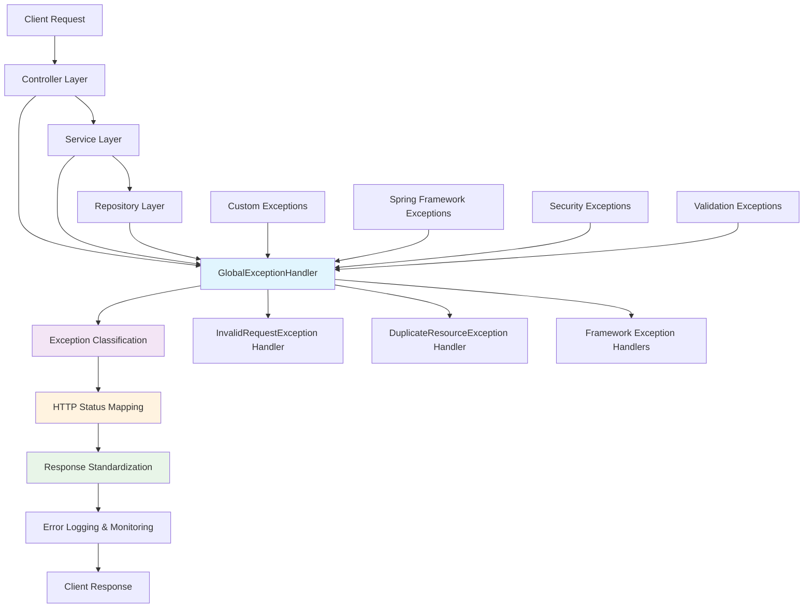
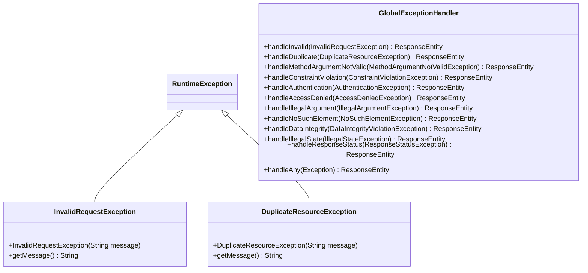
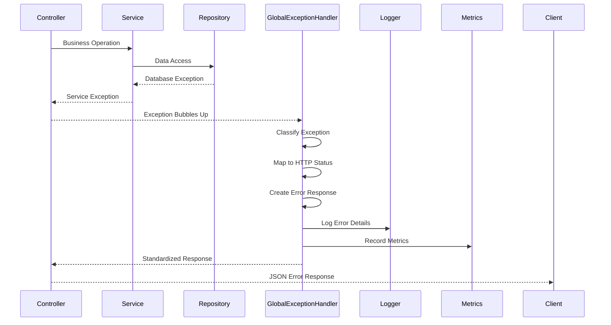

# Exception Layer Architecture Documentation

**Version:** 1.0  
**Date:** October 8, 2025  
**Purpose:** Enterprise Exception Handling Architecture  
**Scope:** Global Error Management, API Standardization, and Resilience Patterns  

## Table of Contents

1. [Exception Architecture Overview](#exception-architecture-overview)
2. [Enterprise Design Patterns](#enterprise-design-patterns)
3. [Exception Hierarchy Strategy](#exception-hierarchy-strategy)
4. [Global Handler Architecture](#global-handler-architecture)
5. [HTTP Status Code Mapping](#http-status-code-mapping)
6. [Error Response Standardization](#error-response-standardization)
7. [Integration Patterns](#integration-patterns)
8. [Security and Compliance](#security-and-compliance)

## Exception Architecture Overview

The exception layer provides **enterprise-grade error handling** with standardized API responses, comprehensive error mapping, and resilient failure management across all application layers.

### Exception Layer Architecture



### Core Architecture Principles

1. **Unified Error Contract**: Consistent JSON structure across all API endpoints
2. **Exception Translation**: Framework exceptions mapped to business-meaningful responses
3. **Status Code Accuracy**: Precise HTTP status codes for different error categories
4. **Security-Aware**: Sanitized error messages preventing information disclosure
5. **Monitoring Integration**: Comprehensive error tracking and alerting capabilities

## Enterprise Design Patterns

### Pattern 1: Exception Translation Strategy

**Purpose**: Convert technical exceptions into business-meaningful API responses.

#### Exception Translation Architecture
```java
/**
 * Exception translation layers in enterprise architecture.
 */

// Layer 1: Domain Exceptions (Business Logic)
@Component
public class BusinessExceptionTranslator {
    
    /**
     * Translate domain business rule violations.
     */
    public void validateBusinessRule(String operation, Object context) {
        switch (operation) {
            case "delete_supplier_with_inventory" -> 
                throw new IllegalStateException("Cannot delete supplier with active inventory");
            case "duplicate_sku" -> 
                throw new DuplicateResourceException("SKU already exists: " + context);
            case "invalid_quantity" -> 
                throw new InvalidRequestException("Quantity must be positive: " + context);
        }
    }
}

// Layer 2: Framework Exception Mapping
@RestControllerAdvice
public class GlobalExceptionHandler {
    
    /**
     * Maps Spring framework exceptions to standardized responses.
     */
    @ExceptionHandler(MethodArgumentNotValidException.class)
    public ResponseEntity<ErrorResponse> handleValidation(MethodArgumentNotValidException ex) {
        String fieldError = extractFirstFieldError(ex);
        return createErrorResponse(HttpStatus.BAD_REQUEST, fieldError);
    }
    
    /**
     * Maps JPA/Database exceptions to conflict responses.
     */
    @ExceptionHandler(DataIntegrityViolationException.class)
    public ResponseEntity<ErrorResponse> handleDataIntegrity(DataIntegrityViolationException ex) {
        String constraint = extractConstraintViolation(ex);
        return createErrorResponse(HttpStatus.CONFLICT, "Data constraint violation: " + constraint);
    }
}
```

#### Benefits of Translation Strategy
- **Abstraction**: Hide technical implementation details from API clients
- **Consistency**: Uniform error handling across different technology layers
- **Evolution**: Change underlying technology without breaking API contracts
- **Security**: Prevent sensitive system information leakage

### Pattern 2: Hierarchical Exception Design

**Purpose**: Organize exceptions in logical hierarchy for maintainable error handling.

#### Exception Hierarchy Implementation
```java
/**
 * Enterprise exception hierarchy design.
 */

// Base exception for all application exceptions
public abstract class SmartSupplyProException extends RuntimeException {
    
    private final String errorCode;
    private final HttpStatus httpStatus;
    private final Map<String, Object> context;
    
    protected SmartSupplyProException(String message, String errorCode, 
                                    HttpStatus httpStatus, Map<String, Object> context) {
        super(message);
        this.errorCode = errorCode;
        this.httpStatus = httpStatus;
        this.context = context != null ? context : Map.of();
    }
    
    // Getters for error handling framework
    public String getErrorCode() { return errorCode; }
    public HttpStatus getHttpStatus() { return httpStatus; }
    public Map<String, Object> getContext() { return context; }
}

// Client error category (4xx status codes)
public abstract class ClientException extends SmartSupplyProException {
    protected ClientException(String message, String errorCode, HttpStatus httpStatus) {
        super(message, errorCode, httpStatus, null);
    }
}

// Server error category (5xx status codes)  
public abstract class ServerException extends SmartSupplyProException {
    protected ServerException(String message, String errorCode, HttpStatus httpStatus) {
        super(message, errorCode, httpStatus, null);
    }
}

// Business rule violations (specific implementations)
public class DuplicateResourceException extends ClientException {
    public DuplicateResourceException(String message) {
        super(message, "DUPLICATE_RESOURCE", HttpStatus.CONFLICT);
    }
}

public class InvalidRequestException extends ClientException {
    public InvalidRequestException(String message) {
        super(message, "INVALID_REQUEST", HttpStatus.BAD_REQUEST);
    }
}
```

### Pattern 3: Error Context Enrichment

**Purpose**: Provide comprehensive error context for debugging and monitoring.

#### Context-Rich Error Handling
```java
@Component
public class ErrorContextEnricher {
    
    /**
     * Enrich exceptions with operational context.
     */
    public EnrichedErrorResponse enrichError(Exception ex, HttpServletRequest request) {
        return EnrichedErrorResponse.builder()
            .timestamp(Instant.now())
            .path(request.getRequestURI())
            .method(request.getMethod())
            .userAgent(request.getHeader("User-Agent"))
            .sessionId(extractSessionId(request))
            .correlationId(generateCorrelationId())
            .exceptionType(ex.getClass().getSimpleName())
            .stackTrace(sanitizeStackTrace(ex))
            .build();
    }
    
    /**
     * Create correlation ID for request tracking.
     */
    private String generateCorrelationId() {
        return "SSP-" + System.currentTimeMillis() + "-" + 
               ThreadLocalRandom.current().nextInt(1000, 9999);
    }
    
    /**
     * Sanitize stack trace for security compliance.
     */
    private String sanitizeStackTrace(Exception ex) {
        // Remove sensitive paths and internal implementation details
        return Arrays.stream(ex.getStackTrace())
            .filter(element -> element.getClassName().startsWith("com.smartsupplypro"))
            .limit(5) // Limit stack trace depth
            .map(StackTraceElement::toString)
            .collect(Collectors.joining("\\n"));
    }
}
```

## Exception Hierarchy Strategy

### Current Exception Structure



### Exception Classification Matrix

| Exception Category | Purpose | HTTP Status | Error Code | Examples |
|-------------------|---------|-------------|------------|----------|
| **Validation** | Client input errors | 400 | `bad_request` | Missing fields, invalid formats |
| **Authentication** | Identity verification | 401 | `unauthorized` | Missing credentials, expired tokens |
| **Authorization** | Permission checks | 403 | `forbidden` | Insufficient roles, access denied |
| **Not Found** | Resource location | 404 | `not_found` | Missing entities, invalid IDs |
| **Conflict** | Business rule violations | 409 | `conflict` | Duplicates, state conflicts |
| **Server Error** | System failures | 500 | `internal_server_error` | Unhandled exceptions |

### Future Exception Hierarchy Design

```java
/**
 * Proposed enhanced exception hierarchy for scalability.
 */

// Enhanced base exception with error codes
public abstract class SmartSupplyProException extends RuntimeException {
    private final ErrorCode errorCode;
    private final Map<String, Object> details;
    
    // Constructor and methods...
}

// Error code enumeration for standardization
public enum ErrorCode {
    // Validation errors (400 series)
    INVALID_REQUEST("INVALID_REQUEST", HttpStatus.BAD_REQUEST),
    MISSING_PARAMETER("MISSING_PARAMETER", HttpStatus.BAD_REQUEST),
    INVALID_FORMAT("INVALID_FORMAT", HttpStatus.BAD_REQUEST),
    
    // Resource errors (404 series)
    RESOURCE_NOT_FOUND("RESOURCE_NOT_FOUND", HttpStatus.NOT_FOUND),
    
    // Conflict errors (409 series)
    DUPLICATE_RESOURCE("DUPLICATE_RESOURCE", HttpStatus.CONFLICT),
    BUSINESS_RULE_VIOLATION("BUSINESS_RULE_VIOLATION", HttpStatus.CONFLICT),
    
    // Server errors (500 series)
    INTERNAL_ERROR("INTERNAL_ERROR", HttpStatus.INTERNAL_SERVER_ERROR);
    
    private final String code;
    private final HttpStatus httpStatus;
    
    ErrorCode(String code, HttpStatus httpStatus) {
        this.code = code;
        this.httpStatus = httpStatus;
    }
}
```

## Global Handler Architecture

### Handler Processing Flow



### Handler Registration Strategy

```java
/**
 * Exception handler registration and priority management.
 */

@Order(Ordered.HIGHEST_PRECEDENCE)
@RestControllerAdvice
public class GlobalExceptionHandler {
    
    /**
     * Handler priority order (highest to lowest):
     * 1. Security exceptions (authentication/authorization)
     * 2. Business exceptions (domain-specific)
     * 3. Validation exceptions (input validation)
     * 4. Framework exceptions (Spring/JPA)
     * 5. Generic exceptions (catch-all)
     */
    
    // Priority 1: Security
    @ExceptionHandler({AuthenticationException.class, AccessDeniedException.class})
    public ResponseEntity<ErrorResponse> handleSecurity(Exception ex) {
        // Security-specific handling with audit logging
    }
    
    // Priority 2: Business Logic
    @ExceptionHandler({DuplicateResourceException.class, InvalidRequestException.class})
    public ResponseEntity<ErrorResponse> handleBusiness(Exception ex) {
        // Business context preservation
    }
    
    // Priority 3: Validation
    @ExceptionHandler({MethodArgumentNotValidException.class, ConstraintViolationException.class})
    public ResponseEntity<ErrorResponse> handleValidation(Exception ex) {
        // Field-level error extraction
    }
    
    // Priority 4: Framework
    @ExceptionHandler({DataIntegrityViolationException.class, HttpMessageNotReadableException.class})
    public ResponseEntity<ErrorResponse> handleFramework(Exception ex) {
        // Technical exception translation
    }
    
    // Priority 5: Catch-all
    @ExceptionHandler(Exception.class)
    public ResponseEntity<ErrorResponse> handleGeneric(Exception ex) {
        // Safety net with comprehensive logging
    }
}
```

## HTTP Status Code Mapping

### Comprehensive Status Code Strategy

| Status Code | Usage | Exception Types | Response Strategy |
|-------------|-------|----------------|-------------------|
| **400 Bad Request** | Client input errors | `InvalidRequestException`, validation failures | Include field-specific details |
| **401 Unauthorized** | Authentication required | `AuthenticationException` | Generic message, no user enumeration |
| **403 Forbidden** | Insufficient permissions | `AccessDeniedException` | Generic access denied message |
| **404 Not Found** | Resource not found | `NoSuchElementException`, `IllegalArgumentException` | Resource-specific not found |
| **409 Conflict** | Business rule violations | `DuplicateResourceException`, `IllegalStateException` | Conflict resolution guidance |
| **422 Unprocessable Entity** | Semantic validation errors | Business rule violations | Business context explanation |
| **500 Internal Server Error** | System failures | Unhandled exceptions | Generic error with correlation ID |

### Status Code Decision Matrix

```java
/**
 * Status code decision logic for consistent API responses.
 */

@Component
public class HttpStatusMapper {
    
    public HttpStatus mapExceptionToStatus(Exception ex) {
        return switch (ex) {
            // Client errors (4xx)
            case InvalidRequestException ire -> HttpStatus.BAD_REQUEST;
            case DuplicateResourceException dre -> HttpStatus.CONFLICT;
            case NoSuchElementException nsee -> HttpStatus.NOT_FOUND;
            case IllegalArgumentException iae when isResourceNotFound(iae) -> HttpStatus.NOT_FOUND;
            case IllegalStateException ise -> HttpStatus.CONFLICT;
            case MethodArgumentNotValidException manve -> HttpStatus.BAD_REQUEST;
            case ConstraintViolationException cve -> HttpStatus.BAD_REQUEST;
            
            // Security errors
            case AuthenticationException ae -> HttpStatus.UNAUTHORIZED;
            case AccessDeniedException ade -> HttpStatus.FORBIDDEN;
            
            // Framework errors
            case DataIntegrityViolationException dive -> HttpStatus.CONFLICT;
            case HttpMessageNotReadableException hmnre -> HttpStatus.BAD_REQUEST;
            case MissingServletRequestParameterException msrpe -> HttpStatus.BAD_REQUEST;
            
            // Server errors (5xx)
            default -> HttpStatus.INTERNAL_SERVER_ERROR;
        };
    }
    
    private boolean isResourceNotFound(IllegalArgumentException ex) {
        String message = ex.getMessage().toLowerCase();
        return message.contains("not found") || 
               message.contains("does not exist") ||
               message.contains("invalid id");
    }
}
```

## Error Response Standardization

### Standard Error Response Format

```json
{
  "error": "conflict",
  "message": "Supplier name already exists: Acme Corp",
  "timestamp": "2025-10-08T10:30:00Z",
  "path": "/api/v1/suppliers",
  "correlationId": "SSP-1728378600-4521"
}
```

### Response Format Specification

```java
/**
 * Standardized error response structure for API consistency.
 */

@JsonInclude(JsonInclude.Include.NON_NULL)
public class ErrorResponse {
    
    /** Normalized error code (e.g., "bad_request", "conflict") */
    private String error;
    
    /** Human-readable error description */
    private String message;
    
    /** Error occurrence timestamp */
    private Instant timestamp;
    
    /** Request path where error occurred */
    private String path;
    
    /** Correlation ID for request tracking */
    private String correlationId;
    
    /** Detailed field-level errors for validation failures */
    private Map<String, String> fieldErrors;
    
    /** Additional context for debugging (non-production) */
    private Map<String, Object> debugInfo;
    
    // Builder pattern for flexible response construction
    public static ErrorResponseBuilder builder() {
        return new ErrorResponseBuilder();
    }
    
    public static class ErrorResponseBuilder {
        private ErrorResponse response = new ErrorResponse();
        
        public ErrorResponseBuilder error(String error) {
            response.error = error;
            return this;
        }
        
        public ErrorResponseBuilder message(String message) {
            response.message = message;
            return this;
        }
        
        public ErrorResponseBuilder timestamp(Instant timestamp) {
            response.timestamp = timestamp;
            return this;
        }
        
        public ErrorResponseBuilder path(String path) {
            response.path = path;
            return this;
        }
        
        public ErrorResponseBuilder correlationId(String correlationId) {
            response.correlationId = correlationId;
            return this;
        }
        
        public ErrorResponseBuilder fieldErrors(Map<String, String> fieldErrors) {
            response.fieldErrors = fieldErrors;
            return this;
        }
        
        public ErrorResponse build() {
            if (response.timestamp == null) {
                response.timestamp = Instant.now();
            }
            return response;
        }
    }
}
```

### Response Customization Strategies

```java
/**
 * Environment-specific response customization.
 */

@Component
@ConfigurationProperties("app.error-handling")
public class ErrorResponseCustomizer {
    
    private boolean includeStackTrace = false;
    private boolean includeDebugInfo = false;
    private int maxStackTraceElements = 5;
    
    /**
     * Customize error response based on environment and configuration.
     */
    public ErrorResponse customizeResponse(ErrorResponse response, Exception ex, 
                                         HttpServletRequest request) {
        ErrorResponseBuilder builder = ErrorResponse.builder()
            .error(response.getError())
            .message(response.getMessage())
            .timestamp(response.getTimestamp())
            .path(request.getRequestURI())
            .correlationId(generateCorrelationId());
        
        // Add debug information in development environment
        if (includeDebugInfo && isDevelopmentEnvironment()) {
            Map<String, Object> debugInfo = Map.of(
                "exceptionType", ex.getClass().getSimpleName(),
                "method", request.getMethod(),
                "userAgent", request.getHeader("User-Agent"),
                "remoteAddr", request.getRemoteAddr()
            );
            builder.debugInfo(debugInfo);
        }
        
        // Add stack trace in development (never in production)
        if (includeStackTrace && isDevelopmentEnvironment()) {
            builder.debugInfo(Map.of("stackTrace", 
                sanitizeStackTrace(ex, maxStackTraceElements)));
        }
        
        return builder.build();
    }
}
```

## Integration Patterns

### Service Layer Integration

```java
/**
 * Exception handling integration with service layer business logic.
 */

@Service
@Transactional
public class SupplierService {
    
    /**
     * Create supplier with comprehensive exception handling.
     */
    public SupplierDTO createSupplier(CreateSupplierRequest request) {
        try {
            // Business validation
            validateSupplierUniqueness(request.getName());
            validateBusinessRules(request);
            
            // Entity creation
            Supplier supplier = supplierMapper.toEntity(request);
            Supplier saved = supplierRepository.save(supplier);
            
            return supplierMapper.toDTO(saved);
            
        } catch (DataIntegrityViolationException ex) {
            // Convert technical exception to business exception
            throw new DuplicateResourceException(
                "Supplier with name '" + request.getName() + "' already exists");
        }
    }
    
    private void validateSupplierUniqueness(String name) {
        if (supplierRepository.existsByName(name)) {
            throw new DuplicateResourceException(
                "Supplier name already exists: " + name);
        }
    }
    
    private void validateBusinessRules(CreateSupplierRequest request) {
        if (request.getName() == null || request.getName().trim().isEmpty()) {
            throw new InvalidRequestException("Supplier name is required");
        }
        
        if (request.getContactEmail() != null && !isValidEmail(request.getContactEmail())) {
            throw new InvalidRequestException("Invalid email format: " + request.getContactEmail());
        }
    }
}
```

### Repository Layer Integration

```java
/**
 * Exception handling integration with data access layer.
 */

@Repository
public interface SupplierRepository extends JpaRepository<Supplier, String> {
    
    /**
     * Custom query with exception translation.
     */
    @Query("SELECT s FROM Supplier s WHERE s.name = :name")
    Optional<Supplier> findByName(@Param("name") String name);
    
    /**
     * Existence check for business validation.
     */
    boolean existsByName(String name);
    
    /**
     * Custom method with declarative exception handling.
     */
    @Modifying
    @Query("DELETE FROM Supplier s WHERE s.id = :id AND s.inventoryItems IS EMPTY")
    int deleteIfNoInventory(@Param("id") String supplierId);
}

@Component
public class SupplierRepositoryWrapper {
    
    private final SupplierRepository repository;
    
    /**
     * Wrapper method with enhanced exception context.
     */
    public void deleteSupplierSafely(String supplierId) {
        try {
            int deleted = repository.deleteIfNoInventory(supplierId);
            
            if (deleted == 0) {
                // Check if supplier exists
                if (!repository.existsById(supplierId)) {
                    throw new NoSuchElementException("Supplier not found: " + supplierId);
                } else {
                    throw new IllegalStateException(
                        "Cannot delete supplier with active inventory items");
                }
            }
            
        } catch (DataIntegrityViolationException ex) {
            throw new IllegalStateException(
                "Supplier deletion failed due to referential constraints", ex);
        }
    }
}
```

## Security and Compliance

### Security-Aware Exception Handling

```java
/**
 * Security-conscious exception handling to prevent information disclosure.
 */

@Component
public class SecurityAwareExceptionHandler {
    
    /**
     * Sanitize exception messages to prevent information leakage.
     */
    public String sanitizeErrorMessage(Exception ex, boolean isAuthenticated) {
        String originalMessage = ex.getMessage();
        
        // For unauthenticated users, provide minimal information
        if (!isAuthenticated) {
            return switch (ex) {
                case AuthenticationException ae -> "Authentication required";
                case AccessDeniedException ade -> "Access denied";
                case NoSuchElementException nsee -> "Resource not found";
                default -> "Request failed";
            };
        }
        
        // For authenticated users, provide more context while avoiding sensitive data
        return sanitizeMessage(originalMessage);
    }
    
    private String sanitizeMessage(String message) {
        if (message == null) return "Unknown error";
        
        // Remove file paths, SQL details, and internal class names
        return message
            .replaceAll("\\b[A-Za-z]:\\\\[\\w\\\\.-]+", "[PATH]")
            .replaceAll("\\bcom\\.smartsupplypro\\.[\\w.]+", "[INTERNAL]")
            .replaceAll("\\bSQL\\s+.*", "Database constraint violation")
            .replaceAll("\\bstack trace:.*", "")
            .trim();
    }
    
    /**
     * Audit security-related exceptions for monitoring.
     */
    @EventListener
    public void auditSecurityException(SecurityExceptionEvent event) {
        auditService.logSecurityEvent(
            event.getExceptionType(),
            event.getUserId(),
            event.getRequestPath(),
            event.getIpAddress(),
            event.getTimestamp()
        );
    }
}
```

### Compliance Integration

```java
/**
 * Compliance-aware error handling for regulatory requirements.
 */

@Component
public class ComplianceExceptionHandler {
    
    /**
     * Handle errors with compliance logging requirements.
     */
    public void handleComplianceError(Exception ex, HttpServletRequest request) {
        ComplianceContext context = ComplianceContext.builder()
            .requestId(generateRequestId())
            .userId(extractUserId(request))
            .action(request.getMethod() + " " + request.getRequestURI())
            .timestamp(Instant.now())
            .errorType(ex.getClass().getSimpleName())
            .errorMessage(sanitizeForCompliance(ex.getMessage()))
            .build();
        
        // Different retention periods based on error severity
        Duration retentionPeriod = switch (ex) {
            case AuthenticationException ae -> Duration.ofYears(3);
            case AccessDeniedException ade -> Duration.ofYears(3);
            case DuplicateResourceException dre -> Duration.ofMonths(12);
            default -> Duration.ofMonths(6);
        };
        
        complianceService.logError(context, retentionPeriod);
    }
    
    private String sanitizeForCompliance(String message) {
        // Remove PII and sensitive data while preserving audit trail
        return message
            .replaceAll("\\b[A-Za-z0-9._%+-]+@[A-Za-z0-9.-]+\\.[A-Z|a-z]{2,}\\b", "[EMAIL]")
            .replaceAll("\\b\\d{4}[-.]?\\d{4}[-.]?\\d{4}[-.]?\\d{4}\\b", "[CARD]")
            .replaceAll("\\b\\d{3}-\\d{2}-\\d{4}\\b", "[SSN]");
    }
}
```

---

## Architecture Summary

The exception layer architecture provides:

1. **Unified Error Handling**: Consistent API responses across all endpoints
2. **Comprehensive Coverage**: Framework, business, and security exception mapping
3. **Security-Aware**: Sanitized responses preventing information disclosure
4. **Monitoring Integration**: Error tracking, correlation IDs, and audit trails
5. **Compliance Ready**: Regulatory logging and data retention policies
6. **Extensible Design**: Hierarchical structure supporting future enhancements

This architecture ensures robust, secure, and maintainable error handling for enterprise applications.

---

*This architecture documentation provides the foundation for reliable exception management in Spring Boot applications.*