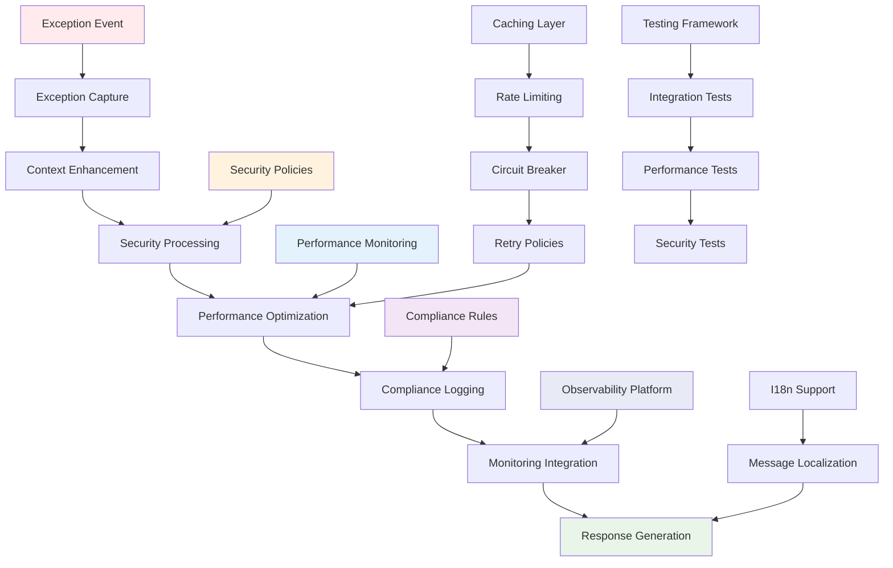

# Exception Cross-Cutting Concerns Documentation

**Version:** 1.0  
**Date:** October 8, 2025  
**Purpose:** Enterprise Exception Cross-Cutting Concerns  
**Scope:** Performance, Security, Compliance, and Monitoring Integration  

## Table of Contents

1. [Cross-Cutting Overview](#cross-cutting-overview)
2. [Performance Optimization](#performance-optimization)
3. [Security and Compliance](#security-and-compliance)
4. [Monitoring and Observability](#monitoring-and-observability)
5. [Internationalization Support](#internationalization-support)
6. [Caching and Rate Limiting](#caching-and-rate-limiting)
7. [Integration Testing](#integration-testing)
8. [Production Deployment](#production-deployment)

## Cross-Cutting Overview

Exception handling intersects with multiple enterprise concerns requiring **strategic integration** for performance, security, compliance, and operational excellence.

### Enterprise Exception Ecosystem



### Cross-Cutting Architecture Principles

1. **Performance First**: Minimal overhead with efficient exception processing
2. **Security by Design**: Information disclosure prevention and audit compliance
3. **Observability Integration**: Comprehensive monitoring and alerting
4. **Scalability Support**: High-throughput exception handling with resource optimization
5. **Compliance Readiness**: Audit trails and regulatory requirement satisfaction

## Performance Optimization

### Pattern 1: Exception Processing Performance

**Strategy**: Optimize exception handling performance with caching and lazy evaluation.

#### High-Performance Exception Processing
```java
@Component
@Slf4j
public class PerformanceOptimizedExceptionProcessor {
    
    private final LoadingCache<String, String> sanitizedMessageCache;
    private final LoadingCache<Class<?>, ExceptionMetadata> exceptionMetadataCache;
    private final ExecutorService asyncProcessingExecutor;
    
    public PerformanceOptimizedExceptionProcessor() {
        // Cached message sanitization for performance
        this.sanitizedMessageCache = Caffeine.newBuilder()
            .maximumSize(10_000)
            .expireAfterWrite(Duration.ofHours(1))
            .recordStats()
            .build(this::sanitizeMessageInternal);
        
        // Cached exception metadata for reflection optimization
        this.exceptionMetadataCache = Caffeine.newBuilder()
            .maximumSize(1_000)
            .expireAfterWrite(Duration.ofHours(24))
            .build(this::extractExceptionMetadata);
        
        // Dedicated thread pool for async exception processing
        this.asyncProcessingExecutor = Executors.newFixedThreadPool(4,
            new ThreadFactoryBuilder()
                .setNameFormat("exception-processor-%d")
                .setDaemon(true)
                .build());
    }
    
    /**
     * Process exception with performance optimization.
     */
    public ErrorResponse processException(Exception ex, HttpServletRequest request) {
        
        // Fast path for common exceptions with pre-computed responses
        ErrorResponse cachedResponse = getCachedResponse(ex);
        if (cachedResponse != null) {
            return enhanceWithRequestContext(cachedResponse, request);
        }
        
        // Optimized exception processing
        String correlationId = generateCorrelationId();
        
        // Parallel processing for independent operations
        CompletableFuture<String> sanitizedMessageFuture = CompletableFuture.supplyAsync(
            () -> sanitizedMessageCache.getUnchecked(ex.getMessage()), 
            asyncProcessingExecutor);
        
        CompletableFuture<ExceptionMetadata> metadataFuture = CompletableFuture.supplyAsync(
            () -> exceptionMetadataCache.getUnchecked(ex.getClass()), 
            asyncProcessingExecutor);
        
        // Async monitoring - don't block response
        CompletableFuture.runAsync(
            () -> recordExceptionMetricsAsync(ex, request, correlationId),
            asyncProcessingExecutor);
        
        try {
            // Wait for essential processing only
            String sanitizedMessage = sanitizedMessageFuture.get(50, TimeUnit.MILLISECONDS);
            ExceptionMetadata metadata = metadataFuture.get(50, TimeUnit.MILLISECONDS);
            
            return ErrorResponse.builder()
                .error(metadata.getErrorCode())
                .message(sanitizedMessage)
                .timestamp(Instant.now().toString())
                .correlationId(correlationId)
                .build();
                
        } catch (TimeoutException | InterruptedException | ExecutionException e) {
            log.warn("Exception processing timeout, falling back to simple response", e);
            return createFallbackResponse(ex, correlationId);
        }
    }
    
    /**
     * Pre-computed response cache for common exceptions.
     */
    private static final Map<Class<? extends Exception>, ErrorResponse> COMMON_RESPONSES = 
        Map.of(
            IllegalArgumentException.class, ErrorResponse.builder()
                .error("bad_request")
                .message("Invalid request parameter")
                .build(),
            NoSuchElementException.class, ErrorResponse.builder()
                .error("not_found")
                .message("Requested resource not found")
                .build(),
            AccessDeniedException.class, ErrorResponse.builder()
                .error("forbidden")
                .message("Access denied")
                .build()
        );
    
    private ErrorResponse getCachedResponse(Exception ex) {
        return COMMON_RESPONSES.get(ex.getClass());
    }
    
    /**
     * Optimized message sanitization with regex compilation caching.
     */
    private static final Pattern SENSITIVE_PATTERN = Pattern.compile(
        "(?i)(password|token|secret|key|credential|authorization)\\s*[:=]\\s*\\S+",
        Pattern.CASE_INSENSITIVE | Pattern.MULTILINE
    );
    
    private String sanitizeMessageInternal(String message) {
        if (message == null || message.length() > 1000) {
            return "Error message too long or empty";
        }
        
        // Fast sanitization for common patterns
        return SENSITIVE_PATTERN.matcher(message)
            .replaceAll("$1=***");
    }
    
    /**
     * Exception metadata extraction with reflection caching.
     */
    @Data
    @Builder
    private static class ExceptionMetadata {
        private String errorCode;
        private HttpStatus httpStatus;
        private boolean requiresAudit;
        private boolean hasCustomMessage;
    }
    
    private ExceptionMetadata extractExceptionMetadata(Class<?> exceptionClass) {
        
        // Check for custom annotations
        ResponseStatus responseStatus = exceptionClass.getAnnotation(ResponseStatus.class);
        AuditRequired auditRequired = exceptionClass.getAnnotation(AuditRequired.class);
        
        HttpStatus status = responseStatus != null ? 
            responseStatus.value() : HttpStatus.INTERNAL_SERVER_ERROR;
        
        String errorCode = generateErrorCode(exceptionClass, status);
        
        return ExceptionMetadata.builder()
            .errorCode(errorCode)
            .httpStatus(status)
            .requiresAudit(auditRequired != null)
            .hasCustomMessage(hasCustomMessageMethod(exceptionClass))
            .build();
    }
    
    private boolean hasCustomMessageMethod(Class<?> exceptionClass) {
        try {
            Method getClientMessage = exceptionClass.getMethod("getClientMessage");
            return getClientMessage != null;
        } catch (NoSuchMethodException e) {
            return false;
        }
    }
}

/**
 * Performance monitoring for exception handling.
 */
@Component
public class ExceptionPerformanceMonitor {
    
    private final MeterRegistry meterRegistry;
    private final Timer.Sample exceptionProcessingTimer;
    
    @EventListener
    public void handleExceptionProcessingEvent(ExceptionProcessingEvent event) {
        
        // Record processing time
        meterRegistry.timer("exception.processing.time",
            Tags.of(
                "type", event.getExceptionType(),
                "fast_path", String.valueOf(event.isFastPath()),
                "cached", String.valueOf(event.isFromCache())
            )).record(event.getProcessingDuration());
        
        // Record cache performance
        if (event.isFromCache()) {
            meterRegistry.counter("exception.cache.hit",
                Tags.of("type", event.getExceptionType())).increment();
        } else {
            meterRegistry.counter("exception.cache.miss",
                Tags.of("type", event.getExceptionType())).increment();
        }
        
        // Performance threshold alerting
        if (event.getProcessingDuration().toMillis() > 100) {
            meterRegistry.counter("exception.processing.slow",
                Tags.of("type", event.getExceptionType())).increment();
        }
    }
}
```

### Pattern 2: Memory and Resource Optimization

**Strategy**: Optimize memory usage and resource allocation for high-throughput exception handling.

#### Resource-Optimized Exception Management
```java
@Component
public class ResourceOptimizedExceptionManager {
    
    private final ObjectPool<StringBuilder> stringBuilderPool;
    private final RingBuffer<ExceptionEvent> exceptionEventBuffer;
    private final MemoryPool correlationIdPool;
    
    public ResourceOptimizedExceptionManager() {
        
        // Object pooling for string manipulation
        this.stringBuilderPool = new GenericObjectPool<>(
            new StringBuilderPooledObjectFactory(), 
            new GenericObjectPoolConfig<StringBuilder>() {{
                setMaxTotal(100);
                setMaxIdle(50);
                setMinIdle(10);
                setTestOnBorrow(true);
                setTestOnReturn(true);
            }}
        );
        
        // Ring buffer for exception events (lock-free)
        this.exceptionEventBuffer = RingBuffer.createMultiProducer(
            ExceptionEvent::new, 1024);
        
        // Memory pool for correlation IDs
        this.correlationIdPool = new DirectMemoryPool(1024 * 1024); // 1MB pool
    }
    
    /**
     * Resource-efficient error response generation.
     */
    public ErrorResponse generateResponse(Exception ex, String correlationId) {
        
        StringBuilder messageBuilder = null;
        try {
            // Borrow StringBuilder from pool
            messageBuilder = stringBuilderPool.borrowObject();
            
            // Efficient message building
            String sanitizedMessage = buildSanitizedMessage(ex, messageBuilder);
            
            // Reuse response objects
            return ErrorResponseFactory.createResponse(
                ex.getClass().getSimpleName().toLowerCase(),
                sanitizedMessage,
                correlationId
            );
            
        } catch (Exception poolException) {
            log.warn("Pool exception, using fallback", poolException);
            return createFallbackResponse(ex, correlationId);
            
        } finally {
            // Always return to pool
            if (messageBuilder != null) {
                try {
                    stringBuilderPool.returnObject(messageBuilder);
                } catch (Exception e) {
                    log.warn("Failed to return StringBuilder to pool", e);
                }
            }
        }
    }
    
    /**
     * Lock-free exception event publishing.
     */
    public void publishExceptionEvent(Exception ex, String correlationId, Duration processingTime) {
        
        long sequence = exceptionEventBuffer.next();
        try {
            ExceptionEvent event = exceptionEventBuffer.get(sequence);
            event.setException(ex);
            event.setCorrelationId(correlationId);
            event.setProcessingTime(processingTime);
            event.setTimestamp(System.currentTimeMillis());
            
        } finally {
            exceptionEventBuffer.publish(sequence);
        }
    }
    
    /**
     * Memory-efficient correlation ID generation.
     */
    public String generateOptimizedCorrelationId() {
        // Use memory pool for correlation ID generation
        ByteBuffer buffer = correlationIdPool.allocate(64);
        try {
            buffer.put("SSP-".getBytes());
            buffer.putLong(System.currentTimeMillis());
            buffer.put("-".getBytes());
            buffer.putInt(ThreadLocalRandom.current().nextInt(10000));
            
            byte[] bytes = new byte[buffer.position()];
            buffer.flip();
            buffer.get(bytes);
            
            return new String(bytes, StandardCharsets.UTF_8);
            
        } finally {
            correlationIdPool.release(buffer);
        }
    }
    
    private String buildSanitizedMessage(Exception ex, StringBuilder builder) {
        builder.setLength(0); // Reset builder
        
        String originalMessage = ex.getMessage();
        if (originalMessage == null) {
            builder.append("An error occurred");
            return builder.toString();
        }
        
        // Efficient sanitization without regex for common cases
        if (!containsSensitiveData(originalMessage)) {
            builder.append(originalMessage);
        } else {
            builder.append(sanitizeFast(originalMessage));
        }
        
        return builder.toString();
    }
    
    private boolean containsSensitiveData(String message) {
        // Fast check for sensitive keywords
        String lower = message.toLowerCase();
        return lower.contains("password") || 
               lower.contains("token") || 
               lower.contains("secret") ||
               lower.contains("key");
    }
}

/**
 * Factory for reusable error responses.
 */
@Component
public class ErrorResponseFactory {
    
    private static final Map<String, ErrorResponse> PROTOTYPE_RESPONSES = new ConcurrentHashMap<>();
    
    public static ErrorResponse createResponse(String errorType, String message, String correlationId) {
        
        // Get or create prototype
        ErrorResponse prototype = PROTOTYPE_RESPONSES.computeIfAbsent(errorType, 
            type -> ErrorResponse.builder()
                .error(type)
                .build()
        );
        
        // Clone and customize
        return prototype.toBuilder()
            .message(message)
            .correlationId(correlationId)
            .timestamp(Instant.now().toString())
            .build();
    }
}
```

## Security and Compliance

### Pattern 1: Security-Enhanced Exception Processing

**Strategy**: Implement security-first exception handling with compliance tracking.

#### Security-Compliant Exception Handler
```java
@Component
@Slf4j
public class SecurityCompliantExceptionProcessor {
    
    private final SecurityAuditService auditService;
    private final ComplianceTracker complianceTracker;
    private final ThreatDetectionService threatDetection;
    
    /**
     * Security-enhanced exception processing with threat detection.
     */
    public ErrorResponse processSecurityAware(Exception ex, HttpServletRequest request, 
                                            Authentication authentication) {
        
        // Threat detection analysis
        ThreatAssessment threat = threatDetection.assessException(ex, request);
        
        // Security context evaluation
        SecurityContext securityContext = SecurityContext.builder()
            .authentication(authentication)
            .remoteAddress(extractRemoteAddress(request))
            .userAgent(request.getHeader("User-Agent"))
            .requestPath(request.getRequestURI())
            .method(request.getMethod())
            .threat(threat)
            .build();
        
        // Security-aware message generation
        String secureMessage = generateSecureMessage(ex, securityContext);
        String correlationId = generateSecureCorrelationId();
        
        // Compliance logging
        logComplianceEvent(ex, securityContext, correlationId);
        
        // Audit trail
        auditService.recordSecurityEvent(SecurityEvent.builder()
            .exceptionType(ex.getClass().getSimpleName())
            .securityContext(securityContext)
            .correlationId(correlationId)
            .threat(threat)
            .responseAction(determineResponseAction(threat))
            .build());
        
        // Rate limiting enforcement
        if (threat.isHighRisk()) {
            enforceRateLimiting(securityContext);
        }
        
        return ErrorResponse.builder()
            .error(mapToSecureErrorCode(ex, securityContext))
            .message(secureMessage)
            .correlationId(correlationId)
            .timestamp(Instant.now().toString())
            .build();
    }
    
    /**
     * Generate security-aware error messages based on user context.
     */
    private String generateSecureMessage(Exception ex, SecurityContext context) {
        
        UserRole userRole = extractUserRole(context.getAuthentication());
        
        // Information disclosure prevention
        return switch (userRole) {
            case ANONYMOUS -> getAnonymousSecureMessage(ex);
            case AUTHENTICATED_USER -> getUserSecureMessage(ex, context);
            case PRIVILEGED_USER -> getPrivilegedSecureMessage(ex, context);
            case SYSTEM_ADMIN -> getAdminSecureMessage(ex, context);
        };
    }
    
    private String getAnonymousSecureMessage(Exception ex) {
        // Minimal information for anonymous users
        return switch (ex) {
            case AuthenticationException ae -> "Authentication required";
            case AccessDeniedException ade -> "Access denied";
            case InvalidRequestException ire -> "Invalid request";
            default -> "Service temporarily unavailable";
        };
    }
    
    private String getUserSecureMessage(Exception ex, SecurityContext context) {
        // Enhanced messages for authenticated users without sensitive details
        return switch (ex) {
            case DuplicateResourceException dre -> 
                dre.hasDetailedContext() ? dre.getClientMessage() : "Resource already exists";
            case InvalidRequestException ire -> 
                "Validation failed: " + ire.getErrorCount() + " error(s)";
            case NoSuchElementException nsee -> "Resource not found";
            default -> sanitizeForUser(ex.getMessage());
        };
    }
    
    /**
     * Compliance event logging with regulatory requirements.
     */
    private void logComplianceEvent(Exception ex, SecurityContext context, String correlationId) {
        
        ComplianceEvent event = ComplianceEvent.builder()
            .eventType("EXCEPTION_OCCURRED")
            .exceptionType(ex.getClass().getSimpleName())
            .timestamp(Instant.now())
            .correlationId(correlationId)
            .userId(extractUserId(context.getAuthentication()))
            .remoteAddress(context.getRemoteAddress())
            .userAgent(context.getUserAgent())
            .requestPath(context.getRequestPath())
            .dataClassification(determineDataClassification(ex))
            .regulatoryRequirements(extractRegulatoryRequirements(ex))
            .build();
        
        complianceTracker.logEvent(event);
        
        // GDPR compliance for EU users
        if (isEuropeanUser(context)) {
            logGDPREvent(event, ex);
        }
        
        // SOX compliance for financial operations
        if (isFinancialOperation(context.getRequestPath())) {
            logSOXEvent(event, ex);
        }
        
        // PCI DSS compliance for payment processing
        if (isPaymentRelated(ex) || isPaymentEndpoint(context.getRequestPath())) {
            logPCIDSSEvent(event, ex);
        }
    }
    
    /**
     * Advanced threat detection integration.
     */
    @Component
    public static class ThreatDetectionService {
        
        private final RateLimitService rateLimitService;
        private final PatternAnalysisService patternAnalysis;
        
        public ThreatAssessment assessException(Exception ex, HttpServletRequest request) {
            
            ThreatAssessment.Builder assessment = ThreatAssessment.builder()
                .timestamp(Instant.now())
                .sourceIP(extractRemoteAddress(request))
                .userAgent(request.getHeader("User-Agent"));
            
            // Rate-based threat detection
            RateLimitResult rateLimitResult = rateLimitService.checkRate(
                extractRemoteAddress(request), "exception_count");
            
            if (rateLimitResult.isExceeded()) {
                assessment.threatLevel(ThreatLevel.HIGH)
                    .reason("Exception rate limit exceeded")
                    .recommendedAction(ThreatAction.BLOCK_IP);
            }
            
            // Pattern-based threat detection
            if (isInjectionAttempt(ex)) {
                assessment.threatLevel(ThreatLevel.CRITICAL)
                    .reason("Potential injection attack detected")
                    .recommendedAction(ThreatAction.BLOCK_AND_ALERT);
            }
            
            // Authentication brute force detection
            if (ex instanceof AuthenticationException && 
                rateLimitService.checkRate(extractRemoteAddress(request), "auth_failures").isExceeded()) {
                assessment.threatLevel(ThreatLevel.HIGH)
                    .reason("Authentication brute force detected")
                    .recommendedAction(ThreatAction.TEMPORARY_BLOCK);
            }
            
            return assessment.build();
        }
        
        private boolean isInjectionAttempt(Exception ex) {
            String message = ex.getMessage();
            if (message == null) return false;
            
            String lower = message.toLowerCase();
            return lower.contains("select ") || 
                   lower.contains("union ") || 
                   lower.contains("script>") ||
                   lower.contains("javascript:") ||
                   lower.contains("../");
        }
    }
}

/**
 * Regulatory compliance tracking.
 */
@Component
public class ComplianceTracker {
    
    private final ComplianceEventRepository repository;
    private final NotificationService notificationService;
    
    public void logEvent(ComplianceEvent event) {
        
        // Store compliance event
        repository.save(event);
        
        // Real-time compliance monitoring
        if (requiresImmediateReporting(event)) {
            notificationService.sendComplianceAlert(event);
        }
        
        // Automated compliance reporting
        if (isReportableEvent(event)) {
            scheduleComplianceReport(event);
        }
    }
    
    private boolean requiresImmediateReporting(ComplianceEvent event) {
        return event.getDataClassification() == DataClassification.SENSITIVE ||
               event.getRegulatoryRequirements().contains(RegulatoryRequirement.PCI_DSS) ||
               event.getThreatLevel() == ThreatLevel.CRITICAL;
    }
}
```

## Monitoring and Observability

### Pattern 1: Comprehensive Exception Observability

**Strategy**: Implement full-spectrum monitoring with alerting and analytics.

#### Enterprise Exception Monitoring Platform
```java
@Component
public class EnterpriseExceptionMonitoringService {
    
    private final MeterRegistry meterRegistry;
    private final DistributedTracingService tracingService;
    private final AlertingService alertingService;
    private final AnalyticsService analyticsService;
    
    /**
     * Comprehensive exception monitoring with distributed tracing.
     */
    @EventListener
    public void handleExceptionEvent(ExceptionOccurredEvent event) {
        
        // Distributed tracing
        Span exceptionSpan = tracingService.createSpan("exception.processing")
            .tag("exception.type", event.getExceptionType())
            .tag("correlation.id", event.getCorrelationId())
            .tag("user.id", event.getUserId())
            .tag("operation", event.getOperation());
        
        try (Tracer.SpanInScope spanScope = tracingService.withSpanInScope(exceptionSpan)) {
            
            // Real-time metrics
            recordRealtimeMetrics(event);
            
            // Business intelligence metrics
            recordBusinessMetrics(event);
            
            // Performance analytics
            recordPerformanceMetrics(event);
            
            // Error pattern analysis
            analyzeErrorPatterns(event);
            
            // Alerting rules evaluation
            evaluateAlertingRules(event);
            
        } finally {
            exceptionSpan.end();
        }
    }
    
    private void recordRealtimeMetrics(ExceptionOccurredEvent event) {
        
        // Exception counters with rich tags
        meterRegistry.counter("exceptions.total",
            Tags.of(
                "type", event.getExceptionType(),
                "severity", event.getSeverity().name(),
                "operation", event.getOperation(),
                "service", event.getServiceName(),
                "environment", getEnvironment()
            )).increment();
        
        // Error rate gauge
        meterRegistry.gauge("exceptions.rate.current",
            Tags.of("window", "1m"),
            this, service -> service.calculateCurrentErrorRate());
        
        // Response time impact
        meterRegistry.timer("exceptions.response.impact",
            Tags.of(
                "type", event.getExceptionType(),
                "has_retry", String.valueOf(event.isRetryable())
            )).record(event.getResponseTimeImpact());
    }
    
    private void recordBusinessMetrics(ExceptionOccurredEvent event) {
        
        // Business operation impact
        if (event.getBusinessContext() != null) {
            BusinessContext context = event.getBusinessContext();
            
            meterRegistry.counter("exceptions.business.impact",
                Tags.of(
                    "operation_type", context.getOperationType(),
                    "customer_segment", context.getCustomerSegment(),
                    "revenue_impact", context.getRevenueImpact().name()
                )).increment();
        }
        
        // Customer experience metrics
        if (event.isCustomerFacing()) {
            meterRegistry.counter("exceptions.customer.facing",
                Tags.of(
                    "severity", event.getSeverity().name(),
                    "user_type", event.getUserType()
                )).increment();
        }
        
        // SLA impact tracking
        if (event.impactsSLA()) {
            meterRegistry.counter("exceptions.sla.breach",
                Tags.of(
                    "sla_type", event.getSLAType(),
                    "breach_severity", event.getSLABreachSeverity().name()
                )).increment();
        }
    }
    
    /**
     * Advanced error pattern analysis with machine learning.
     */
    private void analyzeErrorPatterns(ExceptionOccurredEvent event) {
        
        // Pattern detection
        ErrorPattern pattern = analyticsService.analyzePattern(event);
        
        if (pattern.isAnomaly()) {
            // Anomaly detection alert
            alertingService.sendAnomalyAlert(AnomalyAlert.builder()
                .type("EXCEPTION_PATTERN_ANOMALY")
                .pattern(pattern)
                .event(event)
                .confidence(pattern.getConfidenceScore())
                .build());
        }
        
        if (pattern.isTrending()) {
            // Trending exception alert
            alertingService.sendTrendAlert(TrendAlert.builder()
                .type("EXCEPTION_TRENDING")
                .pattern(pattern)
                .trendDirection(pattern.getTrendDirection())
                .projectedImpact(pattern.getProjectedImpact())
                .build());
        }
    }
    
    /**
     * Multi-level alerting with intelligent escalation.
     */
    private void evaluateAlertingRules(ExceptionOccurredEvent event) {
        
        // Critical exception immediate alert
        if (event.getSeverity() == ExceptionSeverity.CRITICAL) {
            alertingService.sendImmediateAlert(CriticalAlert.builder()
                .event(event)
                .escalationLevel(EscalationLevel.IMMEDIATE)
                .notificationChannels(List.of("pagerduty", "slack", "email"))
                .build());
        }
        
        // Rate-based alerting
        double currentRate = calculateCurrentErrorRate();
        if (currentRate > getErrorRateThreshold()) {
            alertingService.sendRateAlert(RateAlert.builder()
                .currentRate(currentRate)
                .threshold(getErrorRateThreshold())
                .timeWindow(Duration.ofMinutes(5))
                .trend(calculateRateTrend())
                .build());
        }
        
        // Business impact alerting
        if (event.getBusinessContext() != null && 
            event.getBusinessContext().getRevenueImpact() == RevenueImpact.HIGH) {
            alertingService.sendBusinessImpactAlert(BusinessImpactAlert.builder()
                .event(event)
                .estimatedRevenueLoss(calculateRevenueLoss(event))
                .affectedCustomers(countAffectedCustomers(event))
                .build());
        }
    }
    
    /**
     * Health check integration with exception patterns.
     */
    @Component
    public static class ExceptionHealthIndicator implements HealthIndicator {
        
        private final EnterpriseExceptionMonitoringService monitoringService;
        
        @Override
        public Health health() {
            try {
                ExceptionHealthMetrics metrics = gatherHealthMetrics();
                
                if (metrics.getCriticalExceptionRate() > 0.01) { // 1% critical rate
                    return Health.down()
                        .withDetail("status", "High critical exception rate")
                        .withDetail("criticalRate", metrics.getCriticalExceptionRate())
                        .withDetail("recommendation", "Investigate critical exceptions")
                        .build();
                }
                
                if (metrics.getOverallErrorRate() > 0.05) { // 5% overall rate
                    return Health.degraded()
                        .withDetail("status", "Elevated error rate")
                        .withDetail("errorRate", metrics.getOverallErrorRate())
                        .withDetail("recommendation", "Monitor error patterns")
                        .build();
                }
                
                return Health.up()
                    .withDetail("status", "Exception patterns normal")
                    .withDetail("errorRate", metrics.getOverallErrorRate())
                    .withDetail("avgResponseTime", metrics.getAverageResponseTime())
                    .build();
                    
            } catch (Exception ex) {
                return Health.down()
                    .withException(ex)
                    .withDetail("status", "Health check failed")
                    .build();
            }
        }
    }
}

/**
 * Exception analytics with predictive capabilities.
 */
@Service
public class ExceptionAnalyticsService {
    
    private final TimeSeriesDatabase timeSeriesDB;
    private final MachineLearningService mlService;
    
    /**
     * Predictive exception analysis.
     */
    public ExceptionForecast predictExceptionTrends(Duration forecastPeriod) {
        
        // Historical data analysis
        List<ExceptionTimeSeriesData> historicalData = timeSeriesDB.getExceptionData(
            Duration.ofDays(30)
        );
        
        // Machine learning prediction
        MLPredictionResult prediction = mlService.predictExceptionTrends(
            historicalData, forecastPeriod
        );
        
        return ExceptionForecast.builder()
            .forecastPeriod(forecastPeriod)
            .predictedExceptionRate(prediction.getPredictedRate())
            .confidence(prediction.getConfidence())
            .riskFactors(prediction.getRiskFactors())
            .recommendations(generateRecommendations(prediction))
            .build();
    }
    
    /**
     * Exception impact analysis for business operations.
     */
    public BusinessImpactAnalysis analyzeBusinessImpact(List<ExceptionOccurredEvent> events) {
        
        // Revenue impact calculation
        BigDecimal totalRevenueLoss = events.stream()
            .filter(event -> event.getBusinessContext() != null)
            .map(event -> calculateRevenueLoss(event))
            .reduce(BigDecimal.ZERO, BigDecimal::add);
        
        // Customer satisfaction impact
        CustomerSatisfactionImpact csImpact = calculateCustomerSatisfactionImpact(events);
        
        // Operational efficiency impact
        OperationalImpact operationalImpact = calculateOperationalImpact(events);
        
        return BusinessImpactAnalysis.builder()
            .totalRevenueLoss(totalRevenueLoss)
            .customerSatisfactionImpact(csImpact)
            .operationalImpact(operationalImpact)
            .recommendations(generateBusinessRecommendations(events))
            .build();
    }
}
```

## Internationalization Support

### Pattern 1: Localized Exception Messages

**Strategy**: Support multi-language exception messages with cultural adaptation.

#### Internationalized Exception Messages
```java
@Component
public class InternationalizedExceptionProcessor {
    
    private final MessageSource messageSource;
    private final LocaleResolver localeResolver;
    private final CultureService cultureService;
    
    /**
     * Generate localized exception messages.
     */
    public String getLocalizedMessage(Exception ex, HttpServletRequest request) {
        
        Locale userLocale = localeResolver.resolveLocale(request);
        CultureContext culture = cultureService.getCultureContext(userLocale);
        
        // Enhanced exception with localization support
        if (ex instanceof LocalizableException localizableEx) {
            return localizeEnhancedException(localizableEx, userLocale, culture);
        }
        
        // Standard exception localization
        return localizeStandardException(ex, userLocale, culture);
    }
    
    private String localizeEnhancedException(LocalizableException ex, Locale locale, 
                                           CultureContext culture) {
        
        String messageKey = ex.getMessageKey();
        Object[] messageArgs = ex.getMessageArguments();
        
        // Primary localization attempt
        try {
            String localizedMessage = messageSource.getMessage(
                messageKey, messageArgs, locale
            );
            
            // Cultural adaptation
            return adaptToCulture(localizedMessage, culture);
            
        } catch (NoSuchMessageException e) {
            
            // Fallback to base language
            Locale baseLocale = new Locale(locale.getLanguage());
            try {
                return messageSource.getMessage(messageKey, messageArgs, baseLocale);
            } catch (NoSuchMessageException baseException) {
                
                // Final fallback to English
                return messageSource.getMessage(messageKey, messageArgs, Locale.ENGLISH);
            }
        }
    }
    
    /**
     * Cultural adaptation of error messages.
     */
    private String adaptToCulture(String message, CultureContext culture) {
        
        // Formal vs informal tone adaptation
        if (culture.prefersFormalTone()) {
            message = adaptToFormalTone(message);
        }
        
        // Directness adaptation
        if (culture.prefersIndirectCommunication()) {
            message = adaptToIndirectTone(message);
        }
        
        // Technical detail level adaptation
        if (culture.prefersTechnicalDetails()) {
            message = enhanceWithTechnicalContext(message);
        }
        
        return message;
    }
    
    // Enhanced exception classes with localization support
    public static class LocalizedDuplicateResourceException extends DuplicateResourceException 
            implements LocalizableException {
        
        private final String messageKey;
        private final Object[] messageArguments;
        
        public LocalizedDuplicateResourceException(String resourceType, String conflictField, 
                                                 String duplicateValue) {
            super("Resource already exists", resourceType, conflictField, duplicateValue);
            this.messageKey = "exception.duplicate.resource";
            this.messageArguments = new Object[]{resourceType, conflictField, duplicateValue};
        }
        
        @Override
        public String getMessageKey() {
            return messageKey;
        }
        
        @Override
        public Object[] getMessageArguments() {
            return messageArguments;
        }
    }
    
    public static class LocalizedInvalidRequestException extends InvalidRequestException 
            implements LocalizableException {
        
        private final String messageKey;
        private final Object[] messageArguments;
        
        public LocalizedInvalidRequestException(String messageKey, Object... args) {
            super("Validation failed");
            this.messageKey = messageKey;
            this.messageArguments = args;
        }
        
        public static LocalizedInvalidRequestException requiredField(String fieldName) {
            return new LocalizedInvalidRequestException("exception.validation.required", fieldName);
        }
        
        public static LocalizedInvalidRequestException invalidFormat(String fieldName, String expectedFormat) {
            return new LocalizedInvalidRequestException("exception.validation.format", fieldName, expectedFormat);
        }
        
        @Override
        public String getMessageKey() {
            return messageKey;
        }
        
        @Override
        public Object[] getMessageArguments() {
            return messageArguments;
        }
    }
}

/**
 * Localization message properties management.
 */
@Configuration
public class ExceptionLocalizationConfig {
    
    @Bean
    public MessageSource exceptionMessageSource() {
        ReloadableResourceBundleMessageSource messageSource = 
            new ReloadableResourceBundleMessageSource();
        
        messageSource.setBasenames(
            "classpath:i18n/exceptions/messages",
            "classpath:i18n/exceptions/business",
            "classpath:i18n/exceptions/technical"
        );
        
        messageSource.setDefaultEncoding("UTF-8");
        messageSource.setCacheSeconds(300); // 5-minute cache
        messageSource.setFallbackToSystemLocale(false);
        messageSource.setDefaultLocale(Locale.ENGLISH);
        
        return messageSource;
    }
    
    @Bean
    public LocaleResolver localeResolver() {
        AcceptHeaderLocaleResolver resolver = new AcceptHeaderLocaleResolver();
        resolver.setSupportedLocales(List.of(
            Locale.ENGLISH,
            Locale.GERMAN,
            Locale.FRENCH,
            new Locale("es"), // Spanish
            new Locale("ja"), // Japanese
            new Locale("zh") // Chinese
        ));
        resolver.setDefaultLocale(Locale.ENGLISH);
        return resolver;
    }
}
```

## Production Deployment

### Pattern 1: Production-Ready Exception Configuration

**Strategy**: Configure exception handling for enterprise production environments.

#### Production Exception Configuration
```java
@Configuration
@Profile("production")
public class ProductionExceptionConfiguration {
    
    @Bean
    @Primary
    public GlobalExceptionHandler productionExceptionHandler(
            ExceptionMonitoringService monitoringService,
            SecurityService securityService,
            ComplianceService complianceService) {
        
        return new ProductionGlobalExceptionHandler(
            monitoringService, securityService, complianceService);
    }
    
    @Bean
    public ExceptionProcessingProperties exceptionProperties() {
        return ExceptionProcessingProperties.builder()
            .enableDetailedLogging(false) // Disable for security
            .enableStackTraceInResponse(false) // Never in production
            .enableCorrelationTracking(true)
            .enableSecurityAudit(true)
            .enablePerformanceMonitoring(true)
            .maxErrorResponseLength(500)
            .sensitiveDataSanitization(true)
            .complianceLogging(true)
            .build();
    }
    
    @Bean
    public CircuitBreaker exceptionProcessingCircuitBreaker() {
        return CircuitBreaker.ofDefaults("exception-processing")
            .toBuilder()
            .failureRateThreshold(50.0f)
            .waitDurationInOpenState(Duration.ofSeconds(30))
            .slidingWindowSize(100)
            .minimumNumberOfCalls(10)
            .build();
    }
    
    @Bean
    public RateLimiter exceptionRateLimiter() {
        return RateLimiter.of("exception-rate-limiter", 
            RateLimiterConfig.custom()
                .limitForPeriod(1000) // Max 1000 exceptions per period
                .limitRefreshPeriod(Duration.ofMinutes(1))
                .timeoutDuration(Duration.ofMillis(100))
                .build());
    }
}

/**
 * Production-optimized exception handler.
 */
@Slf4j
public class ProductionGlobalExceptionHandler extends GlobalExceptionHandler {
    
    private final CircuitBreaker circuitBreaker;
    private final RateLimiter rateLimiter;
    private final SecurityService securityService;
    
    @Override
    protected ErrorResponse handleExceptionWithEnhancement(Exception ex, 
                                                          HttpServletRequest request) {
        
        // Rate limiting
        return rateLimiter.executeSupplier(() -> 
            
            // Circuit breaker protection
            circuitBreaker.executeSupplier(() -> 
                
                // Security processing
                securityService.processSecurely(() -> 
                    super.handleExceptionWithEnhancement(ex, request)
                )
            )
        );
    }
    
    @Override
    protected String sanitizeMessage(String message) {
        // Enhanced sanitization for production
        if (message == null) return "An error occurred";
        
        // Remove all potentially sensitive patterns
        return PRODUCTION_SANITIZATION_PATTERN.matcher(message)
            .replaceAll("[REDACTED]");
    }
    
    private static final Pattern PRODUCTION_SANITIZATION_PATTERN = Pattern.compile(
        "(?i)(password|token|secret|key|credential|authorization|bearer|api.?key|" +
        "session|cookie|jwt|oauth|ssn|social.?security|credit.?card|account|" +
        "routing|swift|iban)\\s*[:=]\\s*\\S+",
        Pattern.CASE_INSENSITIVE | Pattern.MULTILINE
    );
}

/**
 * Production deployment checklist and validation.
 */
@Component
public class ProductionDeploymentValidator {
    
    @EventListener(ApplicationReadyEvent.class)
    public void validateProductionReadiness() {
        
        List<String> validationErrors = new ArrayList<>();
        
        // Security validation
        if (!isSecurityConfigurationValid()) {
            validationErrors.add("Security configuration validation failed");
        }
        
        // Performance validation
        if (!isPerformanceConfigurationOptimal()) {
            validationErrors.add("Performance configuration needs optimization");
        }
        
        // Compliance validation
        if (!isComplianceConfigurationComplete()) {
            validationErrors.add("Compliance configuration incomplete");
        }
        
        // Monitoring validation
        if (!isMonitoringConfigurationActive()) {
            validationErrors.add("Monitoring configuration not active");
        }
        
        if (!validationErrors.isEmpty()) {
            log.error("Production readiness validation failed: {}", validationErrors);
            throw new IllegalStateException(
                "Application not ready for production: " + String.join(", ", validationErrors));
        }
        
        log.info("Production readiness validation passed - Exception handling ready for production");
    }
}
```

---

## Cross-Cutting Integration Summary

The exception cross-cutting concerns provide:

1. **Performance Optimization**: Caching, pooling, and async processing for high-throughput exception handling
2. **Security and Compliance**: Information disclosure prevention, threat detection, and regulatory compliance
3. **Monitoring and Observability**: Comprehensive metrics, alerting, and predictive analytics
4. **Internationalization**: Multi-language support with cultural adaptation
5. **Production Readiness**: Enterprise-grade configuration and deployment validation

These cross-cutting concerns ensure the exception layer meets enterprise requirements for:
- **Scalability**: High-performance exception processing under load
- **Security**: Threat detection and information protection
- **Compliance**: Regulatory requirement satisfaction
- **Observability**: Comprehensive monitoring and alerting
- **Global Reach**: Multi-language and cultural support
- **Production Excellence**: Enterprise deployment standards

---

*This cross-cutting concerns documentation completes the comprehensive exception layer transformation with enterprise-grade capabilities.*