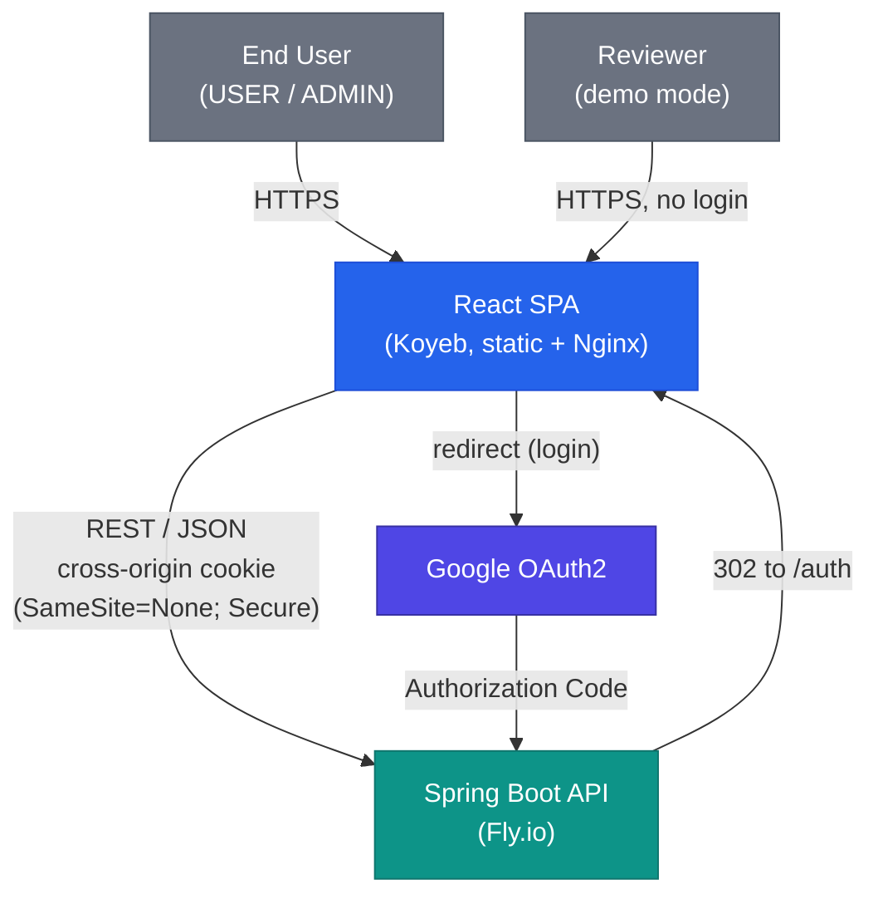

# §3 Context & Scope

## Business Context

Smart Supply Pro (SSP) is a full-stack inventory management system for
small-to-medium businesses. The frontend is the single user-facing surface: staff
track stock levels, manage suppliers, and analyse purchasing trends through it. Two
authenticated roles exist — `USER` (view inventory, record stock movements) and
`ADMIN` (full CRUD over suppliers and items, financial analytics) — plus an
unauthenticated **demo mode** for reviewers.

## Technical Context

| External System | Role | Integration |
|---|---|---|
| Spring Boot API (Fly.io) | Sole data source | REST/JSON over HTTPS, **cross-origin** (Koyeb → Fly.io); session carried by an HTTP-only cookie with `SameSite=None; Secure` |
| Google OAuth2 | Identity provider | Full-page redirect to Google; the code exchange happens backend-to-backend — the SPA never sees a token. On success the backend redirects to the SPA's `/auth` route |
| GitHub Pages | Documentation host | Published API reference, architecture docs, and coverage reports linked from the app footer |

## Context Diagram (C4 Level 1)

## System Boundary

**Inside** (this documentation's scope): everything under `frontend/` — the SPA,
its API layer, i18n resources, theme, tests, and the Nginx config it ships with.

**Outside**: the backend API (see the
[backend architecture docs](../../backend/architecture/index.md)), Google OAuth2,
Koyeb hosting, and GitHub Pages.

## Key Integration Facts

- **Cross-origin session**: frontend (`inventory-service.koyeb.app`) and backend
  (`inventoryservice.fly.dev`) are different origins. The session cookie is issued
  with `SameSite=None; Secure`, and all API calls send credentials. Rationale and
  alternatives: [ADR-0007 (backend)](../../backend/architecture/09-decisions/adr-0007-cross-origin-auth-cookie.md).
- **No tokens in the browser**: the SPA never receives, stores, or forwards an OAuth
  token. Authentication state is read from a `/api/me`-style session probe.
- **Demo mode is client-only**: a `localStorage` flag enables read-only exploration
  with sample data; it involves no backend account and no security bypass — mutating
  UI short-circuits before any request is sent.
- **Docs deep links**: the footer and help panel link to the published documentation
  hub (`keglev.github.io/inventory-service`).
