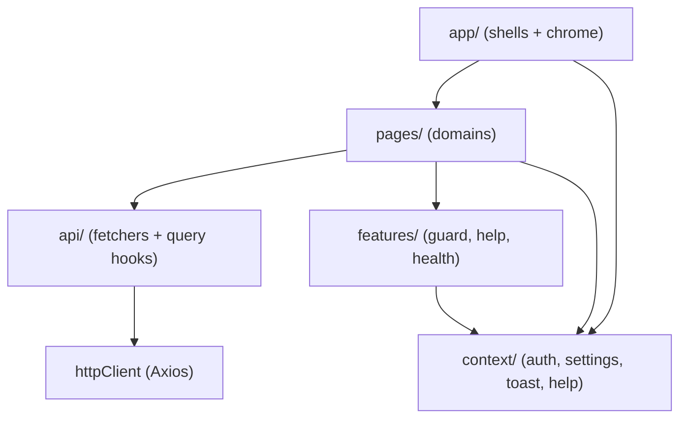

# §5 Building Blocks

## Level 1 — Source Layers

The SPA is organized feature-first with strict import direction: domain pages never
touch HTTP details, the API layer never imports UI, and cross-cutting concerns are
implemented once ([ADR-0001](09-decisions/adr-0001-frontend-folder-structure-strategy.md)).

| Layer | Path | Responsibility |
|---|---|---|
| App shell | `frontend/src/app/` | Application chrome: shells, header, sidebar, settings surfaces |
| Domain pages | `frontend/src/pages/` | One module per business area (see Level 2 below) |
| API layer | `frontend/src/api/` | Typed fetchers + React Query hooks behind a shared `httpClient` |
| Global state | `frontend/src/context/` | Auth, settings, toast, and help providers |
| Cross-cutting features | `frontend/src/features/` | Auth guard, help trigger, health polling |
| Shared | `frontend/src/hooks|utils|i18n|theme/` | Context-hook factory, debounce, formatters, locale + theme setup |

## App Shell

Two shell variants keep public and authenticated experiences separate
([ADR-0005](09-decisions/adr-0005-shell-split-authenticated-vs-public.md)): the
**public shell** wraps login/home/legal pages with a minimal header, and the
**authenticated shell** provides the full chrome — fixed header, responsive
sidebar/drawer, and a main content `<Outlet />`. Both are thin orchestrators: they
coordinate state and delegate rendering to focused sub-components.

Cross-cutting concerns owned at shell level:

- **Preferences** — theme mode (light/dark) and locale (DE/EN) are shell-owned,
  persisted in browser storage, and synchronized with the i18n runtime, so chrome,
  pages, and dialogs stay consistent without per-feature reimplementation.
- **Toasts** — a shared context exposes `toast(message, severity?)`
  (success/info/warning/error); both shells provide it, so leaf components trigger
  feedback without knowing which shell is active.
- **Settings** — the authenticated shell owns the settings-dialog open/close
  lifecycle; entry points live in the shell chrome.
- **Context help** — the current route maps to a help `topicId`, so the help panel
  always opens on content relevant to the visible screen.

## Shared UI & Cross-cutting Features

- **Shared components** (`components/ui/`) are small, domain-agnostic, and accept
  renderable primitives — e.g. `StatCard` (KPI card with loading skeleton and
  null-value em-dash). Anything that grows domain-specific moves into its domain.
- **Context-hook factory** (`hooks/createContextHook.ts`) builds typed hooks that
  throw a clear error outside their provider; `useAuth()`, `useSettings()`, and
  `useHelp()` all share this pattern
  ([ADR-0006](09-decisions/adr-0006-global-state-with-context-modules.md)).
- **`useDebounced(value, delayMs)`** paces input-driven queries (search, filters).
- **Help system** — a central topic registry (`help/topics.ts`) maps `topicId` to
  i18n keys; `HelpProvider` (context) holds open-state and current topic;
  `HelpIconButton` (features) is the uniform trigger. Help content is fully
  localized like all other UI text.
- **Health polling** (`features/health/`) — a lightweight hook polls the backend
  `/api/health` endpoint (flat `{status, database, databaseProduct, timestamp}`
  contract, 200/503) for status surfaces.

## Level 2 — Domain Modules

Each business area is a self-contained module under `frontend/src/pages/`; each has
a dedicated level-2 document consolidating its orchestration, data flow, dialogs,
and rules:

| Domain | Responsibility | Detail |
|---|---|---|
| Inventory | Item CRUD, quantity adjustment, price changes, stock reasons | [§5.1](05-domains/inventory.md) |
| Suppliers | Supplier CRUD, search/display modes, active-stock delete guard | [§5.2](05-domains/suppliers.md) |
| Analytics | Chart/table blocks, filters with URL sync, supplier-gated queries | [§5.3](05-domains/analytics.md) |
| Dashboard | KPI cards, movement mini-chart, navigation hub | [§5.4](05-domains/dashboard.md) |
| Auth | Login, OAuth callback + session hydration, demo entry, logout | [§5.5](05-domains/auth.md) |
| Home | Public landing flow and demo entry point | [§5.6](05-domains/home.md) |
| System | Not-found and system pages | [§5.7](05-domains/system.md) |
